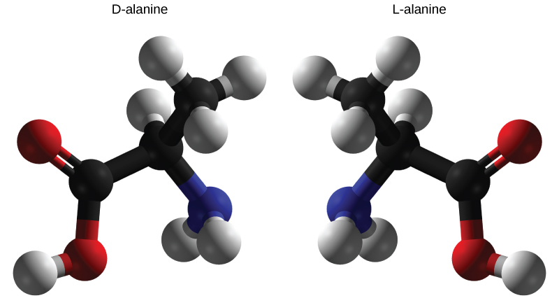

By the end of this section, you will be able to:
* Explain why carbon is important for life
* Describe the role of functional groups in biological molecules

Cells are made of many complex molecules called macromolecules, such as proteins, nucleic acids (RNA and DNA), carbohydrates, and lipids. The macromolecules are a subset of **organic molecules**{: data-type="term"} (any carbon-containing liquid, solid, or gas) that are especially important for life. The fundamental component for all of these macromolecules is carbon. The carbon atom has unique properties that allow it to form covalent bonds to as many as four different atoms, making this versatile element ideal to serve as the basic structural component, or “backbone,” of the macromolecules.

Individual carbon atoms have an incomplete outermost electron shell. With an atomic number of 6 (six electrons and six protons), the first two electrons fill the inner shell, leaving four in the second shell. Therefore, carbon atoms can form up to four covalent bonds with other atoms to satisfy the octet rule. The methane molecule provides an example: it has the chemical formula CH4. Each of its four hydrogen atoms forms a single covalent bond with the carbon atom by sharing a pair of electrons. This results in a filled outermost shell.

# Hydrocarbons

**Hydrocarbons**{: data-type="term"} are organic molecules consisting entirely of carbon and hydrogen, such as methane (CH4) described above. We often use hydrocarbons in our daily lives as fuels—like the propane in a gas grill or the butane in a lighter. The many covalent bonds between the atoms in hydrocarbons store a great amount of energy, which is released when these molecules are burned (oxidized). Methane, an excellent fuel, is the simplest hydrocarbon molecule, with a central carbon atom bonded to four different hydrogen atoms, as illustrated in [\[link\]](#fig-ch02_03_01). The geometry of the methane molecule, where the atoms reside in three dimensions, is determined by the shape of its electron orbitals. The carbons and the four hydrogen atoms form a shape known as a tetrahedron, with four triangular faces; for this reason, methane is described as having tetrahedral geometry.

 {: #fig-ch02_03_01}

As the backbone of the large molecules of living things, hydrocarbons may exist as linear carbon chains, carbon rings, or combinations of both. Furthermore, individual carbon-to-carbon bonds may be single, double, or triple covalent bonds, and each type of bond affects the geometry of the molecule in a specific way. This three-dimensional shape or conformation of the large molecules of life (macromolecules) is critical to how they function.

## Hydrocarbon Chains

Hydrocarbon chains are formed by successive bonds between carbon atoms and may be branched or unbranched. Furthermore, the overall geometry of the molecule is altered by the different geometries of single, double, and triple covalent bonds, illustrated in [\[link\]](#fig-ch02_03_02). The hydrocarbons ethane, ethene, and ethyne serve as examples of how different carbon-to-carbon bonds affect the geometry of the molecule. The names of all three molecules start with the prefix “eth-,” which is the prefix for two carbon hydrocarbons. The suffixes “-ane,” “-ene,” and “-yne” refer to the presence of single, double, or triple carbon-carbon bonds, respectively. Thus, propane, propene, and propyne follow the same pattern with three carbon molecules, butane, butane, and butyne for four carbon molecules, and so on. Double and triple bonds change the geometry of the molecule: single bonds allow rotation along the axis of the bond, whereas double bonds lead to a planar configuration and triple bonds to a linear one. These geometries have a significant impact on the shape a particular molecule can assume.

 ![Methane, the simplest hydrocarbon, is composed of four hydrogen atoms surrounding a central carbon. The bond between the four hydrogen atoms and the central carbon spaced as far apart as possible. This results in a tetrahedral shape with hydrogen atoms projecting upward and off to three sides around the central carbon. Ethane is composed of two carbons connected by a single bond. Each carbon also has three hydrogen atoms connected to it. The hydrogens are spaced as far apart from each other and from the other carbon so again the shape is tetrahedral. Ethene, like ethane, is composed of two carbon atoms, but in this case the carbons are connected by a double bond. Each carbon also has two hydrogen atoms connected to it, for a total of three bonds. The three bonds are spaced as far apart as possible around carbon, which means they are all on the same plane and pointing off in three directions. As a result, the molecule is planar, or flat.](../resources/Figure_02_03_02.jpg "When carbon forms single bonds with other atoms, the shape is tetrahedral. When two carbon atoms form a double bond, the shape is planar, or flat. Single bonds, like those found in ethane, are able to rotate. Double bonds, like those found in ethene cannot rotate, so the atoms on either side are locked in place."){: #fig-ch02_03_02}

## Hydrocarbon Rings

So far, the hydrocarbons we have discussed have been **aliphatic hydrocarbons**{: data-type="term"}, which consist of linear chains of carbon atoms. Another type of hydrocarbon, **aromatic hydrocarbons**{: data-type="term"}, consists of closed rings of carbon atoms. Ring structures are found in hydrocarbons, sometimes with the presence of double bonds, which can be seen by comparing the structure of cyclohexane to benzene in [\[link\]](#fig-ch02_03_03). Examples of biological molecules that incorporate the benzene ring include some amino acids and cholesterol and its derivatives, including the hormones estrogen and testosterone. The benzene ring is also found in the herbicide 2,4-D. Benzene is a natural component of crude oil and has been classified as a carcinogen. Some hydrocarbons have both aliphatic and aromatic portions; beta-carotene is an example of such a hydrocarbon.

{: #fig-ch02_03_03}

# Isomers

The three-dimensional placement of atoms and chemical bonds within organic molecules is central to understanding their chemistry. Molecules that share the same chemical formula but differ in the placement (structure) of their atoms and/or chemical bonds are known as **isomers**{: data-type="term"}. **Structural isomers**{: data-type="term"} (like butane and isobutene shown in [\[link\]](#fig-ch02_03_04)**a**) differ in the placement of their covalent bonds: both molecules have four carbons and ten hydrogens (C4H10), but the different arrangement of the atoms within the molecules leads to differences in their chemical properties. For example, due to their different chemical properties, butane is suited for use as a fuel for cigarette lighters and torches, whereas isobutene is suited for use as a refrigerant and a propellant in spray cans.

**Geometric isomers**{: data-type="term"}, on the other hand, have similar placements of their covalent bonds but differ in how these bonds are made to the surrounding atoms, especially in carbon-to-carbon double bonds. In the simple molecule butene (C4H8), the two methyl groups (CH3) can be on either side of the double covalent bond central to the molecule, as illustrated in [\[link\]](#fig-ch02_03_04)**b**. When the carbons are bound on the same side of the double bond, this is the *cis* configuration; if they are on opposite sides of the double bond, it is a *trans* configuration. In the *trans* configuration, the carbons form a more or less linear structure, whereas the carbons in the *cis* configuration make a bend (change in direction) of the carbon backbone.

Art Connection

![Part A shows butane and isobutene are structural isomers. Both molecules have four carbons and ten hydrogens, but in butane the carbons form a single chain, while in isobutene the carbons form a branched chain. Part B shows cis-2 butene and trans-2 butene each consist of a four-carbon chain. The two central carbons are connected by a double bond resulting in a planar, or flat shape. In the cis isomer, both terminal CH3 groups are on the same side of the plane, and two hydrogen atoms are on the opposite side. Imagine a person with arms stretched out and upwards and legs spread apart, with a glove on the left hand and a sock on the left foot: this represents a cis configuration. In cis-butene the terminal CH3 groups are on opposite sides of the plane. Now, imagine a person with outstretched arms and legs, but this time with a glove on the left hand and a sock on the right foot: this is what a trans configuration looks like. Part C shows two enantiomers, each with different arrangement of hydrogen, bromine, chlorine and fluorine around a central carbon. The molecules are mirror images of one another.](../resources/Figure_02_03_04.png "Molecules that have the same number and type of atoms arranged differently are called isomers. (a) Structural isomers have a different covalent arrangement of atoms. (b) Geometric isomers have a different arrangement of atoms around a double bond. (c) Enantiomers are mirror images of each other."){: #fig-ch02_03_04}

Which of the following statements is false?

1.  Molecules with the formulas CH3CH2COOH and C3H6O2 could be structural isomers.
2.  Molecules must have a double bond to be *cis*-*trans* isomers.
3.  To be enantiomers, a molecule must have at least three different atoms or groups connected to a central carbon.
4.  To be enantiomers, a molecule must have at least four different atoms or groups connected to a central carbon.
{: data-number-style="lower-alpha"}

<!--<para><link target-id="fig-ch02_03_04" document=""/>C</para>-->

In triglycerides (fats and oils), long carbon chains known as fatty acids may contain double bonds, which can be in either the *cis* or *trans* configuration, illustrated in [\[link\]](#fig-ch02_03_05). Fats with at least one double bond between carbon atoms are unsaturated fats. When some of these bonds are in the *cis* configuration, the resulting bend in the carbon backbone of the chain means that triglyceride molecules cannot pack tightly, so they remain liquid (oil) at room temperature. On the other hand, triglycerides with *trans* double bonds (popularly called trans fats), have relatively linear fatty acids that are able to pack tightly together at room temperature and form solid fats. In the human diet, trans fats are linked to an increased risk of cardiovascular disease, so many food manufacturers have reduced or eliminated their use in recent years. In contrast to unsaturated fats, triglycerides without double bonds between carbon atoms are called saturated fats, meaning that they contain all the hydrogen atoms available. Saturated fats are a solid at room temperature and usually of animal origin.

  and a trans (eliadic acid) fatty acid. Notice the bend in the molecule cause by the cis configuration."){: #fig-ch02_03_05}

# Enantiomers

**Enantiomers**{: data-type="term"} are molecules that share the same chemical structure and chemical bonds but differ in the three-dimensional placement of atoms so that they are mirror images. As shown in [\[link\]](#fig-ch02_03_06), an amino acid alanine example, the two structures are non-superimposable. In nature, only the L-forms of amino acids are used to make proteins. Some D forms of amino acids are seen in the cell walls of bacteria, but never in their proteins. Similarly, the D-form of glucose is the main product of photosynthesis and the L-form of the molecule is rarely seen in nature.

 {: #fig-ch02_03_06}

# Functional Groups

**Functional groups**{: data-type="term"} are groups of atoms that occur within molecules and confer specific chemical properties to those molecules. They are found along the “carbon backbone” of macromolecules. This carbon backbone is formed by chains and/or rings of carbon atoms with the occasional substitution of an element such as nitrogen or oxygen. Molecules with other elements in their carbon backbone are **substituted hydrocarbons**{: data-type="term"}.

The functional groups in a macromolecule are usually attached to the carbon backbone at one or several different places along its chain and/or ring structure. Each of the four types of macromolecules—proteins, lipids, carbohydrates, and nucleic acids—has its own characteristic set of functional groups that contributes greatly to its differing chemical properties and its function in living organisms.

A functional group can participate in specific chemical reactions. Some of the important functional groups in biological molecules are shown in [\[link\]](#fig-ch02_03_07); they include: hydroxyl, methyl, carbonyl, carboxyl, amino, phosphate, and sulfhydryl. These groups play an important role in the formation of molecules like DNA, proteins, carbohydrates, and lipids. Functional groups are usually classified as hydrophobic or hydrophilic depending on their charge or polarity characteristics. An example of a hydrophobic group is the non-polar methane molecule. Among the hydrophilic functional groups is the carboxyl group found in amino acids, some amino acid side chains, and the fatty acids that form triglycerides and phospholipids. This carboxyl group ionizes to release hydrogen ions (H+) from the COOH group resulting in the negatively charged COO- group; this contributes to the hydrophilic nature of whatever molecule it is found on. Other functional groups, such as the carbonyl group, have a partially negatively charged oxygen atom that may form hydrogen bonds with water molecules, again making the molecule more hydrophilic.

 ![Table shows the structure and properties of different functional groups. Hydroxyl groups, which consist of OH attached to a carbon chain, are polar. Methyl groups, which consist of three hydrogens attached to a carbon chain, are nonpolar. Carbonyl groups, which consist of an oxygen double bonded to a carbon in the middle of a hydrocarbon chain, are polar. Carboxyl groups, which consist of a carbon with a double bonded oxygen and an OH group attached to a carbon chain, are able to ionize, releasing H+ ions into solution. Carboxyl groups are considered acidic. Amino groups, which consist of two hydrogens attached to a nitrogen, are able to accept H+ ions from solution, forming H3+. Amino groups are considered basic. Phosphate groups consist of a phosphorous with one double bonded oxygen and two OH groups. Another oxygen forms a link from the phosphorous to a carbon chain. Both OH groups in phosphorous can lose a H+ ion, and phosphate groups are considered acidic.](../resources/Figure_02_03_07.jpg "The functional groups shown here are found in many different biological molecules."){: #fig-ch02_03_07}

Hydrogen bonds between functional groups (within the same molecule or between different molecules) are important to the function of many macromolecules and help them to fold properly into and maintain the appropriate shape for functioning. Hydrogen bonds are also involved in various recognition processes, such as DNA complementary base pairing and the binding of an enzyme to its substrate, as illustrated in [\[link\]](#fig-ch02_03_08).

 {: #fig-ch02_03_08}

# Section Summary

The unique properties of carbon make it a central part of biological molecules. Carbon binds to oxygen, hydrogen, and nitrogen covalently to form the many molecules important for cellular function. Carbon has four electrons in its outermost shell and can form four bonds. Carbon and hydrogen can form hydrocarbon chains or rings. Functional groups are groups of atoms that confer specific properties to hydrocarbon (or substituted hydrocarbon) chains or rings that define their overall chemical characteristics and function.

# Art Connections

[[link]](#fig-ch02_03_04) Which of the following statements is false?

1.  Molecules with the formulas CH3CH2COOH and C3H6O2 could be structural isomers.
2.  Molecules must have a double bond to be *cis*-*trans* isomers.
3.  To be enantiomers, a molecule must have at least three different atoms or groups connected to a central carbon.
4.  To be enantiomers, a molecule must have at least four different atoms or groups connected to a central carbon.
{: data-number-style="lower-alpha"}

[[link]](#fig-ch02_03_04) C

# Review Questions

Each carbon molecule can bond with as many as\_\_\_\_\_\_\_\_ other atom(s) or molecule(s).

1.  one
2.  two
3.  six
4.  four
{: data-number-style="lower-alpha"}

D

Which of the following is not a functional group that can bond with carbon?

1.  sodium
2.  hydroxyl
3.  phosphate
4.  carbonyl
{: data-number-style="lower-alpha"}

A

# Free Response

What property of carbon makes it essential for organic life?

Carbon is unique and found in all living things because it can form up to four covalent bonds between atoms or molecules. These can be nonpolar or polar covalent bonds, and they allow for the formation of long chains of carbon molecules that combine to form proteins and DNA.

Compare and contrast saturated and unsaturated triglycerides.

Saturated triglycerides contain no double bonds between carbon atoms; they are usually solid at room temperature. Unsaturated triglycerides contain at least one double bond between carbon atoms and are usually liquid at room temperature.

