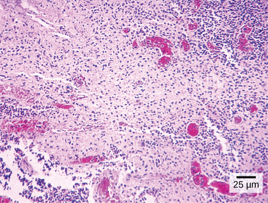
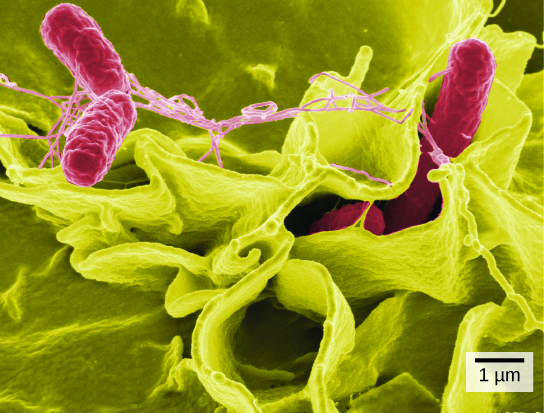

By the end of this section, you will be able to:
* Describe the role of cells in organisms
* Compare and contrast light microscopy and electron microscopy
* Summarize cell theory

A cell is the smallest unit of a living thing. A living thing, whether made of one cell (like bacteria) or many cells (like a human), is called an organism. Thus, cells are the basic building blocks of all organisms.

Several cells of one kind that interconnect with each other and perform a shared function form tissues, several tissues combine to form an organ (your stomach, heart, or brain), and several organs make up an organ system (such as the digestive system, circulatory system, or nervous system). Several systems that function together form an organism (like a human being). Here, we will examine the structure and function of cells.

There are many types of cells, all grouped into one of two broad categories: prokaryotic and eukaryotic. For example, both animal and plant cells are classified as eukaryotic cells, whereas bacterial cells are classified as prokaryotic. Before discussing the criteria for determining whether a cell is prokaryotic or eukaryotic, let’s first examine how biologists study cells.

### Microscopy

Cells vary in size. With few exceptions, individual cells cannot be seen with the naked eye, so scientists use microscopes (micro- = “small”; -scope = “to look at”) to study them. A **microscope**{: data-type="term"} is an instrument that magnifies an object. Most photographs of cells are taken with a microscope, and these images can also be called micrographs.

The optics of a microscope’s lenses change the orientation of the image that the user sees. A specimen that is right-side up and facing right on the microscope slide will appear upside-down and facing left when viewed through a microscope, and vice versa. Similarly, if the slide is moved left while looking through the microscope, it will appear to move right, and if moved down, it will seem to move up. This occurs because microscopes use two sets of lenses to magnify the image. Because of the manner by which light travels through the lenses, this system of two lenses produces an inverted image (binocular, or dissecting microscopes, work in a similar manner, but include an additional magnification system that makes the final image appear to be upright).

#### Light Microscopes

To give you a sense of cell size, a typical human red blood cell is about eight millionths of a meter or eight micrometers (abbreviated as eight μm) in diameter; the head of a pin of is about two thousandths of a meter (two mm) in diameter. That means about 250 red blood cells could fit on the head of a pin.

Most student microscopes are classified as **light microscopes**{: data-type="term"} ([\[link\]](#fig-ch04-01-01)**a**). Visible light passes and is bent through the lens system to enable the user to see the specimen. Light microscopes are advantageous for viewing living organisms, but since individual cells are generally transparent, their components are not distinguishable unless they are colored with special stains. Staining, however, usually kills the cells.

Light microscopes commonly used in the undergraduate college laboratory magnify up to approximately 400 times. Two parameters that are important in microscopy are magnification and resolving power. Magnification is the process of enlarging an object in appearance. Resolving power is the ability of a microscope to distinguish two adjacent structures as separate: the higher the resolution, the better the clarity and detail of the image. When oil immersion lenses are used for the study of small objects, magnification is usually increased to 1,000 times. In order to gain a better understanding of cellular structure and function, scientists typically use electron microscopes.

  Most light microscopes used in a college biology lab can magnify cells up to approximately 400 times and have a resolution of about 200 nanometers. (b) Electron microscopes provide a much higher magnification, 100,000x, and a have a resolution of 50 picometers. (credit a: modification of work by &quot;GcG&quot;/Wikimedia Commons; credit b: modification of work by Evan Bench)"){: #fig-ch04-01-01}

#### Electron Microscopes

In contrast to light microscopes, **electron microscopes**{: data-type="term"} ([\[link\]](#fig-ch04-01-01)**b**) use a beam of electrons instead of a beam of light. Not only does this allow for higher magnification and, thus, more detail ([\[link\]](#fig-ch04-01-02)), it also provides higher resolving power. The method used to prepare the specimen for viewing with an electron microscope kills the specimen. Electrons have short wavelengths (shorter than photons) that move best in a vacuum, so living cells cannot be viewed with an electron microscope.

In a scanning electron microscope, a beam of electrons moves back and forth across a cell’s surface, creating details of cell surface characteristics. In a transmission electron microscope, the electron beam penetrates the cell and provides details of a cell’s internal structures. As you might imagine, electron microscopes are significantly more bulky and expensive than light microscopes.

<figure markdown="1" id="fig-ch04-01-02">
<figcaption>
(a) These *Salmonella* bacteria appear as tiny purple dots when viewed with a light microscope. (b) This scanning electron microscope micrograph shows *Salmonella* bacteria (in red) invading human cells (yellow). Even though subfigure (b) shows a different *Salmonella* specimen than subfigure (a), you can still observe the comparative increase in magnification and detail. (credit a: modification of work by CDC/Armed Forces Institute of Pathology, Charles N. Farmer, Rocky Mountain Laboratories; credit b: modification of work by NIAID, NIH; scale-bar data from Matt Russell)
</figcaption>
{: #eip-id1378311}

{: #eip-id1361557}

</figure>

Link to Learning

For another perspective on cell size, try the HowBig interactive at [<u>this site</u>][1]{: target="_window"}.

### Cell Theory

The microscopes we use today are far more complex than those used in the 1600s by Antony van Leeuwenhoek, a Dutch shopkeeper who had great skill in crafting lenses. Despite the limitations of his now-ancient lenses, van Leeuwenhoek observed the movements of protista (a type of single-celled organism) and sperm, which he collectively termed “animalcules.”

In a 1665 publication called *Micrographia*, experimental scientist Robert Hooke coined the term “cell” for the box-like structures he observed when viewing cork tissue through a lens. In the 1670s, van Leeuwenhoek discovered bacteria and protozoa. Later advances in lenses, microscope construction, and staining techniques enabled other scientists to see some components inside cells.

By the late 1830s, botanist Matthias Schleiden and zoologist Theodor Schwann were studying tissues and proposed the **unified cell theory**{: data-type="term"}, which states that all living things are composed of one or more cells, the cell is the basic unit of life, and new cells arise from existing cells. Rudolf Virchow later made important contributions to this theory.

Career Connection

CytotechnologistHave you ever heard of a medical test called a Pap smear ([\[link\]](#fig-ch04-01-03))? In this test, a doctor takes a small sample of cells from the uterine cervix of a patient and sends it to a medical lab where a cytotechnologist stains the cells and examines them for any changes that could indicate cervical cancer or a microbial infection.

Cytotechnologists (cyto- = “cell”) are professionals who study cells via microscopic examinations and other laboratory tests. They are trained to determine which cellular changes are within normal limits and which are abnormal. Their focus is not limited to cervical cells; they study cellular specimens that come from all organs. When they notice abnormalities, they consult a pathologist, who is a medical doctor who can make a clinical diagnosis.

Cytotechnologists play a vital role in saving people’s lives. When abnormalities are discovered early, a patient’s treatment can begin sooner, which usually increases the chances of a successful outcome.

. Notice that the infected cells are larger; also, two of these cells each have two nuclei instead of one, the normal number. (credit: modification of work by Ed Uthman, MD; scale-bar data from Matt Russell)"){: #fig-ch04-01-03}

### Section Summary

A cell is the smallest unit of life. Most cells are so tiny that they cannot be seen with the naked eye. Therefore, scientists use microscopes to study cells. Electron microscopes provide higher magnification, higher resolution, and more detail than light microscopes. The unified cell theory states that all organisms are composed of one or more cells, the cell is the basic unit of life, and new cells arise from existing cells.

### Review Questions

When viewing a specimen through a light microscope, scientists use \_\_\_\_\_\_\_\_ to distinguish the individual components of cells.

1.  a beam of electrons
2.  radioactive isotopes
3.  special stains
4.  high temperatures
{: data-number-style="lower-alpha"}

C

The \_\_\_\_\_\_\_\_ is the basic unit of life.

1.  organism
2.  cell
3.  tissue
4.  organ
{: data-number-style="lower-alpha"}

B

### Free Response

In your everyday life, you have probably noticed that certain instruments are ideal for certain situations. For example, you would use a spoon rather than a fork to eat soup because a spoon is shaped for scooping, while soup would slip between the tines of a fork. The use of ideal instruments also applies in science. In what situation(s) would the use of a light microscope be ideal, and why?

A light microscope would be ideal when viewing a small living organism, especially when the cell has been stained to reveal details.

In what situation(s) would the use of a scanning electron microscope be ideal, and why?

A scanning electron microscope would be ideal when you want to view the minute details of a cell’s surface, because its beam of electrons moves back and forth over the surface to convey the image.

In what situation(s) would a transmission electron microscope be ideal, and why?

A transmission electron microscope would be ideal for viewing the cell’s internal structures, because many of the internal structures have membranes that are not visible by the light microscope.

What are the advantages and disadvantages of each of these types of microscopes?

The advantages of light microscopes are that they are easily obtained, and the light beam does not kill the cells. However, typical light microscopes are somewhat limited in the amount of detail they can reveal. Electron microscopes are ideal because you can view intricate details, but they are bulky and costly, and preparation for the microscopic examination kills the specimen.

### Glossary
{: data-type="glossary-title"}

cell theory
: see unified cell theory
^

electron microscope
: an instrument that magnifies an object using a beam of electrons passed and bent through a lens system to visualize a specimen
^

light microscope
: an instrument that magnifies an object using a beam visible light passed and bent through a lens system to visualize a specimen
^

microscope
: an instrument that magnifies an object
^

unified cell theory
: a biological concept that states that all organisms are composed of one or more cells; the cell is the basic unit of life; and new cells arise from existing cells

[1]: http://openstaxcollege.org/l/cell_sizes
