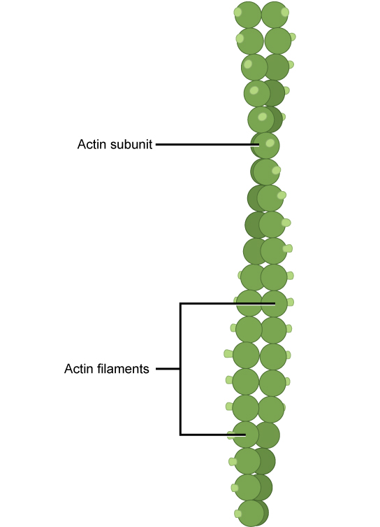

By the end of this section, you will be able to:
* Describe the cytoskeleton
* Compare the roles of microfilaments, intermediate filaments, and microtubules
* Compare and contrast cilia and flagella
* Summarize the differences among the components of prokaryotic cells, animal cells, and plant cells

If you were to remove all the organelles from a cell, would the plasma membrane and the cytoplasm be the only components left? No. Within the cytoplasm, there would still be ions and organic molecules, plus a network of protein fibers that help maintain the shape of the cell, secure some organelles in specific positions, allow cytoplasm and vesicles to move within the cell, and enable cells within multicellular organisms to move. Collectively, this network of protein fibers is known as the **cytoskeleton**{: data-type="term"}. There are three types of fibers within the cytoskeleton: microfilaments, intermediate filaments, and microtubules ([\[link\]](#fig-ch04-05-01)). Here, we will examine each.

 {: #fig-ch04-05-01 data-media-type="image/jpg"}

# Microfilaments

Of the three types of protein fibers in the cytoskeleton, **microfilaments**{: data-type="term"} are the narrowest. They function in cellular movement, have a diameter of about 7 nm, and are made of two intertwined strands of a globular protein called actin ([\[link\]](#fig-ch04-05-02)). For this reason, microfilaments are also known as actin filaments.

 {: #fig-ch04-05-02 data-media-type="image/jpg"}

Actin is powered by ATP to assemble its filamentous form, which serves as a track for the movement of a motor protein called myosin. This enables actin to engage in cellular events requiring motion, such as cell division in animal cells and cytoplasmic streaming, which is the circular movement of the cell cytoplasm in plant cells. Actin and myosin are plentiful in muscle cells. When your actin and myosin filaments slide past each other, your muscles contract.

Microfilaments also provide some rigidity and shape to the cell. They can depolymerize (disassemble) and reform quickly, thus enabling a cell to change its shape and move. White blood cells (your body’s infection-fighting cells) make good use of this ability. They can move to the site of an infection and phagocytize the pathogen.

Link to Learning

 {: data-media-type="image/png"} 
To see an example of a white blood cell in action, click [here][1]{: target="_window"} and watch a short time-lapse video of the cell capturing two bacteria. It engulfs one and then moves on to the other.

# Intermediate Filaments

Intermediate filaments are made of several strands of fibrous proteins that are wound together ([\[link\]](#fig-ch04-05-03)). These elements of the cytoskeleton get their name from the fact that their diameter, 8 to 10 nm, is between those of microfilaments and microtubules.

 {: #fig-ch04-05-03 data-media-type="image/jpg"}

**Intermediate filaments**{: data-type="term"} have no role in cell movement. Their function is purely structural. They bear tension, thus maintaining the shape of the cell, and anchor the nucleus and other organelles in place. [\[link\]](#fig-ch04-05-01) shows how intermediate filaments create a supportive scaffolding inside the cell.

The intermediate filaments are the most diverse group of cytoskeletal elements. Several types of fibrous proteins are found in the intermediate filaments. You are probably most familiar with keratin, the fibrous protein that strengthens your hair, nails, and the epidermis of the skin.

# Microtubules

As their name implies, microtubules are small hollow tubes. The walls of the microtubule are made of polymerized dimers of α-tubulin and β-tubulin, two globular proteins ([\[link\]](#fig-ch04-05-04)). With a diameter of about 25 nm, **microtubules**{: data-type="term"} are the widest components of the cytoskeleton. They help the cell resist compression, provide a track along which vesicles move through the cell, and pull replicated chromosomes to opposite ends of a dividing cell. Like microfilaments, microtubules can dissolve and reform quickly.

 . The left image shows the molecular structure of the tube."){: #fig-ch04-05-04 data-media-type="image/jpg"}

Microtubules are also the structural elements of flagella, cilia, and centrioles (the latter are the two perpendicular bodies of the centrosome). In fact, in animal cells, the centrosome is the microtubule-organizing center. In eukaryotic cells, flagella and cilia are quite different structurally from their counterparts in prokaryotes, as discussed below.

## Flagella and Cilia

To refresh your memory, **flagella**{: data-type="term"} (singular = flagellum) are long, hair-like structures that extend from the plasma membrane and are used to move an entire cell (for example, sperm, *Euglena*). When present, the cell has just one flagellum or a few flagella. When **cilia**{: data-type="term"} (singular = cilium) are present, however, many of them extend along the entire surface of the plasma membrane. They are short, hair-like structures that are used to move entire cells (such as paramecia) or substances along the outer surface of the cell (for example, the cilia of cells lining the Fallopian tubes that move the ovum toward the uterus, or cilia lining the cells of the respiratory tract that trap particulate matter and move it toward your nostrils.)

Despite their differences in length and number, flagella and cilia share a common structural arrangement of microtubules called a “9 + 2 array.” This is an appropriate name because a single flagellum or cilium is made of a ring of nine microtubule doublets, surrounding a single microtubule doublet in the center ([\[link\]](#fig-ch04-05-05)).

 "){: #fig-ch04-05-05 data-media-type="image/jpg"}

You have now completed a broad survey of the components of prokaryotic and eukaryotic cells. For a summary of cellular components in prokaryotic and eukaryotic cells, see [\[link\]](#tab-ch04-05-01).

<table id="tab-ch04-05-01" class="  " summary="This table compares the features of prokaryotic and eukaryotic cells, highlighting their different levels of functioning."><thead>
<tr>
<th colspan="5">Components of Prokaryotic and Eukaryotic Cells</th>
</tr>
<tr>
<th>Cell Component</th>
<th>Function</th>
<th>Present in Prokaryotes?</th>
<th>Present in Animal Cells?</th>
<th>Present in Plant Cells?</th>
</tr>
</thead><tbody>
<tr>
<td>Plasma membrane</td>
<td>Separates cell from external environment; controls passage of organic molecules, ions, water, oxygen, and wastes into and out of cell</td>
<td>Yes</td>
<td>Yes</td>
<td>Yes</td>
</tr>
<tr>
<td>Cytoplasm</td>
<td>Provides turgor pressure to plant cells as fluid inside the central vacuole; site of many metabolic reactions; medium in which organelles are found</td>
<td>Yes</td>
<td>Yes</td>
<td>Yes</td>
</tr>
<tr>
<td>Nucleolus</td>
<td> Darkened area within the nucleus where ribosomal subunits are synthesized.</td>
<td>No</td>
<td>Yes</td>
<td>Yes</td>
</tr>
<tr>
<td>Nucleus</td>
<td>Cell organelle that houses DNA and directs synthesis of ribosomes and proteins</td>
<td>No</td>
<td>Yes</td>
<td>Yes</td>
</tr>
<tr>
<td>Ribosomes</td>
<td>Protein synthesis</td>
<td>Yes</td>
<td>Yes</td>
<td>Yes</td>
</tr>
<tr>
<td>Mitochondria</td>
<td>ATP production/cellular respiration</td>
<td>No</td>
<td>Yes</td>
<td>Yes</td>
</tr>
<tr>
<td>Peroxisomes</td>
<td>Oxidizes and thus breaks down fatty acids and amino acids, and detoxifies poisons</td>
<td>No</td>
<td>Yes</td>
<td>Yes</td>
</tr>
<tr>
<td>Vesicles and vacuoles</td>
<td>Storage and transport; digestive function in plant cells</td>
<td>No</td>
<td>Yes</td>
<td>Yes</td>
</tr>
<tr>
<td>Centrosome</td>
<td>Unspecified role in cell division in animal cells; source of microtubules in animal cells</td>
<td>No</td>
<td>Yes</td>
<td>No</td>
</tr>
<tr>
<td>Lysosomes</td>
<td>Digestion of macromolecules; recycling of worn-out organelles</td>
<td>No</td>
<td>Yes</td>
<td>No</td>
</tr>
<tr>
<td>Cell wall</td>
<td>Protection, structural support and maintenance of cell shape</td>
<td>Yes, primarily peptidoglycan</td>
<td>No</td>
<td>Yes, primarily cellulose</td>
</tr>
<tr>
<td>Chloroplasts</td>
<td>Photosynthesis</td>
<td>No</td>
<td>No</td>
<td>Yes</td>
</tr>
<tr>
<td>Endoplasmic reticulum</td>
<td>Modifies proteins and synthesizes lipids</td>
<td>No</td>
<td>Yes</td>
<td>Yes</td>
</tr>
<tr>
<td>Golgi apparatus</td>
<td>Modifies, sorts, tags, packages, and distributes lipids and proteins</td>
<td>No</td>
<td>Yes</td>
<td>Yes</td>
</tr>
<tr>
<td>Cytoskeleton</td>
<td>Maintains cell’s shape, secures organelles in specific positions, allows cytoplasm and vesicles to move within cell, and enables unicellular organisms to move independently</td>
<td>Yes</td>
<td>Yes</td>
<td>Yes</td>
</tr>
<tr>
<td>Flagella</td>
<td>Cellular locomotion</td>
<td>Some</td>
<td>Some</td>
<td>No, except for some plant sperm cells.</td>
</tr>
<tr>
<td>Cilia</td>
<td>Cellular locomotion, movement of particles along extracellular surface of plasma membrane, and filtration</td>
<td>Some</td>
<td>Some</td>
<td>No</td>
</tr>
</tbody></table>

# Section Summary

The cytoskeleton has three different types of protein elements. From narrowest to widest, they are the microfilaments (actin filaments), intermediate filaments, and microtubules. Microfilaments are often associated with myosin. They provide rigidity and shape to the cell and facilitate cellular movements. Intermediate filaments bear tension and anchor the nucleus and other organelles in place. Microtubules help the cell resist compression, serve as tracks for motor proteins that move vesicles through the cell, and pull replicated chromosomes to opposite ends of a dividing cell. They are also the structural element of centrioles, flagella, and cilia.

# Review Questions

Which of the following have the ability to disassemble and reform quickly?

1.  microfilaments and intermediate filaments
2.  microfilaments and microtubules
3.  intermediate filaments and microtubules
4.  only intermediate filaments
{: data-number-style="lower-alpha"}

B

Which of the following do not play a role in intracellular movement?

1.  microfilaments and intermediate filaments
2.  microfilaments and microtubules
3.  intermediate filaments and microtubules
4.  only intermediate filaments
{: data-number-style="lower-alpha"}

D

# Free Response

What are the similarities and differences between the structures of centrioles and flagella?

Centrioles and flagella are alike in that they are made up of microtubules. In centrioles, two rings of nine microtubule “triplets” are arranged at right angles to one another. This arrangement does not occur in flagella.

How do cilia and flagella differ?

Cilia and flagella are alike in that they are made up of microtubules. Cilia are short, hair-like structures that exist in large numbers and usually cover the entire surface of the plasma membrane. Flagella, in contrast, are long, hair-like structures; when flagella are present, a cell has just one or two.

[1]: http://openstaxcollege.org/l/chasing_bcteria
