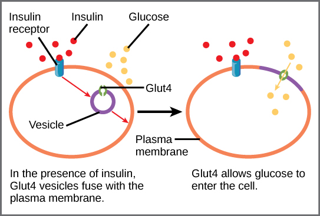

By the end of this section, you will be able to:
* Describe how feedback inhibition would affect the production of an intermediate or product in a pathway
* Identify the mechanism that controls the rate of the transport of electrons through the electron transport chain

Cellular respiration must be regulated in order to provide balanced amounts of energy in the form of ATP. The cell also must generate a number of intermediate compounds that are used in the anabolism and catabolism of macromolecules. Without controls, metabolic reactions would quickly come to a stand still as the forward and backward reactions reached a state of equilibrium. Resources would be used inappropriately. A cell does not need the maximum amount of ATP that it can make all the time: At times, the cell needs to shunt some of the intermediates to pathways for amino acid, protein, glycogen, lipid, and nucleic acid production. In short, the cell needs to control its metabolism.

# Regulatory Mechanisms

A variety of mechanisms is used to control cellular respiration. Some type of control exists at each stage of glucose metabolism. Access of glucose to the cell can be regulated using the **GLUT proteins**{: data-type="term"} that transport glucose ([\[link\]](#fig-ch07_07_01)). Different forms of the GLUT protein control passage of glucose into the cells of specific tissues.

 {: #fig-ch07_07_01 data-media-type="image/jpg"}

Some reactions are controlled by having two different enzymes—one each for the two directions of a reversible reaction. Reactions that are catalyzed by only one enzyme can go to equilibrium, stalling the reaction. In contrast, if two different enzymes (each specific for a given direction) are necessary for a reversible reaction, the opportunity to control the rate of the reaction increases, and equilibrium is not reached.

A number of enzymes involved in each of the pathways—in particular, the enzyme catalyzing the first committed reaction of the pathway—are controlled by attachment of a molecule to an allosteric site on the protein. The molecules most commonly used in this capacity are the nucleotides ATP, ADP, AMP, NAD+, and NADH. These regulators, allosteric effectors, may increase or decrease enzyme activity, depending on the prevailing conditions. The allosteric effector alters the steric structure of the enzyme, usually affecting the configuration of the active site. This alteration of the protein’s (the enzyme’s) structure either increases or decreases its affinity for its substrate, with the effect of increasing or decreasing the rate of the reaction. The attachment signals to the enzyme. This binding can increase or decrease the enzyme’s activity, providing feedback. This feedback type of control is effective as long as the chemical affecting it is attached to the enzyme. Once the overall concentration of the chemical decreases, it will diffuse away from the protein, and the control is relaxed.

# Control of Catabolic Pathways

Enzymes, proteins, electron carriers, and pumps that play roles in glycolysis, the citric acid cycle, and the electron transport chain tend to catalyze non-reversible reactions. In other words, if the initial reaction takes place, the pathway is committed to proceeding with the remaining reactions. Whether a particular enzyme activity is released depends upon the energy needs of the cell (as reflected by the levels of ATP, ADP, and AMP).

## Glycolysis

The control of glycolysis begins with the first enzyme in the pathway, hexokinase ([\[link\]](#fig-ch07_07_02)). This enzyme catalyzes the phosphorylation of glucose, which helps to prepare the compound for cleavage in a later step. The presence of the negatively charged phosphate in the molecule also prevents the sugar from leaving the cell. When hexokinase is inhibited, glucose diffuses out of the cell and does not become a substrate for the respiration pathways in that tissue. The product of the hexokinase reaction is glucose-6-phosphate, which accumulates when a later enzyme, phosphofructokinase, is inhibited.

  as indicated. Note that the first two steps that are regulated occur early in the pathway and involve hydrolysis of ATP."){: #fig-ch07_07_02 data-media-type="image/jpg"}

Phosphofructokinase is the main enzyme controlled in glycolysis. High levels of ATP, citrate, or a lower, more acidic pH decrease the enzyme’s activity. An increase in citrate concentration can occur because of a blockage in the citric acid cycle. Fermentation, with its production of organic acids like lactic acid, frequently accounts for the increased acidity in a cell; however, the products of fermentation do not typically accumulate in cells.

The last step in glycolysis is catalyzed by pyruvate kinase. The pyruvate produced can proceed to be catabolized or converted into the amino acid alanine. If no more energy is needed and alanine is in adequate supply, the enzyme is inhibited. The enzyme’s activity is increased when fructose-1,6-bisphosphate levels increase. (Recall that fructose-1,6-bisphosphate is an intermediate in the first half of glycolysis.) The regulation of pyruvate kinase involves phosphorylation by a kinase (pyruvate kinase kinase), resulting in a less-active enzyme. Dephosphorylation by a phosphatase reactivates it. Pyruvate kinase is also regulated by ATP (a negative allosteric effect).

If more energy is needed, more pyruvate will be converted into acetyl CoA through the action of pyruvate dehydrogenase. If either acetyl groups or NADH accumulate, there is less need for the reaction and the rate decreases. Pyruvate dehydrogenase is also regulated by phosphorylation: A kinase phosphorylates it to form an inactive enzyme, and a phosphatase reactivates it. The kinase and the phosphatase are also regulated.

## Citric Acid Cycle

The citric acid cycle is controlled through the enzymes that catalyze the reactions that make the first two molecules of NADH ([\[link\]](/m44433#fig-ch07_03_02)). These enzymes are isocitrate dehydrogenase and *α*-ketoglutarate dehydrogenase. When adequate ATP and NADH levels are available, the rates of these reactions decrease. When more ATP is needed, as reflected in rising ADP levels, the rate increases. *α*-Ketoglutarate dehydrogenase will also be affected by the levels of succinyl CoA—a subsequent intermediate in the cycle—causing a decrease in activity. A decrease in the rate of operation of the pathway at this point is not necessarily negative, as the increased levels of the *α*-ketoglutarate not used by the citric acid cycle can be used by the cell for amino acid (glutamate) synthesis.

## Electron Transport Chain

Specific enzymes of the electron transport chain are unaffected by feedback inhibition, but the rate of electron transport through the pathway is affected by the levels of ADP and ATP. Greater ATP consumption by a cell is indicated by a buildup of ADP. As ATP usage decreases, the concentration of ADP decreases, and now, ATP begins to build up in the cell. This change is the relative concentration of ADP to ATP triggers the cell to slow down the electron transport chain.

Link to Learning

 {: data-media-type="image/png"} 
Visit this [site][1]{: target="_window"} to see an animation of the electron transport chain and ATP synthesis.

For a summary of feedback controls in cellular respiration, see [\[link\]](#tab-ch07_07_01).

<table id="tab-ch07_07_01" summary="table x.x"><thead>
                <tr>
                    <th colspan="4">Summary of Feedback Controls in Cellular Respiration</th> 
                </tr>
                <tr>
                    <th>Pathway</th>
                    <th>Enzyme affected</th>
                    <th>Elevated levels of effector</th>
                    <th>Effect on pathway activity</th>                    
                </tr>
            </thead><tbody>
<tr>
<td>glycolysis</td>
<td>hexokinase</td>
    <td>glucose-6-phosphate</td>
    <td>decrease</td>
</tr>
        <tr>
            <td />
<td>phosphofructokinase</td>
            <td>low-energy charge (ATP, AMP), fructose-6-phosphate via fructose-2,6-bisphosphate</td>
            <td>increase</td>
        </tr>
        <tr>
            <td />
            <td />
        		<td>high-energy charge (ATP, AMP), citrate, acidic pH</td>
            <td>decrease</td>
        </tr>
        <tr>
            <td />
            <td>pyruvate kinase</td>
            <td>fructose-1,6-bisphosphate</td>
            <td>increase</td></tr>
        <tr>
            <td />
            <td />
            <td>high-energy charge (ATP, AMP), alanine</td>
            <td>decrease</td></tr>
<tr><td>pyruvate to acetyl CoA conversion</td> 
    <td>pyruvate dehydrogenase</td>
    <td>ADP, pyruvate</td>
    <td>increase</td></tr>
<tr>
    <td />
    <td />
    <td>acetyl CoA, ATP, NADH</td>
    <td>decrease</td>
</tr>
<tr>
    <td>citric acid cycle</td>
    <td>isocitrate dehydrogenase</td>
    <td>ADP</td>
    <td>increase</td></tr>
<tr>
    <td />
    <td />
    <td>ATP, NADH</td>
    <td>decrease</td>
</tr>
<tr>
    <td />
    <td><em>α</em>-ketoglutarate dehydrogenase</td>
    <td>Calcium ions, ADP</td>
    <td>increase</td></tr>
<tr>
    <td />
    <td />
    <td>ATP, NADH, succinyl CoA</td>
    <td>decrease</td></tr>
<tr><td>electron transport chain</td>
    <td />
    <td>ADP</td>
    <td>increase</td>
</tr>
<tr>
    <td />
    <td />
    <td>ATP</td>
    <td>decrease</td></tr>
    </tbody></table>

# Section Summary

Cellular respiration is controlled by a variety of means. The entry of glucose into a cell is controlled by the transport proteins that aid glucose passage through the cell membrane. Most of the control of the respiration processes is accomplished through the control of specific enzymes in the pathways. This is a type of negative feedback, turning the enzymes off. The enzymes respond most often to the levels of the available nucleosides ATP, ADP, AMP, NAD+, and FAD. Other intermediates of the pathway also affect certain enzymes in the systems.

# Review Questions

The effect of high levels of ADP is to \_\_\_\_\_\_\_\_.

1.  increase the activity of the enzyme
2.  decrease the activity of the enzyme
3.  have no effect on the activity of the enzyme
4.  slow down the pathway
{: data-number-style="lower-alpha"}

A

The control of which enzyme exerts the most control on glycolysis?

1.  hexokinase
2.  phosphofructokinase
3.  glucose-6-phosphatase
4.  aldolase
{: data-number-style="lower-alpha"}

A

# Free Response

How does citrate from the citric acid cycle affect glycolysis?

Citrate can inhibit phosphofructokinase by feedback regulation.

Why might negative feedback mechanisms be more common than positive feedback mechanisms in living cells?

Negative feedback mechanisms actually control a process; it can turn it off, whereas positive feedback accelerates the process, allowing the cell no control over it. Negative feedback naturally maintains homeostasis, whereas positive feedback drives the system away from equilibrium.

[1]: http://openstaxcollege.org/l/electron_transp
