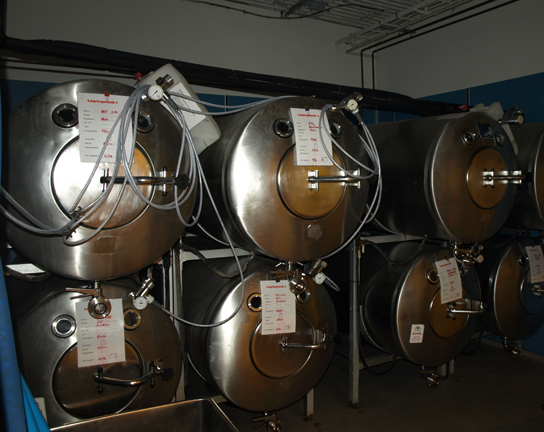

By the end of this section, you will be able to:
* Discuss the fundamental difference between anaerobic cellular respiration and fermentation
* Describe the type of fermentation that readily occurs in animal cells and the conditions that initiate that fermentation

In aerobic respiration, the final electron acceptor is an oxygen molecule, O2. If aerobic respiration occurs, then ATP will be produced using the energy of high-energy electrons carried by NADH or FADH2 to the electron transport chain. If aerobic respiration does not occur, NADH must be reoxidized to NAD+ for reuse as an electron carrier for the glycolytic pathway to continue. How is this done? Some living systems use an organic molecule as the final electron acceptor. Processes that use an organic molecule to regenerate NAD+ from NADH are collectively referred to as **fermentation**{: data-type="term"}. In contrast, some living systems use an inorganic molecule as a final electron acceptor. Both methods are called **anaerobic cellular respiration**{: data-type="term"} in which organisms convert energy for their use in the absence of oxygen.

### Anaerobic Cellular Respiration

Certain prokaryotes, including some species of bacteria and Archaea, use anaerobic respiration. For example, the group of Archaea called methanogens reduces carbon dioxide to methane to oxidize NADH. These microorganisms are found in soil and in the digestive tracts of ruminants, such as cows and sheep. Similarly, sulfate-reducing bacteria and Archaea, most of which are anaerobic ( [\[link\]](#fig-ch07_05_01)), reduce sulfate to hydrogen sulfide to regenerate NAD+ from NADH.

 "){: #fig-ch07_05_01}

Link to Learning

Visit this [site][1]{: target="_window"} to see anaerobic cellular respiration in action.

#### Lactic Acid Fermentation

The fermentation method used by animals and certain bacteria, like those in yogurt, is lactic acid fermentation ( [\[link\]](#fig-ch07_05_02)). This type of fermentation is used routinely in mammalian red blood cells and in skeletal muscle that has an insufficient oxygen supply to allow aerobic respiration to continue (that is, in muscles used to the point of fatigue). In muscles, lactic acid accumulation must be removed by the blood circulation and the lactate brought to the liver for further metabolism. The chemical reactions of lactic acid fermentation are the following:

<math xmlns="http://www.w3.org/1998/Math/MathML" display="block"> <mrow> <mtext>Pyruvic acid</mtext> <mo>+</mo> <mtext>NADH</mtext> <mrow><mo stretchy="false">↔</mo></mrow> <mtext>lactic acid</mtext> <mo>+</mo> <msup> <mtext>NAD</mtext> <mrow> <mo>+</mo> </mrow> </msup> </mrow> </math>

The enzyme used in this reaction is lactate dehydrogenase (LDH). The reaction can proceed in either direction, but the reaction from left to right is inhibited by acidic conditions. Such lactic acid accumulation was once believed to cause muscle stiffness, fatigue, and soreness, although more recent research disputes this hypothesis. Once the lactic acid has been removed from the muscle and circulated to the liver, it can be reconverted into pyruvic acid and further catabolized for energy.

Art Connection

{: #fig-ch07_05_02}

Tremetol, a metabolic poison found in the white snake root plant, prevents the metabolism of lactate. When cows eat this plant, it is concentrated in the milk they produce. Humans who consume the milk become ill. Symptoms of this disease, which include vomiting, abdominal pain, and tremors, become worse after exercise. Why do you think this is the case?

<!-- [link]Figure 07_05_02[/link]The illness is caused by lactate accumulation. Lactate levels rise after exercise, making the symptoms worse. Milk sickness is rare today, but was common in the Midwestern United States in the early 1800s. -->

#### Alcohol Fermentation

Another familiar fermentation process is alcohol fermentation ( [\[link\]](#fig-ch07_05_03)) that produces ethanol, an alcohol. The first chemical reaction of alcohol fermentation is the following (CO2 does not participate in the second reaction):

<math xmlns="http://www.w3.org/1998/Math/MathML" display="block"> <mrow> <mtext>Pyruvic acid</mtext> <mo stretchy="false">→</mo> <msub> <mtext>CO</mtext> <mrow> <mn>2</mn> </mrow> </msub> <mo>+</mo> <mtext>acetaldehyde</mtext> <mo>+</mo> <mtext>NADH</mtext> <mo stretchy="false">→</mo> <mtext>ethanol</mtext> <mo>+</mo> <msup> <mtext>NAD</mtext> <mrow> <mo>+</mo> </mrow> </msup> </mrow> </math>

The first reaction is catalyzed by pyruvate decarboxylase, a cytoplasmic enzyme, with a coenzyme of thiamine pyrophosphate (TPP, derived from vitamin B1 and also called thiamine). A carboxyl group is removed from pyruvic acid, releasing carbon dioxide as a gas. The loss of carbon dioxide reduces the size of the molecule by one carbon, making acetaldehyde. The second reaction is catalyzed by alcohol dehydrogenase to oxidize NADH to NAD+ and reduce acetaldehyde to ethanol. The fermentation of pyruvic acid by yeast produces the ethanol found in alcoholic beverages. Ethanol tolerance of yeast is variable, ranging from about 5 percent to 21 percent, depending on the yeast strain and environmental conditions.

 {: #fig-ch07_05_03}

#### Other Types of Fermentation

Other fermentation methods occur in bacteria. Many prokaryotes are facultatively anaerobic. This means that they can switch between aerobic respiration and fermentation, depending on the availability of oxygen. Certain prokaryotes, like *Clostridia*, are obligate anaerobes. Obligate anaerobes live and grow in the absence of molecular oxygen. Oxygen is a poison to these microorganisms and kills them on exposure. It should be noted that all forms of fermentation, except lactic acid fermentation, produce gas. The production of particular types of gas is used as an indicator of the fermentation of specific carbohydrates, which plays a role in the laboratory identification of the bacteria. Various methods of fermentation are used by assorted organisms to ensure an adequate supply of NAD+ for the sixth step in glycolysis. Without these pathways, that step would not occur and no ATP would be harvested from the breakdown of glucose.

### Section Summary

If NADH cannot be oxidized through aerobic respiration, another electron acceptor is used. Most organisms will use some form of fermentation to accomplish the regeneration of NAD+, ensuring the continuation of glycolysis. The regeneration of NAD+ in fermentation is not accompanied by ATP production; therefore, the potential of NADH to produce ATP using an electron transport chain is not utilized.

### Art Connections

[[link]](#fig-ch07_05_02) Tremetol, a metabolic poison found in the white snake root plant, prevents the metabolism of lactate. When cows eat this plant, it is concentrated in the milk they produce. Humans who consume the milk become ill. Symptoms of this disease, which include vomiting, abdominal pain, and tremors, become worse after exercise. Why do you think this is the case?

[[link]](#fig-ch07_05_02) The illness is caused by lactate accumulation. Lactate levels rise after exercise, making the symptoms worse. Milk sickness is rare today, but was common in the Midwestern United States in the early 1800s.

### Review Questions

Which of the following fermentation methods can occur in animal skeletal muscles?

1.  lactic acid fermentation
2.  alcohol fermentation
3.  mixed acid fermentation
4.  propionic fermentation
{: data-number-style="lower-alpha"}

A

### Free Response

What is the primary difference between fermentation and anaerobic respiration?

Fermentation uses glycolysis only. Anaerobic respiration uses all three parts of cellular respiration, including the parts in the mitochondria like the citric acid cycle and electron transport; it also uses a different final electron acceptor instead of oxygen gas.

### Glossary
{: data-type="glossary-title"}

anaerobic cellular respiration
: process in which organisms convert energy for their use in the absence of oxygen
^

fermentation
: process of regenerating NAD+ with either an inorganic or organic compound serving as the final electron acceptor, occurs in the absence; occurs in the absence of oxygen

[1]: http://openstaxcollege.org/l/fermentation
