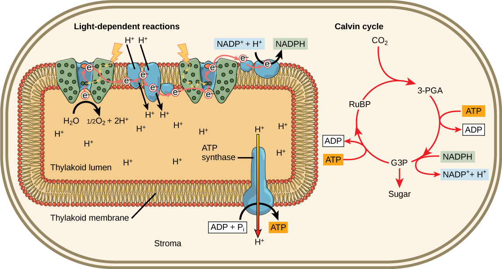

By the end of this section, you will be able to:
* Describe the Calvin cycle
* Define carbon fixation
* Explain how photosynthesis works in the energy cycle of all living organisms

After the energy from the sun is converted into chemical energy and temporarily stored in ATP and NADPH molecules, the cell has the fuel needed to build carbohydrate molecules for long-term energy storage. The products of the light-dependent reactions, ATP and NADPH, have lifespans in the range of millionths of seconds, whereas the products of the light-independent reactions (carbohydrates and other forms of reduced carbon) can survive for hundreds of millions of years. The carbohydrate molecules made will have a backbone of carbon atoms. Where does the carbon come from? It comes from carbon dioxide, the gas that is a waste product of respiration in microbes, fungi, plants, and animals.

# The Calvin Cycle

In plants, carbon dioxide (CO2) enters the leaves through stomata, where it diffuses over short distances through intercellular spaces until it reaches the mesophyll cells. Once in the mesophyll cells, CO2 diffuses into the stroma of the chloroplast—the site of light-independent reactions of photosynthesis. These reactions actually have several names associated with them. Another term, the **Calvin cycle**{: data-type="term"}, is named for the man who discovered it, and because these reactions function as a cycle. Others call it the Calvin-Benson cycle to include the name of another scientist involved in its discovery. The most outdated name is dark reactions, because light is not directly required ([\[link\]](#fig-ch08_03_01)). However, the term dark reaction can be misleading because it implies incorrectly that the reaction only occurs at night or is independent of light, which is why most scientists and instructors no longer use it.

 {: #fig-ch08_03_01}

The light-independent reactions of the Calvin cycle can be organized into three basic stages: fixation, reduction, and regeneration.

## Stage 1: Fixation

In the stroma, in addition to CO2, two other components are present to initiate the light-independent reactions: an enzyme called ribulose-1,5-bisphosphate carboxylase/oxygenase (RuBisCO), and three molecules of ribulose bisphosphate (RuBP), as shown in [\[link\]](#fig-ch08_03_02). RuBP has five atoms of carbon, flanked by two phosphates.

Art Connection

![A diagram of the Calvin cycle is shown with its three stages: carbon fixation, 3-PGA reduction, and regeneration of RuBP. In stage 1, the enzyme RuBisCO adds a carbon dioxide to the five-carbon molecule RuBP, producing two three-carbon 3-PGA molecules. In stage 2, two NADPH and two ATP are used to reduce 3-PGA to GA3P. In stage 3 RuBP is regenerated from GA3P. One ATP is used in the process. Three complete cycles produces one new GA3P, which is shunted out of the cycle and made into glucose (C6H12O6).](../resources/Figure_08_03_02f.png "The Calvin cycle has three stages. In stage 1, the enzyme RuBisCO incorporates carbon dioxide into an organic molecule, 3-PGA. In stage 2, the organic molecule is reduced using electrons supplied by NADPH. In stage 3, RuBP, the molecule that starts the cycle, is regenerated so that the cycle can continue. Only one carbon dioxide molecule is incorporated at a time, so the cycle must be completed three times to produce a single three-carbon GA3P molecule, and six times to produce a six-carbon glucose molecule."){: #fig-ch08_03_02}

Which of the following statements is true?

1.  In photosynthesis, oxygen, carbon dioxide, ATP, and NADPH are reactants. GA3P and water are products.
2.  In photosynthesis, chlorophyll, water, and carbon dioxide are reactants. GA3P and oxygen are products.
3.  In photosynthesis, water, carbon dioxide, ATP, and NADPH are reactants. RuBP and oxygen are products.
4.  In photosynthesis, water and carbon dioxide are reactants. GA3P and oxygen are products.
{: data-number-style="lower-alpha"}

<!-- <para><link target-id="fig-ch08_03_02" document=""/>D</para> -->

RuBisCO catalyzes a reaction between CO2 and RuBP. For each CO2 molecule that reacts with one RuBP, two molecules of another compound (3-PGA) form. PGA has three carbons and one phosphate. Each turn of the cycle involves only one RuBP and one carbon dioxide and forms two molecules of 3-PGA. The number of carbon atoms remains the same, as the atoms move to form new bonds during the reactions (3 atoms from 3CO2 + 15 atoms from 3RuBP = 18 atoms in 3 atoms of 3-PGA). This process is called **carbon**{: data-type="term"} **fixation**{: data-type="term"}, because CO2 is “fixed” from an inorganic form into organic molecules.

## Stage 2: Reduction

ATP and NADPH are used to convert the six molecules of 3-PGA into six molecules of a chemical called glyceraldehyde 3-phosphate (G3P). That is a reduction reaction because it involves the gain of electrons by 3-PGA. Recall that a **reduction**{: data-type="term"} is the gain of an electron by an atom or molecule. Six molecules of both ATP and NADPH are used. For ATP, energy is released with the loss of the terminal phosphate atom, converting it into ADP; for NADPH, both energy and a hydrogen atom are lost, converting it into NADP+. Both of these molecules return to the nearby light-dependent reactions to be reused and reenergized.

## Stage 3: Regeneration

Interestingly, at this point, only one of the G3P molecules leaves the Calvin cycle and is sent to the cytoplasm to contribute to the formation of other compounds needed by the plant. Because the G3P exported from the chloroplast has three carbon atoms, it takes three “turns” of the Calvin cycle to fix enough net carbon to export one G3P. But each turn makes two G3Ps, thus three turns make six G3Ps. One is exported while the remaining five G3P molecules remain in the cycle and are used to regenerate RuBP, which enables the system to prepare for more CO2 to be fixed. Three more molecules of ATP are used in these regeneration reactions.

Link to Learning

  
This [link][1]{: target="_window"} leads to an animation of the Calvin cycle. Click stage 1, stage 2, and then stage 3 to see G3P and ATP regenerate to form RuBP.

Evolution Connection

PhotosynthesisDuring the evolution of photosynthesis, a major shift occurred from the bacterial type of photosynthesis that involves only one photosystem and is typically anoxygenic (does not generate oxygen) into modern oxygenic (does generate oxygen) photosynthesis, employing two photosystems. This modern oxygenic photosynthesis is used by many organisms—from giant tropical leaves in the rainforest to tiny cyanobacterial cells—and the process and components of this photosynthesis remain largely the same. Photosystems absorb light and use electron transport chains to convert energy into the chemical energy of ATP and NADH. The subsequent light-independent reactions then assemble carbohydrate molecules with this energy.

Photosynthesis in desert plants has evolved adaptations that conserve water. In the harsh dry heat, every drop of water must be used to survive. Because stomata must open to allow for the uptake of CO2, water escapes from the leaf during active photosynthesis. Desert plants have evolved processes to conserve water and deal with harsh conditions. A more efficient use of CO2 allows plants to adapt to living with less water. Some plants such as cacti ([\[link\]](#fig-ch08_03_03)) can prepare materials for photosynthesis during the night by a temporary carbon fixation/storage process, because opening the stomata at this time conserves water due to cooler temperatures. In addition, cacti have evolved the ability to carry out low levels of photosynthesis without opening stomata at all, an extreme mechanism to face extremely dry periods.

"){: #fig-ch08_03_03}

# The Energy Cycle

Whether the organism is a bacterium, plant, or animal, all living things access energy by breaking down carbohydrate molecules. But if plants make carbohydrate molecules, why would they need to break them down, especially when it has been shown that the gas organisms release as a “waste product” (CO2) acts as a substrate for the formation of more food in photosynthesis? Remember, living things need energy to perform life functions. In addition, an organism can either make its own food or eat another organism—either way, the food still needs to be broken down. Finally, in the process of breaking down food, called cellular respiration, heterotrophs release needed energy and produce “waste” in the form of CO2 gas.

In nature, there is no such thing as waste. Every single atom of matter and energy is conserved, recycling over and over infinitely. Substances change form or move from one type of molecule to another, but their constituent atoms never disappear ([\[link\]](#fig-ch08_03_04)).

CO2 is no more a form of waste than oxygen is wasteful to photosynthesis. Both are byproducts of reactions that move on to other reactions. Photosynthesis absorbs light energy to build carbohydrates in chloroplasts, and aerobic cellular respiration releases energy by using oxygen to metabolize carbohydrates in the cytoplasm and mitochondria. Both processes use electron transport chains to capture the energy necessary to drive other reactions. These two powerhouse processes, photosynthesis and cellular respiration, function in biological, cyclical harmony to allow organisms to access life-sustaining energy that originates millions of miles away in a burning star humans call the sun.

"){: #fig-ch08_03_04}

# Section Summary

Using the energy carriers formed in the first steps of photosynthesis, the light-independent reactions, or the Calvin cycle, take in CO2 from the environment. An enzyme, RuBisCO, catalyzes a reaction with CO2 and another molecule, RuBP. After three cycles, a three-carbon molecule of G3P leaves the cycle to become part of a carbohydrate molecule. The remaining G3P molecules stay in the cycle to be regenerated into RuBP, which is then ready to react with more CO2. Photosynthesis forms an energy cycle with the process of cellular respiration. Plants need both photosynthesis and respiration for their ability to function in both the light and dark, and to be able to interconvert essential metabolites. Therefore, plants contain both chloroplasts and mitochondria.

# Art Connections

[[link]](#fig-ch08_03_02) Which of the following statements is true?

1.  In photosynthesis, oxygen, carbon dioxide, ATP, and NADPH are reactants. G3P and water are products.
2.  In photosynthesis, chlorophyll, water, and carbon dioxide are reactants. G3P and oxygen are products.
3.  In photosynthesis, water, carbon dioxide, ATP, and NADPH are reactants. RuBP and oxygen are products.
4.  In photosynthesis, water and carbon dioxide are reactants. G3P and oxygen are products.
{: data-number-style="lower-alpha"}

[[link]](#fig-ch08_03_02) D

# Review Questions

Which molecule must enter the Calvin cycle continually for the light-independent reactions to take place?

1.  RuBisCO
2.  RuBP
3.  3-PGA
4.  CO2
{: data-number-style="lower-alpha"}

D

Which order of molecular conversions is correct for the Calvin cycle?

1.  <math xmlns="http://www.w3.org/1998/Math/MathML" display=""> <mrow> <mtext>RuBP + G3P </mtext><mo stretchy="false">→</mo><mtext> 3-PGA </mtext><mo stretchy="false">→</mo><mtext> sugar</mtext> </mrow> </math>

2.  <math xmlns="http://www.w3.org/1998/Math/MathML" display=""> <mrow> <mtext>RuBisCO </mtext><mo stretchy="false">→</mo><msub> <mrow> <mtext> CO</mtext> </mrow> <mn>2</mn> </msub> <mtext> </mtext><mo stretchy="false">→</mo><mtext> RuBP </mtext><mo stretchy="false">→</mo><mtext> G3P</mtext> </mrow> </math>

3.  <math xmlns="http://www.w3.org/1998/Math/MathML" display=""> <mrow> <msub> <mrow> <mtext>RuBP + CO</mtext> </mrow> <mn>2</mn> </msub> <mtext> </mtext><mo stretchy="false">→</mo><mtext> </mtext><mrow><mo>[</mo> <mrow> <mtext>RuBisCO</mtext> </mrow> <mo>]</mo></mrow><mtext> 3-PGA </mtext><mo stretchy="false">→</mo><mtext> G3P</mtext> </mrow> </math>

4.  <math xmlns="http://www.w3.org/1998/Math/MathML" display=""> <mrow> <msub> <mrow> <mtext>CO</mtext> </mrow> <mn>2</mn> </msub> <mtext> </mtext><mo stretchy="false">→</mo><mtext> 3-PGA </mtext><mo stretchy="false">→</mo><mtext> RuBP </mtext><mo stretchy="false">→</mo><mtext> G3P</mtext> </mrow> </math>
{: data-number-style="lower-alpha"}

C

Where in eukaryotic cells does the Calvin cycle take place?

1.  thylakoid membrane
2.  thylakoid lumen
3.  chloroplast stroma
4.  granum
{: data-number-style="lower-alpha"}

C

Which statement correctly describes carbon fixation?

1.  the conversion of CO2 into an organic compound
2.  the use of RuBisCO to form 3-PGA
3.  the production of carbohydrate molecules from G3P
4.  the formation of RuBP from G3P molecules
5.  the use of ATP and NADPH to reduce CO2
{: data-number-style="lower-alpha"}

A

# Free Response

Why is the third stage of the Calvin cycle called the regeneration stage?

Because RuBP, the molecule needed at the start of the cycle, is regenerated from G3P.

Which part of the light-independent reactions would be affected if a cell could not produce the enzyme RuBisCO?

None of the cycle could take place, because RuBisCO is essential in fixing carbon dioxide. Specifically, RuBisCO catalyzes the reaction between carbon dioxide and RuBP at the start of the cycle.

Why does it take three turns of the Calvin cycle to produce G3P, the initial product of photosynthesis?

Because G3P has three carbon atoms, and each turn of the cycle takes in one carbon atom in the form of carbon dioxide.

## Glossary
{: data-type="glossary-title"}

Calvin cycle
: light-independent reactions of photosynthesis that convert carbon dioxide from the atmosphere into carbohydrates using the energy and reducing power of ATP and NADPH
{: .definition}

carbon fixation
: process of converting inorganic CO2 gas into organic compounds
{: .definition}

reduction
: gain of electron(s) by an atom or molecule
{: .definition}

[1]: http://openstaxcollege.org/l/calvin_cycle
