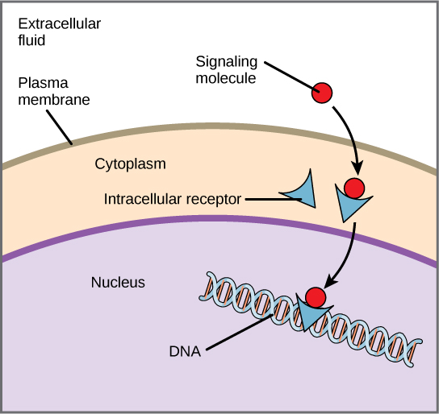
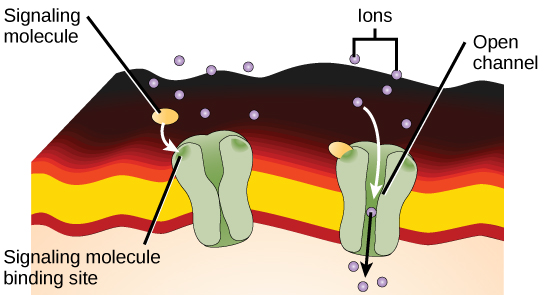
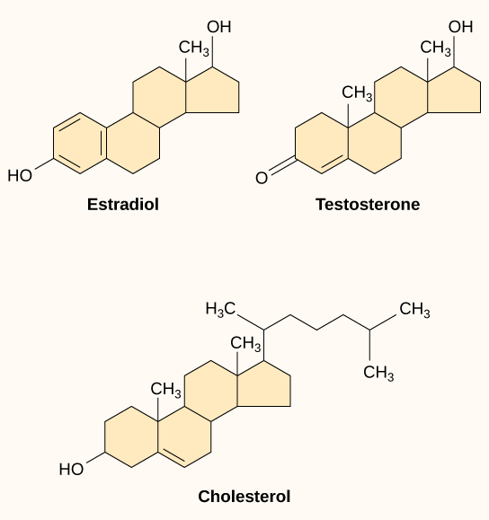

By the end of this section, you will be able to:
* Describe four types of signaling found in multicellular organisms
* Compare internal receptors with cell-surface receptors
* Recognize the relationship between a ligand’s structure and its mechanism of action

There are two kinds of communication in the world of living cells. Communication between cells is called **intercellular signaling**{: data-type="term"}, and communication within a cell is called **intracellular signaling**{: data-type="term"}. An easy way to remember the distinction is by understanding the Latin origin of the prefixes: inter- means \"between\" (for example, intersecting lines are those that cross each other) and intra- means \"inside\" (like intravenous).

Chemical signals are released by **signaling cells**{: data-type="term"} in the form of small, usually volatile or soluble molecules called ligands. A **ligand**{: data-type="term"} is a molecule that binds another specific molecule, in some cases, delivering a signal in the process. Ligands can thus be thought of as signaling molecules. Ligands interact with proteins in **target cells**{: data-type="term"}, which are cells that are affected by chemical signals; these proteins are also called **receptors**{: data-type="term"}. Ligands and receptors exist in several varieties; however, a specific ligand will have a specific receptor that typically binds only that ligand.

# Forms of Signaling

There are four categories of chemical signaling found in multicellular organisms: paracrine signaling, endocrine signaling, autocrine signaling, and direct signaling across gap junctions ([\[link\]](#fig-ch09_01_01)). The main difference between the different categories of signaling is the distance that the signal travels through the organism to reach the target cell. Not all cells are affected by the same signals.

 , a cell connected by gap junctions, a nearby cell (paracrine signaling), or a distant cell (endocrine signaling). Paracrine signaling acts on nearby cells, endocrine signaling uses the circulatory system to transport ligands, and autocrine signaling acts on the signaling cell. Signaling via gap junctions involves signaling molecules moving directly between adjacent cells."){: #fig-ch09_01_01}

## Paracrine Signaling

Signals that act locally between cells that are close together are called **paracrine signals**{: data-type="term"}. Paracrine signals move by diffusion through the extracellular matrix. These types of signals usually elicit quick responses that last only a short amount of time. In order to keep the response localized, paracrine ligand molecules are normally quickly degraded by enzymes or removed by neighboring cells. Removing the signals will reestablish the concentration gradient for the signal, allowing them to quickly diffuse through the intracellular space if released again.

One example of paracrine signaling is the transfer of signals across synapses between nerve cells. A nerve cell consists of a cell body, several short, branched extensions called dendrites that receive stimuli, and a long extension called an axon, which transmits signals to other nerve cells or muscle cells. The junction between nerve cells where signal transmission occurs is called a synapse. A **synaptic signal**{: data-type="term"} is a chemical signal that travels between nerve cells. Signals within the nerve cells are propagated by fast-moving electrical impulses. When these impulses reach the end of the axon, the signal continues on to a dendrite of the next cell by the release of chemical ligands called **neurotransmitters**{: data-type="term"} by the presynaptic cell (the cell emitting the signal). The neurotransmitters are transported across the very small distances between nerve cells, which are called **chemical synapses**{: data-type="term"} ([\[link\]](#fig-ch09_01_02)). The small distance between nerve cells allows the signal to travel quickly; this enables an immediate response, such as, Take your hand off the stove!

When the neurotransmitter binds the receptor on the surface of the postsynaptic cell, the electrochemical potential of the target cell changes, and the next electrical impulse is launched. The neurotransmitters that are released into the chemical synapse are degraded quickly or get reabsorbed by the presynaptic cell so that the recipient nerve cell can recover quickly and be prepared to respond rapidly to the next synaptic signal.

 {: #fig-ch09_01_02}

## Endocrine Signaling

Signals from distant cells are called **endocrine signals**{: data-type="term"}, and they originate from **endocrine cells**{: data-type="term"}. (In the body, many endocrine cells are located in endocrine glands, such as the thyroid gland, the hypothalamus, and the pituitary gland.) These types of signals usually produce a slower response but have a longer-lasting effect. The ligands released in endocrine signaling are called hormones, signaling molecules that are produced in one part of the body but affect other body regions some distance away.

Hormones travel the large distances between endocrine cells and their target cells via the bloodstream, which is a relatively slow way to move throughout the body. Because of their form of transport, hormones get diluted and are present in low concentrations when they act on their target cells. This is different from paracrine signaling, in which local concentrations of ligands can be very high.

## Autocrine Signaling

**Autocrine signals**{: data-type="term"} are produced by signaling cells that can also bind to the ligand that is released. This means the signaling cell and the target cell can be the same or a similar cell (the prefix *auto-* means self, a reminder that the signaling cell sends a signal to itself). This type of signaling often occurs during the early development of an organism to ensure that cells develop into the correct tissues and take on the proper function. Autocrine signaling also regulates pain sensation and inflammatory responses. Further, if a cell is infected with a virus, the cell can signal itself to undergo programmed cell death, killing the virus in the process. In some cases, neighboring cells of the same type are also influenced by the released ligand. In embryological development, this process of stimulating a group of neighboring cells may help to direct the differentiation of identical cells into the same cell type, thus ensuring the proper developmental outcome.

## Direct Signaling Across Gap Junctions

Gap junctions in animals and plasmodesmata in plants are connections between the plasma membranes of neighboring cells. These water-filled channels allow small signaling molecules, called **intracellular mediators**{: data-type="term"}, to diffuse between the two cells. Small molecules, such as calcium ions (Ca2+), are able to move between cells, but large molecules like proteins and DNA cannot fit through the channels. The specificity of the channels ensures that the cells remain independent but can quickly and easily transmit signals. The transfer of signaling molecules communicates the current state of the cell that is directly next to the target cell; this allows a group of cells to coordinate their response to a signal that only one of them may have received. In plants, plasmodesmata are ubiquitous, making the entire plant into a giant, communication network.

# Types of Receptors

Receptors are protein molecules in the target cell or on its surface that bind ligand. There are two types of receptors, internal receptors and cell-surface receptors.

## Internal receptors

**Internal receptors**{: data-type="term"}, also known as intracellular or cytoplasmic receptors, are found in the cytoplasm of the cell and respond to hydrophobic ligand molecules that are able to travel across the plasma membrane. Once inside the cell, many of these molecules bind to proteins that act as regulators of mRNA synthesis (transcription) to mediate gene expression. Gene expression is the cellular process of transforming the information in a cell\'s DNA into a sequence of amino acids, which ultimately forms a protein. When the ligand binds to the internal receptor, a conformational change is triggered that exposes a DNA-binding site on the protein. The ligand-receptor complex moves into the nucleus, then binds to specific regulatory regions of the chromosomal DNA and promotes the initiation of transcription ([\[link\]](#fig-ch09_01_03)). Transcription is the process of copying the information in a cells DNA into a special form of RNA called messenger RNA (mRNA); the cell uses information in the mRNA (which moves out into the cytoplasm and associates with ribosomes) to link specific amino acids in the correct order, producing a protein. Internal receptors can directly influence gene expression without having to pass the signal on to other receptors or messengers.

{: #fig-ch09_01_03}

## Cell-Surface Receptors

**Cell-surface receptors**{: data-type="term"}, also known as transmembrane receptors, are cell surface, membrane-anchored (integral) proteins that bind to external ligand molecules. This type of receptor spans the plasma membrane and performs signal transduction, in which an extracellular signal is converted into an intercellular signal. Ligands that interact with cell-surface receptors do not have to enter the cell that they affect. Cell-surface receptors are also called cell-specific proteins or markers because they are specific to individual cell types.

Because cell-surface receptor proteins are fundamental to normal cell functioning, it should come as no surprise that a malfunction in any one of these proteins could have severe consequences. Errors in the protein structures of certain receptor molecules have been shown to play a role in hypertension (high blood pressure), asthma, heart disease, and cancer.

Each cell-surface receptor has three main components: an external ligand-binding domain, a hydrophobic membrane-spanning region, and an intracellular domain inside the cell. The ligand-binding domain is also called the **extracellular domain**{: data-type="term"}. The size and extent of each of these domains vary widely, depending on the type of receptor.

Evolution Connection

How Viruses Recognize a HostUnlike living cells, many viruses do not have a plasma membrane or any of the structures necessary to sustain life. Some viruses are simply composed of an inert protein shell containing DNA or RNA. To reproduce, viruses must invade a living cell, which serves as a host, and then take over the hosts cellular apparatus. But how does a virus recognize its host?

Viruses often bind to cell-surface receptors on the host cell. For example, the virus that causes human influenza (flu) binds specifically to receptors on membranes of cells of the respiratory system. Chemical differences in the cell-surface receptors among hosts mean that a virus that infects a specific species (for example, humans) cannot infect another species (for example, chickens).

However, viruses have very small amounts of DNA or RNA compared to humans, and, as a result, viral reproduction can occur rapidly. Viral reproduction invariably produces errors that can lead to changes in newly produced viruses; these changes mean that the viral proteins that interact with cell-surface receptors may evolve in such a way that they can bind to receptors in a new host. Such changes happen randomly and quite often in the reproductive cycle of a virus, but the changes only matter if a virus with new binding properties comes into contact with a suitable host. In the case of influenza, this situation can occur in settings where animals and people are in close contact, such as poultry and swine farms.A. B. Sigalov, The School of Nature. IV. Learning from Viruses, *Self/Nonself* 1, no. 4 (2010): 282-298. Y. Cao, X. Koh, L. Dong, X. Du, A. Wu, X. Ding, H. Deng, Y. Shu, J. Chen, T. Jiang, Rapid Estimation of Binding Activity of Influenza Virus Hemagglutinin to Human and Avian Receptors, *PLoS One* 6, no. 4 (2011): e18664.

 Once a virus jumps to a new host, it can spread quickly. Scientists watch newly appearing viruses (called emerging viruses) closely in the hope that such monitoring can reduce the likelihood of global viral epidemics.

Cell-surface receptors are involved in most of the signaling in multicellular organisms. There are three general categories of cell-surface receptors: ion channel-linked receptors, G-protein-linked receptors, and enzyme-linked receptors.

**Ion channel-linked receptors**{: data-type="term"} bind a ligand and open a channel through the membrane that allows specific ions to pass through. To form a channel, this type of cell-surface receptor has an extensive membrane-spanning region. In order to interact with the phospholipid fatty acid tails that form the center of the plasma membrane, many of the amino acids in the membrane-spanning region are hydrophobic in nature. Conversely, the amino acids that line the inside of the channel are hydrophilic to allow for the passage of water or ions. When a ligand binds to the extracellular region of the channel, there is a conformational change in the proteins structure that allows ions such as sodium, calcium, magnesium, and hydrogen to pass through ([\[link\]](#fig-ch09_01_04)).

 {: #fig-ch09_01_04}

**G-protein-linked receptors**{: data-type="term"} bind a ligand and activate a membrane protein called a G-protein. The activated G-protein then interacts with either an ion channel or an enzyme in the membrane ([\[link\]](#fig-ch09_01_05)). All G-protein-linked receptors have seven transmembrane domains, but each receptor has its own specific extracellular domain and G-protein-binding site.

Cell signaling using G-protein-linked receptors occurs as a cyclic series of events. Before the ligand binds, the inactive G-protein can bind to a newly revealed site on the receptor specific for its binding. Once the G-protein binds to the receptor, the resultant shape change activates the G-protein, which releases GDP and picks up GTP. The subunits of the G-protein then split into the *α* subunit and the *βγ* subunit. One or both of these G-protein fragments may be able to activate other proteins as a result. After awhile, the GTP on the active *α* subunit of the G-protein is hydrolyzed to GDP and the *βγ* subunit is deactivated. The subunits reassociate to form the inactive G-protein and the cycle begins anew.

{: #fig-ch09_01_05}

G-protein-linked receptors have been extensively studied and much has been learned about their roles in maintaining health. Bacteria that are pathogenic to humans can release poisons that interrupt specific G-protein-linked receptor function, leading to illnesses such as pertussis, botulism, and cholera. In cholera ([\[link\]](#fig-ch09_01_06)), for example, the water-borne bacterium *Vibrio cholerae* produces a toxin, choleragen, that binds to cells lining the small intestine. The toxin then enters these intestinal cells, where it modifies a G-protein that controls the opening of a chloride channel and causes it to remain continuously active, resulting in large losses of fluids from the body and potentially fatal dehydration as a result.

 "){: #fig-ch09_01_06}

**Enzyme-linked receptors**{: data-type="term"} are cell-surface receptors with intracellular domains that are associated with an enzyme. In some cases, the intracellular domain of the receptor itself is an enzyme. Other enzyme-linked receptors have a small intracellular domain that interacts directly with an enzyme. The enzyme-linked receptors normally have large extracellular and intracellular domains, but the membrane-spanning region consists of a single alpha-helical region of the peptide strand. When a ligand binds to the extracellular domain, a signal is transferred through the membrane, activating the enzyme. Activation of the enzyme sets off a chain of events within the cell that eventually leads to a response. One example of this type of enzyme-linked receptor is the tyrosine kinase receptor ([\[link\]](#fig-ch09_01_07)). A kinase is an enzyme that transfers phosphate groups from ATP to another protein. The tyrosine kinase receptor transfers phosphate groups to tyrosine molecules (tyrosine residues). First, signaling molecules bind to the extracellular domain of two nearby tyrosine kinase receptors. The two neighboring receptors then bond together, or dimerize. Phosphates are then added to tyrosine residues on the intracellular domain of the receptors (phosphorylation). The phosphorylated residues can then transmit the signal to the next messenger within the cytoplasm.

Art Connection

{: #fig-ch09_01_07}

HER2 is a receptor tyrosine kinase. In 30 percent of human breast cancers, HER2 is permanently activated, resulting in unregulated cell division. Lapatinib, a drug used to treat breast cancer, inhibits HER2 receptor tyrosine kinase autophosphorylation (the process by which the receptor adds phosphates onto itself), thus reducing tumor growth by 50 percent. Besides autophosphorylation, which of the following steps would be inhibited by Lapatinib?

1.  Signaling molecule binding, dimerization, and the downstream cellular response
2.  Dimerization, and the downstream cellular response
3.  The downstream cellular response
4.  Phosphatase activity, dimerization, and the downsteam cellular response
{: data-number-style="lower-alpha"}

# Signaling Molecules

Produced by signaling cells and the subsequent binding to receptors in target cells, ligands act as chemical signals that travel to the target cells to coordinate responses. The types of molecules that serve as ligands are incredibly varied and range from small proteins to small ions like calcium (Ca2+).

## Small Hydrophobic Ligands

Small hydrophobic ligands can directly diffuse through the plasma membrane and interact with internal receptors. Important members of this class of ligands are the steroid hormones. Steroids are lipids that have a hydrocarbon skeleton with four fused rings; different steroids have different functional groups attached to the carbon skeleton. Steroid hormones include the female sex hormone, estradiol, which is a type of estrogen; the male sex hormone, testosterone; and cholesterol, which is an important structural component of biological membranes and a precursor of steriod hormones ([\[link\]](#fig-ch09_01_08)). Other hydrophobic hormones include thyroid hormones and vitamin D. In order to be soluble in blood, hydrophobic ligands must bind to carrier proteins while they are being transported through the bloodstream.

 {: #fig-ch09_01_08}

## Water-Soluble Ligands

Water-soluble ligands are polar and therefore cannot pass through the plasma membrane unaided; sometimes, they are too large to pass through the membrane at all. Instead, most water-soluble ligands bind to the extracellular domain of cell-surface receptors. This group of ligands is quite diverse and includes small molecules, peptides, and proteins.

## Other Ligands

Nitric oxide (NO) is a gas that also acts as a ligand. It is able to diffuse directly across the plasma membrane, and one of its roles is to interact with receptors in smooth muscle and induce relaxation of the tissue. NO has a very short half-life and therefore only functions over short distances. Nitroglycerin, a treatment for heart disease, acts by triggering the release of NO, which causes blood vessels to dilate (expand), thus restoring blood flow to the heart. NO has become better known recently because the pathway that it affects is targeted by prescription medications for erectile dysfunction, such as Viagra (erection involves dilated blood vessels).

# Section Summary

Cells communicate by both inter- and intracellular signaling. Signaling cells secrete ligands that bind to target cells and initiate a chain of events within the target cell. The four categories of signaling in multicellular organisms are paracrine signaling, endocrine signaling, autocrine signaling, and direct signaling across gap junctions. Paracrine signaling takes place over short distances. Endocrine signals are carried long distances through the bloodstream by hormones, and autocrine signals are received by the same cell that sent the signal or other nearby cells of the same kind. Gap junctions allow small molecules, including signaling molecules, to flow between neighboring cells.

Internal receptors are found in the cell cytoplasm. Here, they bind ligand molecules that cross the plasma membrane; these receptor-ligand complexes move to the nucleus and interact directly with cellular DNA. Cell-surface receptors transmit a signal from outside the cell to the cytoplasm. Ion channel-linked receptors, when bound to their ligands, form a pore through the plasma membrane through which certain ions can pass. G-protein-linked receptors interact with a G-protein on the cytoplasmic side of the plasma membrane, promoting the exchange of bound GDP for GTP and interacting with other enzymes or ion channels to transmit a signal. Enzyme-linked receptors transmit a signal from outside the cell to an intracellular domain of a membrane-bound enzyme. Ligand binding causes activation of the enzyme. Small hydrophobic ligands (like steroids) are able to penetrate the plasma membrane and bind to internal receptors. Water-soluble hydrophilic ligands are unable to pass through the membrane; instead, they bind to cell-surface receptors, which transmit the signal to the inside of the cell.

# Art Connections

[[link]](#fig-ch09_01_07) HER2 is a receptor tyrosine kinase. In 30 percent of human breast cancers, HER2 is permanently activated, resulting in unregulated cell division. Lapatinib, a drug used to treat breast cancer, inhibits HER2 receptor tyrosine kinase autophosphorylation (the process by which the receptor adds phosphates onto itself), thus reducing tumor growth by 50 percent. Besides autophosphorylation, which of the following steps would be inhibited by Lapatinib?

1.  Signaling molecule binding, dimerization, and the downstream cellular response.
2.  Dimerization, and the downstream cellular response.
3.  The downstream cellular response.
4.  Phosphatase activity, dimerization, and the downsteam cellular response.
{: data-number-style="lower-alpha"}

[[link]](#fig-ch09_01_07) C. The downstream cellular response would be inhibited.

# Review Questions

What property prevents the ligands of cell-surface receptors from entering the cell?

1.  The molecules bind to the extracellular domain.
2.  The molecules are hydrophilic and cannot penetrate the hydrophobic interior of the plasma membrane.
3.  The molecules are attached to transport proteins that deliver them through the bloodstream to target cells.
4.  The ligands are able to penetrate the membrane and directly influence gene expression upon receptor binding.
{: data-number-style="lower-alpha"}

B

The secretion of hormones by the pituitary gland is an example of \_\_\_\_\_\_\_\_\_\_\_\_\_\_\_.

1.  autocrine signaling
2.  paracrine signaling
3.  endocrine signaling
4.  direct signaling across gap junctions
{: data-number-style="lower-alpha"}

C

Why are ion channels necessary to transport ions into or out of a cell?

1.  Ions are too large to diffuse through the membrane.
2.  Ions are charged particles and cannot diffuse through the hydrophobic interior of the membrane.
3.  Ions do not need ion channels to move through the membrane.
4.  Ions bind to carrier proteins in the bloodstream, which must be removed before transport into the cell.
{: data-number-style="lower-alpha"}

B

Endocrine signals are transmitted more slowly than paracrine signals because \_\_\_\_\_\_\_\_\_\_\_.

1.  the ligands are transported through the bloodstream and travel greater distances
2.  the target and signaling cells are close together
3.  the ligands are degraded rapidly
4.  the ligands don't bind to carrier proteins during transport
{: data-number-style="lower-alpha"}

A

# Free Response

What is the difference between intracellular signaling and intercellular signaling?

Intracellular signaling occurs within a cell, and intercellular signaling occurs between cells.

How are the effects of paracrine signaling limited to an area near the signaling cells?

The secreted ligands are quickly removed by degradation or reabsorption into the cell so that they cannot travel far.

What are the differences between internal receptors and cell-surface receptors?

Internal receptors are located inside the cell, and their ligands enter the cell to bind the receptor. The complex formed by the internal receptor and the ligand then enters the nucleus and directly affects protein production by binding to the chromosomal DNA and initiating the making of mRNA that codes for proteins. Cell-surface receptors, however, are embedded in the plasma membrane, and their ligands do not enter the cell. Binding of the ligand to the cell-surface receptor initiates a cell signaling cascade and does not directly influence the making of proteins; however, it may involve the activation of intracellular proteins.

Cells grown in the laboratory are mixed with a dye molecule that is unable to pass through the plasma membrane. If a ligand is added to the cells, observations show that the dye enters the cells. What type of receptor did the ligand bind to on the cell surface?

An ion channel receptor opened up a pore in the membrane, which allowed the ionic dye to move into the cell.

