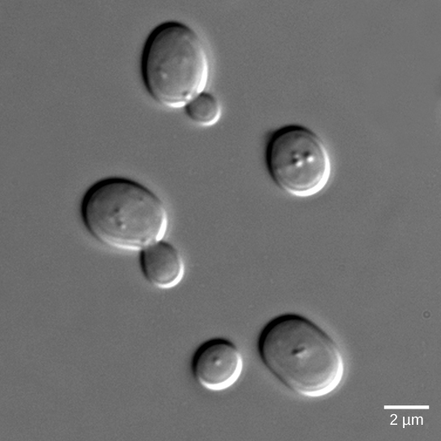

By the end of this section, you will be able to:
* Describe how single-celled yeasts use cell signaling to communicate with one another
* Relate the role of quorum sensing to the ability of some bacteria to form biofilms

Within-cell signaling allows bacteria to respond to environmental cues, such as nutrient levels, some single-celled organisms also release molecules to signal to each other.

### Signaling in Yeast

Yeasts are eukaryotes (fungi), and the components and processes found in yeast signals are similar to those of cell-surface receptor signals in multicellular organisms. Budding yeasts ([\[link\]](#fig-ch09_04_01)) are able to participate in a process that is similar to sexual reproduction that entails two haploid cells (cells with one-half the normal number of chromosomes) combining to form a diploid cell (a cell with two sets of each chromosome, which is what normal body cells contain). In order to find another haploid yeast cell that is prepared to mate, budding yeasts secrete a signaling molecule called **mating factor**{: data-type="term"}. When mating factor binds to cell-surface receptors in other yeast cells that are nearby, they stop their normal growth cycles and initiate a cell signaling cascade that includes protein kinases and GTP-binding proteins that are similar to G-proteins.

 {: #fig-ch09_04_01}

### Signaling in Bacteria

Signaling in bacteria enables bacteria to monitor extracellular conditions, ensure that there are sufficient amounts of nutrients, and ensure that hazardous situations are avoided. There are circumstances, however, when bacteria communicate with each other.

The first evidence of bacterial communication was observed in a bacterium that has a symbiotic relationship with Hawaiian bobtail squid. When the population density of the bacteria reaches a certain level, specific gene expression is initiated, and the bacteria produce bioluminescent proteins that emit light. Because the number of cells present in the environment (cell density) is the determining factor for signaling, bacterial signaling was named **quorum sensing**{: data-type="term"}. In politics and business, a quorum is the minimum number of members required to be present to vote on an issue.

Quorum sensing uses autoinducers as signaling molecules. **Autoinducers**{: data-type="term"} are signaling molecules secreted by bacteria to communicate with other bacteria of the same kind. The secreted autoinducers can be small, hydrophobic molecules such as acyl-homoserine lactone, (AHL) or larger peptide-based molecules; each type of molecule has a different mode of action. When AHL enters target bacteria, it binds to transcription factors, which then switch gene expression on or off ([\[link\]](#fig-ch09_04_02)). The peptide autoinducers stimulate more complicated signaling pathways that include bacterial kinases. The changes in bacteria following exposure to autoinducers can be quite extensive. The pathogenic bacterium *Pseudomonas aeruginosa* has 616 different genes that respond to autoinducers.

Art Connection

{: #fig-ch09_04_02}

Which of the following statements about quorum sensing is false?

1.  Autoinducer must bind to receptor to turn on transcription of genes responsible for the production of more autoinducer.
2.  The receptor stays in the bacterial cell, but the autoinducer diffuses out.
3.  Autoinducer can only act on a different cell: it cannot act on the cell in which it is made.
4.  Autoinducer turns on genes that enable the bacteria to form a biofilm.
{: data-number-style="lower-alpha"}

Some species of bacteria that use quorum sensing form biofilms, complex colonies of bacteria (often containing several species) that exchange chemical signals to coordinate the release of toxins that will attack the host. Bacterial biofilms ([\[link\]](#fig-ch09_04_03)) can sometimes be found on medical equipment; when biofilms invade implants such as hip or knee replacements or heart pacemakers, they can cause life-threatening infections.

Art Connection

 Staphylococcus aureus bacteria to work together to form a biofilm inside a hospital patient&#x2019;s catheter, seen here via scanning electron microscopy. S. aureus is the main cause of hospital-acquired infections. (b) Hawaiian bobtail squid have a symbiotic relationship with the bioluminescent bacteria Vibrio fischeri. The luminescence makes it difficult to see the squid from below because it effectively eliminates its shadow. In return for camouflage, the squid provides food for the bacteria. Free-living V. fischeri do not produce luciferase, the enzyme responsible for luminescence, but V. fischeri living in a symbiotic relationship with the squid do. Quorum sensing determines whether the bacteria should produce the luciferase enzyme. (credit a: modifications of work by CDC/Janice Carr; credit b: modifications of work by Cliff1066/Flickr)"){: #fig-ch09_04_03}

What advantage might biofilm production confer on the *S. aureus* inside the catheter?

Research on the details of quorum sensing has led to advances in growing bacteria for industrial purposes. Recent discoveries suggest that it may be possible to exploit bacterial signaling pathways to control bacterial growth; this process could replace or supplement antibiotics that are no longer effective in certain situations.

Link to Learning

Watch geneticist Bonnie Bassler discuss her [discovery][1]{: target="_window"} of quorum sensing in biofilm bacteria in squid.

Evolution Connection

Cellular Communication in YeastsThe first life on our planet consisted of single-celled prokaryotic organisms that had limited interaction with each other. While some external signaling occurs between different species of single-celled organisms, the majority of signaling within bacteria and yeasts concerns only other members of the same species. The evolution of cellular communication is an absolute necessity for the development of multicellular organisms, and this innovation is thought to have required approximately 2.5 billion years to appear in early life forms.

Yeasts are single-celled eukaryotes, and therefore have a nucleus and organelles characteristic of more complex life forms. Comparisons of the genomes of yeasts, nematode worms, fruit flies, and humans illustrate the evolution of increasingly complex signaling systems that allow for the efficient inner workings that keep humans and other complex life forms functioning correctly.

Kinases are a major component of cellular communication, and studies of these enzymes illustrate the evolutionary connectivity of different species. Yeasts have 130 types of kinases. More complex organisms such as nematode worms and fruit flies have 454 and 239 kinases, respectively. Of the 130 kinase types in yeast, 97 belong to the 55 subfamilies of kinases that are found in other eukaryotic organisms. The only obvious deficiency seen in yeasts is the complete absence of tyrosine kinases. It is hypothesized that phosphorylation of tyrosine residues is needed to control the more sophisticated functions of development, differentiation, and cellular communication used in multicellular organisms.

Because yeasts contain many of the same classes of signaling proteins as humans, these organisms are ideal for studying signaling cascades. Yeasts multiply quickly and are much simpler organisms than humans or other multicellular animals. Therefore, the signaling cascades are also simpler and easier to study, although they contain similar counterparts to human signaling.[1](#footnote1){: data-type="footnote-link"}

Link to Learning

Watch this collection of interview clips with biofilm researchers in “What Are Bacterial Biofilms?”

<iframe width="660" height="371.4" src="https://www.openstaxcollege.org/l/bacteria_bioflm"></iframe>

### Section Summary

Yeasts and multicellular organisms have similar signaling mechanisms. Yeasts use cell-surface receptors and signaling cascades to communicate information on mating with other yeast cells. The signaling molecule secreted by yeasts is called mating factor.

Bacterial signaling is called quorum sensing. Bacteria secrete signaling molecules called autoinducers that are either small, hydrophobic molecules or peptide-based signals. The hydrophobic autoinducers, such as AHL, bind transcription factors and directly affect gene expression. The peptide-based molecules bind kinases and initiate signaling cascades in the cells.

### Art Connections

[[link]](#fig-ch09_04_02) Which of the following statements about quorum sensing is false?

1.  Autoinducer must bind to receptor to turn on transcription of genes responsible for the production of more autoinducer.
2.  The receptor stays in the bacterial cell, but the autoinducer diffuses out.
3.  Autoinducer can only act on a different cell: it cannot act on the cell in which it is made.
4.  Autoinducer turns on genes that enable the bacteria to form a biofilm.
{: data-number-style="lower-alpha"}

[[link]](#fig-ch09_04_02) C.

[[link]](#fig-ch09_04_03) What advantage might biofilm production confer on the *S. aureus* inside the catheter?

[[link]](#fig-ch09_04_03) *S. aureus* produces a biofilm because the higher cell density in the biofilm permits the formation of a dense surface that helps protect the bacteria from antibiotics.

### Review Questions

Which type of molecule acts as a signaling molecule in yeasts?

1.  steroid
2.  autoinducer
3.  mating factor
4.  second messenger
{: data-number-style="lower-alpha"}

C

Quorum sensing is triggered to begin when \_\_\_\_\_\_\_\_\_\_\_.

1.  treatment with antibiotics occurs
2.  bacteria release growth hormones
3.  bacterial protein expression is switched on
4.  a sufficient number of bacteria are present
{: data-number-style="lower-alpha"}

D

### Free Response

What characteristics make yeasts a good model for learning about signaling in humans?

Yeasts are eukaryotes and have many of the same systems that humans do; however, they are single-celled, so they are easy to grow, grow rapidly, have a short generation time, and are much simpler than humans.

Why is signaling in multicellular organisms more complicated than signaling in single-celled organisms?

Multicellular organisms must coordinate many different events in different cell types that may be very distant from each other. Single-celled organisms are only concerned with their immediate environment and the presence of other cells in the area.

### Footnotes
{: data-type="footnote-refs-title"}

* {: data-type="footnote-ref" #footnote1} [1](#footnote-ref1){: data-type="footnote-ref-link"} G. Manning, G.D. Plowman, T. Hunter, S. Sudarsanam, “Evolution of Protein Kinase Signaling from Yeast to Man,” *Trends in Biochemical Sciences* 27, no. 10 (2002): 514–520.
{: data-list-type="bulleted" data-bullet-style="none"}

### Glossary
{: data-type="glossary-title"}

autoinducer
: signaling molecule secreted by bacteria to communicate with other bacteria of its kind and others
^

mating factor
: signaling molecule secreted by yeast cells to communicate to nearby yeast cells that they are available to mate and communicating their mating orientation
^

quorum sensing
: method of cellular communication used by bacteria that informs them of the abundance of similar (or different) bacteria in the environment

[1]: http://openstaxcollege.org/l/bacteria_talk
