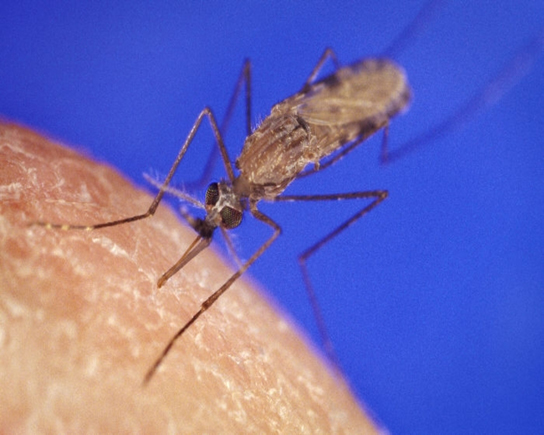
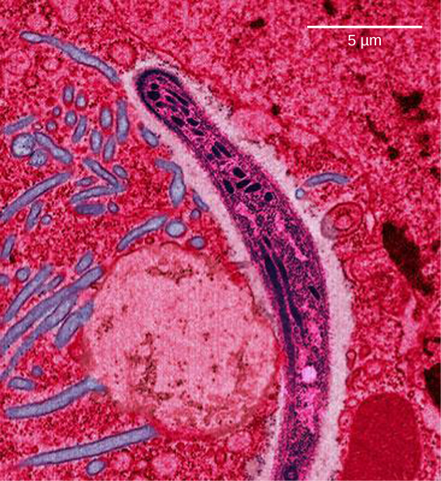
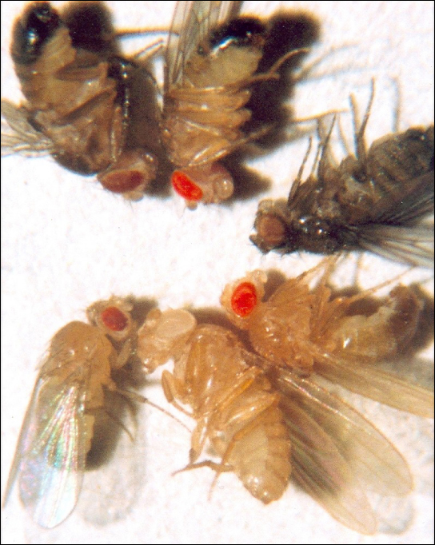

By the end of this section, you will be able to:
* Explain the relationship between genotypes and phenotypes in dominant and recessive gene systems
* Develop a Punnett square to calculate the expected proportions of genotypes and phenotypes in a monohybrid cross
* Explain the purpose and methods of a test cross
* Identify non-Mendelian inheritance patterns such as incomplete dominance, codominance, recessive lethals, multiple alleles, and sex linkage

The seven characteristics that Mendel evaluated in his pea plants were each expressed as one of two versions, or traits. The physical expression of characteristics is accomplished through the expression of genes carried on chromosomes. The genetic makeup of peas consists of two similar or homologous copies of each chromosome, one from each parent. Each pair of homologous chromosomes has the same linear order of genes. In other words, peas are diploid organisms in that they have two copies of each chromosome. The same is true for many other plants and for virtually all animals. Diploid organisms utilize meiosis to produce haploid gametes, which contain one copy of each homologous chromosome that unite at fertilization to create a diploid zygote.

For cases in which a single gene controls a single characteristic, a diploid organism has two genetic copies that may or may not encode the same version of that characteristic. Gene variants that arise by mutation and exist at the same relative locations on homologous chromosomes are called **alleles**{: data-type="term"}. Mendel examined the inheritance of genes with just two allele forms, but it is common to encounter more than two alleles for any given gene in a natural population.

# Phenotypes and Genotypes

Two alleles for a given gene in a diploid organism are expressed and interact to produce physical characteristics. The observable traits expressed by an organism are referred to as its **phenotype**{: data-type="term"}. An organism’s underlying genetic makeup, consisting of both physically visible and non-expressed alleles, is called its **genotype**{: data-type="term"}. Mendel’s hybridization experiments demonstrate the difference between phenotype and genotype. When true-breeding plants in which one parent had yellow pods and one had green pods were cross-fertilized, all of the F1 hybrid offspring had yellow pods. That is, the hybrid offspring were phenotypically identical to the true-breeding parent with yellow pods. However, we know that the allele donated by the parent with green pods was not simply lost because it reappeared in some of the F2 offspring. Therefore, the F1 plants must have been genotypically different from the parent with yellow pods.

The P1 plants that Mendel used in his experiments were each homozygous for the trait he was studying. Diploid organisms that are **homozygous**{: data-type="term"} at a given gene, or locus, have two identical alleles for that gene on their homologous chromosomes. Mendel’s parental pea plants always bred true because both of the gametes produced carried the same trait. When P1 plants with contrasting traits were cross-fertilized, all of the offspring were **heterozygous**{: data-type="term"} for the contrasting trait, meaning that their genotype reflected that they had different alleles for the gene being examined.

## Dominant and Recessive Alleles

Our discussion of homozygous and heterozygous organisms brings us to why the F1 heterozygous offspring were identical to one of the parents, rather than expressing both alleles. In all seven pea-plant characteristics, one of the two contrasting alleles was dominant, and the other was recessive. Mendel called the dominant allele the expressed unit factor; the recessive allele was referred to as the latent unit factor. We now know that these so-called unit factors are actually genes on homologous chromosome pairs. For a gene that is expressed in a dominant and recessive pattern, homozygous dominant and heterozygous organisms will look identical (that is, they will have different genotypes but the same phenotype). The recessive allele will only be observed in homozygous recessive individuals ([\[link\]](#tab-ch12-02-01)).

<table id="tab-ch12-02-01" summary=""><thead>
<tr>
<th colspan="2">Human Inheritance in Dominant and Recessive Patterns</th>
</tr>
<tr>
<th>Dominant Traits</th>
<th>Recessive Traits</th>
</tr>
</thead><tbody>
<tr><td>Achondroplasia</td>
<td>Albinism</td></tr>
<tr><td>Brachydactyly</td>
<td>Cystic fibrosis</td></tr>
<tr><td>Huntington’s disease</td>
<td>Duchenne muscular dystrophy</td></tr>
<tr><td>Marfan syndrome</td>
<td>Galactosemia</td></tr>
<tr><td>Neurofibromatosis</td>
<td>Phenylketonuria</td></tr>
<tr><td>Widow’s peak</td>
<td>Sickle-cell anemia</td></tr>
<tr><td>Wooly hair</td>
<td>Tay-Sachs disease</td></tr>
</tbody></table>

Several conventions exist for referring to genes and alleles. For the purposes of this chapter, we will abbreviate genes using the first letter of the gene’s corresponding dominant trait. For example, violet is the dominant trait for a pea plant’s flower color, so the flower-color gene would be abbreviated as *V* (note that it is customary to italicize gene designations). Furthermore, we will use uppercase and lowercase letters to represent dominant and recessive alleles, respectively. Therefore, we would refer to the genotype of a homozygous dominant pea plant with violet flowers as *VV*, a homozygous recessive pea plant with white flowers as *vv*, and a heterozygous pea plant with violet flowers as *Vv*.

# The Punnett Square Approach for a Monohybrid Cross

When fertilization occurs between two true-breeding parents that differ in only one characteristic, the process is called a **monohybrid**{: data-type="term"} cross, and the resulting offspring are monohybrids. Mendel performed seven monohybrid crosses involving contrasting traits for each characteristic. On the basis of his results in F1 and F2 generations, Mendel postulated that each parent in the monohybrid cross contributed one of two paired unit factors to each offspring, and every possible combination of unit factors was equally likely.

To demonstrate a monohybrid cross, consider the case of true-breeding pea plants with yellow versus green pea seeds. The dominant seed color is yellow; therefore, the parental genotypes were *YY* for the plants with yellow seeds and *yy* for the plants with green seeds, respectively. A **Punnett square**{: data-type="term"}, devised by the British geneticist Reginald Punnett, can be drawn that applies the rules of probability to predict the possible outcomes of a genetic cross or mating and their expected frequencies. To prepare a Punnett square, all possible combinations of the parental alleles are listed along the top (for one parent) and side (for the other parent) of a grid, representing their meiotic segregation into haploid gametes. Then the combinations of egg and sperm are made in the boxes in the table to show which alleles are combining. Each box then represents the diploid genotype of a zygote, or fertilized egg, that could result from this mating. Because each possibility is equally likely, genotypic ratios can be determined from a Punnett square. If the pattern of inheritance (dominant or recessive) is known, the phenotypic ratios can be inferred as well. For a monohybrid cross of two true-breeding parents, each parent contributes one type of allele. In this case, only one genotype is possible. All offspring are *Yy* and have yellow seeds ([\[link\]](#fig-ch12_02_01)).

 ![This illustration shows a monohybrid cross. In the P generation, one parent has a dominant yellow phenotype and the genotype YY, and the other parent has the recessive green phenotype and the genotype yy. Each parent produces one kind of gamete, resulting in an F\_\{1} generation with a dominant yellow phenotype and the genotype Yy. Self-pollination of the F\_\{1} generation results in an F\_\{2} generation with a 3 to 1 ratio of yellow to green peas. One out of three of the yellow pea plants has a dominant genotype of YY, and 2 out of 3 have the heterozygous phenotype Yy. The homozygous recessive plant has the green phenotype and the genotype yy.](../resources/Figure_12_02_02.jpg "In the P generation, pea plants that are true-breeding for the dominant yellow phenotype are crossed with plants with the recessive green phenotype. This cross produces F1 heterozygotes with a yellow phenotype. Punnett square analysis can be used to predict the genotypes of the F2 generation."){: #fig-ch12_02_01 data-media-type="image/jpg"}

A self-cross of one of the *Yy* heterozygous offspring can be represented in a 2 × 2 Punnett square because each parent can donate one of two different alleles. Therefore, the offspring can potentially have one of four allele combinations: *YY*, *Yy*, *yY*, or *yy* ([\[link\]](#fig-ch12_02_01)). Notice that there are two ways to obtain the *Yy* genotype: a *Y* from the egg and a *y* from the sperm, or a *y* from the egg and a *Y* from the sperm. Both of these possibilities must be counted. Recall that Mendel’s pea-plant characteristics behaved in the same way in reciprocal crosses. Therefore, the two possible heterozygous combinations produce offspring that are genotypically and phenotypically identical despite their dominant and recessive alleles deriving from different parents. They are grouped together. Because fertilization is a random event, we expect each combination to be equally likely and for the offspring to exhibit a ratio of *YY*\:*Yy*\:*yy* genotypes of 1:2:1 ([\[link\]](#fig-ch12_02_01)). Furthermore, because the *YY* and *Yy* offspring have yellow seeds and are phenotypically identical, applying the sum rule of probability, we expect the offspring to exhibit a phenotypic ratio of 3 yellow:1 green. Indeed, working with large sample sizes, Mendel observed approximately this ratio in every F2 generation resulting from crosses for individual traits.

Mendel validated these results by performing an F3 cross in which he self-crossed the dominant- and recessive-expressing F2 plants. When he self-crossed the plants expressing green seeds, all of the offspring had green seeds, confirming that all green seeds had homozygous genotypes of *yy*. When he self-crossed the F2 plants expressing yellow seeds, he found that one-third of the plants bred true, and two-thirds of the plants segregated at a 3:1 ratio of yellow:green seeds. In this case, the true-breeding plants had homozygous (*YY*) genotypes, whereas the segregating plants corresponded to the heterozygous (*Yy*) genotype. When these plants self-fertilized, the outcome was just like the F1 self-fertilizing cross.

## The Test Cross Distinguishes the Dominant Phenotype

Beyond predicting the offspring of a cross between known homozygous or heterozygous parents, Mendel also developed a way to determine whether an organism that expressed a dominant trait was a heterozygote or a homozygote. Called the **test cross**{: data-type="term"}, this technique is still used by plant and animal breeders. In a test cross, the dominant-expressing organism is crossed with an organism that is homozygous recessive for the same characteristic. If the dominant-expressing organism is a homozygote, then all F1 offspring will be heterozygotes expressing the dominant trait ([\[link\]](#fig-ch12_02_02)). Alternatively, if the dominant expressing organism is a heterozygote, the F1 offspring will exhibit a 1:1 ratio of heterozygotes and recessive homozygotes ([\[link\]](#fig-ch12_02_02)). The test cross further validates Mendel’s postulate that pairs of unit factors segregate equally.

Art Connection

{: #fig-ch12_02_02 data-media-type="image/jpg"}

In pea plants, round peas (*R*) are dominant to wrinkled peas (*r*). You do a test cross between a pea plant with wrinkled peas (genotype *rr*) and a plant of unknown genotype that has round peas. You end up with three plants, all which have round peas. From this data, can you tell if the round pea parent plant is homozygous dominant or heterozygous? If the round pea parent plant is heterozygous, what is the probability that a random sample of 3 progeny peas will all be round?

Many human diseases are genetically inherited. A healthy person in a family in which some members suffer from a recessive genetic disorder may want to know if he or she has the disease-causing gene and what risk exists of passing the disorder on to his or her offspring. Of course, doing a test cross in humans is unethical and impractical. Instead, geneticists use **pedigree analysis**{: data-type="term"} to study the inheritance pattern of human genetic diseases ([\[link\]](#fig-ch12_02_03)).

Art Connection

![This is a pedigree of a family that carries the recessive disorder alkaptonuria. In the second generation, an unaffected mother and an affected father have three children. One child has the disorder, so the genotype of the mother must be Aa and the genotype of the father is aa. One unaffected child goes on to have two children, one affected and one unaffected. Because her husband was not affected, she and her husband must both be heterozygous. The genotype of their unaffected child is unknown, and is designated A?. In the third generation, the other unaffected child had no offspring, and his genotype is therefore also unknown. The affected third-generation child goes on to have one child with the disorder. Her husband is unaffected and is labeled &#x201C;3.&#x201D; The first generation father is affected and is labeled &#x201C;1.&#x201D; The first generation mother is unaffected and is labeled &#x201C;2.&#x201D;  The Art Connection question asks the genotype of the three numbered individuals. ](../resources/Figure_12_02_11.jpg "Alkaptonuria is a recessive genetic disorder in which two amino acids, phenylalanine and tyrosine, are not properly metabolized. Affected individuals may have darkened skin and brown urine, and may suffer joint damage and other complications. In this pedigree, individuals with the disorder are indicated in blue and have the genotype aa. Unaffected individuals are indicated in yellow and have the genotype AA or Aa. Note that it is often possible to determine a person&#x2019;s genotype from the genotype of their offspring. For example, if neither parent has the disorder but their child does, they must be heterozygous. Two individuals on the pedigree have an unaffected phenotype but unknown genotype. Because they do not have the disorder, they must have at least one normal allele, so their genotype gets the &#x201C;A?&#x201D; designation."){: #fig-ch12_02_03 data-media-type="image/jpg"}

What are the genotypes of the individuals labeled 1, 2 and 3?

# Alternatives to Dominance and Recessiveness

Mendel’s experiments with pea plants suggested that: (1) two “units” or alleles exist for every gene; (2) alleles maintain their integrity in each generation (no blending); and (3) in the presence of the dominant allele, the recessive allele is hidden and makes no contribution to the phenotype. Therefore, recessive alleles can be “carried” and not expressed by individuals. Such heterozygous individuals are sometimes referred to as “carriers.” Further genetic studies in other plants and animals have shown that much more complexity exists, but that the fundamental principles of Mendelian genetics still hold true. In the sections to follow, we consider some of the extensions of Mendelism. If Mendel had chosen an experimental system that exhibited these genetic complexities, it’s possible that he would not have understood what his results meant.

## Incomplete Dominance

Mendel’s results, that traits are inherited as dominant and recessive pairs, contradicted the view at that time that offspring exhibited a blend of their parents’ traits. However, the heterozygote phenotype occasionally does appear to be intermediate between the two parents. For example, in the snapdragon, *Antirrhinum majus* ([\[link\]](#fig-ch12_02_04)), a cross between a homozygous parent with white flowers (*CWCW*) and a homozygous parent with red flowers (*CRCR*) will produce offspring with pink flowers (*CRCW*). (Note that different genotypic abbreviations are used for Mendelian extensions to distinguish these patterns from simple dominance and recessiveness.) This pattern of inheritance is described as **incomplete dominance**{: data-type="term"}, denoting the expression of two contrasting alleles such that the individual displays an intermediate phenotype. The allele for red flowers is incompletely dominant over the allele for white flowers. However, the results of a heterozygote self-cross can still be predicted, just as with Mendelian dominant and recessive crosses. In this case, the genotypic ratio would be 1 *CRCR*\:2 *CRCW*\:1 *CWCW*, and the phenotypic ratio would be 1:2:1 for red:pink:white.

 "){: #fig-ch12_02_04 data-media-type="image/jpg"}

## Codominance

A variation on incomplete dominance is **codominance**{: data-type="term"}, in which both alleles for the same characteristic are simultaneously expressed in the heterozygote. An example of codominance is the MN blood groups of humans. The M and N alleles are expressed in the form of an M or N antigen present on the surface of red blood cells. Homozygotes (*LMLM* and *LNLN*) express either the M or the N allele, and heterozygotes (*LMLN*) express both alleles equally. In a self-cross between heterozygotes expressing a codominant trait, the three possible offspring genotypes are phenotypically distinct. However, the 1:2:1 genotypic ratio characteristic of a Mendelian monohybrid cross still applies.

## Multiple Alleles

Mendel implied that only two alleles, one dominant and one recessive, could exist for a given gene. We now know that this is an oversimplification. Although individual humans (and all diploid organisms) can only have two alleles for a given gene, multiple alleles may exist at the population level such that many combinations of two alleles are observed. Note that when many alleles exist for the same gene, the convention is to denote the most common phenotype or genotype among wild animals as the **wild type**{: data-type="term"} (often abbreviated “+”); this is considered the standard or norm. All other phenotypes or genotypes are considered **variants**{: data-type="term"} of this standard, meaning that they deviate from the wild type. The variant may be recessive or dominant to the wild-type allele.

An example of multiple alleles is coat color in rabbits ([\[link\]](#fig-ch12_02_05)). Here, four alleles exist for the *c* gene. The wild-type version, *C+C+*, is expressed as brown fur. The chinchilla phenotype, *cchcch*, is expressed as black-tipped white fur. The Himalayan phenotype, *chch*, has black fur on the extremities and white fur elsewhere. Finally, the albino, or “colorless” phenotype, *cc*, is expressed as white fur. In cases of multiple alleles, dominance hierarchies can exist. In this case, the wild-type allele is dominant over all the others, chinchilla is incompletely dominant over Himalayan and albino, and Himalayan is dominant over albino. This hierarchy, or allelic series, was revealed by observing the phenotypes of each possible heterozygote offspring.

 gene."){: #fig-ch12_02_05 data-media-type="image/jpg"}

The complete dominance of a wild-type phenotype over all other mutants often occurs as an effect of “dosage” of a specific gene product, such that the wild-type allele supplies the correct amount of gene product whereas the mutant alleles cannot. For the allelic series in rabbits, the wild-type allele may supply a given dosage of fur pigment, whereas the mutants supply a lesser dosage or none at all. Interestingly, the Himalayan phenotype is the result of an allele that produces a temperature-sensitive gene product that only produces pigment in the cooler extremities of the rabbit’s body.

Alternatively, one mutant allele can be dominant over all other phenotypes, including the wild type. This may occur when the mutant allele somehow interferes with the genetic message so that even a heterozygote with one wild-type allele copy expresses the mutant phenotype. One way in which the mutant allele can interfere is by enhancing the function of the wild-type gene product or changing its distribution in the body. One example of this is the *Antennapedia* mutation in *Drosophila* ([\[link\]](#fig-ch12_02_06)). In this case, the mutant allele expands the distribution of the gene product, and as a result, the *Antennapedia* heterozygote develops legs on its head where its antennae should be.

  and the Antennapedia mutant (right), the Antennapedia mutant has legs on its head in place of antennae."){: #fig-ch12_02_06 data-media-type="image/jpg"}

Evolution Connection

Multiple Alleles Confer Drug Resistance in the Malaria ParasiteMalaria is a parasitic disease in humans that is transmitted by infected female mosquitoes, including *Anopheles gambiae* ([\[link\]](#fig-ch12_02_07)**a**), and is characterized by cyclic high fevers, chills, flu-like symptoms, and severe anemia. *Plasmodium falciparum* and *P. vivax* are the most common causative agents of malaria, and *P. falciparum* is the most deadly ([\[link\]](#fig-ch12_02_07)**b**)*.* When promptly and correctly treated, *P. falciparum* malaria has a mortality rate of 0.1 percent. However, in some parts of the world, the parasite has evolved resistance to commonly used malaria treatments, so the most effective malarial treatments can vary by geographic region.

<figure markdown="1" id="fig-ch12_02_07" class=" ">
<figcaption>
The (a) *Anopheles gambiae*, or African malaria mosquito, acts as a vector in the transmission to humans of the malaria-causing parasite (b) *Plasmodium falciparum*, here visualized using false-color transmission electron microscopy. (credit a: James D. Gathany; credit b: Ute Frevert; false color by Margaret Shear; scale-bar data from Matt Russell)
</figcaption>
{: #fig-ch12-02-07a data-media-type="image/jpg"}

{: #fig-ch12-02-07b data-media-type="image/jpg"}

</figure>
In Southeast Asia, Africa, and South America, *P. falciparum* has developed resistance to the anti-malarial drugs chloroquine, mefloquine, and sulfadoxine-pyrimethamine. *P. falciparum*, which is haploid during the life stage in which it is infectious to humans, has evolved multiple drug-resistant mutant alleles of the *dhps* gene. Varying degrees of sulfadoxine resistance are associated with each of these alleles. Being haploid, *P. falciparum* needs only one drug-resistant allele to express this trait.

In Southeast Asia, different sulfadoxine-resistant alleles of the *dhps* gene are localized to different geographic regions. This is a common evolutionary phenomenon that occurs because drug-resistant mutants arise in a population and interbreed with other *P. falciparum* isolates in close proximity. Sulfadoxine-resistant parasites cause considerable human hardship in regions where this drug is widely used as an over-the-counter malaria remedy. As is common with pathogens that multiply to large numbers within an infection cycle, *P. falciparum* evolves relatively rapidly (over a decade or so) in response to the selective pressure of commonly used anti-malarial drugs. For this reason, scientists must constantly work to develop new drugs or drug combinations to combat the worldwide malaria burden.

Sumiti Vinayak, et al., “Origin and Evolution of Sulfadoxine Resistant *Plasmodium falciparum*,” *Public Library of Science Pathogens* 6, no. 3 (2010): e1000830, doi:10.1371/journal.ppat.1000830.

## X-Linked Traits

In humans, as well as in many other animals and some plants, the sex of the individual is determined by sex chromosomes. The sex chromosomes are one pair of non-homologous chromosomes. Until now, we have only considered inheritance patterns among non-sex chromosomes, or **autosomes**{: data-type="term"}. In addition to 22 homologous pairs of autosomes, human females have a homologous pair of X chromosomes, whereas human males have an XY chromosome pair. Although the Y chromosome contains a small region of similarity to the X chromosome so that they can pair during meiosis, the Y chromosome is much shorter and contains many fewer genes. When a gene being examined is present on the X chromosome, but not on the Y chromosome, it is said to be **X-linked**{: data-type="term"}.

Eye color in *Drosophila* was one of the first X-linked traits to be identified. Thomas Hunt Morgan mapped this trait to the X chromosome in 1910. Like humans, *Drosophila* males have an XY chromosome pair, and females are XX. In flies, the wild-type eye color is red (X*W*) and it is dominant to white eye color (X*w*) ([\[link\]](#fig-ch12_02_09)). Because of the location of the eye-color gene, reciprocal crosses do not produce the same offspring ratios. Males are said to be **hemizygous**{: data-type="term"}, because they have only one allele for any X-linked characteristic. Hemizygosity makes the descriptions of dominance and recessiveness irrelevant for XY males. *Drosophila* males lack a second allele copy on the Y chromosome; that is, their genotype can only be X*W*Y or X*w*Y. In contrast, females have two allele copies of this gene and can be X*W*X*W*, X*W*X*w*, or X*w*X*w*.

 {: #fig-ch12_02_09 data-media-type="image/jpg"}

In an X-linked cross, the genotypes of F1 and F2 offspring depend on whether the recessive trait was expressed by the male or the female in the P1 generation. With regard to *Drosophila* eye color, when the P1 male expresses the white-eye phenotype and the female is homozygous red-eyed, all members of the F1 generation exhibit red eyes ([\[link\]](#fig-ch12_02_10)). The F1 females are heterozygous (X*W*X*w*), and the males are all X*W*Y, having received their X chromosome from the homozygous dominant P1 female and their Y chromosome from the P1 male. A subsequent cross between the X*W*X*w* female and the X*W*Y** male would produce only red-eyed females (with X*W*X*W* or X*W*X*w* genotypes) and both red- and white-eyed males (with X*W*Y** or X*w*Y** genotypes). Now, consider a cross between a homozygous white-eyed female and a male with red eyes. The F1 generation would exhibit only heterozygous red-eyed females (X*W*X*w*) and only white-eyed males (X*w*Y). Half of the F2 females would be red-eyed (X*W*X*w*) and half would be white-eyed (X*w*X*w*). Similarly, half of the F2 males would be red-eyed (X*W*Y) and half would be white-eyed (X*w*Y).

Art Connection

![This illustration shows a Punnett square analysis of fruit fly eye color, which is a sex-linked trait. A red-eyed male fruit fly with the genotype X^\{w}Y is crossed with a white-eyed female fruit fly with the genotype X^\{w}X^\{w}. All of the female offspring acquire a dominant W allele from the father and a recessive w allele from the mother, and are therefore heterozygous dominant with red eye color. All of the male offspring acquire a recessive w allele from the mother and a Y chromosome from the father and are therefore hemizygous recessive with white eye color.](../resources/Figure_12_02_09.jpg "Punnett square analysis is used to determine the ratio of offspring from a cross between a red-eyed male fruit fly and a white-eyed female fruit fly."){: #fig-ch12_02_10 data-media-type="image/jpg"}

What ratio of offspring would result from a cross between a white-eyed male and a female that is heterozygous for red eye color?

Discoveries in fruit fly genetics can be applied to human genetics. When a female parent is homozygous for a recessive X-linked trait, she will pass the trait on to 100 percent of her offspring. Her male offspring are, therefore, destined to express the trait, as they will inherit their father\'s Y chromosome. In humans, the alleles for certain conditions (some forms of color blindness, hemophilia, and muscular dystrophy) are X-linked. Females who are heterozygous for these diseases are said to be carriers and may not exhibit any phenotypic effects. These females will pass the disease to half of their sons and will pass carrier status to half of their daughters; therefore, recessive X-linked traits appear more frequently in males than females.

In some groups of organisms with sex chromosomes, the gender with the non-homologous sex chromosomes is the female rather than the male. This is the case for all birds. In this case, sex-linked traits will be more likely to appear in the female, in which they are hemizygous.

## Human Sex-linked Disorders

Sex-linkage studies in Morgan’s laboratory provided the fundamentals for understanding X-linked recessive disorders in humans, which include red-green color blindness, and Types A and B hemophilia. Because human males need to inherit only one recessive mutant X allele to be affected, X-linked disorders are disproportionately observed in males. Females must inherit recessive X-linked alleles from both of their parents in order to express the trait. When they inherit one recessive X-linked mutant allele and one dominant X-linked wild-type allele, they are carriers of the trait and are typically unaffected. Carrier females can manifest mild forms of the trait due to the inactivation of the dominant allele located on one of the X chromosomes. However, female carriers can contribute the trait to their sons, resulting in the son exhibiting the trait, or they can contribute the recessive allele to their daughters, resulting in the daughters being carriers of the trait ([\[link\]](#fig-ch12_02_11)). Although some Y-linked recessive disorders exist, typically they are associated with infertility in males and are therefore not transmitted to subsequent generations.

 {: #fig-ch12_02_11 data-media-type="image/jpg"}

Link to Learning

 {: data-media-type="image/png"} 
Watch [this video][1]{: target="_window"} to learn more about sex-linked traits.

## Lethality

A large proportion of genes in an individual’s genome are essential for survival. Occasionally, a nonfunctional allele for an essential gene can arise by mutation and be transmitted in a population as long as individuals with this allele also have a wild-type, functional copy. The wild-type allele functions at a capacity sufficient to sustain life and is therefore considered to be dominant over the nonfunctional allele. However, consider two heterozygous parents that have a genotype of wild-type/nonfunctional mutant for a hypothetical essential gene. In one quarter of their offspring, we would expect to observe individuals that are homozygous recessive for the nonfunctional allele. Because the gene is essential, these individuals might fail to develop past fertilization, die *in utero*, or die later in life, depending on what life stage requires this gene. An inheritance pattern in which an allele is only lethal in the homozygous form and in which the heterozygote may be normal or have some altered non-lethal phenotype is referred to as **recessive lethal**{: data-type="term"}.

For crosses between heterozygous individuals with a recessive lethal allele that causes death before birth when homozygous, only wild-type homozygotes and heterozygotes would be observed. The genotypic ratio would therefore be 2:1. In other instances, the recessive lethal allele might also exhibit a dominant (but not lethal) phenotype in the heterozygote. For instance, the recessive lethal *Curly* allele in *Drosophila* affects wing shape in the heterozygote form but is lethal in the homozygote.

A single copy of the wild-type allele is not always sufficient for normal functioning or even survival. The **dominant lethal**{: data-type="term"} inheritance pattern is one in which an allele is lethal both in the homozygote and the heterozygote; this allele can only be transmitted if the lethality phenotype occurs after reproductive age. Individuals with mutations that result in dominant lethal alleles fail to survive even in the heterozygote form. Dominant lethal alleles are very rare because, as you might expect, the allele only lasts one generation and is not transmitted. However, just as the recessive lethal allele might not immediately manifest the phenotype of death, dominant lethal alleles also might not be expressed until adulthood. Once the individual reaches reproductive age, the allele may be unknowingly passed on, resulting in a delayed death in both generations. An example of this in humans is Huntington’s disease, in which the nervous system gradually wastes away ([\[link\]](#fig-ch12_02_12)). People who are heterozygous for the dominant Huntington allele (*Hh*) will inevitably develop the fatal disease. However, the onset of Huntington’s disease may not occur until age 40, at which point the afflicted persons may have already passed the allele to 50 percent of their offspring.

  has nuclear inclusions characteristic of Huntington&#x2019;s disease (orange area in the center of the neuron). Huntington&#x2019;s disease occurs when an abnormal dominant allele for the Huntington gene is present. (credit: Dr. Steven Finkbeiner, Gladstone Institute of Neurological Disease, The Taube-Koret Center for Huntington's Disease Research, and the University of California San Francisco/Wikimedia)"){: #fig-ch12_02_12 data-media-type="image/jpg"}

# Section Summary

When true-breeding or homozygous individuals that differ for a certain trait are crossed, all of the offspring will be heterozygotes for that trait. If the traits are inherited as dominant and recessive, the F1 offspring will all exhibit the same phenotype as the parent homozygous for the dominant trait. If these heterozygous offspring are self-crossed, the resulting F2 offspring will be equally likely to inherit gametes carrying the dominant or recessive trait, giving rise to offspring of which one quarter are homozygous dominant, half are heterozygous, and one quarter are homozygous recessive. Because homozygous dominant and heterozygous individuals are phenotypically identical, the observed traits in the F2 offspring will exhibit a ratio of three dominant to one recessive.

Alleles do not always behave in dominant and recessive patterns. Incomplete dominance describes situations in which the heterozygote exhibits a phenotype that is intermediate between the homozygous phenotypes. Codominance describes the simultaneous expression of both of the alleles in the heterozygote. Although diploid organisms can only have two alleles for any given gene, it is common for more than two alleles of a gene to exist in a population. In humans, as in many animals and some plants, females have two X chromosomes and males have one X and one Y chromosome. Genes that are present on the X but not the Y chromosome are said to be X-linked, such that males only inherit one allele for the gene, and females inherit two. Finally, some alleles can be lethal. Recessive lethal alleles are only lethal in homozygotes, but dominant lethal alleles are fatal in heterozygotes as well.

# Art Connections

[[link]](#fig-ch12_02_02) In pea plants, round peas (*R*) are dominant to wrinkled peas (*r*). You do a test cross between a pea plant with wrinkled peas (genotype *rr*) and a plant of unknown genotype that has round peas. You end up with three plants, all which have round peas. From this data, can you tell if the round pea parent plant is homozygous dominant or heterozygous? If the round pea parent plant is heterozygous, what is the probability that a random sample of 3 progeny peas will all be round?

[[link]](#fig-ch12_02_02) You cannot be sure if the plant is homozygous or heterozygous as the data set is too small: by random chance, all three plants might have acquired only the dominant gene even if the recessive one is present. If the round pea parent is heterozygous, there is a one-eighth probability that a random sample of three progeny peas will all be round.

[[link]](#fig-ch12_02_03) What are the genotypes of the individuals labeled 1, 2 and 3?

[[link]](#fig-ch12_02_03) Individual 1 has the genotype *aa*. Individual 2 has the genotype *Aa*. Individual 3 has the genotype *Aa*.

[[link]](#fig-ch12_02_10) What ratio of offspring would result from a cross between a white-eyed male and a female that is heterozygous for red eye color?

[[link]](#fig-ch12_02_10) Half of the female offspring would be heterozygous (X*W*X*w*) with red eyes, and half would be homozygous recessive (X*w*X*w*) with white eyes. Half of the male offspring would be hemizygous dominant (X*W*Y) withe red yes, and half would be hemizygous recessive (X*w*Y) with white eyes.

# Review Questions

The observable traits expressed by an organism are described as its ________.

1.  phenotype
2.  genotype
3.  alleles
4.  zygote
{: data-number-style="lower-alpha"}

A

A recessive trait will be observed in individuals that are ________ for that trait.

1.  heterozygous
2.  homozygous or heterozygous
3.  homozygous
4.  diploid
{: data-number-style="lower-alpha"}

C

If black and white true-breeding mice are mated and the result is all gray offspring, what inheritance pattern would this be indicative of?

1.  dominance
2.  codominance
3.  multiple alleles
4.  incomplete dominance
{: data-number-style="lower-alpha"}

D

The ABO blood groups in humans are expressed as the *IA*, *IB*, and *i* alleles. The *IA* allele encodes the A blood group antigen, *IB* encodes B, and *i* encodes O. Both A and B are dominant to O. If a heterozygous blood type A parent (*IAi*) and a heterozygous blood type B parent (*IBi*) mate, one quarter of their offspring will have AB blood type (*IAIB*) in which both antigens are expressed equally. Therefore, ABO blood groups are an example of:

1.  multiple alleles and incomplete dominance
2.  codominance and incomplete dominance
3.  incomplete dominance only
4.  multiple alleles and codominance
{: data-number-style="lower-alpha"}

D

In a mating between two individuals that are heterozygous for a recessive lethal allele that is expressed *in utero*, what genotypic ratio (homozygous dominant:heterozygous:homozygous recessive) would you expect to observe in the offspring?

1.  1:2:1
2.  3:1:1
3.  1:2:0
4.  0:2:1
{: data-number-style="lower-alpha"}

C

# Free Response

The gene for flower position in pea plants exists as axial or terminal alleles. Given that axial is dominant to terminal, list all of the possible F1 and F2 genotypes and phenotypes from a cross involving parents that are homozygous for each trait. Express genotypes with conventional genetic abbreviations.

Because axial is dominant, the gene would be designated as *A*. F1 would be all heterozygous *Aa* with axial phenotype. F2 would have possible genotypes of *AA*, *Aa*, and *aa*; these would correspond to axial, axial, and terminal phenotypes, respectively.

Use a Punnett square to predict the offspring in a cross between a dwarf pea plant (homozygous recessive) and a tall pea plant (heterozygous). What is the phenotypic ratio of the offspring?

The Punnett square would be 2 × 2 and will have *T* and *T* along the top, and *T* and *t* along the left side. Clockwise from the top left, the genotypes listed within the boxes will be *Tt*, *Tt*, *tt*, and *tt*. The phenotypic ratio will be 1 tall:1 dwarf.

Can a human male be a carrier of red-green color blindness?

No, males can only express color blindness. They cannot carry it because an individual needs two X chromosomes to be a carrier.

[1]: http://openstaxcollege.org/l/sex-linked_trts
