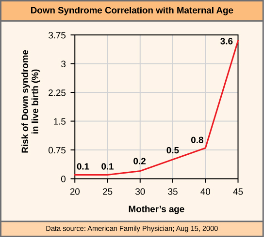
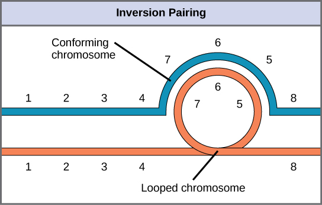

By the end of this section, you will be able to:
* Describe how a karyogram is created
* Explain how nondisjunction leads to disorders in chromosome number
* Compare disorders caused by aneuploidy
* Describe how errors in chromosome structure occur through inversions and translocations

Inherited disorders can arise when chromosomes behave abnormally during meiosis. Chromosome disorders can be divided into two categories: abnormalities in chromosome number and chromosomal structural rearrangements. Because even small segments of chromosomes can span many genes, chromosomal disorders are characteristically dramatic and often fatal.

# Identification of Chromosomes

The isolation and microscopic observation of chromosomes forms the basis of cytogenetics and is the primary method by which clinicians detect chromosomal abnormalities in humans. A **karyotype**{: data-type="term"} is the number and appearance of chromosomes, and includes their length, banding pattern, and centromere position. To obtain a view of an individual’s karyotype, cytologists photograph the chromosomes and then cut and paste each chromosome into a chart, or **karyogram**{: data-type="term"}, also known as an ideogram ([\[link\]](#fig-ch13_02_01)).

 "){: #fig-ch13_02_01 data-media-type="image/jpg"}

In a given species, chromosomes can be identified by their number, size, centromere position, and banding pattern. In a human karyotype, **autosomes**{: data-type="term"} or “body chromosomes” (all of the non–sex chromosomes) are generally organized in approximate order of size from largest (chromosome 1) to smallest (chromosome 22). The X and Y chromosomes are not autosomes. However, chromosome 21 is actually shorter than chromosome 22. This was discovered after the naming of Down syndrome as trisomy 21, reflecting how this disease results from possessing one extra chromosome 21 (three total). Not wanting to change the name of this important disease, chromosome 21 retained its numbering, despite describing the shortest set of chromosomes. The chromosome “arms” projecting from either end of the centromere may be designated as short or long, depending on their relative lengths. The short arm is abbreviated <em>p </em>(for “petite”), whereas the long arm is abbreviated <em>q </em>(because it follows “p” alphabetically). Each arm is further subdivided and denoted by a number. Using this naming system, locations on chromosomes can be described consistently in the scientific literature.

Career Connection

Geneticists Use Karyograms to Identify Chromosomal AberrationsAlthough Mendel is referred to as the “father of modern genetics,” he performed his experiments with none of the tools that the geneticists of today routinely employ. One such powerful cytological technique is karyotyping, a method in which traits characterized by chromosomal abnormalities can be identified from a single cell. To observe an individual’s karyotype, a person’s cells (like white blood cells) are first collected from a blood sample or other tissue. In the laboratory, the isolated cells are stimulated to begin actively dividing. A chemical called colchicine is then applied to cells to arrest condensed chromosomes in metaphase. Cells are then made to swell using a hypotonic solution so the chromosomes spread apart. Finally, the sample is preserved in a fixative and applied to a slide.

The geneticist then stains chromosomes with one of several dyes to better visualize the distinct and reproducible banding patterns of each chromosome pair. Following staining, the chromosomes are viewed using bright-field microscopy. A common stain choice is the Giemsa stain. Giemsa staining results in approximately 400–800 bands (of tightly coiled DNA and condensed proteins) arranged along all of the 23 chromosome pairs; an experienced geneticist can identify each band. In addition to the banding patterns, chromosomes are further identified on the basis of size and centromere location. To obtain the classic depiction of the karyotype in which homologous pairs of chromosomes are aligned in numerical order from longest to shortest, the geneticist obtains a digital image, identifies each chromosome, and manually arranges the chromosomes into this pattern ([\[link\]](#fig-ch13_02_01)).

At its most basic, the karyogram may reveal genetic abnormalities in which an individual has too many or too few chromosomes per cell. Examples of this are Down Syndrome, which is identified by a third copy of chromosome 21, and Turner Syndrome, which is characterized by the presence of only one X chromosome in women instead of the normal two. Geneticists can also identify large deletions or insertions of DNA. For instance, Jacobsen Syndrome—which involves distinctive facial features as well as heart and bleeding defects—is identified by a deletion on chromosome 11. Finally, the karyotype can pinpoint **translocations**{: data-type="term"}, which occur when a segment of genetic material breaks from one chromosome and reattaches to another chromosome or to a different part of the same chromosome. Translocations are implicated in certain cancers, including chronic myelogenous leukemia.

During Mendel’s lifetime, inheritance was an abstract concept that could only be inferred by performing crosses and observing the traits expressed by offspring. By observing a karyogram, today’s geneticists can actually visualize the chromosomal composition of an individual to confirm or predict genetic abnormalities in offspring, even before birth.

# Disorders in Chromosome Number

Of all of the chromosomal disorders, abnormalities in chromosome number are the most obviously identifiable from a karyogram. Disorders of chromosome number include the duplication or loss of entire chromosomes, as well as changes in the number of complete sets of chromosomes. They are caused by **nondisjunction**{: data-type="term"}, which occurs when pairs of homologous chromosomes or sister chromatids fail to separate during meiosis. Misaligned or incomplete synapsis, or a dysfunction of the spindle apparatus that facilitates chromosome migration, can cause nondisjunction. The risk of nondisjunction occurring increases with the age of the parents.

Nondisjunction can occur during either meiosis I or II, with differing results ([\[link\]](#fig-ch13_02_02)). If homologous chromosomes fail to separate during meiosis I, the result is two gametes that lack that particular chromosome and two gametes with two copies of the chromosome. If sister chromatids fail to separate during meiosis II, the result is one gamete that lacks that chromosome, two normal gametes with one copy of the chromosome, and one gamete with two copies of the chromosome.

Art Connection

{: #fig-ch13_02_02 data-media-type="image/png"}

Which of the following statements about nondisjunction is true?

1.  Nondisjunction only results in gametes with n+1 or n–1 chromosomes.
2.  Nondisjunction occurring during meiosis II results in 50 percent normal gametes.
3.  Nondisjunction during meiosis I results in 50 percent normal gametes.
4.  Nondisjunction always results in four different kinds of gametes.
{: data-number-style="lower-alpha"}

<!-- <solution>
<para><link window="new"  target-id="fig-ch13_02_02" document=""/>B</para>
</solution> -->

# Aneuploidy

An individual with the appropriate number of chromosomes for their species is called **euploid**{: data-type="term"}; in humans, euploidy corresponds to 22 pairs of autosomes and one pair of sex chromosomes. An individual with an error in chromosome number is described as **aneuploid**{: data-type="term"}, a term that includes **monosomy**{: data-type="term"} (loss of one chromosome) or **trisomy**{: data-type="term"} (gain of an extraneous chromosome). Monosomic human zygotes missing any one copy of an autosome invariably fail to develop to birth because they lack essential genes. This underscores the importance of “gene dosage” in humans. Most autosomal trisomies also fail to develop to birth; however, duplications of some of the smaller chromosomes (13, 15, 18, 21, or 22) can result in offspring that survive for several weeks to many years. Trisomic individuals suffer from a different type of genetic imbalance: an excess in gene dose. Individuals with an extra chromosome may synthesize an abundance of the gene products encoded by that chromosome. This extra dose (150 percent) of specific genes can lead to a number of functional challenges and often precludes development. The most common trisomy among viable births is that of chromosome 21, which corresponds to Down Syndrome. Individuals with this inherited disorder are characterized by short stature and stunted digits, facial distinctions that include a broad skull and large tongue, and significant developmental delays. The incidence of Down syndrome is correlated with maternal age; older women are more likely to become pregnant with fetuses carrying the trisomy 21 genotype ([\[link\]](#fig-ch13_02_03)).

{: #fig-ch13_02_03 data-media-type="image/jpg"}

Link to Learning

 {: data-media-type="image/png"} 
Visualize the addition of a chromosome that leads to Down syndrome in this [video simulation][1]{: target="_window"}.

# Polyploidy

An individual with more than the correct number of chromosome sets (two for diploid species) is called **polyploid**{: data-type="term"}. For instance, fertilization of an abnormal diploid egg with a normal haploid sperm would yield a triploid zygote. Polyploid animals are extremely rare, with only a few examples among the flatworms, crustaceans, amphibians, fish, and lizards. Polyploid animals are sterile because meiosis cannot proceed normally and instead produces mostly aneuploid daughter cells that cannot yield viable zygotes. Rarely, polyploid animals can reproduce asexually by haplodiploidy, in which an unfertilized egg divides mitotically to produce offspring. In contrast, polyploidy is very common in the plant kingdom, and polyploid plants tend to be larger and more robust than euploids of their species ([\[link\]](#fig-ch13_02_04)).

  is particularly large and robust, and grows flowers with triple the number of petals of its diploid counterparts. (credit: Steve Karg)"){: #fig-ch13_02_04 data-media-type="image/jpg"}

# Sex Chromosome Nondisjunction in Humans

Humans display dramatic deleterious effects with autosomal trisomies and monosomies. Therefore, it may seem counterintuitive that human females and males can function normally, despite carrying different numbers of the X chromosome. Rather than a gain or loss of autosomes, variations in the number of sex chromosomes are associated with relatively mild effects. In part, this occurs because of a molecular process called **X inactivation**{: data-type="term"}. Early in development, when female mammalian embryos consist of just a few thousand cells (relative to trillions in the newborn), one X chromosome in each cell inactivates by tightly condensing into a quiescent (dormant) structure called a Barr body. The chance that an X chromosome (maternally or paternally derived) is inactivated in each cell is random, but once the inactivation occurs, all cells derived from that one will have the same inactive X chromosome or Barr body. By this process, females compensate for their double genetic dose of X chromosome. In so-called “tortoiseshell” cats, embryonic X inactivation is observed as color variegation ([\[link\]](#fig-ch13_02_05)). Females that are heterozygous for an X-linked coat color gene will express one of two different coat colors over different regions of their body, corresponding to whichever X chromosome is inactivated in the embryonic cell progenitor of that region.

 "){: #fig-ch13_02_05 data-media-type="image/jpg"}

An individual carrying an abnormal number of X chromosomes will inactivate all but one X chromosome in each of her cells. However, even inactivated X chromosomes continue to express a few genes, and X chromosomes must reactivate for the proper maturation of female ovaries. As a result, X-chromosomal abnormalities are typically associated with mild mental and physical defects, as well as sterility. If the X chromosome is absent altogether, the individual will not develop in utero.

Several errors in sex chromosome number have been characterized. Individuals with three X chromosomes, called triplo-X, are phenotypically female but express developmental delays and reduced fertility. The XXY genotype, corresponding to one type of Klinefelter syndrome, corresponds to phenotypically male individuals with small testes, enlarged breasts, and reduced body hair. More complex types of Klinefelter syndrome exist in which the individual has as many as five X chromosomes. In all types, every X chromosome except one undergoes inactivation to compensate for the excess genetic dosage. This can be seen as several Barr bodies in each cell nucleus. Turner syndrome, characterized as an X0 genotype (i.e., only a single sex chromosome), corresponds to a phenotypically female individual with short stature, webbed skin in the neck region, hearing and cardiac impairments, and sterility.

# Duplications and Deletions

In addition to the loss or gain of an entire chromosome, a chromosomal segment may be duplicated or lost. Duplications and deletions often produce offspring that survive but exhibit physical and mental abnormalities. Duplicated chromosomal segments may fuse to existing chromosomes or may be free in the nucleus. Cri-du-chat (from the French for “cry of the cat”) is a syndrome associated with nervous system abnormalities and identifiable physical features that result from a deletion of most of 5p (the small arm of chromosome 5) ([\[link\]](#fig-ch13_02_06)). Infants with this genotype emit a characteristic high-pitched cry on which the disorder’s name is based.

"){: #fig-ch13_02_06 data-media-type="image/jpg"}

# Chromosomal Structural Rearrangements

Cytologists have characterized numerous structural rearrangements in chromosomes, but chromosome inversions and translocations are the most common. Both are identified during meiosis by the adaptive pairing of rearranged chromosomes with their former homologs to maintain appropriate gene alignment. If the genes carried on two homologs are not oriented correctly, a recombination event could result in the loss of genes from one chromosome and the gain of genes on the other. This would produce aneuploid gametes.

## Chromosome Inversions

A **chromosome inversion**{: data-type="term"} is the detachment, 180° rotation, and reinsertion of part of a chromosome. Inversions may occur in nature as a result of mechanical shear, or from the action of transposable elements (special DNA sequences capable of facilitating the rearrangement of chromosome segments with the help of enzymes that cut and paste DNA sequences). Unless they disrupt a gene sequence, inversions only change the orientation of genes and are likely to have more mild effects than aneuploid errors. However, altered gene orientation can result in functional changes because regulators of gene expression could be moved out of position with respect to their targets, causing aberrant levels of gene products.

An inversion can be **pericentric**{: data-type="term"} and include the centromere, or **paracentric**{: data-type="term"} and occur outside of the centromere ([\[link\]](#fig-ch13_02_07)). A pericentric inversion that is asymmetric about the centromere can change the relative lengths of the chromosome arms, making these inversions easily identifiable.

 {: #fig-ch13_02_07 data-media-type="image/jpg"}

When one homologous chromosome undergoes an inversion but the other does not, the individual is described as an inversion heterozygote. To maintain point-for-point synapsis during meiosis, one homolog must form a loop, and the other homolog must mold around it. Although this topology can ensure that the genes are correctly aligned, it also forces the homologs to stretch and can be associated with regions of imprecise synapsis ([\[link\]](#fig-ch13_02_08)).

 {: #fig-ch13_02_08 data-media-type="image/jpg"}

Evolution Connection

The Chromosome 18 InversionNot all structural rearrangements of chromosomes produce nonviable, impaired, or infertile individuals. In rare instances, such a change can result in the evolution of a new species. In fact, a pericentric inversion in chromosome 18 appears to have contributed to the evolution of humans. This inversion is not present in our closest genetic relatives, the chimpanzees. Humans and chimpanzees differ cytogenetically by pericentric inversions on several chromosomes and by the fusion of two separate chromosomes in chimpanzees that correspond to chromosome two in humans.

The pericentric chromosome 18 inversion is believed to have occurred in early humans following their divergence from a common ancestor with chimpanzees approximately five million years ago. Researchers characterizing this inversion have suggested that approximately 19,000 nucleotide bases were duplicated on 18p, and the duplicated region inverted and reinserted on chromosome 18 of an ancestral human.

A comparison of human and chimpanzee genes in the region of this inversion indicates that two genes—*ROCK1* and *USP14*—that are adjacent on chimpanzee chromosome 17 (which corresponds to human chromosome 18) are more distantly positioned on human chromosome 18. This suggests that one of the inversion breakpoints occurred between these two genes. Interestingly, humans and chimpanzees express *USP14* at distinct levels in specific cell types, including cortical cells and fibroblasts. Perhaps the chromosome 18 inversion in an ancestral human repositioned specific genes and reset their expression levels in a useful way. Because both *ROCK1* and *USP14* encode cellular enzymes, a change in their expression could alter cellular function. It is not known how this inversion contributed to hominid evolution, but it appears to be a significant factor in the divergence of humans from other primates.

Violaine Goidts et al., “Segmental duplication associated with the human-specific inversion of chromosome 18: a further example of the impact of segmental duplications on karyotype and genome evolution in primates,” *Human Genetics*. 115 (2004):116-122

## Translocations

A **translocation**{: data-type="term"} occurs when a segment of a chromosome dissociates and reattaches to a different, nonhomologous chromosome. Translocations can be benign or have devastating effects depending on how the positions of genes are altered with respect to regulatory sequences. Notably, specific translocations have been associated with several cancers and with schizophrenia. Reciprocal translocations result from the exchange of chromosome segments between two nonhomologous chromosomes such that there is no gain or loss of genetic information ([\[link\]](#fig-ch13_02_09)).

 "){: #fig-ch13_02_09 data-media-type="image/jpg"}

# Section Summary

The number, size, shape, and banding pattern of chromosomes make them easily identifiable in a karyogram and allows for the assessment of many chromosomal abnormalities. Disorders in chromosome number, or aneuploidies, are typically lethal to the embryo, although a few trisomic genotypes are viable. Because of X inactivation, aberrations in sex chromosomes typically have milder phenotypic effects. Aneuploidies also include instances in which segments of a chromosome are duplicated or deleted. Chromosome structures may also be rearranged, for example by inversion or translocation. Both of these aberrations can result in problematic phenotypic effects. Because they force chromosomes to assume unnatural topologies during meiosis, inversions and translocations are often associated with reduced fertility because of the likelihood of nondisjunction.

# Art Connections

[[link]](#fig-ch13_02_02) Which of the following statements about nondisjunction is true?

1.  Nondisjunction only results in gametes with n+1 or n–1 chromosomes.
2.  Nondisjunction occurring during meiosis II results in 50 percent normal gametes.
3.  Nondisjunction during meiosis I results in 50 percent normal gametes.
4.  Nondisjunction always results in four different kinds of gametes.
{: data-number-style="lower-alpha"}

[[link]](#fig-ch13_02_02) B.

# Review Questions

Which of the following codes describes position 12 on the long arm of chromosome 13?

1.  13p12
2.  13q12
3.  12p13
4.  12q13
{: data-number-style="lower-alpha"}

B

In agriculture, polyploid crops (like coffee, strawberries, or bananas) tend to produce \_\_\_\_\_\_\_\_.

1.  more uniformity
2.  more variety
3.  larger yields
4.  smaller yields
{: data-number-style="lower-alpha"}

C

Assume a pericentric inversion occurred in one of two homologs prior to meiosis. The other homolog remains normal. During meiosis, what structure—if any—would these homologs assume in order to pair accurately along their lengths?

1.  V formation
2.  cruciform
3.  loop
4.  pairing would not be possible
{: data-number-style="lower-alpha"}

C

The genotype XXY corresponds to

1.  Klinefelter syndrome
2.  Turner syndrome
3.  Triplo-X
4.  Jacob syndrome
{: data-number-style="lower-alpha"}

A

Abnormalities in the number of X chromosomes tends to have milder phenotypic effects than the same abnormalities in autosomes because of \_\_\_\_\_\_\_\_.

1.  deletions
2.  nonhomologous recombination
3.  synapsis
4.  X inactivation
{: data-number-style="lower-alpha"}

D

By definition, a pericentric inversion includes the \_\_\_\_\_\_\_\_.

1.  centromere
2.  chiasma
3.  telomere
4.  synapse
{: data-number-style="lower-alpha"}

A

# Free Response

Using diagrams, illustrate how nondisjunction can result in an aneuploid zygote.

Exact diagram style will vary; diagram should look like [[link]](#fig-ch13_02_02).

[1]: http://openstaxcollege.org/l/down_syndrome
