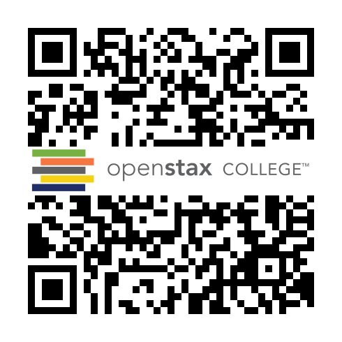
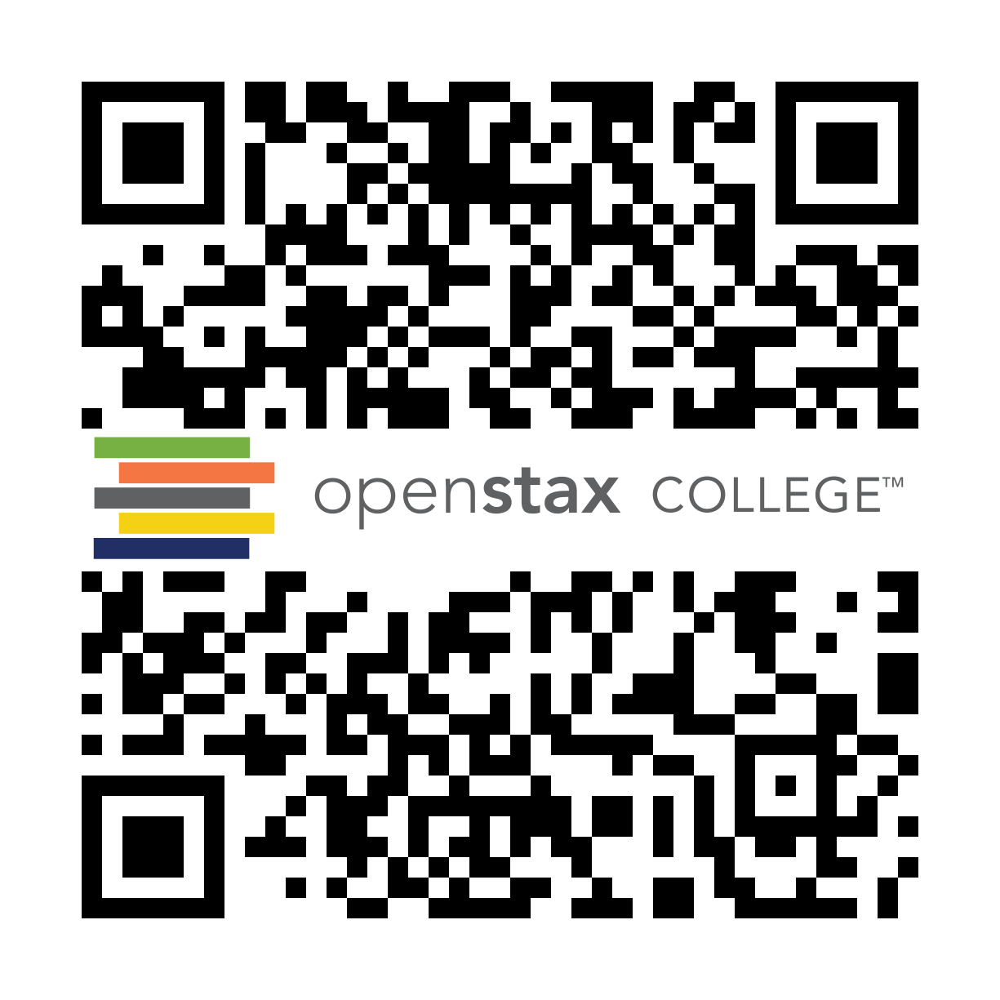

By the end of this section, you will be able to:
* Describe the steps involved in prokaryotic gene regulation
* Explain the roles of activators, inducers, and repressors in gene regulation

The DNA of prokaryotes is organized into a circular chromosome supercoiled in the nucleoid region of the cell cytoplasm. Proteins that are needed for a specific function, or that are involved in the same biochemical pathway, are encoded together in blocks called **operons**{: data-type="term"}. For example, all of the genes needed to use lactose as an energy source are coded next to each other in the lactose (or *lac*) operon.

In prokaryotic cells, there are three types of regulatory molecules that can affect the expression of operons: repressors, activators, and inducers. **Repressors**{: data-type="term"} are proteins that suppress transcription of a gene in response to an external stimulus, whereas **activators**{: data-type="term"} are proteins that increase the transcription of a gene in response to an external stimulus. Finally, inducers are small molecules that either activate or repress transcription depending on the needs of the cell and the availability of substrate.

# The *trp* Operon: A Repressor Operon

Bacteria such as *E. coli* need amino acids to survive. **Tryptophan**{: data-type="term"} is one such amino acid that *E. coli* can ingest from the environment. *E. coli* can also synthesize tryptophan using enzymes that are encoded by five genes. These five genes are next to each other in what is called the **tryptophan (*trp*) operon**{: data-type="term"} ([\[link\]](#fig-ch16_02_01)). If tryptophan is present in the environment, then *E. coli* does not need to synthesize it and the switch controlling the activation of the genes in the *trp* operon is switched off. However, when tryptophan availability is low, the switch controlling the operon is turned on, transcription is initiated, the genes are expressed, and tryptophan is synthesized.

 {: #fig-ch16_02_01}

A DNA sequence that codes for proteins is referred to as the coding region. The five coding regions for the tryptophan biosynthesis enzymes are arranged sequentially on the chromosome in the operon. Just before the coding region is the **transcriptional start site**{: data-type="term"}. This is the region of DNA to which RNA polymerase binds to initiate transcription. The promoter sequence is upstream of the transcriptional start site; each operon has a sequence within or near the promoter to which proteins (activators or repressors) can bind and regulate transcription.

A DNA sequence called the operator sequence is encoded between the promoter region and the first *trp* coding gene. This **operator**{: data-type="term"} contains the DNA code to which the repressor protein can bind. When tryptophan is present in the cell, two tryptophan molecules bind to the *trp* repressor, which changes shape to bind to the *trp* operator. Binding of the tryptophan–repressor complex at the operator physically prevents the RNA polymerase from binding, and transcribing the downstream genes.

When tryptophan is not present in the cell, the repressor by itself does not bind to the operator; therefore, the operon is active and tryptophan is synthesized. Because the repressor protein actively binds to the operator to keep the genes turned off, the *trp* operon is negatively regulated and the proteins that bind to the operator to silence *trp* expression are **negative regulators**{: data-type="term"}.

Link to Learning

  
Watch this video to learn more about the *trp* operon. 

<iframe width="660" height="371.4" src="https://www.openstaxcollege.org/l/trp_operon"></iframe>

# Catabolite Activator Protein (CAP): An Activator Regulator

Just as the *trp* operon is negatively regulated by tryptophan molecules, there are proteins that bind to the operator sequences that act as a **positive regulator**{: data-type="term"} to turn genes on and activate them. For example, when glucose is scarce, *E. coli* bacteria can turn to other sugar sources for fuel. To do this, new genes to process these alternate genes must be transcribed. When glucose levels drop, cyclic AMP (cAMP) begins to accumulate in the cell. The cAMP molecule is a signaling molecule that is involved in glucose and energy metabolism in *E. coli*. When glucose levels decline in the cell, accumulating cAMP binds to the positive regulator **catabolite activator protein (CAP)**{: data-type="term"}, a protein that binds to the promoters of operons that control the processing of alternative sugars. When cAMP binds to CAP, the complex binds to the promoter region of the genes that are needed to use the alternate sugar sources ([\[link\]](#fig-ch16_02_02)). In these operons, a CAP binding site is located upstream of the RNA polymerase binding site in the promoter. This increases the binding ability of RNA polymerase to the promoter region and the transcription of the genes.

 {: #fig-ch16_02_02}

# The *lac* Operon: An Inducer Operon

The third type of gene regulation in prokaryotic cells occurs through **inducible operons**{: data-type="term"}, which have proteins that bind to activate or repress transcription depending on the local environment and the needs of the cell. The *lac* operon is a typical inducible operon. As mentioned previously, *E. coli* is able to use other sugars as energy sources when glucose concentrations are low. To do so, the cAMP–CAP protein complex serves as a positive regulator to induce transcription. One such sugar source is lactose. The ***lac* operon**{: data-type="term"} encodes the genes necessary to acquire and process the lactose from the local environment. CAP binds to the operator sequence upstream of the promoter that initiates transcription of the *lac* operon. However, for the *lac* operon to be activated, two conditions must be met. First, the level of glucose must be very low or non-existent. Second, lactose must be present. Only when glucose is absent and lactose is present will the *lac* operon be transcribed ([\[link\]](#fig-ch16_02_03)). This makes sense for the cell, because it would be energetically wasteful to create the proteins to process lactose if glucose was plentiful or lactose was not available.

Art Connection

![The lac operon consists of a promoter, an operator, and three genes named lacZ, lacY, and lacA. RNA polymerase binds to the promoter. In the absence of lactose, the lac repressor binds to the operator and prevents RNA polymerase from transcribing the operon. In the presence of lactose, the repressor is released from the operator, and transcription proceeds at a slow rate. Binding of the cAMP&#x2013;CAP complex to the promoter stimulates RNA polymerase activity and increases RNA synthesis. However, even in the presence of the cAMP&#x2013;CAP complex, RNA synthesis is blocked if the repressor binds to the promoter.](../resources/Figure_16_02_03.png "Transcription of the lac operon is carefully regulated so that its expression only occurs when glucose is limited and lactose is present to serve as an alternative fuel source."){: #fig-ch16_02_03}

In *E. coli*, the *trp* operon is on by default, while the *lac* operon is off. Why do you think this is the case?

<!--<para><link window="new"  target-id="fig-ch16_02_03" document=""/> Tryptophan is an amino acid essential for making proteins, so the cell always needs to have some on hand. However, if plenty of tryptophan is present, it is wasteful to make more, and the expression of the <emphasis effect="italics">trp</emphasis> receptor is repressed. Lactose, a sugar found in milk, is not always available. It makes no sense to make the enzymes necessary to digest an energy source that is not available, so the <emphasis effect="italics">lac</emphasis> operon is only turned on when lactose is present.</para>-->

If glucose is absent, then CAP can bind to the operator sequence to activate transcription. If lactose is absent, then the repressor binds to the operator to prevent transcription. If either of these requirements is met, then transcription remains off. Only when both conditions are satisfied is the *lac* operon transcribed ([\[link\]](#tab-ch16_02_01)).

<table id="tab-ch16_02_01" class=" " summary=""><thead>
                <tr><th colspan="5" data-align="left">Signals that Induce or Repress Transcription of the <em>lac</em> Operon</th></tr>
                <tr>
<th data-align="center">Glucose</th><th data-align="center">CAP binds</th><th data-align="center">Lactose</th><th data-align="center">Repressor binds</th>	<th data-align="center">Transcription</th>
                </tr>
            </thead><tbody>
<tr><td data-align="center">+</td><td data-align="center">-</td><td data-align="center">-</td><td data-align="center">+</td><td data-align="center">No</td></tr>
    <tr><td data-align="center">+</td><td data-align="center">-</td><td data-align="center">+</td><td data-align="center">-</td><td data-align="center">Some</td></tr>
    <tr><td data-align="center">-</td><td data-align="center">+</td><td data-align="center">-</td><td data-align="center">+</td><td data-align="center">No</td></tr>
    <tr><td data-align="center">-</td><td data-align="center">+</td><td data-align="center">+</td><td data-align="center">-</td><td data-align="center">Yes</td></tr>
</tbody></table>

Link to Learning

  
Watch an animated tutorial about the workings of *lac* operon here. 

<iframe width="660" height="371.4" src="https://www.openstaxcollege.org/l/lac_operon"></iframe>

# Section Summary

The regulation of gene expression in prokaryotic cells occurs at the transcriptional level. There are three ways to control the transcription of an operon: repressive control, activator control, and inducible control. Repressive control, typified by the<em> trp</em> operon, uses proteins bound to the operator sequence to physically prevent the binding of RNA polymerase and the activation of transcription. Therefore, if tryptophan is not needed, the repressor is bound to the operator and transcription remains off. Activator control, typified by the action of CAP, increases the binding ability of RNA polymerase to the promoter when CAP is bound. In this case, low levels of glucose result in the binding of cAMP to CAP. CAP then binds the promoter, which allows RNA polymerase to bind to the promoter better. In the last example—the *lac* operon—two conditions must be met to initiate transcription. Glucose must not be present, and lactose must be available for the *lac* operon to be transcribed. If glucose is absent, CAP binds to the operator. If lactose is present, the repressor protein does not bind to its operator. Only when both conditions are met will RNA polymerase bind to the promoter to induce transcription.

# Art Connections

[[link]](#fig-ch16_02_03) In *E. coli*, the *trp* operon is on by default, while the *lac* operon is off. Why do you think that this is the case?

[[link]](#fig-ch16_02_03) Tryptophan is an amino acid essential for making proteins, so the cell always needs to have some on hand. However, if plenty of tryptophan is present, it is wasteful to make more, and the expression of the *trp* receptor is repressed. Lactose, a sugar found in milk, is not always available. It makes no sense to make the enzymes necessary to digest an energy source that is not available, so the *lac* operon is only turned on when lactose is present.

# Review Questions

If glucose is absent, but so is lactose, the *lac* operon will be \_\_\_\_\_\_\_\_.

1.  activated
2.  repressed
3.  activated, but only partially
4.  mutated
{: data-number-style="lower-alpha"}

B

Prokaryotic cells lack a nucleus. Therefore, the genes in prokaryotic cells are:

1.  all expressed, all of the time
2.  transcribed and translated almost simultaneously
3.  transcriptionally controlled because translation begins before transcription ends
4.  b and c are both true
{: data-number-style="lower-alpha"}

D

# Free Response

Describe how transcription in prokaryotic cells can be altered by external stimulation such as excess lactose in the environment.

Environmental stimuli can increase or induce transcription in prokaryotic cells. In this example, lactose in the environment will induce the transcription of the *lac* operon, but only if glucose is not available in the environment.

What is the difference between a repressible and an inducible operon?

A repressible operon uses a protein bound to the promoter region of a gene to keep the gene repressed or silent. This repressor must be actively removed in order to transcribe the gene. An inducible operon is either activated or repressed depending on the needs of the cell and what is available in the local environment.

## Glossary
{: data-type="glossary-title"}

activator
: protein that binds to prokaryotic operators to increase transcription
{: .definition}

catabolite activator protein (CAP)
: protein that complexes with cAMP to bind to the promoter sequences of operons that control sugar processing when glucose is not available
{: .definition}

inducible operon
: operon that can be activated or repressed depending on cellular needs and the surrounding environment
{: .definition}

lac operon
: operon in prokaryotic cells that encodes genes required for processing and intake of lactose
{: .definition}

negative regulator
: protein that prevents transcription
{: .definition}

operator
: region of DNA outside of the promoter region that binds activators or repressors that control gene expression in prokaryotic cells
{: .definition}

operon
: collection of genes involved in a pathway that are transcribed together as a single mRNA in prokaryotic cells
{: .definition}

positive regulator
: protein that increases transcription
{: .definition}

repressor
: protein that binds to the operator of prokaryotic genes to prevent transcription
{: .definition}

transcriptional start site
: site at which transcription begins
{: .definition}

trp operon
: series of genes necessary to synthesize tryptophan in prokaryotic cells
{: .definition}

tryptophan
: amino acid that can be synthesized by prokaryotic cells when necessary
{: .definition}

