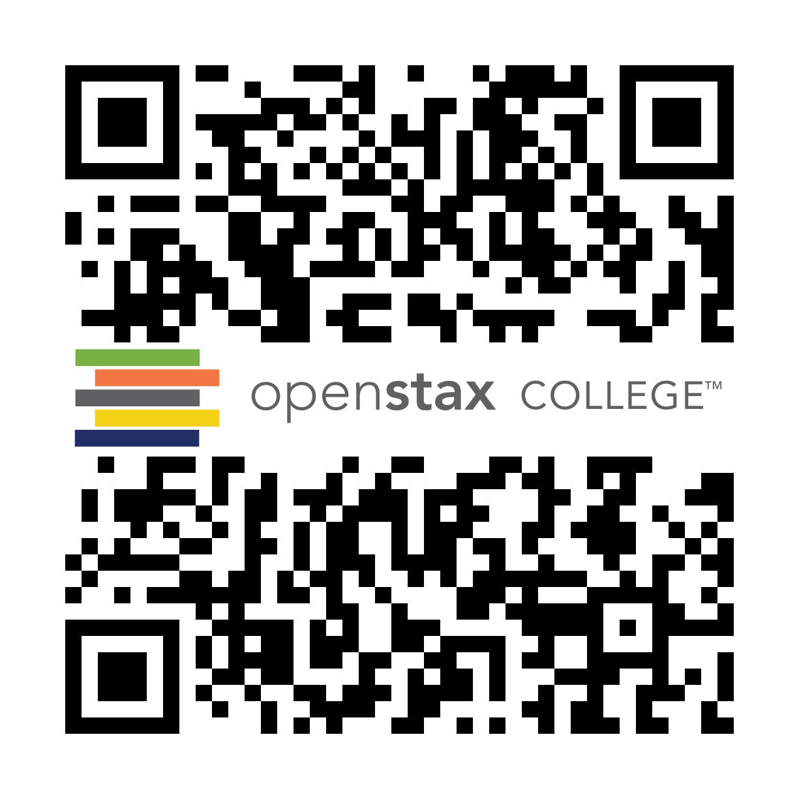

By the end of this section, you will be able to:
* Discuss the role of transcription factors in gene regulation
* Explain how enhancers and repressors regulate gene expression

Like prokaryotic cells, the transcription of genes in eukaryotes requires the actions of an RNA polymerase to bind to a sequence upstream of a gene to initiate transcription. However, unlike prokaryotic cells, the eukaryotic RNA polymerase requires other proteins, or transcription factors, to facilitate transcription initiation. Transcription factors are proteins that bind to the promoter sequence and other regulatory sequences to control the transcription of the target gene. RNA polymerase by itself cannot initiate transcription in eukaryotic cells. Transcription factors must bind to the promoter region first and recruit RNA polymerase to the site for transcription to be established.

Link to Learning

 {: data-media-type="image/png"} 
View the process of transcription—the making of RNA from a DNA template—at [this site][1]{: target="_window"}.

# The Promoter and the Transcription Machinery

Genes are organized to make the control of gene expression easier. The promoter region is immediately upstream of the coding sequence. This region can be short (only a few nucleotides in length) or quite long (hundreds of nucleotides long). The longer the promoter, the more available space for proteins to bind. This also adds more control to the transcription process. The length of the promoter is gene-specific and can differ dramatically between genes. Consequently, the level of control of gene expression can also differ quite dramatically between genes. The purpose of the promoter is to bind transcription factors that control the initiation of transcription.

Within the promoter region, just upstream of the transcriptional start site, resides the TATA box. This box is simply a repeat of thymine and adenine dinucleotides (literally, TATA repeats). RNA polymerase binds to the transcription initiation complex, allowing transcription to occur. To initiate transcription, a transcription factor (TFIID) is the first to bind to the TATA box. Binding of TFIID recruits other transcription factors, including TFIIB, TFIIE, TFIIF, and TFIIH to the TATA box. Once this complex is assembled, RNA polymerase can bind to its upstream sequence. When bound along with the transcription factors, RNA polymerase is phosphorylated. This releases part of the protein from the DNA to activate the transcription initiation complex and places RNA polymerase in the correct orientation to begin transcription; DNA-bending protein brings the enhancer, which can be quite a distance from the gene, in contact with transcription factors and mediator proteins ([\[link\]](#fig-ch16_04_01)).

 ![Eukaryotic gene expression is controlled by a promoter immediately adjacent to the gene, and an enhancer far upstream. The DNA folds over itself, bringing the enhancer next to the promoter. Transcription factors and mediator proteins are sandwiched between the promoter and the enhancer. Short DNA sequences within the enhancer called distal control elements bind activators, which in turn bind transcription factors and mediator proteins bound to the promoter. RNA polymerase binds the complex, allowing transcription to begin. Different genes have enhancers with different distal control elements, allowing differential regulation of transcription.](../resources/Figure_16_04_01.jpg "An enhancer is a DNA sequence that promotes transcription. Each enhancer is made up of short DNA sequences called distal control elements. Activators bound to the distal control elements interact with mediator proteins and transcription factors. Two different genes may have the same promoter but different distal control elements, enabling differential gene expression."){: #fig-ch16_04_01 data-media-type="image/jpg"}

In addition to the general transcription factors, other transcription factors can bind to the promoter to regulate gene transcription. These transcription factors bind to the promoters of a specific set of genes. They are not general transcription factors that bind to every promoter complex, but are recruited to a specific sequence on the promoter of a specific gene. There are hundreds of transcription factors in a cell that each bind specifically to a particular DNA sequence motif. When transcription factors bind to the promoter just upstream of the encoded gene, it is referred to as a ***cis*-acting element**{: data-type="term"}, because it is on the same chromosome just next to the gene. The region that a particular transcription factor binds to is called the **transcription factor binding site**{: data-type="term"}. Transcription factors respond to environmental stimuli that cause the proteins to find their binding sites and initiate transcription of the gene that is needed.

# Enhancers and Transcription

In some eukaryotic genes, there are regions that help increase or enhance transcription. These regions, called **enhancers**{: data-type="term"}, are not necessarily close to the genes they enhance. They can be located upstream of a gene, within the coding region of the gene, downstream of a gene, or may be thousands of nucleotides away.

Enhancer regions are binding sequences, or sites, for transcription factors. When a DNA-bending protein binds, the shape of the DNA changes ([\[link\]](#fig-ch16_04_01)). This shape change allows for the interaction of the activators bound to the enhancers with the transcription factors bound to the promoter region and the RNA polymerase. Whereas DNA is generally depicted as a straight line in two dimensions, it is actually a three-dimensional object. Therefore, a nucleotide sequence thousands of nucleotides away can fold over and interact with a specific promoter.

# Turning Genes Off: Transcriptional Repressors

Like prokaryotic cells, eukaryotic cells also have mechanisms to prevent transcription. Transcriptional repressors can bind to promoter or enhancer regions and block transcription. Like the transcriptional activators, repressors respond to external stimuli to prevent the binding of activating transcription factors.

# Section Summary

To start transcription, general transcription factors, such as TFIID, TFIIH, and others, must first bind to the TATA box and recruit RNA polymerase to that location. The binding of additional regulatory transcription factors to *cis*-acting elements will either increase or prevent transcription. In addition to promoter sequences, enhancer regions help augment transcription. Enhancers can be upstream, downstream, within a gene itself, or on other chromosomes. Transcription factors bind to enhancer regions to increase or prevent transcription.

# Review Questions

The binding of \_\_\_\_\_\_\_\_ is required for transcription to start.

1.  a protein
2.  DNA polymerase
3.  RNA polymerase
4.  a transcription factor
{: data-number-style="lower-alpha"}

C

What will result from the binding of a transcription factor to an enhancer region?

1.  decreased transcription of an adjacent gene
2.  increased transcription of a distant gene
3.  alteration of the translation of an adjacent gene
4.  initiation of the recruitment of RNA polymerase
{: data-number-style="lower-alpha"}

B

# Free Response

A mutation within the promoter region can alter transcription of a gene. Describe how this can happen.

A mutation in the promoter region can change the binding site for a transcription factor that normally binds to increase transcription. The mutation could either decrease the ability of the transcription factor to bind, thereby decreasing transcription, or it can increase the ability of the transcription factor to bind, thus increasing transcription.

What could happen if a cell had too much of an activating transcription factor present?

If too much of an activating transcription factor were present, then transcription would be increased in the cell. This could lead to dramatic alterations in cell function.

[1]: http://openstaxcollege.org/l/transcript_RNA
