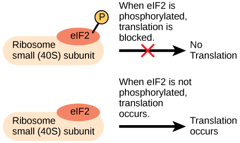
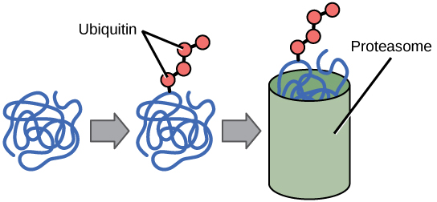

By the end of this section, you will be able to:
* Understand the process of translation and discuss its key factors
* Describe how the initiation complex controls translation
* Explain the different ways in which the post-translational control of gene expression takes place

After the RNA has been transported to the cytoplasm, it is translated into protein. Control of this process is largely dependent on the RNA molecule. As previously discussed, the stability of the RNA will have a large impact on its translation into a protein. As the stability changes, the amount of time that it is available for translation also changes.

### The Initiation Complex and Translation Rate

Like transcription, translation is controlled by proteins that bind and initiate the process. In translation, the complex that assembles to start the process is referred to as the **initiation complex**{: data-type="term"}. The first protein to bind to the RNA to initiate translation is the **eukaryotic initiation factor-2 (eIF-2)**{: data-type="term"}. The eIF-2 protein is active when it binds to the high-energy molecule **guanosine triphosphate (GTP)**{: data-type="term"}. GTP provides the energy to start the reaction by giving up a phosphate and becoming **guanosine diphosphate (GDP)**{: data-type="term"}. The eIF-2 protein bound to GTP binds to the small **40S ribosomal subunit**{: data-type="term"}. When bound, the methionine initiator tRNA associates with the eIF-2/40S ribosome complex, bringing along with it the mRNA to be translated. At this point, when the initiator complex is assembled, the GTP is converted into GDP and energy is released. The phosphate and the eIF-2 protein are released from the complex and the large **60S ribosomal subunit**{: data-type="term"} binds to translate the RNA. The binding of eIF-2 to the RNA is controlled by phosphorylation. If eIF-2 is phosphorylated, it undergoes a conformational change and cannot bind to GTP. Therefore, the initiation complex cannot form properly and translation is impeded ([\[link\]](#fig-ch16_06_01)). When eIF-2 remains unphosphorylated, it binds the RNA and actively translates the protein.

Art Connection

{: #fig-ch16_06_01}

An increase in phosphorylation levels of eIF-2 has been observed in patients with neurodegenerative diseases such as Alzheimer’s, Parkinson’s, and Huntington’s. What impact do you think this might have on protein synthesis?

<!--<para><link window="new"  target-id="fig-ch16_06_01" document=""/> Protein synthesis would be inhibited.</para>-->

### Chemical Modifications, Protein Activity, and Longevity

Proteins can be chemically modified with the addition of groups including methyl, phosphate, acetyl, and ubiquitin groups. The addition or removal of these groups from proteins regulates their activity or the length of time they exist in the cell. Sometimes these modifications can regulate where a protein is found in the cell—for example, in the nucleus, the cytoplasm, or attached to the plasma membrane.

Chemical modifications occur in response to external stimuli such as stress, the lack of nutrients, heat, or ultraviolet light exposure. These changes can alter epigenetic accessibility, transcription, mRNA stability, or translation—all resulting in changes in expression of various genes. This is an efficient way for the cell to rapidly change the levels of specific proteins in response to the environment. Because proteins are involved in every stage of gene regulation, the phosphorylation of a protein (depending on the protein that is modified) can alter accessibility to the chromosome, can alter translation (by altering transcription factor binding or function), can change nuclear shuttling (by influencing modifications to the nuclear pore complex), can alter RNA stability (by binding or not binding to the RNA to regulate its stability), can modify translation (increase or decrease), or can change post-translational modifications (add or remove phosphates or other chemical modifications).

The addition of an ubiquitin group to a protein marks that protein for degradation. Ubiquitin acts like a flag indicating that the protein lifespan is complete. These proteins are moved to the **proteasome**{: data-type="term"}, an organelle that functions to remove proteins, to be degraded ([\[link\]](#fig-ch16_06_02)). One way to control gene expression, therefore, is to alter the longevity of the protein.

 {: #fig-ch16_06_02}

### Section Summary

Changing the status of the RNA or the protein itself can affect the amount of protein, the function of the protein, or how long it is found in the cell. To translate the protein, a protein initiator complex must assemble on the RNA. Modifications (such as phosphorylation) of proteins in this complex can prevent proper translation from occurring. Once a protein has been synthesized, it can be modified (phosphorylated, acetylated, methylated, or ubiquitinated). These post-translational modifications can greatly impact the stability, degradation, or function of the protein.

### Art Connections

[[link]](#fig-ch16_06_01) An increase in phosphorylation levels of eIF-2 has been observed in patients with neurodegenerative diseases such as Alzheimer’s, Parkinson’s, and Huntington’s. What impact do you think this might have on protein synthesis?

[[link]](#fig-ch16_06_01) Protein synthesis would be inhibited.

### Review Questions

Post-translational modifications of proteins can affect which of the following?

1.  protein function
2.  transcriptional regulation
3.  chromatin modification
4.  all of the above
{: data-number-style="lower-alpha"}

A

### Free Response

Protein modification can alter gene expression in many ways. Describe how phosphorylation of proteins can alter gene expression.

Because proteins are involved in every stage of gene regulation, phosphorylation of a protein (depending on the protein that is modified) can alter accessibility to the chromosome, can alter translation (by altering the transcription factor binding or function), can change nuclear shuttling (by influencing modifications to the nuclear pore complex), can alter RNA stability (by binding or not binding to the RNA to regulate its stability), can modify translation (increase or decrease), or can change post-translational modifications (add or remove phosphates or other chemical modifications).

Alternative forms of a protein can be beneficial or harmful to a cell. What do you think would happen if too much of an alternative protein bound to the 3' UTR of an RNA and caused it to degrade?

If the RNA degraded, then less of the protein that the RNA encodes would be translated. This could have dramatic implications for the cell.

Changes in epigenetic modifications alter the accessibility and transcription of DNA. Describe how environmental stimuli, such as ultraviolet light exposure, could modify gene expression.

Environmental stimuli, like ultraviolet light exposure, can alter the modifications to the histone proteins or DNA. Such stimuli may change an actively transcribed gene into a silenced gene by removing acetyl groups from histone proteins or by adding methyl groups to DNA.

### Glossary
{: data-type="glossary-title"}

eukaryotic initiation factor-2 (eIF-2)
: protein that binds first to an mRNA to initiate translation
^

guanine diphosphate (GDP)
: molecule that is left after the energy is used to start translation
^

guanine triphosphate (GTP)
: energy-providing molecule that binds to eIF-2 and is needed for translation
^

initiation complex
: protein complex containing eIF2-2 that starts translation
^

large 60S ribosomal subunit
: second, larger ribosomal subunit that binds to the RNA to translate it into protein
^

proteasome
: organelle that degrades proteins
^

small 40S ribosomal subunit
: ribosomal subunit that binds to the RNA to translate it into protein

