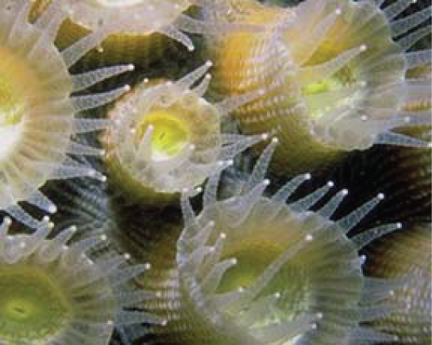

By the end of this section, you will be able to:
* Describe the role that protists play in the ecosystem
* Describe important pathogenic species of protists

Protists function in various ecological niches. Whereas some protist species are essential components of the food chain and generators of biomass, others function in the decomposition of organic materials. Still other protists are dangerous human pathogens or causative agents of devastating plant diseases.

# Primary Producers/Food Sources

Protists are essential sources of nutrition for many other organisms. In some cases, as in plankton, protists are consumed directly. Alternatively, photosynthetic protists serve as producers of nutrition for other organisms. For instance, photosynthetic dinoflagellates called zooxanthellae use sunlight to fix inorganic carbon. In this symbiotic relationship, these protists provide nutrients for coral polyps ([\[link\]](#fig-ch23_04_01)) that house them, giving corals a boost of energy to secrete a calcium carbonate skeleton. In turn, the corals provide the protist with a protected environment and the compounds needed for photosynthesis. This type of symbiotic relationship is important in nutrient-poor environments. Without dinoflagellate symbionts, corals lose algal pigments in a process called coral bleaching, and they eventually die. This explains why reef-building corals do not reside in waters deeper than 20 meters: insufficient light reaches those depths for dinoflagellates to photosynthesize.

 {: #fig-ch23_04_01}

The protists themselves and their products of photosynthesis are essential—directly or indirectly—to the survival of organisms ranging from bacteria to mammals ([\[link\]](#fig-ch23_04_02)). As primary producers, protists feed a large proportion of the world’s aquatic species. (On land, terrestrial plants serve as primary producers.) In fact, approximately one-quarter of the world’s photosynthesis is conducted by protists, particularly dinoflagellates, diatoms, and multicellular algae.

 "){: #fig-ch23_04_02}

Protists do not create food sources only for sea-dwelling organisms. For instance, certain anaerobic parabasalid species exist in the digestive tracts of termites and wood-eating cockroaches, where they contribute an essential step in the digestion of cellulose ingested by these insects as they bore through wood.

# Human Pathogens

A pathogen is anything that causes disease. Parasites live in or on an organism and harm the organism. A significant number of protists are pathogenic parasites that must infect other organisms to survive and propagate. Protist parasites include the causative agents of malaria, African sleeping sickness, and waterborne gastroenteritis in humans. Other protist pathogens prey on plants, effecting massive destruction of food crops.

## *Plasmodium* Species

Members of the genus *Plasmodium* must colonize both a mosquito and a vertebrate to complete their life cycle. In vertebrates, the parasite develops in liver cells and goes on to infect red blood cells, bursting from and destroying the blood cells with each asexual replication cycle ([\[link\]](#fig-ch23_04_03)). Of the four *Plasmodium* species known to infect humans, *P*.<em> falciparum</em> accounts for 50 percent of all malaria cases and is the primary cause of disease-related fatalities in tropical regions of the world. In 2010, it was estimated that malaria caused between one-half and one million deaths, mostly in African children. During the course of malaria, *P*.<em> falciparum</em> can infect and destroy more than one-half of a human’s circulating blood cells, leading to severe anemia. In response to waste products released as the parasites burst from infected blood cells, the host immune system mounts a massive inflammatory response with episodes of delirium-inducing fever as parasites lyse red blood cells, spilling parasite waste into the bloodstream. *P*.<em> falciparum</em> is transmitted to humans by the African malaria mosquito, *Anopheles gambiae*. Techniques to kill, sterilize, or avoid exposure to this highly aggressive mosquito species are crucial to malaria control.

 "){: #fig-ch23_04_03}

Link to Learning

  
This [movie][1]{: target="_window"} depicts the pathogenesis of *Plasmodium falciparum*, the causative agent of malaria.

## Trypanosomes

*Trypanosoma brucei*, the parasite that is responsible for African sleeping sickness, confounds the human immune system by changing its thick layer of surface glycoproteins with each infectious cycle ([\[link\]](#fig-ch23_04_04)). The glycoproteins are identified by the immune system as foreign antigens, and a specific antibody defense is mounted against the parasite. However, *T*.<em> brucei</em> has thousands of possible antigens, and with each subsequent generation, the protist switches to a glycoprotein coating with a different molecular structure. In this way, *T*.<em> brucei</em> is capable of replicating continuously without the immune system ever succeeding in clearing the parasite. Without treatment, *T*.<em> brucei</em> attacks red blood cells, causing the patient to lapse into a coma and eventually die. During epidemic periods, mortality from the disease can be high. Greater surveillance and control measures lead to a reduction in reported cases; some of the lowest numbers reported in 50 years (fewer than 10,000 cases in all of sub-Saharan Africa) have happened since 2009.

Link to Learning

  
This [movie][2]{: target="_window"} discusses the pathogenesis of *Trypanosoma brucei*, the causative agent of African sleeping sickness.

In Latin America, another species, *T*.<em> cruzi</em>, is responsible for Chagas disease. *T*.<em> cruzi</em> infections are mainly caused by a blood-sucking bug. The parasite inhabits heart and digestive system tissues in the chronic phase of infection, leading to malnutrition and heart failure due to abnormal heart rhythms. An estimated 10 million people are infected with Chagas disease, and it caused 10,000 deaths in 2008.

 "){: #fig-ch23_04_04}

# Plant Parasites

Protist parasites of terrestrial plants include agents that destroy food crops. The oomycete *Plasmopara viticola* parasitizes grape plants, causing a disease called downy mildew ([\[link\]](#fig-ch23_04_05)). Grape plants infected with *P*.<em> viticola</em> appear stunted and have discolored, withered leaves. The spread of downy mildew nearly collapsed the French wine industry in the nineteenth century.

 "){: #fig-ch23_04_05}

*Phytophthora infestans* is an oomycete responsible for potato late blight, which causes potato stalks and stems to decay into black slime ([\[link\]](#fig-ch23_04_06)). Widespread potato blight caused by *P*.<em> infestans</em> precipitated the well-known Irish potato famine in the nineteenth century that claimed the lives of approximately 1 million people and led to the emigration of at least 1 million more from Ireland. Late blight continues to plague potato crops in certain parts of the United States and Russia, wiping out as much as 70 percent of crops when no pesticides are applied.

 "){: #fig-ch23_04_06}

# Agents of Decomposition

The fungus-like protist saprobes are specialized to absorb nutrients from nonliving organic matter, such as dead organisms or their wastes. For instance, many types of oomycetes grow on dead animals or algae. Saprobic protists have the essential function of returning inorganic nutrients to the soil and water. This process allows for new plant growth, which in turn generates sustenance for other organisms along the food chain. Indeed, without saprobe species, such as protists, fungi, and bacteria, life would cease to exist as all organic carbon became “tied up” in dead organisms.

# Section Summary

Protists function at several levels of the ecological food web: as primary producers, as direct food sources, and as decomposers. In addition, many protists are parasites of plants and animals that can cause deadly human diseases or destroy valuable crops.

# Review Questions

An example of carbon fixation is \_\_\_\_\_\_\_\_\_\_\_\_\_.

1.  photosynthesis
2.  decomposition
3.  phagocytosis
4.  parasitism
{: data-number-style="lower-alpha"}

A

Which parasitic protist evades the host immune system by altering its surface proteins with each generation?

1.  *Paramecium caudatum*
2.  *Trypanosoma brucei*
3.  *Plasmodium falciparum*
4.  *Phytophthora infestans*
{: data-number-style="lower-alpha"}

B

# Free Response

How does killing *Anopheles* mosquitoes affect the *Plasmodium* protists?

*Plasmodium* parasites infect humans and cause malaria. However, they must complete part of their life cycle within *Anopheles* mosquitoes, and they can only infect humans via the bite wound of a mosquito. If the mosquito population is decreased, then fewer *Plasmodium* would be able to develop and infect humans, thereby reducing the incidence of human infections with this parasite.

Without treatment, why does African sleeping sickness invariably lead to death?

The trypanosomes that cause this disease are capable of expressing a glycoprotein coat with a different molecular structure with each generation. Because the immune system must respond to specific antigens to raise a meaningful defense, the changing nature of trypanosome antigens prevents the immune system from ever clearing this infection. Massive trypanosome infection eventually leads to host organ failure and death.

[1]: http://openstaxcollege.org/l/malaria
[2]: http://openstaxcollege.org/l/African_sleep
