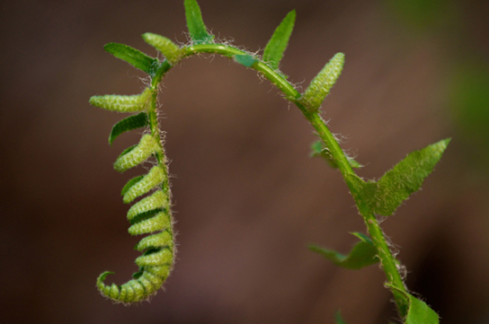
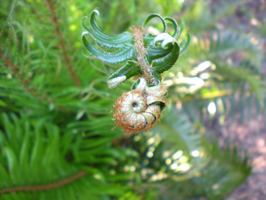

By the end of this section, you will be able to:
* Identify the new traits that first appear in tracheophytes
* Discuss the importance of adaptations to life on land
* Describe the classes of seedless tracheophytes
* Describe the lifecycle of a fern
* Explain the role of seedless vascular plants in the ecosystem

The vascular plants, or **tracheophytes**{: data-type="term"}, are the dominant and most conspicuous group of land plants. More than 260,000 species of tracheophytes represent more than 90 percent of Earth’s vegetation. Several evolutionary innovations explain their success and their ability to spread to all habitats.

Bryophytes may have been successful at the transition from an aquatic habitat to land, but they are still dependent on water for reproduction, and absorb moisture and nutrients through the gametophyte surface. The lack of roots for absorbing water and minerals from the soil, as well as a lack of reinforced conducting cells, limits bryophytes to small sizes. Although they may survive in reasonably dry conditions, they cannot reproduce and expand their habitat range in the absence of water. Vascular plants, on the other hand, can achieve enormous heights, thus competing successfully for light. Photosynthetic organs become leaves, and pipe-like cells or vascular tissues transport water, minerals, and fixed carbon throughout the organism.

In seedless vascular plants, the diploid sporophyte is the dominant phase of the lifecycle. The gametophyte is now an inconspicuous, but still independent, organism. Throughout plant evolution, there is an evident reversal of roles in the dominant phase of the lifecycle. Seedless vascular plants still depend on water during fertilization, as the sperm must swim on a layer of moisture to reach the egg. This step in reproduction explains why ferns and their relatives are more abundant in damp environments.

# Vascular Tissue: Xylem and Phloem

The first fossils that show the presence of vascular tissue date to the Silurian period, about 430 million years ago. The simplest arrangement of conductive cells shows a pattern of xylem at the center surrounded by phloem. **Xylem**{: data-type="term"} is the tissue responsible for the storage and long-distance transport of water and nutrients, as well as the transfer of water-soluble growth factors from the organs of synthesis to the target organs. The tissue consists of conducting cells, known as tracheids, and supportive filler tissue, called parenchyma. Xylem conductive cells incorporate the compound **lignin**{: data-type="term"} into their walls, and are thus described as lignified. Lignin itself is a complex polymer that is impermeable to water and confers mechanical strength to vascular tissue. With their rigid cell walls, the xylem cells provide support to the plant and allow it to achieve impressive heights. Tall plants have a selective advantage by being able to reach unfiltered sunlight and disperse their spores or seeds further away, thus expanding their range. By growing higher than other plants, tall trees cast their shadow on shorter plants and limit competition for water and precious nutrients in the soil.

**Phloem**{: data-type="term"} is the second type of vascular tissue; it transports sugars, proteins, and other solutes throughout the plant. Phloem cells are divided into sieve elements (conducting cells) and cells that support the sieve elements. Together, xylem and phloem tissues form the vascular system of plants.

# Roots: Support for the Plant

Roots are not well preserved in the fossil record. Nevertheless, it seems that roots appeared later in evolution than vascular tissue. The development of an extensive network of roots represented a significant new feature of vascular plants. Thin rhizoids attached bryophytes to the substrate, but these rather flimsy filaments did not provide a strong anchor for the plant; neither did they absorb substantial amounts of water and nutrients. In contrast, roots, with their prominent vascular tissue system, transfer water and minerals from the soil to the rest of the plant. The extensive network of roots that penetrates deep into the soil to reach sources of water also stabilizes trees by acting as a ballast or anchor. The majority of roots establish a symbiotic relationship with fungi, forming mycorrhizae, which benefit the plant by greatly increasing the surface area for absorption of water and soil minerals and nutrients.

# Leaves, Sporophylls, and Strobili

A third innovation marks the seedless vascular plants. Accompanying the prominence of the sporophyte and the development of vascular tissue, the appearance of true leaves improved their photosynthetic efficiency. Leaves capture more sunlight with their increased surface area by employing more chloroplasts to trap light energy and convert it to chemical energy, which is then used to fix atmospheric carbon dioxide into carbohydrates. The carbohydrates are exported to the rest of the plant by the conductive cells of phloem tissue.

The existence of two types of morphology suggests that leaves evolved independently in several groups of plants. The first type of leaf is the **microphyll**{: data-type="term"}, or “little leaf,” which can be dated to 350 million years ago in the late Silurian. A microphyll is small and has a simple vascular system. A single unbranched **vein**{: data-type="term"}—a bundle of vascular tissue made of xylem and phloem—runs through the center of the leaf. Microphylls may have originated from the flattening of lateral branches, or from sporangia that lost their reproductive capabilities. Microphylls are present in the club mosses and probably preceded the development of **megaphylls**{: data-type="term"}, or “big leaves”, which are larger leaves with a pattern of branching veins. Megaphylls most likely appeared independently several times during the course of evolution. Their complex networks of veins suggest that several branches may have combined into a flattened organ, with the gaps between the branches being filled with photosynthetic tissue.

In addition to photosynthesis, leaves play another role in the life of the plants. Pine cones, mature fronds of ferns, and flowers are all **sporophylls**{: data-type="term"}—leaves that were modified structurally to bear sporangia. **Strobili**{: data-type="term"} are cone-like structures that contain sporangia. They are prominent in conifers and are commonly known as pine cones.

# Ferns and Other Seedless Vascular Plants

By the late Devonian period, plants had evolved vascular tissue, well-defined leaves, and root systems. With these advantages, plants increased in height and size. During the Carboniferous period, swamp forests of club mosses and horsetails—some specimens reaching heights of more than 30 m (100 ft)—covered most of the land. These forests gave rise to the extensive coal deposits that gave the Carboniferous its name. In seedless vascular plants, the sporophyte became the dominant phase of the lifecycle.

Water is still required for fertilization of seedless vascular plants, and most favor a moist environment. Modern-day seedless tracheophytes include club mosses, horsetails, ferns, and whisk ferns.

##  Phylum Lycopodiophyta: Club Mosses

The **club mosses**{: data-type="term"}, or phylum **Lycopodiophyta**{: data-type="term"}, are the earliest group of seedless vascular plants. They dominated the landscape of the Carboniferous, growing into tall trees and forming large swamp forests. Today’s club mosses are diminutive, evergreen plants consisting of a stem (which may be branched) and microphylls ([\[link\]](#fig-ch25_04_01)). The phylum Lycopodiophyta consists of close to 1,200 species, including the quillworts (*Isoetales*), the club mosses (*Lycopodiales*), and spike mosses (*Selaginellales*), none of which are true mosses or bryophytes.

Lycophytes follow the pattern of alternation of generations seen in the bryophytes, except that the sporophyte is the major stage of the lifecycle. The gametophytes do not depend on the sporophyte for nutrients. Some gametophytes develop underground and form mycorrhizal associations with fungi. In club mosses, the sporophyte gives rise to sporophylls arranged in strobili, cone-like structures that give the class its name. Lycophytes can be homosporous or heterosporous.

 "){: #fig-ch25_04_01}

## Phylum Monilophyta: Class Equisetopsida (Horsetails)

Horsetails, whisk ferns and ferns belong to the phylum Monilophyta, with **horsetails**{: data-type="term"} placed in the Class Equisetopsida. The single genus *Equisetum* is the survivor of a large group of plants, known as Arthrophyta, which produced large trees and entire swamp forests in the Carboniferous. The plants are usually found in damp environments and marshes ([\[link\]](#fig-ch25_04_02)).

 "){: #fig-ch25_04_02}

The stem of a horsetail is characterized by the presence of joints or nodes, hence the name Arthrophyta (arthro- = \"joint\"; -phyta = \"plant\"). Leaves and branches come out as whorls from the evenly spaced joints. The needle-shaped leaves do not contribute greatly to photosynthesis, the majority of which takes place in the green stem ([\[link\]](#fig-ch25_04_03)).

"){: #fig-ch25_04_03}

Silica collects in the epidermal cells, contributing to the stiffness of horsetail plants. Underground stems known as rhizomes anchor the plants to the ground. Modern-day horsetails are homosporous and produce bisexual gametophytes.

## Phylum Monilophyta: Class Psilotopsida (Whisk Ferns)

While most ferns form large leaves and branching roots, the **whisk ferns**{: data-type="term"}, Class Psilotopsida, lack both roots and leaves, probably lost by reduction. Photosynthesis takes place in their green stems, and small yellow knobs form at the tip of the branch stem and contain the sporangia. Whisk ferns were considered an early pterophytes. However, recent comparative DNA analysis suggests that this group may have lost both vascular tissue and roots through evolution, and is more closely related to ferns.

 "){: #fig-ch25_04_04}

## Phylum Monilophyta: Class Psilotopsida (Ferns)

With their large fronds, **ferns**{: data-type="term"} are the most readily recognizable seedless vascular plants. They are considered the most advanced seedless vascular plants and display characteristics commonly observed in seed plants. More than 20,000 species of ferns live in environments ranging from tropics to temperate forests. Although some species survive in dry environments, most ferns are restricted to moist, shaded places. Ferns made their appearance in the fossil record during the Devonian period and expanded during the Carboniferous.

The dominant stage of the lifecycle of a fern is the sporophyte, which consists of large compound leaves called fronds. Fronds fulfill a double role; they are photosynthetic organs that also carry reproductive organs. The stem may be buried underground as a rhizome, from which adventitious roots grow to absorb water and nutrients from the soil; or, they may grow above ground as a trunk in tree ferns ([\[link\]](#fig-ch25_04_05)). **Adventitious**{: data-type="term"} organs are those that grow in unusual places, such as roots growing from the side of a stem.

 "){: #fig-ch25_04_05}

The tip of a developing fern frond is rolled into a crozier, or fiddlehead ([\[link\]](#fig-ch25_04_06)**a** and [\[link\]](#fig-ch25_04_06)**b**). Fiddleheads unroll as the frond develops.

<figure markdown="1" id="fig-ch25_04_06" data-orient="horizontal">
<figcaption>
Croziers, or fiddleheads, are the tips of fern fronds. (credit a: modification of work by Cory Zanker; credit b: modification of work by Myriam Feldman)
</figcaption>
{:}

{:}

</figure>

The lifecycle of a fern is depicted in [\[link\]](#fig-ch25_04_07).

Art Connection

![ The fern life cycle begins with a diploid (2n) sporophyte, which is the fern plant. Sporangia are round bumps that occur on the bottom of the leaves. Sporangia undergo mitosis to form haploid (1n) spores. The spores germinate and grow into a green gametophyte 1n that resembles lettuce. The gametophyte contains antheridia that produce, sperm and archegonia that produce eggs. Inside the archegonium the sperm fertilizes the egg, forming a diploid (2n) zygote. The zygote undergoes mitosis to form a 2n sporophyte, ending the cycle.](../resources/Figure_25_04_07.png "This life cycle of a fern shows alternation of generations with a dominant sporophyte stage. (credit &quot;fern&quot;: modification of work by Cory Zanker; credit &quot;gametophyte&quot;: modification of work by &quot;Vlmastra&quot;/Wikimedia Commons)"){: #fig-ch25_04_07}

Which of the following statements about the fern life cycle is false?

1.  Sporangia produce haploid spores.
2.  The sporophyte grows from a gametophyte.
3.  The sporophyte is diploid and the gametophyte is haploid.
4.  Sporangia form on the underside of the gametophyte.
{: data-number-style="lower-alpha"}

<!-- <para><link target-id="fig-ch25_04_06" document=""/> D.</para> -->

Link to Learning

  
To see an animation of the lifecycle of a fern and to test your knowledge, go to the [website][1]{: target="_window"}.

Most ferns produce the same type of spores and are therefore homosporous. The diploid sporophyte is the most conspicuous stage of the lifecycle. On the underside of its mature fronds, sori (singular, sorus) form as small clusters where sporangia develop ([\[link\]](#fig-ch25_04_08)).

"){: #fig-ch25_04_08}

Inside the sori, spores are produced by meiosis and released into the air. Those that land on a suitable substrate germinate and form a heart-shaped gametophyte, which is attached to the ground by thin filamentous rhizoids ([\[link\]](#fig-ch25_04_09)).

 and a heart-shaped gametophyte (bottom part of image). (credit: modification of work by &quot;Vlmastra&quot;/Wikimedia Commons)"){: #fig-ch25_04_09}

The inconspicuous gametophyte harbors both sex gametangia. Flagellated sperm released from the antheridium swim on a wet surface to the archegonium, where the egg is fertilized. The newly formed zygote grows into a sporophyte that emerges from the gametophyte and grows by mitosis into the next generation sporophyte.

Career Connection

Landscape DesignerLooking at the well-laid parterres of flowers and fountains in the grounds of royal castles and historic houses of Europe, it’s clear that the gardens’ creators knew about more than art and design. They were also familiar with the biology of the plants they chose. Landscape design also has strong roots in the United States’ tradition. A prime example of early American classical design is Monticello: Thomas Jefferson’s private estate. Among his many interests, Jefferson maintained a strong passion for botany. Landscape layout can encompass a small private space, like a backyard garden; public gathering places, like Central Park in New York City; or an entire city plan, like Pierre L’Enfant’s design for Washington, DC.

A landscape designer will plan traditional public spaces—such as botanical gardens, parks, college campuses, gardens, and larger developments—as well as natural areas and private gardens. The restoration of natural places encroached on by human intervention, such as wetlands, also requires the expertise of a landscape designer.

With such an array of necessary skills, a landscape designer’s education includes a solid background in botany, soil science, plant pathology, entomology, and horticulture. Coursework in architecture and design software is also required for the completion of the degree. The successful design of a landscape rests on an extensive knowledge of plant growth requirements, such as light and shade, moisture levels, compatibility of different species, and susceptibility to pathogens and pests. Mosses and ferns will thrive in a shaded area, where fountains provide moisture; cacti, on the other hand, would not fare well in that environment. The future growth of individual plants must be taken into account, to avoid crowding and competition for light and nutrients. The appearance of the space over time is also of concern. Shapes, colors, and biology must be balanced for a well-maintained and sustainable green space. Art, architecture, and biology blend in a beautifully designed and implemented landscape.

"){: #fig-ch25_04_10}

# The Importance of Seedless Vascular Plants

Mosses and liverworts are often the first macroscopic organisms to colonize an area, both in a primary succession—where bare land is settled for the first time by living organisms—or in a secondary succession, where soil remains intact after a catastrophic event wipes out many existing species. Their spores are carried by the wind, birds, or insects. Once mosses and liverworts are established, they provide food and shelter for other species. In a hostile environment, like the tundra where the soil is frozen, bryophytes grow well because they do not have roots and can dry and rehydrate rapidly once water is again available. Mosses are at the base of the food chain in the tundra biome. Many species—from small insects to musk oxen and reindeer—depend on mosses for food. In turn, predators feed on the herbivores, which are the primary consumers. Some reports indicate that bryophytes make the soil more amenable to colonization by other plants. Because they establish symbiotic relationships with nitrogen-fixing cyanobacteria, mosses replenish the soil with nitrogen.

At the end of the nineteenth century, scientists observed that lichens and mosses were becoming increasingly rare in urban and suburban areas. Since bryophytes have neither a root system for absorption of water and nutrients, nor a cuticle layer that protects them from desiccation, pollutants in rainwater readily penetrate their tissues; they absorb moisture and nutrients through their entire exposed surfaces. Therefore, pollutants dissolved in rainwater penetrate plant tissues readily and have a larger impact on mosses than on other plants. The disappearance of mosses can be considered a bioindicator for the level of pollution in the environment.

Ferns contribute to the environment by promoting the weathering of rock, accelerating the formation of topsoil, and slowing down erosion by spreading rhizomes in the soil. The water ferns of the genus *Azolla* harbor nitrogen-fixing cyanobacteria and restore this important nutrient to aquatic habitats.

Seedless plants have historically played a role in human life through uses as tools, fuel, and medicine. Dried **peat moss**{: data-type="term"}, *Sphagnum*, is commonly used as fuel in some parts of Europe and is considered a renewable resource. <em>Sphagnum </em>bogs ([\[link\]](#fig-ch25_04_11)) are cultivated with cranberry and blueberry bushes. The ability of *Sphagnum* to hold moisture makes the moss a common soil conditioner. Florists use blocks of <em>Sphagnum </em>to maintain moisture for floral arrangements.

"){: #fig-ch25_04_11}

The attractive fronds of ferns make them a favorite ornamental plant. Because they thrive in low light, they are well suited as house plants. More importantly, fiddleheads are a traditional spring food of Native Americans in the Pacific Northwest, and are popular as a side dish in French cuisine. The licorice fern, <em>Polypodium glycyrrhiza, </em>is part of the diet of the Pacific Northwest coastal tribes, owing in part to the sweetness of its rhizomes. It has a faint licorice taste and serves as a sweetener. The rhizome also figures in the pharmacopeia of Native Americans for its medicinal properties and is used as a remedy for sore throat.

LInk to Learning

  
Go to this [website][2]{: target="_window"} to learn how to identify fern species based upon their fiddleheads.

By far the greatest impact of seedless vascular plants on human life, however, comes from their extinct progenitors. The tall club mosses, horsetails, and tree-like ferns that flourished in the swampy forests of the Carboniferous period gave rise to large deposits of coal throughout the world. Coal provided an abundant source of energy during the Industrial Revolution, which had tremendous consequences on human societies, including rapid technological progress and growth of large cities, as well as the degradation of the environment. Coal is still a prime source of energy and also a major contributor to global warming.

# Section Summary

Vascular systems consist of xylem tissue, which transports water and minerals, and phloem tissue, which transports sugars and proteins. With the development of the vascular system, there appeared leaves to act as large photosynthetic organs, and roots to access water from the ground. Small uncomplicated leaves are microphylls. Large leaves with vein patterns are megaphylls. Modified leaves that bear sporangia are sporophylls. Some sporophylls are arranged in cone structures called strobili.

The seedless vascular plants include club mosses, which are the most primitive; whisk ferns, which lost leaves and roots by reductive evolution; and horsetails and ferns. Ferns are the most advanced group of seedless vascular plants. They are distinguished by large leaves called fronds and small sporangia-containing structures called sori, which are found on the underside of the fronds.

Mosses play an essential role in the balance of the ecosystems; they are pioneering species that colonize bare or devastated environments and make it possible for a succession to occur. They contribute to the enrichment of the soil and provide shelter and nutrients for animals in hostile environments. Mosses and ferns can be used as fuels and serve culinary, medical, and decorative purposes.

# Art Connections

[[link]](#fig-ch25_04_06) Which of the following statements about the fern life cycle is false?

1.  Sporangia produce haploid spores.
2.  The sporophyte grows from a gametophyte.
3.  The sporophyte is diploid and the gametophyte is haploid.
4.  Sporangia form on the underside of the gametophyte.
{: data-number-style="lower-alpha"}

[[link]](#fig-ch25_04_06) D.

# Review Questions

Microphylls are characteristic of which types of plants?

1.  mosses
2.  liverworts
3.  club mosses
4.  ferns
{: data-number-style="lower-alpha"}

C

A plant in the understory of a forest displays a segmented stem and slender leaves arranged in a whorl. It is probably a \_\_\_\_\_\_\_\_.

1.  club moss
2.  whisk fern
3.  fern
4.  horsetail
{: data-number-style="lower-alpha"}

D

The following structures are found on the underside of fern leaves and contain sporangia:

1.  sori
2.  rhizomes
3.  megaphylls
4.  microphylls
{: data-number-style="lower-alpha"}

A

The dominant organism in fern is the \_\_\_\_\_\_\_\_.

1.  sperm
2.  spore
3.  gamete
4.  sporophyte
{: data-number-style="lower-alpha"}

D

What seedless plant is a renewable source of energy?

1.  club moss
2.  horsetail
3.  sphagnum moss
4.  fern
{: data-number-style="lower-alpha"}

C

How do mosses contribute to returning nitrogen to the soil?

1.  Mosses fix nitrogen from the air.
2.  Mosses harbor cyanobacteria that fix nitrogen.
3.  Mosses die and return nitrogen to the soil.
4.  Mosses decompose rocks and release nitrogen.
{: data-number-style="lower-alpha"}

D

# Free Response

How did the development of a vascular system contribute to the increase in size of plants?

Plants became able to transport water and nutrients and not be limited by rates of diffusion. Vascularization allowed the development of leaves, which increased efficiency of photosynthesis and provided more energy for plant growth.

Which plant is considered the most advanced seedless vascular plant and why?

Ferns are considered the most advanced seedless vascular plants, because they display characteristics commonly observed in seed plants—they form large leaves and branching roots.

[1]: http://openstaxcollege.org/l/fern_life_cycle
[2]: http://openstaxcollege.org/l/fiddleheads
