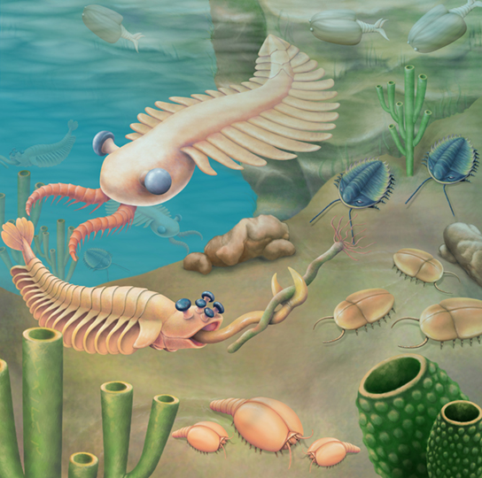

By the end of this section, you will be able to:
* Describe the features that characterized the earliest animals and when they appeared on earth
* Explain the significance of the Cambrian period for animal evolution and the changes in animal diversity that took place during that time
* Describe some of the unresolved questions surrounding the Cambrian explosion
* Discuss the implications of mass animal extinctions that have occurred in evolutionary history

Many questions regarding the origins and evolutionary history of the animal kingdom continue to be researched and debated, as new fossil and molecular evidence change prevailing theories. Some of these questions include the following: How long have animals existed on Earth? What were the earliest members of the animal kingdom, and what organism was their common ancestor? While animal diversity increased during the Cambrian period of the Paleozoic era, 530 million years ago, modern fossil evidence suggests that primitive animal species existed much earlier.

# Pre-Cambrian Animal Life

The time before the Cambrian period is known as the **Ediacaran period**{: data-type="term"} (from about 635 million years ago to 543 million years ago), the final period of the late Proterozoic Neoproterozoic Era ([\[link\]](#fig-ch27_04_01)). It is believed that early animal life, termed Ediacaran biota, evolved from protists at this time. Some protest species called choanoflagellates closely resemble the choanocyte cells in the simplest animals, sponges. In addition to their morphological similarity, molecular analyses have revealed similar sequence homologies in their DNA.

 ![Table A describes eras in earth&#x2019;s history. The earth&#x2019;s history is divided into four eons, the Pre-Archean, Archaea, Proteozoic, Phanerozoic. The oldest eon, the Pre-Archean, spans the beginning of earth&#x2019;s history to about 3.8 billion years ago. The Archean eon spans 2.5 to 3.8 billion years ago, and the Proterozoic spans 570 million to 2.5 billion years ago. The Pharenozoic eon, from 570 million years ago to present time, is sub-divided into the Paleozoic, Mesozoic and Cenozoic eras. The Paleozoic era, from 240 to 570 million years ago, is further divided into seven periods: the Cambrian from 500 to 570 million years ago, the Ordovician from 435 to 500 million years ago, the Silurian from 410 to 435 million years ago, the Devonian from 360 to 410 million years ago, the Missisippian from 330 to 360 million years ago, the Pennsylvanian from 290 to 330 million years ago, and the Permian from 240 to 290 million years ago. The Mesozoic era, from 66 to 240 million years ago, is divided into three periods, the Triassic from 205 to 240 million years ago, the Jurassic from 138 to 205 million years ago, and the Cretaceous, from 66 to 138 million years ago. The Cenozoic era, from 66 million years ago to modern times, is divided into two eras, the Tertiary and the Quaternary. The tertiary period spans 66 to 1.6 million years ago. The quaternary period spans 1.6 million years ago to modern times. Illustration B shows geological periods in a spiral starting with the beginning of earth&#x2019;s history  at the bottom and ending with modern times at the top. The diversity and complexity of life increases toward the top of the spiral.](../resources/Figure_27_04_01.jpg "(a) Earth&#x2019;s history is divided into eons, eras, and periods. Note that the Ediacaran period starts in the Proterozoic eon and ends in the Cambrian period of the Phanerozoic eon.  (b) Stages on the geological time scale are represented as a spiral. (credit: modification of work by USGS)"){: #fig-ch27_04_01}

The earliest life comprising Ediacaran biota was long believed to include only tiny, sessile, soft-bodied sea creatures. However, recently there has been increasing scientific evidence suggesting that more varied and complex animal species lived during this time, and possibly even before the Ediacaran period.

Fossils believed to represent the oldest animals with hard body parts were recently discovered in South Australia. These sponge-like fossils, named *Coronacollina acula*, date back as far as 560 million years, and are believed to show the existence of hard body parts and spicules that extended 20–40 cm from the main body (estimated about 5 cm long). Other fossils from the Ediacaran period are shown in [\[link\]](#fig-ch27_04_02)**ab**.

 Cyclomedusa and (b) Dickinsonia date to 650 million years ago, during the Ediacaran period. (credit: modification of work by &#x201C;Smith609&#x201D;/Wikimedia Commons)"){: #fig-ch27_04_02}

Another recent fossil discovery may represent the earliest animal species ever found. While the validity of this claim is still under investigation, these primitive fossils appear to be small, one-centimeter long, sponge-like creatures. These fossils from South Australia date back 650 million years, actually placing the putative animal before the great ice age extinction event that marked the transition between the **Cryogenian period**{: data-type="term"} and the Ediacaran period. Until this discovery, most scientists believed that there was no animal life prior to the Ediacaran period. Many scientists now believe that animals may in fact have evolved during the Cryogenian period.

# The Cambrian Explosion of Animal Life

The Cambrian period, occurring between approximately 542–488 million years ago, marks the most rapid evolution of new animal phyla and animal diversity in Earth’s history. It is believed that most of the animal phyla in existence today had their origins during this time, often referred to as the **Cambrian explosion**{: data-type="term"} ([\[link\]](#fig-ch27_04_03)). Echinoderms, mollusks, worms, arthropods, and chordates arose during this period. One of the most dominant species during the Cambrian period was the trilobite, an arthropod that was among the first animals to exhibit a sense of vision ([\[link\]](#fig-ch27_04_04abcd)**abcd**).

{: #fig-ch27_04_03}

 belong to trilobites, extinct arthropods that appeared in the early Cambrian period, 525 million years ago, and disappeared from the fossil record during a mass extinction at the end of the Permian period, about 250 million years ago."){: #fig-ch27_04_04abcd}

The cause of the Cambrian explosion is still debated. There are many theories that attempt to answer this question. Environmental changes may have created a more suitable environment for animal life. Examples of these changes include rising atmospheric oxygen levels and large increases in oceanic calcium concentrations that preceded the Cambrian period ([\[link\]](#fig-ch27_04_05)). Some scientists believe that an expansive, continental shelf with numerous shallow lagoons or pools provided the necessary living space for larger numbers of different types of animals to co-exist. There is also support for theories that argue that ecological relationships between species, such as changes in the food web, competition for food and space, and predator-prey relationships, were primed to promote a sudden massive coevolution of species. Yet other theories claim genetic and developmental reasons for the Cambrian explosion. The morphological flexibility and complexity of animal development afforded by the evolution of <em>Hox </em>control genes may have provided the necessary opportunities for increases in possible animal morphologies at the time of the Cambrian period. Theories that attempt to explain why the Cambrian explosion happened must be able to provide valid reasons for the massive animal diversification, as well as explain why it happened <em>when </em>it did. There is evidence that both supports and refutes each of the theories described above, and the answer may very well be a combination of these and other theories.

 {: #fig-ch27_04_05}

However, unresolved questions about the animal diversification that took place during the Cambrian period remain. For example, we do not understand how the evolution of so many species occurred in such a short period of time. Was there really an “explosion” of life at this particular time? Some scientists question the validity of the this idea, because there is increasing evidence to suggest that more animal life existed prior to the Cambrian period and that other similar species’ so-called explosions (or radiations) occurred later in history as well. Furthermore, the vast diversification of animal species that appears to have begun during the Cambrian period continued well into the following Ordovician period. Despite some of these arguments, most scientists agree that the Cambrian period marked a time of impressively rapid animal evolution and diversification that is unmatched elsewhere during history.

Link to Learning

  
View an [animation][1] of what ocean life may have been like during the Cambrian explosion.

# Post-Cambrian Evolution and Mass Extinctions

The periods that followed the Cambrian during the Paleozoic Era are marked by further animal evolution and the emergence of many new orders, families, and species. As animal phyla continued to diversify, new species adapted to new ecological niches. During the Ordovician period, which followed the Cambrian period, plant life first appeared on land. This change allowed formerly aquatic animal species to invade land, feeding directly on plants or decaying vegetation. Continual changes in temperature and moisture throughout the remainder of the Paleozoic Era due to continental plate movements encouraged the development of new adaptations to terrestrial existence in animals, such as limbed appendages in amphibians and epidermal scales in reptiles.

Changes in the environment often create new niches (living spaces) that contribute to rapid speciation and increased diversity. On the other hand, cataclysmic events, such as volcanic eruptions and meteor strikes that obliterate life, can result in devastating losses of diversity. Such periods of **mass extinction**{: data-type="term"} ([\[link\]](#fig-ch27_04_06)) have occurred repeatedly in the evolutionary record of life, erasing some genetic lines while creating room for others to evolve into the empty niches left behind. The end of the Permian period (and the Paleozoic Era) was marked by the largest mass extinction event in Earth’s history, a loss of roughly 95 percent of the extant species at that time. Some of the dominant phyla in the world’s oceans, such as the trilobites, disappeared completely. On land, the disappearance of some dominant species of Permian reptiles made it possible for a new line of reptiles to emerge, the dinosaurs. The warm and stable climatic conditions of the ensuing Mesozoic Era promoted an explosive diversification of dinosaurs into every conceivable niche in land, air, and water. Plants, too, radiated into new landscapes and empty niches, creating complex communities of producers and consumers, some of which became very large on the abundant food available.

Another mass extinction event occurred at the end of the Cretaceous period, bringing the Mesozoic Era to an end. Skies darkened and temperatures fell as a large meteor impact and tons of volcanic ash blocked incoming sunlight. Plants died, herbivores and carnivores starved, and the mostly cold-blooded dinosaurs ceded their dominance of the landscape to more warm-blooded mammals. In the following Cenozoic Era, mammals radiated into terrestrial and aquatic niches once occupied by dinosaurs, and birds, the warm-blooded offshoots of one line of the ruling reptiles, became aerial specialists. The appearance and dominance of flowering plants in the Cenozoic Era created new niches for insects, as well as for birds and mammals. Changes in animal species diversity during the late Cretaceous and early Cenozoic were also promoted by a dramatic shift in Earth’s geography, as continental plates slid over the crust into their current positions, leaving some animal groups isolated on islands and continents, or separated by mountain ranges or inland seas from other competitors. Early in the Cenozoic, new ecosystems appeared, with the evolution of grasses and coral reefs. Late in the Cenozoic, further extinctions followed by speciation occurred during ice ages that covered high latitudes with ice and then retreated, leaving new open spaces for colonization.

Link to Learning

  
Watch the following [video][2] to learn more about the mass extinctions.

{: #fig-ch27_04_06}

Career Connection

PaleontologistNatural history museums contain the fossil casts of extinct animals and information about how these animals evolved, lived, and died. Paleontogists are scientists who study prehistoric life. They use fossils to observe and explain how life evolved on Earth and how species interacted with each other and with the environment. A paleontologist needs to be knowledgeable in biology, ecology, chemistry, geology, and many other scientific disciplines. A paleontologist’s work may involve field studies: searching for and studying fossils. In addition to digging for and finding fossils, paleontologists also prepare fossils for further study and analysis. Although dinosaurs are probably the first animals that come to mind when thinking about paleontology, paleontologists study everything from plant life, fungi, and fish to sea animals and birds.

An undergraduate degree in earth science or biology is a good place to start toward the career path of becoming a paleontologist. Most often, a graduate degree is necessary. Additionally, work experience in a museum or in a paleontology lab is useful.

# Section Summary

The most rapid diversification and evolution of animal species in all of history occurred during the Cambrian period of the Paleozoic Era, a phenomenon known as the Cambrian explosion. Until recently, scientists believed that there were only very few tiny and simplistic animal species in existence before this period. However, recent fossil discoveries have revealed that additional, larger, and more complex animals existed during the Ediacaran period, and even possibly earlier, during the Cryogenian period. Still, the Cambrian period undoubtedly witnessed the emergence of the majority of animal phyla that we know today, although many questions remain unresolved about this historical phenomenon.

The remainder of the Paleozoic Era is marked by the growing appearance of new classes, families, and species, and the early colonization of land by certain marine animals. The evolutionary history of animals is also marked by numerous major extinction events, each of which wiped out a majority of extant species. Some species of most animal phyla survived these extinctions, allowing the phyla to persist and continue to evolve into species that we see today.

# Review Questions

Which of the following periods is the earliest during which animals may have appeared?

1.  Ordovician period
2.  Cambrian period
3.  Ediacaran period
4.  Cryogenian period
{: data-number-style="lower-alpha"}

D

What type of data is primarily used to determine the existence and appearance of early animal species?

1.  molecular data
2.  fossil data
3.  morphological data
4.  embryological development data
{: data-number-style="lower-alpha"}

B

The time between 542–488 million years ago marks which period?

1.  Cambrian period
2.  Silurian period
3.  Ediacaran period
4.  Devonian period
{: data-number-style="lower-alpha"}

A

Until recent discoveries suggested otherwise, animals existing before the Cambrian period were believed to be:

1.  small and ocean-dwelling
2.  small and non-motile
3.  small and soft-bodied
4.  small and radially symmetrical or asymmetrical
{: data-number-style="lower-alpha"}

C

Plant life first appeared on land during which of the following periods?

1.  Cambrian period
2.  Ordovician period
3.  Silurian period
4.  Devonian period
{: data-number-style="lower-alpha"}

B

Approximately how many mass extinction events occurred throughout the evolutionary history of animals?

1.  3
2.  4
3.  5
4.  more than 5
{: data-number-style="lower-alpha"}

D

# Free Response

Briefly describe at least two theories that attempt to explain the cause of the Cambrian explosion.

One theory states that environmental factors led to the Cambrian explosion. For example, the rise in atmospheric oxygen and oceanic calcium levels helped to provide the right environmental conditions to allow such a rapid evolution of new animal phyla. Another theory states that ecological factors such as competitive pressures and predator-prey relationships reached a threshold that supported the rapid animal evolution that took place during the Cambrian period.

How is it that most, if not all, of the extant animal phyla today evolved during the Cambrian period if so many massive extinction events have taken place since then?

It is true that multiple mass extinction events have taken place since the Cambrian period, when most currently existing animal phyla appeared, and the majority of animal species were commonly wiped out during these events. However, a small number of animal species representing each phylum were usually able to survive each extinction event, allowing the phylum to continue to evolve rather than become altogether extinct.

## Glossary
{: data-type="glossary-title"}

Cambrian explosion
: time during the Cambrian period (542–488 million years ago) when most of the animal phyla in existence today evolved
{: .definition}

Cryogenian period
: geologic period (850–630 million years ago) characterized by a very cold global climate
{: .definition}

Ediacaran period
: geological period (630–542 million years ago) when the oldest definite multicellular organisms with tissues evolved
{: .definition}

mass extinction
: event that wipes out the majority of species within a relatively short geological time period
{: .definition}

[1]: http://openstaxcollege.org/l/ocean_life
[2]: http://openstaxcollege.org/l/mass_extinction
