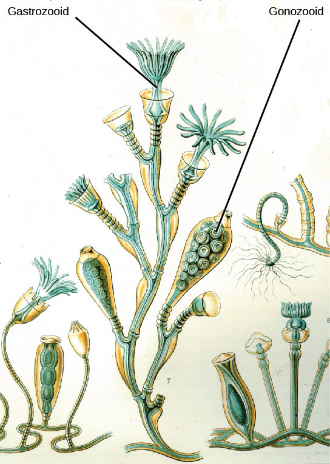

By the end of this section, you will be able to:
* Compare structural and organization characteristics of Porifera and Cnidaria
* Describe the progressive development of tissues and their relevance to animal complexity

Phylum **Cnidaria**{: data-type="term"} includes animals that show radial or biradial symmetry and are diploblastic, that is, they develop from two embryonic layers. Nearly all (about 99 percent) cnidarians are marine species.

Cnidarians contain specialized cells known as **cnidocytes**{: data-type="term"} (“stinging cells”) containing organelles called **nematocysts**{: data-type="term"} (stingers). These cells are present around the mouth and tentacles, and serve to immobilize prey with toxins contained within the cells. Nematocysts contain coiled threads that may bear barbs. The outer wall of the cell has hairlike projections called cnidocils, which are sensitive to touch. When touched, the cells are known to fire coiled threads that can either penetrate the flesh of the prey or predators of cnidarians (see [\[link\]](#fig-ch28_02_01)) or ensnare it. These coiled threads release toxins into the target and can often immobilize prey or scare away predators.

  nematocysts that store a coiled thread and barb. When hairlike projections on the cell surface are touched, (b) the thread, barb, and a toxin are fired from the organelle."){: #fig-ch28_02_01 data-media-type="image/jpg"}

Link to Learning

 {: data-media-type="image/png"} 
View this [video][1]{: target="_window"} animation showing two anemones engaged in a battle.

Animals in this phylum display two distinct morphological body plans: **polyp**{: data-type="term"} or “stalk” and **medusa**{: data-type="term"} or “bell” ([\[link\]](#fig-ch28_02_02)). An example of the polyp form is <em>Hydra </em>spp.; perhaps the most well-known medusoid animals are the jellies (jellyfish). Polyp forms are sessile as adults, with a single opening to the digestive system (the mouth) facing up with tentacles surrounding it. Medusa forms are motile, with the mouth and tentacles hanging down from an umbrella-shaped bell.

  and the polyp (b). All cnidarians have two membrane layers, with a jelly-like mesoglea between them."){: #fig-ch28_02_02 data-media-type="image/jpg"}

Some cnidarians are polymorphic, that is, they have two body plans during their life cycle. An example is the colonial hydroid called an <em>Obelia. </em>The sessile polyp form has, in fact, two types of polyps, shown in [\[link\]](#fig-ch28_02_03). The first is the gastrozooid, which is adapted for capturing prey and feeding; the other type of polyp is the gonozooid, adapted for the asexual budding of medusa. When the reproductive buds mature, they break off and become free-swimming medusa, which are either male or female (dioecious). The male medusa makes sperm, whereas the female medusa makes eggs. After fertilization, the zygote develops into a blastula, which develops into a planula larva. The larva is free swimming for a while, but eventually attaches and a new colonial reproductive polyp is formed.

 {: #fig-ch28_02_03 data-media-type="image/jpg"}

Link to Learning

 {: data-media-type="image/png"} 
Click here to follow the [life cycle][2]{: target="_window"} of the *Obelia.*

All cnidarians show the presence of two membrane layers in the body that are derived from the endoderm and ectoderm of the embryo. The outer layer (from ectoderm) is called the **epidermis**{: data-type="term"} and lines the outside of the animal, whereas the inner layer (from endoderm) is called the **gastrodermis**{: data-type="term"} and lines the digestive cavity. Between these two membrane layers is a non-living, jelly-like **mesoglea**{: data-type="term"} connective layer. In terms of cellular complexity, cnidarians show the presence of differentiated cell types in each tissue layer, such as nerve cells, contractile epithelial cells, enzyme-secreting cells, and nutrient-absorbing cells, as well as the presence of intercellular connections. However, the development of organs or organ systems is not advanced in this phylum.

The nervous system is primitive, with nerve cells scattered across the body. This nerve net may show the presence of groups of cells in the form of nerve plexi (singular plexus) or nerve cords. The nerve cells show mixed characteristics of motor as well as sensory neurons. The predominant signaling molecules in these primitive nervous systems are chemical peptides, which perform both excitatory and inhibitory functions. Despite the simplicity of the nervous system, it coordinates the movement of tentacles, the drawing of captured prey to the mouth, the digestion of food, and the expulsion of waste.

The cnidarians perform **extracellular digestion**{: data-type="term"} in which the food is taken into the gastrovascular cavity, enzymes are secreted into the cavity, and the cells lining the cavity absorb nutrients. The **gastrovascular cavity**{: data-type="term"} has only one opening that serves as both a mouth and an anus, which is termed an incomplete digestive system. Cnidarian cells exchange oxygen and carbon dioxide by diffusion between cells in the epidermis with water in the environment, and between cells in the gastrodermis with water in the gastrovascular cavity. The lack of a circulatory system to move dissolved gases limits the thickness of the body wall and necessitates a non-living mesoglea between the layers. There is no excretory system or organs, and nitrogenous wastes simply diffuse from the cells into the water outside the animal or in the gastrovascular cavity. There is also no circulatory system, so nutrients must move from the cells that absorb them in the lining of the gastrovascular cavity through the mesoglea to other cells.

The phylum Cnidaria contains about 10,000 described species divided into four classes: Anthozoa, Scyphozoa, Cubozoa, and Hydrozoa. The anthozoans, the sea anemones and corals, are all sessile species, whereas the scyphozoans (jellyfish) and cubozoans (box jellies) are swimming forms. The hydrozoans contain sessile forms and swimming colonial forms like the Portuguese Man O’ War.

# Class Anthozoa

The class Anthozoa includes all cnidarians that exhibit a polyp body plan only; in other words, there is no medusa stage within their life cycle. Examples include sea anemones ([\[link\]](#fig-ch28_02_04)), sea pens, and corals, with an estimated number of 6,100 described species. Sea anemones are usually brightly colored and can attain a size of 1.8 to 10 cm in diameter. These animals are usually cylindrical in shape and are attached to a substrate. A mouth opening is surrounded by tentacles bearing cnidocytes.

  photographed and (b) in a diagram illustrating its morphology. (credit a: modification of work by &quot;Dancing With Ghosts&quot;/Flickr; credit b: modification of work by NOAA)"){: #fig-ch28_02_04 data-media-type="image/jpg"}

The mouth of a sea anemone is surrounded by tentacles that bear cnidocytes. The slit-like mouth opening and pharynx are lined by a groove called a **siphonophore**{: data-type="term"}. The pharynx is the muscular part of the digestive system that serves to ingest as well as egest food, and may extend for up to two-thirds the length of the body before opening into the gastrovascular cavity. This cavity is divided into several chambers by longitudinal septa called mesenteries. Each mesentery consists of one ectodermal and one endodermal cell layer with the mesoglea sandwiched in between. Mesenteries do not divide the gastrovascular cavity completely, and the smaller cavities coalesce at the pharyngeal opening. The adaptive benefit of the mesenteries appears to be an increase in surface area for absorption of nutrients and gas exchange.

Sea anemones feed on small fish and shrimp, usually by immobilizing their prey using the cnidocytes. Some sea anemones establish a mutualistic relationship with hermit crabs by attaching to the crab’s shell. In this relationship, the anemone gets food particles from prey caught by the crab, and the crab is protected from the predators by the stinging cells of the anemone. Anemone fish, or clownfish, are able to live in the anemone since they are immune to the toxins contained within the nematocysts.

Anthozoans remain polypoid throughout their lives and can reproduce asexually by budding or fragmentation, or sexually by producing gametes. Both gametes are produced by the polyp, which can fuse to give rise to a free-swimming planula larva. The larva settles on a suitable substratum and develops into a sessile polyp.

# Class Scyphozoa

Class Scyphozoa includes all the jellies and is exclusively a marine class of animals with about 200 known species. The defining characteristic of this class is that the medusa is the prominent stage in the life cycle, although there is a polyp stage present. Members of this species range from 2 to 40 cm in length but the largest scyphozoan species, *Cyanea capillata*, can reach a size of 2 m across. Scyphozoans display a characteristic bell-like morphology ([\[link\]](#fig-ch28_02_05)).

 ![Part a shows a photo of a bright red jellyfish with a dome-shaped body. Long tentacles drift from the bottom edge of the dome, and ribbon-like appendages trail from the middle of the body. Part b shows a cross-section of a jellyfish, which has nematocyst-bearing tentacles hanging from the bottom of the dome. Underneath the middle of the dome is an opening that serves as both a mouth and an anus. The opening leads to a gastrovascular cavity that is lined with a gastrodermis. The outer surface of the body is covered with an epidermis. Between the epidermis and gastrodermis is the mesoglea.](../resources/Figure_28_02_05ab.jpg "A jelly is shown (a) photographed and (b) in a diagram illustrating its morphology. (credit a: modification of work by &quot;Jimg944&quot;/Flickr; credit b: modification of work by Mariana Ruiz Villareal)"){: #fig-ch28_02_05 data-media-type="image/jpg"}

In the jellyfish, a mouth opening is present on the underside of the animal, surrounded by tentacles bearing nematocysts. Scyphozoans live most of their life cycle as free-swimming, solitary carnivores. The mouth leads to the gastrovascular cavity, which may be sectioned into four interconnected sacs, called diverticuli. In some species, the digestive system may be further branched into radial canals. Like the septa in anthozoans, the branched gastrovascular cells serve two functions: to increase the surface area for nutrient absorption and diffusion; thus, more cells are in direct contact with the nutrients in the gastrovascular cavity.

In scyphozoans, nerve cells are scattered all over the body. Neurons may even be present in clusters called rhopalia. These animals possess a ring of muscles lining the dome of the body, which provides the contractile force required to swim through water. Scyphozoans are dioecious animals, that is, the sexes are separate. The gonads are formed from the gastrodermis and gametes are expelled through the mouth. Planula larvae are formed by external fertilization; they settle on a substratum in a polypoid form known as scyphistoma. These forms may produce additional polyps by budding or may transform into the medusoid form. The life cycle ([\[link\]](#fig-ch28_02_06)) of these animals can be described as **polymorphic**{: data-type="term"}, because they exhibit both a medusal and polypoid body plan at some point in their life cycle.

 "){: #fig-ch28_02_06 data-media-type="image/jpg"}

Link to Learning

 {: data-media-type="image/png"} 
Identify the life cycle stages of jellies using this [video animation quiz][3]{: target="_window"} from the New England Aquarium.

# Class Cubozoa

This class includes jellies that have a box-shaped medusa, or a bell that is square in cross-section; hence, are colloquially known as “box jellyfish.” These species may achieve sizes of 15–25 cm. Cubozoans display overall morphological and anatomical characteristics that are similar to those of the scyphozoans. A prominent difference between the two classes is the arrangement of tentacles. This is the most venomous group of all the cnidarians ([\[link\]](#fig-ch28_02_07)).

The cubozoans contain muscular pads called pedalia at the corners of the square bell canopy, with one or more tentacles attached to each pedalium. These animals are further classified into orders based on the presence of single or multiple tentacles per pedalium. In some cases, the digestive system may extend into the pedalia. Nematocysts may be arranged in a spiral configuration along the tentacles; this arrangement helps to effectively subdue and capture prey. Cubozoans exist in a polypoid form that develops from a planula larva. These polyps show limited mobility along the substratum and, like scyphozoans, may bud to form more polyps to colonize a habitat. Polyp forms then transform into the medusoid forms.

  tiny cubazoan jelly Malo kingi is thimble shaped and, like all cubozoan jellies, (b) has four muscular pedalia to which the tentacles attach. M. kingi is one of two species of jellies known to cause Irukandji syndrome, a condition characterized by excruciating muscle pain, vomiting, increased heart rate, and psychological symptoms. Two people in Australia, where Irukandji jellies are most commonly found, are believed to have died from Irukandji stings. (c) A sign on a beach in northern Australia warns swimmers of the danger. (credit c: modification of work by Peter Shanks)"){: #fig-ch28_02_07 data-media-type="image/jpg"}

# Class Hydrozoa

Hydrozoa includes nearly 3,200 species; most are marine, although some freshwater species are known ([\[link\]](#fig-ch28_02_08)). Animals in this class are polymorphs, and most exhibit both polypoid and medusoid forms in their lifecycle, although this is variable.

The polyp form in these animals often shows a cylindrical morphology with a central gastrovascular cavity lined by the gastrodermis. The gastrodermis and epidermis have a simple layer of mesoglea sandwiched between them. A mouth opening, surrounded by tentacles, is present at the oral end of the animal. Many hydrozoans form colonies that are composed of a branched colony of specialized polyps that share a gastrovascular cavity, such as in the colonial hydroid *Obelia*. Colonies may also be free-floating and contain medusoid and polypoid individuals in the colony as in <em>Physalia </em>(the Portuguese Man O’ War) or *Velella* (By-the-wind sailor). Even other species are solitary polyps (*Hydra*) or solitary medusae (*Gonionemus*). The true characteristic shared by all of these diverse species is that their gonads for sexual reproduction are derived from epidermal tissue, whereas in all other cnidarians they are derived from gastrodermal tissue.

  Obelia, (b) Physalia physalis, known as the Portuguese Man O&#x2018; War, (c) Velella bae, and (d) Hydra have different body shapes but all belong to the family Hydrozoa. (credit b: modification of work by NOAA; scale-bar data from Matt Russell)"){: #fig-ch28_02_08 data-media-type="image/jpg"}

# Section Summary

Cnidarians represent a more complex level of organization than Porifera. They possess outer and inner tissue layers that sandwich a noncellular mesoglea. Cnidarians possess a well-formed digestive system and carry out extracellular digestion. The cnidocyte is a specialized cell for delivering toxins to prey as well as warning off predators. Cnidarians have separate sexes and have a lifecycle that involves morphologically distinct forms. These animals also show two distinct morphological forms—medusoid and polypoid—at various stages in their lifecycle.

# Review Questions

Cnidocytes are found in _____.

1.  phylum Porifera
2.  phylum Nemertea
3.  phylum Nematoda
4.  phylum Cnidaria
{: data-number-style="lower-alpha"}

D

Cubozoans are ________.

1.  polyps
2.  medusoids
3.  polymorphs
4.  sponges
{: data-number-style="lower-alpha"}

C

# Free Response

Explain the function of nematocysts in cnidarians.

Nematocysts are “stinging cells” designed to paralyze prey. The nematocysts contain a neurotoxin that renders prey immobile.

Compare the structural differences between Porifera and Cnidaria.

Poriferans do not possess true tissues, while cnidarians do have tissues. Because of this difference, poriferans do not have a nervous system or muscles for locomotion, which cnidarians have.

[1]: http://openstaxcollege.org/l/nematocyst
[2]: http://openstaxcollege.org/l/obelia
[3]: http://openstaxcollege.org/l/amazing_jellies
