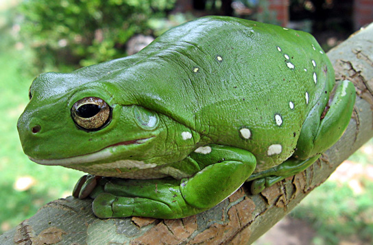
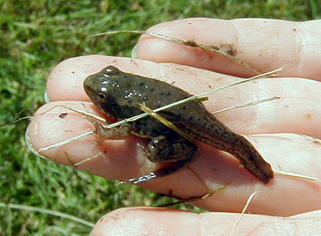

By the end of this section, you will be able to:
* Describe the important difference between the life cycle of amphibians and the life cycles of other vertebrates
* Distinguish between the characteristics of Urodela, Anura, and Apoda
* Describe the evolutionary history of amphibians

Amphibians are vertebrate tetrapods. **Amphibia**{: data-type="term"} includes frogs, salamanders, and caecilians. The term amphibian loosely translates from the Greek as “dual life,” which is a reference to the metamorphosis that many frogs and salamanders undergo and their mixture of aquatic and terrestrial environments in their life cycle. Amphibians evolved during the Devonian period and were the earliest terrestrial tetrapods.

Link to Learning

  
Watch this series of five Animal Planet videos on tetrapod evolution: 

[1: The evolution from fish to earliest tetrapod][1]{: target="_window"}

[2: Fish to Earliest Tetrapod][2]{: target="_window"}

[3: The discovery of coelacanth and *Acanthostega* fossils][3]{: target="_window"}

[4: The number of fingers on “legs”][4]{: target="_window"}

[5: Reconstructing the environment of early tetrapods][5]{: target="_window"}

# Characteristics of Amphibians

As tetrapods, most amphibians are characterized by four well-developed limbs. Some species of salamanders and all caecilians are functionally limbless; their limbs are vestigial. An important characteristic of extant amphibians is a moist, permeable skin that is achieved via mucus glands that keep the skin moist; thus, exchange of oxygen and carbon dioxide with the environment can take place through it (**cutaneous respiration**{: data-type="term"}). Additional characteristics of amphibians include pedicellate teeth—teeth in which the root and crown are calcified, separated by a zone of noncalcified tissue—and a papilla amphibiorum and papilla basilaris, structures of the inner ear that are sensitive to frequencies below and above 10,00 hertz, respectively. Amphibians also have an auricular operculum, which is an extra bone in the ear that transmits sounds to the inner ear. All extant adult amphibians are carnivorous, and some terrestrial amphibians have a sticky tongue that is used to capture prey.

# Evolution of Amphibians

The fossil record provides evidence of the first tetrapods: now-extinct amphibian species dating to nearly 400 million years ago. Evolution of tetrapods from fishes represented a significant change in body plan from one suited to organisms that respired and swam in water, to organisms that breathed air and moved onto land; these changes occurred over a span of 50 million years during the Devonian period. One of the earliest known tetrapods is from the genus ***Acanthostega***{: data-type="term"}. *Acanthostega* was aquatic; fossils show that it had gills similar to fishes. However, it also had four limbs, with the skeletal structure of limbs found in present-day tetrapods, including amphibians. Therefore, it is thought that *Acanthostega* lived in shallow waters and was an intermediate form between lobe-finned fishes and early, fully terrestrial tetrapods. What preceded *Acanthostega*?

In 2006, researchers published news of their discovery of a fossil of a “tetrapod-like fish,” *Tiktaalik roseae*, which seems to be an intermediate form between fishes having fins and tetrapods having limbs ([\[link\]](#fig-ch29_03_01)). *Tiktaalik* likely lived in a shallow water environment about 375 million years ago.[1](#footnote1){: data-type="footnote-number" name="footnote-ref1"}

 "){: #fig-ch29_03_01}

The early tetrapods that moved onto land had access to new nutrient sources and relatively few predators. This led to the widespread distribution of tetrapods during the early Carboniferous period, a period sometimes called the “age of the amphibians.”

# Modern Amphibians

Amphibia comprises an estimated 6,770 extant species that inhabit tropical and temperate regions around the world. Amphibians can be divided into three clades: **Urodela**{: data-type="term"} (“tailed-ones”), the salamanders; **Anura**{: data-type="term"} (“tail-less ones”), the frogs; and **Apoda**{: data-type="term"} (“legless ones”), the caecilians.

## Urodela: Salamanders

**Salamanders**{: data-type="term"} are amphibians that belong to the order Urodela. Living salamanders ([\[link\]](#fig-ch29_03_02)) include approximately 620 species, some of which are aquatic, other terrestrial, and some that live on land only as adults. Adult salamanders usually have a generalized tetrapod body plan with four limbs and a tail. They move by bending their bodies from side to side, called lateral undulation, in a fish-like manner while “walking” their arms and legs fore and aft. It is thought that their gait is similar to that used by early tetrapods. Respiration differs among different species. The majority of salamanders are lungless, and respiration occurs through the skin or through external gills. Some terrestrial salamanders have primitive lungs; a few species have both gills and lungs.

Unlike frogs, virtually all salamanders rely on internal fertilization of the eggs. The only male amphibians that possess copulatory structures are the caecilians, so fertilization among salamanders typically involves an elaborate and often prolonged courtship. Such a courtship allows the successful transfer of sperm from male to female via a spermatophore. Development in many of the most highly evolved salamanders, which are fully terrestrial, occurs during a prolonged egg stage, with the eggs guarded by the mother. During this time, the gilled larval stage is found only within the egg capsule, with the gills being resorbed, and metamorphosis being completed, before hatching. Hatchlings thus resemble tiny adults.

 "){: #fig-ch29_03_02}

Link to Learning

  
View [River Monsters: Fish With Arms and Hands?][6]{: target="_window"} to see a video about an unusually large salamander species.

## Anura: Frogs

**Frogs**{: data-type="term"} are amphibians that belong to the order Anura ([\[link\]](#fig-ch29_03_03)). Anurans are among the most diverse groups of vertebrates, with approximately 5,965 species that occur on all of the continents except Antarctica. Anurans have a body plan that is more specialized for movement. Adult frogs use their hind limbs to jump on land. Frogs have a number of modifications that allow them to avoid predators, including skin that acts as camouflage. Many species of frogs and salamanders also release defensive chemicals from glands in the skin that are poisonous to predators.

 {: #fig-ch29_03_03}

Frog eggs are fertilized externally, and like other amphibians, frogs generally lay their eggs in moist environments. A moist environment is required as eggs lack a shell and thus dehydrate quickly in dry environments. Frogs demonstrate a great diversity of parental behaviors, with some species laying many eggs and exhibiting little parental care, to species that carry eggs and tadpoles on their hind legs or backs. The life cycle of frogs, as other amphibians, consists of two distinct stages: the larval stage followed by metamorphosis to an adult stage. The larval stage of a frog, the **tadpole**{: data-type="term"}, is often a filter-feeding herbivore. Tadpoles usually have gills, a lateral line system, long-finned tails, and lack limbs. At the end of the tadpole stage, frogs undergo metamorphosis into the adult form ([\[link\]](#fig-ch29_03_04)). During this stage, the gills, tail, and lateral line system disappear, and four limbs develop. The jaws become larger and are suited for carnivorous feeding, and the digestive system transforms into the typical short gut of a predator. An eardrum and air-breathing lungs also develop. These changes during metamorphosis allow the larvae to move onto land in the adult stage.

{: #fig-ch29_03_04}

## Apoda: Caecilians

An estimated 185 species comprise **caecilians**{: data-type="term"}, a group of amphibians that belong to the order Apoda. Although they are vertebrates, a complete lack of limbs leads to their resemblance to earthworms in appearance. They are adapted for a soil-burrowing or aquatic lifestyle, and they are nearly blind. These animals are found in the tropics of South America, Africa, and Southern Asia. They have vestigial limbs, evidence that they evolved from a legged ancestor.

Evolution Connection

The Paleozoic Era and the Evolution of Vertebrates The climate and geography of Earth was vastly different during the Paleozoic Era, when vertebrates arose, as compared to today. The Paleozoic spanned from approximately 542 to 251 million years ago. The landmasses on Earth were very different from those of today. Laurentia and Gondwana were continents located near the equator that subsumed much of the current day landmasses in a different configuration ([\[link\]](#fig-ch29_03_05)). At this time, sea levels were very high, probably at a level that hasn’t been reached since. As the Paleozoic progressed, glaciations created a cool global climate, but conditions warmed near the end of the first half of the Paleozoic. During the latter half of the Paleozoic, the landmasses began moving together, with the initial formation of a large northern block called Laurasia. This contained parts of what is now North America, along with Greenland, parts of Europe, and Siberia. Eventually, a single supercontinent, called Pangaea, was formed, starting in the latter third of the Paleozoic. Glaciations then began to affect Pangaea’s climate, affecting the distribution of vertebrate life.

{: #fig-ch29_03_05}

During the early Paleozoic, the amount of carbon dioxide in the atmosphere was much greater than it is today. This may have begun to change later, as land plants became more common. As the roots of land plants began to infiltrate rock and soil began to form, carbon dioxide was drawn out of the atmosphere and became trapped in the rock. This reduced the levels of carbon dioxide and increased the levels of oxygen in the atmosphere, so that by the end of the Paleozoic, atmospheric conditions were similar to those of today.

As plants became more common through the latter half of the Paleozoic, microclimates began to emerge and ecosystems began to change. As plants and ecosystems continued to grow and become more complex, vertebrates moved from the water to land. The presence of shoreline vegetation may have contributed to the movement of vertebrates onto land. One hypothesis suggests that the fins of aquatic vertebrates were used to maneuver through this vegetation, providing a precursor to the movement of fins on land and the development of limbs. The late Paleozoic was a time of diversification of vertebrates, as amniotes emerged and became two different lines that gave rise, on one hand, to mammals, and, on the other hand, to reptiles and birds. Many marine vertebrates became extinct near the end of the Devonian period, which ended about 360 million years ago, and both marine and terrestrial vertebrates were decimated by a mass extinction in the early Permian period about 250 million years ago.

Link to Learning

  
View [Earth’s Paleogeography: Continental Movements Through Time][7]{: target="_window"} to see changes in Earth as life evolved.

# Section Summary

As tetrapods, most amphibians are characterized by four well-developed limbs, although some species of salamanders and all caecilians are limbless. The most important characteristic of extant amphibians is a moist, permeable skin used for cutaneous respiration. The fossil record provides evidence of amphibian species, now extinct, that arose over 400 million years ago as the first tetrapods. Amphibia can be divided into three clades: salamanders (Urodela), frogs (Anura), and caecilians (Apoda). The life cycle of frogs, like the majority of amphibians, consists of two distinct stages: the larval stage and metamorphosis to an adult stage. Some species in all orders bypass a free-living larval stage.

# Review Questions

Which of the following is *not* true of *Acanthostega*?

1.  It was aquatic.
2.  It had gills.
3.  It had four limbs.
4.  It laid shelled eggs.
{: data-number-style="lower-alpha"}

D

Frogs belong to which order?

1.  Anura
2.  Urodela
3.  Caudata
4.  Apoda
{: data-number-style="lower-alpha"}

A

# Free Response

Explain why frogs are restricted to a moist environment.

A moist environment is required, as frog eggs lack a shell and dehydrate quickly in dry environments.

Describe the differences between the larval and adult stages of frogs.

The larval stage of frogs is the tadpole, which is usually a filter-feeding herbivore. Tadpoles usually have gills, a lateral line system, long-finned tails, and lack limbs. In the adult form, the gills and lateral line system disappear, and four limbs develop. The jaws grow larger, suitable for carnivorous feeding, and the digestive system transforms into the typical short gut of a predator. An eardrum and air-breathing lungs also develop.

## Footnotes
{: data-type="footnote-title"}

1.  [1](#footnote-ref1){: data-type="footnote-ref" name="footnote1"} Daeschler, E. B., Shubin, N. H., and Jenkins, F. J. “A Devonian tetrapod-like fish and the evolution of the tetrapod body plan,” *Nature* 440 (2006): 757–763, doi:10.1038/nature04639, http://www.nature.com/nature/journal/v440/n7085/abs/nature04639.html.

## Glossary
{: data-type="glossary-title"}

Acanthostega
: one of the earliest known tetrapods
{: .definition}

Amphibia
: frogs, salamanders, and caecilians
{: .definition}

Anura
: frogs
{: .definition}

Apoda
: caecilians
{: .definition}

caecilian
: legless amphibian that belongs to the clade Apoda
{: .definition}

cutaneous respiration
: gas exchange through the skin
{: .definition}

frog
: tail-less amphibian that belongs to the clade Anura
{: .definition}

salamander
: tailed amphibian that belongs to the clade Urodela
{: .definition}

tadpole
: larval stage of a frog
{: .definition}

Urodela
: salamanders
{: .definition}

[1]: http://openstaxcollege.org/l/tetrapod_evol1
[2]: http://openstaxcollege.org/l/tetrapod_evol2
[3]: http://openstaxcollege.org/l/tetrapod_evol3
[4]: http://openstaxcollege.org/l/tetrapod_evol4
[5]: http://openstaxcollege.org/l/tetrapod_evol5
[6]: http://openstaxcollege.org/l/river_monster
[7]: http://openstaxcollege.org/l/paleogeography
