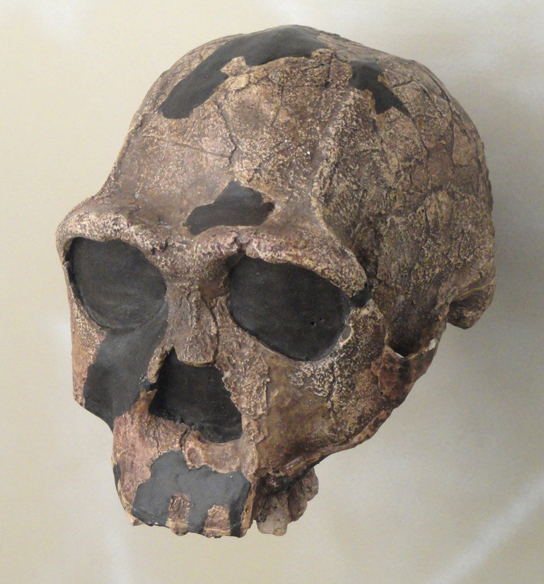
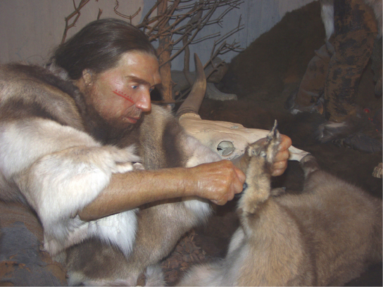

By the end of this section, you will be able to:
* Describe the derived features that distinguish primates from other animals
* Explain why scientists are having difficulty determining the true lines of descent in hominids

Order **Primates**{: data-type="term"} of class Mammalia includes lemurs, tarsiers, monkeys, apes, and humans. Non-human primates live primarily in the tropical or subtropical regions of South America, Africa, and Asia. They range in size from the mouse lemur at 30 grams (1 ounce) to the mountain gorilla at 200 kilograms (441 pounds). The characteristics and evolution of primates is of particular interest to us as it allows us to understand the evolution of our own species.

# Characteristics of Primates

All primate species possess adaptations for climbing trees, as they all descended from tree-dwellers. This arboreal heritage of primates has resulted in hands and feet that are adapted for **brachiation**{: data-type="term"}, or climbing and swinging through trees. These adaptations include, but are not limited to: 1) a rotating shoulder joint, 2) a big toe that is widely separated from the other toes and thumbs, which are widely separated from fingers (except humans), which allow for gripping branches, 3) **stereoscopic vision**{: data-type="term"}, two overlapping fields of vision from the eyes, which allows for the perception of depth and gauging distance. Other characteristics of primates are brains that are larger than those of most other mammals, claws that have been modified into flattened nails, typically only one offspring per pregnancy, and a trend toward holding the body upright.

Order Primates is divided into two groups: prosimians and anthropoids. **Prosimians**{: data-type="term"} include the bush babies of Africa, the lemurs of Madagascar, and the lorises, pottos, and tarsiers of Southeast Asia. **Anthropoids**{: data-type="term"} include monkeys, apes, and humans. In general, prosimians tend to be nocturnal (in contrast to diurnal anthropoids) and exhibit a smaller size and smaller brain than anthropoids.

# Evolution of Primates

The first primate-like mammals are referred to as proto-primates. They were roughly similar to squirrels and tree shrews in size and appearance. The existing fossil evidence (mostly from North Africa) is very fragmented. These proto-primates remain largely mysterious creatures until more fossil evidence becomes available. The oldest known primate-like mammals with a relatively robust fossil record is ***Plesiadapis***{: data-type="term"} (although some researchers do not agree that *Plesiadapis* was a proto-primate). Fossils of this primate have been dated to approximately 55 million years ago. Plesiadapiforms were proto-primates that had some features of the teeth and skeleton in common with true primates. They were found in North America and Europe in the Cenozoic and went extinct by the end of the Eocene.

The first true primates were found in North America, Europe, Asia, and Africa in the Eocene Epoch. These early primates resembled present-day prosimians such as lemurs. Evolutionary changes continued in these early primates, with larger brains and eyes, and smaller muzzles being the trend. By the end of the Eocene Epoch, many of the early prosimian species went extinct due either to cooler temperatures or competition from the first monkeys.

Anthropoid monkeys evolved from prosimians during the Oligocene Epoch. By 40 million years ago, evidence indicates that monkeys were present in the New World (South America) and the Old World (Africa and Asia). New World monkeys are also called **Platyrrhini**{: data-type="term"}—a reference to their broad noses ([\[link\]](#fig-ch29_07_01)). Old World monkeys are called **Catarrhini**{: data-type="term"}—a reference to their narrow noses. There is still quite a bit of uncertainty about the origins of the New World monkeys. At the time the platyrrhines arose, the continents of South American and Africa had drifted apart. Therefore, it is thought that monkeys arose in the Old World and reached the New World either by drifting on log rafts or by crossing land bridges. Due to this reproductive isolation, New World monkeys and Old World monkeys underwent separate adaptive radiations over millions of years. The New World monkeys are all arboreal, whereas Old World monkeys include arboreal and ground-dwelling species.

 "){: #fig-ch29_07_01}

Apes evolved from the catarrhines in Africa midway through the Cenozoic, approximately 25 million years ago. Apes are generally larger than monkeys and they do not possess a tail. All apes are capable of moving through trees, although many species spend most their time on the ground. Apes are more intelligent than monkeys, and they have relatively larger brains proportionate to body size. The apes are divided into two groups. The lesser apes comprise the family **Hylobatidae**{: data-type="term"}, including gibbons and siamangs. The great apes include the genera ***Pan***{: data-type="term"} (chimpanzees and bonobos) ([\[link\]](#fig-ch29_07_02ab)**a**), ***Gorilla***{: data-type="term"} (gorillas), ***Pongo***{: data-type="term"} (orangutans), and ***Homo***{: data-type="term"} (humans) ([\[link\]](#fig-ch29_07_02ab)**b**). The very arboreal gibbons are smaller than the great apes; they have low sexual dimorphism (that is, the genders are not markedly different in size); and they have relatively longer arms used for swinging through trees.

 chimpanzee is one of the great apes. It possesses a relatively large brain and has no tail. (b) All great apes have a similar skeletal structure. (credit a: modification of work by Aaron Logan; credit b: modification of work by Tim Vickers)"){: #fig-ch29_07_02ab}

# Human Evolution

The family Hominidae of order Primates includes the **hominoids**{: data-type="term"}\: the great apes ([\[link\]](#fig-ch29_07_03)). Evidence from the fossil record and from a comparison of human and chimpanzee DNA suggests that humans and chimpanzees diverged from a common hominoid ancestor approximately 6 million years ago. Several species evolved from the evolutionary branch that includes humans, although our species is the only surviving member. The term **hominin**{: data-type="term"} is used to refer to those species that evolved after this split of the primate line, thereby designating species that are more closely related to humans than to chimpanzees. Hominins were predominantly bipedal and include those groups that likely gave rise to our species—including *Australopithecus*,<em> Homo habilis</em>, and *Homo erectus*—and those non-ancestral groups that can be considered “cousins” of modern humans, such as Neanderthals. Determining the true lines of descent in hominins is difficult. In years past, when relatively few hominin fossils had been recovered, some scientists believed that considering them in order, from oldest to youngest, would demonstrate the course of evolution from early hominins to modern humans. In the past several years, however, many new fossils have been found, and it is clear that there was often more than one species alive at any one time and that many of the fossils found (and species named) represent hominin species that died out and are not ancestral to modern humans.

 {: #fig-ch29_07_03}

## Very Early Hominins

Three species of very early hominids have made news in the past few years. The oldest of these, *Sahelanthropus tchadensis*, has been dated to nearly 7 million years ago. There is a single specimen of this genus, a skull that was a surface find in Chad. The fossil, informally called “Toumai,” is a mosaic of primitive and evolved characteristics, and it is unclear how this fossil fits with the picture given by molecular data, namely that the line leading to modern humans and modern chimpanzees apparently bifurcated about 6 million years ago. It is not thought at this time that this species was an ancestor of modern humans.

A second, younger species, *Orrorin tugenensis*, is also a relatively recent discovery, found in 2000. There are several specimens of *Orrorin*. It is not known whether *Orrorin* was a human ancestor, but this possibility has not been ruled out. Some features of *Orrorin* are more similar to those of modern humans than are the australopiths, although <em>Orrorin </em>is much older.

A third genus, *Ardipithecus*, was discovered in the 1990s, and the scientists who discovered the first fossil found that some other scientists did not believe the organism to be a biped (thus, it would not be considered a hominid). In the intervening years, several more specimens of *Ardipithecus*, classified as two different species, demonstrated that the organism was bipedal. Again, the status of this genus as a human ancestor is uncertain.

## Early Hominins: Genus *Australopithecus*

***Australopithecus***{: data-type="term"} (“southern ape”) is a genus of hominin that evolved in eastern Africa approximately 4 million years ago and went extinct about 2 million years ago. This genus is of particular interest to us as it is thought that our genus, genus *Homo*, evolved from *Australopithecus* about 2 million years ago (after likely passing through some transitional states). <em>Australopithecus </em>had a number of characteristics that were more similar to the great apes than to modern humans. For example, sexual dimorphism was more exaggerated than in modern humans. Males were up to 50 percent larger than females, a ratio that is similar to that seen in modern gorillas and orangutans. In contrast, modern human males are approximately 15 to 20 percent larger than females. The brain size of <em>Australopithecus </em>relative to its body mass was also smaller than modern humans and more similar to that seen in the great apes. A key feature that <em>Australopithecus </em>had in common with modern humans was bipedalism, although it is likely that *Australopithecus* also spent time in trees. Hominin footprints, similar to those of modern humans, were found in Laetoli, Tanzania and dated to 3.6 million years ago. They showed that hominins at the time of <em>Australopithecus </em>were walking upright.

There were a number of <em>Australopithecus </em>species, which are often referred to as *australopiths*. <em>Australopithecus anamensis </em>lived about 4.2 million years ago. More is known about another early species, *Australopithecus afarensis*, which lived between 3.9 and 2.9 million years ago. This species demonstrates a trend in human evolution: the reduction of the dentition and jaw in size. *A*.<em> afarensis </em>([\[link\]](#fig-ch29_07_04)) had smaller canines and molars compared to apes, but these were larger than those of modern humans. Its brain size was 380–450 cubic centimeters, approximately the size of a modern chimpanzee brain. It also had **prognathic jaws**{: data-type="term"}, which is a relatively longer jaw than that of modern humans. In the mid-1970s, the fossil of an adult female *A*.<em> afarensis </em>was found in the Afar region of Ethiopia and dated to 3.24 million years ago ([\[link\]](#fig-ch29_07_05)). The fossil, which is informally called “Lucy,” is significant because it was the most complete australopith fossil found, with 40 percent of the skeleton recovered.

 Australopithecus afarensis, an early hominid that lived between two and three million years ago, resembled that of (b) modern humans but was smaller with a sloped forehead and prominent jaw."){: #fig-ch29_07_04}

"){: #fig-ch29_07_05}

<em>Australopithecus africanus </em>lived between 2 and 3 million years ago. It had a slender build and was bipedal, but had robust arm bones and, like other early hominids, may have spent significant time in trees. Its brain was larger than that of *A*.<em> afarensis </em>at 500 cubic centimeters, which is slightly less than one-third the size of modern human brains. Two other species, <em>Australopithecus bahrelghazali </em>and<em> Australopithecus garhi</em>, have been added to the roster of australopiths in recent years.

## A Dead End: Genus *Paranthropus*

The australopiths had a relatively slender build and teeth that were suited for soft food. In the past several years, fossils of hominids of a different body type have been found and dated to approximately 2.5 million years ago. These hominids, of the genus *Paranthropus*, were relatively large and had large grinding teeth. Their molars showed heavy wear, suggesting that they had a coarse and fibrous vegetarian diet as opposed to the partially carnivorous diet of the australopiths. *Paranthropus* includes *Paranthropus* <em>robustus </em>of South Africa, and *Paranthropus* <em>aethiopicus </em>and *Paranthropus* <em>boisei </em>of East Africa. The hominids in this genus went extinct more than 1 million years ago and are not thought to be ancestral to modern humans, but rather members of an evolutionary branch on the hominin tree that left no descendants.

## Early Hominins: Genus *Homo*

The human genus, *Homo*, first appeared between 2.5 and 3 million years ago. For many years, fossils of a species called *H*.<em> habilis </em>were the oldest examples in the genus *Homo*, but in 2010, a new species called *Homo gautengensis* was discovered and may be older. Compared to *A*.<em> africanus</em>,<em> H</em>.<em> habilis </em>had a number of features more similar to modern humans. *H*.<em> habilis </em>had a jaw that was less prognathic than the australopiths and a larger brain, at 600–750 cubic centimeters. However, *H*.<em> habilis </em>retained some features of older hominin species, such as long arms. The name *H*.<em> habilis </em>means “handy man,” which is a reference to the stone tools that have been found with its remains.

Link to Learning

  
Visit this [site][1]{: target="_window"} for a video about Smithsonian paleontologist Briana Pobiner explaining the link between hominin eating of meat and evolutionary trends.

*H*.<em> erectus</em> appeared approximately 1.8 million years ago ([\[link\]](#fig-ch29_07_06)). It is believed to have originated in East Africa and was the first hominin species to migrate out of Africa. Fossils of *H*.<em> erectus </em>have been found in India, China, Java, and Europe, and were known in the past as “Java Man” or “Peking Man.” *H*.<em> erectus </em>had a number of features that were more similar to modern humans than those of *H*.<em> habilis</em>.<em> H</em>.<em> erectus </em>was larger in size than earlier hominins, reaching heights up to 1.85 meters and weighing up to 65 kilograms, which are sizes similar to those of modern humans. Its degree of sexual dimorphism was less than earlier species, with males being 20 to 30 percent larger than females, which is close to the size difference seen in our species. *H*.<em> erectus </em>had a larger brain than earlier species at 775–1,100 cubic centimeters, which compares to the 1,130–1,260 cubic centimeters seen in modern human brains. *H*.<em> erectus</em> also had a nose with downward-facing nostrils similar to modern humans, rather than the forward facing nostrils found in other primates. Longer, downward-facing nostrils allow for the warming of cold air before it enters the lungs and may have been an adaptation to colder climates. Artifacts found with fossils of *H*.<em> erectus </em>suggest that it was the first hominin to use fire, hunt, and have a home base. *H*.<em> erectus </em>is generally thought to have lived until about 50,000 years ago.

 {: #fig-ch29_07_06}

## Humans: *Homo sapiens*

A number of species, sometimes called archaic *Homo sapiens*, apparently evolved from *H*.<em> erectus</em> starting about 500,000 years ago. These species include *Homo heidelbergensis*, *Homo rhodesiensis*, and *Homo neanderthalensis*. These archaic *H*.<em> sapiens</em> had a brain size similar to that of modern humans, averaging 1,200–1,400 cubic centimeters. They differed from modern humans by having a thick skull, a prominent brow ridge, and a receding chin. Some of these species survived until 30,000–10,000 years ago, overlapping with modern humans ([\[link\]](#fig-ch29_07_07)).

 {: #fig-ch29_07_07}

There is considerable debate about the origins of anatomically modern humans or ***Homo sapiens sapiens***{: data-type="term"}. As discussed earlier, *H*.<em> erectus</em> migrated out of Africa and into Asia and Europe in the first major wave of migration about 1.5 million years ago. It is thought that modern humans arose in Africa from *H*.<em> erectus </em>and migrated out of Africa about 100,000 years ago in a second major migration wave. Then, modern humans replaced *H*.<em> erectus </em>species that had migrated into Asia and Europe in the first wave.

This evolutionary timeline is supported by molecular evidence. One approach to studying the origins of modern humans is to examine mitochondrial DNA (mtDNA) from populations around the world. Because a fetus develops from an egg containing its mother’s mitochondria (which have their own, non-nuclear DNA), mtDNA is passed entirely through the maternal line. Mutations in mtDNA can now be used to estimate the timeline of genetic divergence. The resulting evidence suggests that all modern humans have mtDNA inherited from a common ancestor that lived in Africa about 160,000 years ago. Another approach to the molecular understanding of human evolution is to examine the Y chromosome, which is passed from father to son. This evidence suggests that all men today inherited a Y chromosome from a male that lived in Africa about 140,000 years ago.

# Section Summary

All primate species possess adaptations for climbing trees, as they all probably descended from tree-dwellers, although not all species are arboreal. Other characteristics of primates are brains that are larger than those of other mammals, claws that have been modified into flattened nails, typically only one young per pregnancy, stereoscopic vision, and a trend toward holding the body upright. Primates are divided into two groups: prosimians and anthropoids. Monkeys evolved from prosimians during the Oligocene Epoch. Apes evolved from catarrhines in Africa during the Miocene Epoch. Apes are divided into the lesser apes and the greater apes. Hominins include those groups that gave rise to our species, such as *Australopithecus* and *H*.<em> erectus</em>, and those groups that can be considered “cousins” of humans, such as Neanderthals. Fossil evidence shows that hominins at the time of <em>Australopithecus </em>were walking upright, the first evidence of bipedal hominins. A number of species, sometimes called archaic *H*.<em> sapiens</em>, evolved from *H*.<em> erectus</em> approximately 500,000 years ago. There is considerable debate about the origins of anatomically modern humans or *H*.<em> sapiens sapiens</em>.

# Review Questions

Which of the following is *not* an anthropoid?

1.  lemurs
2.  monkeys
3.  apes
4.  humans
{: data-number-style="lower-alpha"}

A

Which of the following is part of a clade believed to have died out, leaving no descendants?

1.  *Paranthropus robustus*
2.  *Australopithecus africanus*
3.  *Homo erectus*
4.  <em> Homo sapiens sapiens</em>
{: data-number-style="lower-alpha"}

A

# Free Response

How did archaic *Homo sapiens* differ from anatomically modern humans?

Archaic *Homo sapiens* differed from modern humans by having a thick skull and a prominent brow ridge, and lacking a prominent chin.

Why is it so difficult to determine the sequence of hominin ancestors that have led to modern *Homo sapiens*?

The immediate ancestors of humans were *Australopithecus*. All people past and present, along with the australopithecines, are hominins. We share the adaptation of being habitually bipedal. The earliest australopithecines very likely did not evolve until 5 million years ago. The primate fossil record for this crucial transitional period leading to australopithecines is still sketchy and somewhat confusing. By about 2.5 million years ago, there were at least two evolutionary lines of hominins descended from early australopithecines.

## Glossary
{: data-type="glossary-title"}

anthropoid
: monkeys, apes, and humans
{: .definition}

Australopithecus
: genus of hominins that evolved in eastern Africa approximately 4 million years ago
{: .definition}

brachiation
: movement through trees branches via suspension from the arms
{: .definition}

Catarrhini
: clade of Old World monkeys
{: .definition}

Gorilla
: genus of gorillas
{: .definition}

hominin
: species that are more closely related to humans than chimpanzees
{: .definition}

hominoid
: pertaining to great apes and humans
{: .definition}

Homo
: genus of humans
{: .definition}

Homo sapiens sapiens
: anatomically modern humans
{: .definition}

Hylobatidae
: family of gibbons
{: .definition}

Pan
: genus of chimpanzees and bonobos
{: .definition}

Platyrrhini
: clade of New World monkeys
{: .definition}

Plesiadapis
: oldest known primate-like mammal
{: .definition}

Pongo
: genus of orangutans
{: .definition}

Primates
: order of lemurs, tarsiers, monkeys, apes, and humans
{: .definition}

prognathic jaw
: long jaw
{: .definition}

prosimian
: division of primates that includes bush babies of Africa, lemurs of Madagascar, and lorises, pottos, and tarsiers of Southeast Asia
{: .definition}

stereoscopic vision
: two overlapping fields of vision from the eyes that produces depth perception
{: .definition}

[1]: http://openstaxcollege.org/l/diet_detective
