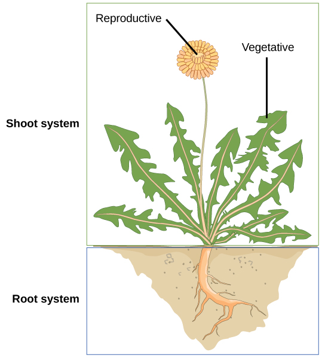

By the end of this section, you will be able to:
* Describe the shoot organ system and the root organ system
* Distinguish between meristematic tissue and permanent tissue
* Identify and describe the three regions where plant growth occurs
* Summarize the roles of dermal tissue, vascular tissue, and ground tissue
* Compare simple plant tissue with complex plant tissue

Like animals, plants contain cells with organelles in which specific metabolic activities take place. Unlike animals, however, plants use energy from sunlight to form sugars during photosynthesis. In addition, plant cells have cell walls, plastids, and a large central vacuole: structures that are not found in animal cells. Each of these cellular structures plays a specific role in plant structure and function.

Link to Learning

 {: data-media-type="image/png"} 
Watch [*Botany Without Borders*][1]{: target="_window"}, a video produced by the Botanical Society of America about the importance of plants.

# Plant Organ Systems

In plants, just as in animals, similar cells working together form a tissue. When different types of tissues work together to perform a unique function, they form an organ; organs working together form organ systems. Vascular plants have two distinct organ systems: a shoot system, and a root system. The **shoot system**{: data-type="term"} consists of two portions: the vegetative (non-reproductive) parts of the plant, such as the leaves and the stems, and the reproductive parts of the plant, which include flowers and fruits. The shoot system generally grows above ground, where it absorbs the light needed for photosynthesis. The **root system**{: data-type="term"}, which supports the plants and absorbs water and minerals, is usually underground. [\[link\]](#fig-ch30_01_01) shows the organ systems of a typical plant.

 {: #fig-ch30_01_01 data-media-type="image/jpg"}

# Plant Tissues

Plants are multicellular eukaryotes with tissue systems made of various cell types that carry out specific functions. Plant tissue systems fall into one of two general types: meristematic tissue, and permanent (or non-meristematic) tissue. Cells of the meristematic tissue are found in **meristems**{: data-type="term"}, which are plant regions of continuous cell division and growth. **Meristematic tissue**{: data-type="term"} cells are either undifferentiated or incompletely differentiated, and they continue to divide and contribute to the growth of the plant. In contrast, **permanent tissue**{: data-type="term"} consists of plant cells that are no longer actively dividing.

Meristematic tissues consist of three types, based on their location in the plant. **Apical meristems**{: data-type="term"} contain meristematic tissue located at the tips of stems and roots, which enable a plant to extend in length. **Lateral meristems**{: data-type="term"} facilitate growth in thickness or girth in a maturing plant. **Intercalary meristems**{: data-type="term"} occur only in monocots, at the bases of leaf blades and at nodes (the areas where leaves attach to a stem). This tissue enables the monocot leaf blade to increase in length from the leaf base; for example, it allows lawn grass leaves to elongate even after repeated mowing.

Meristems produce cells that quickly differentiate, or specialize, and become permanent tissue. Such cells take on specific roles and lose their ability to divide further. They differentiate into three main types: dermal, vascular, and ground tissue. **Dermal tissue**{: data-type="term"} covers and protects the plant, and **vascular tissue**{: data-type="term"} transports water, minerals, and sugars to different parts of the plant. **Ground tissue**{: data-type="term"} serves as a site for photosynthesis, provides a supporting matrix for the vascular tissue, and helps to store water and sugars.

Secondary tissues are either simple (composed of similar cell types) or complex (composed of different cell types). Dermal tissue, for example, is a simple tissue that covers the outer surface of the plant and controls gas exchange. Vascular tissue is an example of a complex tissue, and is made of two specialized conducting tissues: xylem and phloem. Xylem tissue transports water and nutrients from the roots to different parts of the plant, and includes three different cell types: vessel elements and tracheids (both of which conduct water), and xylem parenchyma. Phloem tissue, which transports organic compounds from the site of photosynthesis to other parts of the plant, consists of four different cell types: sieve cells (which conduct photosynthates), companion cells, phloem parenchyma, and phloem fibers. Unlike xylem conducting cells, phloem conducting cells are alive at maturity. The xylem and phloem always lie adjacent to each other ([\[link\]](#fig-ch30_01_02)). In stems, the xylem and the phloem form a structure called a **vascular bundle**{: data-type="term"}; in roots, this is termed the **vascular stele**{: data-type="term"} or **vascular cylinder**{: data-type="term"}.

![Micrograph shows a round plant stem cross section. There are four teardrop-shaped vascular bundles, with the narrow point of the teardrop meeting at a round xylem vessel. Within each teardrop near the center are two to four more xylem vessels. To the outside of the xylem vessels are much smaller phloem cells. The four vascular bundles are encased in ground tissue. Cells of the ground tissue are somewhat larger than phloem. The stem is protected by an outer layer of dermal tissue, made up of several layers of cells smaller than phloem cells.](../resources/Figure_30_01_02f.jpg "This light micrograph shows a cross section of a squash (Curcurbita maxima) stem. Each teardrop-shaped vascular bundle consists of large xylem vessels toward the inside and smaller phloem cells toward the outside.  Xylem cells, which transport water and nutrients from the roots to the rest of the plant, are dead at functional maturity. Phloem cells, which transport sugars and other organic compounds from photosynthetic tissue to the rest of the plant, are living. The vascular bundles are encased in ground tissue and surrounded by dermal tissue. (credit: modification of work by &quot;(biophotos)&quot;/Flickr; scale-bar data from Matt Russell)"){: #fig-ch30_01_02 data-media-type="image/jpg"}

# Section Summary

A vascular plant consists of two organ systems: the shoot system and the root system. The shoot system includes the aboveground vegetative portions (stems and leaves) and reproductive parts (flowers and fruits). The root system supports the plant and is usually underground. A plant is composed of two main types of tissue: meristematic tissue and permanent tissue. Meristematic tissue consists of actively dividing cells found in root and shoot tips. As growth occurs, meristematic tissue differentiates into permanent tissue, which is categorized as either simple or complex. Simple tissues are made up of similar cell types; examples include dermal tissue and ground tissue. Dermal tissue provides the outer covering of the plant. Ground tissue is responsible for photosynthesis; it also supports vascular tissue and may store water and sugars. Complex tissues are made up of different cell types. Vascular tissue, for example, is made up of xylem and phloem cells.

# Review Questions

Plant regions of continuous growth are made up of \_\_\_\_\_\_\_\_.

1.  dermal tissue
2.  vascular tissue
3.  meristematic tissue
4.  permanent tissue
{: data-number-style="lower-alpha"}

C

Which of the following is the major site of photosynthesis?

1.  apical meristem
2.  ground tissue
3.  xylem cells
4.  phloem cells
{: data-number-style="lower-alpha"}

B

# Free Response

What type of meristem is found only in monocots, such as lawn grasses? Explain how this type of meristematic tissue is beneficial in lawn grasses that are mowed each week.

Lawn grasses and other monocots have an intercalary meristem, which is a region of meristematic tissue at the base of the leaf blade. This is beneficial to the plant because it can continue to grow even when the tip of the plant is removed by grazing or mowing.

Which plant part is responsible for transporting water, minerals, and sugars to different parts of the plant? Name the two types of tissue that make up this overall tissue, and explain the role of each.

Vascular tissue transports water, minerals, and sugars throughout the plant. Vascular tissue is made up of xylem tissue and phloem tissue. Xylem tissue transports water and nutrients from the roots upward. Phloem tissue carries sugars from the sites of photosynthesis to the rest of the plant.

[1]: http://openstaxcollege.org/l/botany_wo_bord
