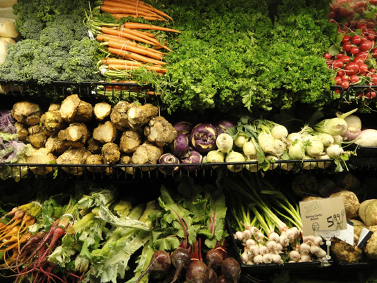

By the end of this section, you will be able to:
* Identify the two types of root systems
* Describe the three zones of the root tip and summarize the role of each zone in root growth
* Describe the structure of the root
* List and describe examples of modified roots

The roots of seed plants have three major functions: anchoring the plant to the soil, absorbing water and minerals and transporting them upwards, and storing the products of photosynthesis. Some roots are modified to absorb moisture and exchange gases. Most roots are underground. Some plants, however, also have **adventitious roots**{: data-type="term"}, which emerge above the ground from the shoot.

# Types of Root Systems

Root systems are mainly of two types ([\[link\]](#fig-ch30_03_01)). Dicots have a tap root system, while monocots have a fibrous root system. A **tap root system**{: data-type="term"} has a main root that grows down vertically, and from which many smaller lateral roots arise. Dandelions are a good example; their tap roots usually break off when trying to pull these weeds, and they can regrow another shoot from the remaining root). A tap root system penetrates deep into the soil. In contrast, a **fibrous root system**{: data-type="term"} is located closer to the soil surface, and forms a dense network of roots that also helps prevent soil erosion (lawn grasses are a good example, as are wheat, rice, and corn). Some plants have a combination of tap roots and fibrous roots. Plants that grow in dry areas often have deep root systems, whereas plants growing in areas with abundant water are likely to have shallower root systems.

  Tap root systems have a main root that grows down, while (b) fibrous root systems consist of many small roots. (credit b: modification of work by &#x201C;Austen Squarepants&#x201D;/Flickr)"){: #fig-ch30_03_01 data-media-type="image/jpg"}

# Root Growth and Anatomy

Root growth begins with seed germination. When the plant embryo emerges from the seed, the radicle of the embryo forms the root system. The tip of the root is protected by the **root cap**{: data-type="term"}, a structure exclusive to roots and unlike any other plant structure. The root cap is continuously replaced because it gets damaged easily as the root pushes through soil. The root tip can be divided into three zones: a zone of cell division, a zone of elongation, and a zone of maturation and differentiation ([\[link\]](#fig-ch30_03_02)). The zone of cell division is closest to the root tip; it is made up of the actively dividing cells of the root meristem. The zone of elongation is where the newly formed cells increase in length, thereby lengthening the root. Beginning at the first root hair is the zone of cell maturation where the root cells begin to differentiate into special cell types. All three zones are in the first centimeter or so of the root tip.

 ![ This lateral section of a root tip is divided into three areas: an upper area of maturation, a middle area of elongation, and a lower area of cell division at the root tip. In the area of maturation, root hairs extend from the main root and cells are large and rectangular. The area of elongation has no root hairs, and the cells are still rectangular, but somewhat smaller. A vascular cylinder runs through the center of the root in the area of maturation and the area of elongation. In the area of cell division the cells are much smaller. Cells within this area are called the apical meristem. A layer of cells called the root cap surrounds the apical meristem.](../resources/Figure_30_03_02.jpg "A longitudinal view of the root reveals the zones of cell division, elongation, and maturation. Cell division occurs in the apical meristem."){: #fig-ch30_03_02 data-media-type="image/jpg"}

The root has an outer layer of cells called the epidermis, which surrounds areas of ground tissue and vascular tissue. The epidermis provides protection and helps in absorption. **Root hairs**{: data-type="term"}, which are extensions of root epidermal cells, increase the surface area of the root, greatly contributing to the absorption of water and minerals.

Inside the root, the ground tissue forms two regions: the cortex and the pith ([\[link\]](#fig-ch30_03_03)). Compared to stems, roots have lots of cortex and little pith. Both regions include cells that store photosynthetic products. The cortex is between the epidermis and the vascular tissue, whereas the pith lies between the vascular tissue and the center of the root.

 ![ The micrograph shows a root cross section. Xylem cells, whose cell walls stain red, are in the middle of the root. Patches of phloem cells, stained blue, are located at the edge of the ring of xylem cells. The pericycle is a ring of cells on the outer edge of the xylem and phloem. Another ring of cells, called the endodermis, surrounds the pericycle. Everything inside the endodermis is the sclera, or vascular tissue. Outside the endermis is the cortex. The parenchyma cells that make up the cortex are the largest in the root. Outside the cortex is the exodermis. The exodermis is about two cells thick and is made up of sclerenchyma cells that stain red. Surrounding the exodermis is the epidermis, which is a single cell layer thick. A couple of root hairs project outward from the root.](../resources/Figure_30_03_03f.jpg "Staining reveals different cell types in this light micrograph of a wheat (Triticum) root cross section. Sclerenchyma cells of the exodermis and xylem cells stain red, and phloem cells stain blue. Other cell types stain black. The stele, or vascular tissue, is the area inside endodermis (indicated by a green ring). Root hairs are visible outside the epidermis. (credit: scale-bar data from Matt Russell)"){: #fig-ch30_03_03 data-media-type="image/jpg"}

The vascular tissue in the root is arranged in the inner portion of the root, which is called the **stele**{: data-type="term"} ([\[link\]](#fig-ch30_03_04)). A layer of cells known as the **endodermis**{: data-type="term"} separates the stele from the ground tissue in the outer portion of the root. The endodermis is exclusive to roots, and serves as a checkpoint for materials entering the root’s vascular system. A waxy substance called suberin is present on the walls of the endodermal cells. This waxy region, known as the **Casparian strip**{: data-type="term"}, forces water and solutes to cross the plasma membranes of endodermal cells instead of slipping between the cells. This ensures that only materials required by the root pass through the endodermis, while toxic substances and pathogens are generally excluded. The outermost cell layer of the root’s vascular tissue is the **pericycle**{: data-type="term"}, an area that can give rise to lateral roots. In dicot roots, the xylem and phloem of the stele are arranged alternately in an X shape, whereas in monocot roots, the vascular tissue is arranged in a ring around the pith.

 ![ The cross section of a dicot root has an X-shaped structure at its center. The X is made up of many xylem cells. Phloem cells fill the space between the X. A ring of cells called the pericycle surrounds the xylem and phloem. The outer edge of the pericycle is called the endodermis. A thick layer of cortex tissue surrounds the pericycle. The cortex is enclosed in a layer of cells called the epidermis. The monocot root is similar to a dicot root, but the center of the root is filled with pith. The phloem cells form a ring around the pith. Round clusters of xylem cells are embedded in the phloem, symmetrically arranged around the central pith. The outer pericycle, endodermis, cortex and epidermis are the same in the dicot root.](../resources/Figure_30_03_04.jpg "In (left) typical dicots, the vascular tissue forms an X shape in the center of the root. In (right) typical monocots, the phloem cells and the larger xylem cells form a characteristic ring around the central pith."){: #fig-ch30_03_04 data-media-type="image/jpg"}

# Root Modifications

Root structures may be modified for specific purposes. For example, some roots are bulbous and store starch. Aerial roots and prop roots are two forms of aboveground roots that provide additional support to anchor the plant. Tap roots, such as carrots, turnips, and beets, are examples of roots that are modified for food storage ([\[link\]](#fig-ch30_03_05)).

 {: #fig-ch30_03_05 data-media-type="image/jpg"}

Epiphytic roots enable a plant to grow on another plant. For example, the epiphytic roots of orchids develop a spongy tissue to absorb moisture. The banyan tree (*Ficus* sp.) begins as an epiphyte, germinating in the branches of a host tree; aerial roots develop from the branches and eventually reach the ground, providing additional support ([\[link\]](#fig-ch30_03_06)). In screwpine (*Pandanus* sp.), a palm-like tree that grows in sandy tropical soils, aboveground prop roots develop from the nodes to provide additional support.

  banyan tree, also known as the strangler fig, begins life as an epiphyte in a host tree. Aerial roots extend to the ground and support the growing plant, which eventually strangles the host tree. The (b) screwpine develops aboveground roots that help support the plant in sandy soils. (credit a: modification of work by &quot;psyberartist&quot;/Flickr; credit b: modification of work by David Eikhoff)"){: #fig-ch30_03_06 data-media-type="image/jpg"}

# Section Summary

Roots help to anchor a plant, absorb water and minerals, and serve as storage sites for food. Taproots and fibrous roots are the two main types of root systems. In a taproot system, a main root grows vertically downward with a few lateral roots. Fibrous root systems arise at the base of the stem, where a cluster of roots forms a dense network that is shallower than a taproot. The growing root tip is protected by a root cap. The root tip has three main zones: a zone of cell division (cells are actively dividing), a zone of elongation (cells increase in length), and a zone of maturation (cells differentiate to form different kinds of cells). Root vascular tissue conducts water, minerals, and sugars. In some habitats, the roots of certain plants may be modified to form aerial roots or epiphytic roots.

# Review Questions

Roots that enable a plant to grow on another plant are called \_\_\_\_\_\_\_\_.

1.  epiphytic roots
2.  prop roots
3.  adventitious roots
4.  aerial roots
{: data-number-style="lower-alpha"}

A

The \_\_\_\_\_\_\_\_ forces selective uptake of minerals in the root.

1.  pericycle
2.  epidermis
3.  endodermis
4.  root cap
{: data-number-style="lower-alpha"}

C

Newly-formed root cells begin to form different cell types in the \_\_\_\_\_\_\_\_.

1.  zone of elongation
2.  zone of maturation
3.  root meristem
4.  zone of cell division
{: data-number-style="lower-alpha"}

B

# Free Response

Compare a tap root system with a fibrous root system. For each type, name a plant that provides a food in the human diet. Which type of root system is found in monocots? Which type of root system is found in dicots?

A tap root system has a single main root that grows down. A fibrous root system forms a dense network of roots that is closer to the soil surface. An example of a tap root system is a carrot. Grasses such as wheat, rice, and corn are examples of fibrous root systems. Fibrous root systems are found in monocots; tap root systems are found in dicots.

What might happen to a root if the pericycle disappeared?

The root would not be able to produce lateral roots.

