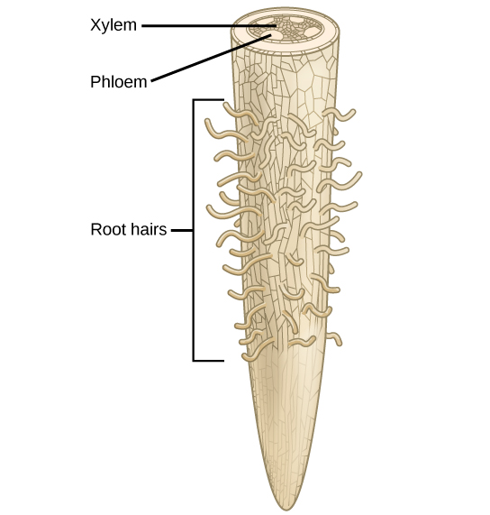
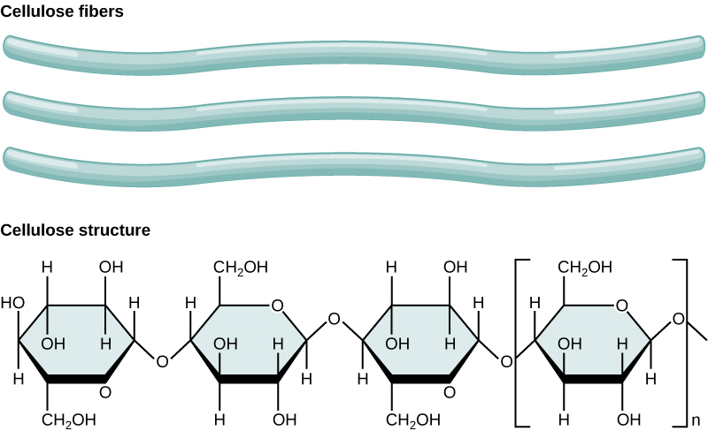

By the end of this section, you will be able to:
* Describe how plants obtain nutrients
* List the elements and compounds required for proper plant nutrition
* Describe an essential nutrient

Plants are unique organisms that can absorb nutrients and water through their root system, as well as carbon dioxide from the atmosphere. Soil quality and climate are the major determinants of plant distribution and growth. The combination of soil nutrients, water, and carbon dioxide, along with sunlight, allows plants to grow.

# The Chemical Composition of Plants

Since plants require nutrients in the form of elements such as carbon and potassium, it is important to understand the chemical composition of plants. The majority of volume in a plant cell is water; it typically comprises 80 to 90 percent of the plant’s total weight. Soil is the water source for land plants, and can be an abundant source of water, even if it appears dry. Plant roots absorb water from the soil through root hairs and transport it up to the leaves through the xylem. As water vapor is lost from the leaves, the process of transpiration and the polarity of water molecules (which enables them to form hydrogen bonds) draws more water from the roots up through the plant to the leaves ([\[link\]](#fig-ch31_01_01)). Plants need water to support cell structure, for metabolic functions, to carry nutrients, and for photosynthesis.

 {: #fig-ch31_01_01 data-media-type="image/jpg"}

Plant cells need essential substances, collectively called nutrients, to sustain life. Plant nutrients may be composed of either organic or inorganic compounds. An **organic compound**{: data-type="term"} is a chemical compound that contains carbon, such as carbon dioxide obtained from the atmosphere. Carbon that was obtained from atmospheric CO2 composes the majority of the dry mass within most plants. An **inorganic compound**{: data-type="term"} does not contain carbon and is not part of, or produced by, a living organism. Inorganic substances, which form the majority of the soil solution, are commonly called minerals: those required by plants include nitrogen (N) and potassium (K) for structure and regulation.

# Essential Nutrients

Plants require only light, water and about 20 elements to support all their biochemical needs: these 20 elements are called essential nutrients ([\[link\]](#tab-ch31_01_01)). For an element to be regarded as **essential**{: data-type="term"}, three criteria are required: 1) a plant cannot complete its life cycle without the element; 2) no other element can perform the function of the element; and 3) the element is directly involved in plant nutrition.

<table id="tab-ch31_01_01" summary="table 31.01.01"><thead>
<tr>
<th colspan="2">Essential Elements for Plant Growth</th>
</tr>
<tr>
<th>Macronutrients</th>
<th>Micronutrients</th>
</tr>
</thead><tbody> 
<tr>
<td>Carbon (C)</td>
<td>Iron (Fe)</td>
</tr>
<tr>
<td>Hydrogen (H)</td>
<td>Manganese (Mn)</td>
</tr>
<tr>
<td>Oxygen (O)</td>
<td>Boron (B)</td>
</tr>
<tr>
<td>Nitrogen (N)</td>
<td>Molybdenum (Mo)</td>
</tr>
<tr>
<td>Phosphorus (P)</td>
<td>Copper (Cu)</td>
</tr>
<tr>
<td>Potassium (K)</td>
<td>Zinc (Zn)</td>
</tr>
<tr>
<td>Calcium (Ca)</td>
<td>Chlorine (Cl)</td>
</tr>
<tr>
<td>Magnesium (Mg)</td>
<td>Nickel (Ni)</td>
</tr>
<tr>
<td>Sulfur (S)</td>
<td>Cobalt (Co)</td>
</tr>
<tr>
<td />
<td>Sodium (S)</td>
</tr>
<tr>
<td />
<td>Silicon (Si)</td>
</tr>
</tbody></table>

## Macronutrients and Micronutrients

The essential elements can be divided into two groups: macronutrients and micronutrients. Nutrients that plants require in larger amounts are called **macronutrients**{: data-type="term"}. About half of the essential elements are considered macronutrients: carbon, hydrogen, oxygen, nitrogen, phosphorus, potassium, calcium, magnesium and sulfur. The first of these macronutrients, carbon (C), is required to form carbohydrates, proteins, nucleic acids, and many other compounds; it is therefore present in all macromolecules. On average, the dry weight (excluding water) of a cell is 50 percent carbon. As shown in [\[link\]](#fig-ch31_01_02), carbon is a key part of plant biomolecules.

 {: #fig-ch31_01_02 data-media-type="image/jpg"}

The next most abundant element in plant cells is nitrogen (N); it is part of proteins and nucleic acids. Nitrogen is also used in the synthesis of some vitamins. Hydrogen and oxygen are macronutrients that are part of many organic compounds, and also form water. Oxygen is necessary for cellular respiration; plants use oxygen to store energy in the form of ATP. Phosphorus (P), another macromolecule, is necessary to synthesize nucleic acids and phospholipids. As part of ATP, phosphorus enables food energy to be converted into chemical energy through oxidative phosphorylation. Likewise, light energy is converted into chemical energy during photophosphorylation in photosynthesis, and into chemical energy to be extracted during respiration. Sulfur is part of certain amino acids, such as cysteine and methionine, and is present in several coenzymes. Sulfur also plays a role in photosynthesis as part of the electron transport chain, where hydrogen gradients play a key role in the conversion of light energy into ATP. Potassium (K) is important because of its role in regulating stomatal opening and closing. As the openings for gas exchange, stomata help maintain a healthy water balance; a potassium ion pump supports this process.

Magnesium (Mg) and calcium (Ca) are also important macronutrients. The role of calcium is twofold: to regulate nutrient transport, and to support many enzyme functions. Magnesium is important to the photosynthetic process. These minerals, along with the micronutrients, which are described below, also contribute to the plant’s ionic balance.

In addition to macronutrients, organisms require various elements in small amounts. These **micronutrients**{: data-type="term"}, or trace elements, are present in very small quantities. They include boron (B), chlorine (Cl), manganese (Mn), iron (Fe), zinc (Zn), copper (Cu), molybdenum (Mo), nickel (Ni), silicon (Si), and sodium (Na).

Deficiencies in any of these nutrients—particularly the macronutrients—can adversely affect plant growth ([\[link\]](#fig-ch31_01_03). Depending on the specific nutrient, a lack can cause stunted growth, slow growth, or chlorosis (yellowing of the leaves). Extreme deficiencies may result in leaves showing signs of cell death.

Link to Learning

 {: data-media-type="image/png"} 
Visit this [website][1]{: target="_window"} to participate in an interactive experiment on plant nutrient deficiencies. You can adjust the amounts of N, P, K, Ca, Mg, and Fe that plants receive . . . and see what happens.

 grape tomato suffers from blossom end rot caused by calcium deficiency. The yellowing in this (b) Frangula alnus results from magnesium deficiency. Inadequate magnesium also leads to (c) intervenal chlorosis, seen here in a sweetgum leaf. This (d) palm is affected by potassium deficiency. (credit c: modification of work by Jim Conrad; credit d: modification of work by Malcolm Manners)"){: #fig-ch31_01_03 data-media-type="image/jpg"}

Everyday Connection

### Hydroponics

Hydroponics is a method of growing plants in a water-nutrient solution instead of soil. Since its advent, hydroponics has developed into a growing process that researchers often use. Scientists who are interested in studying plant nutrient deficiencies can use hydroponics to study the effects of different nutrient combinations under strictly controlled conditions. Hydroponics has also developed as a way to grow flowers, vegetables, and other crops in greenhouse environments. You might find hydroponically grown produce at your local grocery store. Today, many lettuces and tomatoes in your market have been hydroponically grown.

# Section Summary

Plants can absorb inorganic nutrients and water through their root system, and carbon dioxide from the environment. The combination of organic compounds, along with water, carbon dioxide, and sunlight, produce the energy that allows plants to grow. Inorganic compounds form the majority of the soil solution. Plants access water though the soil. Water is absorbed by the plant root, transports nutrients throughout the plant, and maintains the structure of the plant. Essential elements are indispensable elements for plant growth. They are divided into macronutrients and micronutrients. The macronutrients plants require are carbon, nitrogen, hydrogen, oxygen, phosphorus, potassium, calcium, magnesium, and sulfur. Important micronutrients include iron, manganese, boron, molybdenum, copper, zinc, chlorine, nickel, cobalt, silicon and sodium.

# Review Questions

For an element to be regarded as essential, all of the following criteria must be met, except:

1.  No other element can perform the function.
2.  The element is directly involved in plant nutrition.
3.  The element is inorganic.
4.  The plant cannot complete its lifecycle without the element.
{: data-number-style="lower-alpha"}

C

The nutrient that is part of carbohydrates, proteins, and nucleic acids, and that forms biomolecules, is \_\_\_\_\_\_\_\_.

1.  nitrogen
2.  carbon
3.  magnesium
4.  iron
{: data-number-style="lower-alpha"}

B

Most \_\_\_\_\_\_\_\_ are necessary for enzyme function.

1.  micronutrients
2.  macronutrients
3.  biomolecules
4.  essential nutrients
{: data-number-style="lower-alpha"}

A

What is the main water source for land plants?

1.  rain
2.  soil
3.  biomolecules
4.  essential nutrients
{: data-number-style="lower-alpha"}

B

# Free Response

What type of plant problems result from nitrogen and calcium deficiencies?

Deficiencies in these nutrients could result in stunted growth, slow growth, and chlorosis.

What did the van Helmont experiment show?

van Helmont showed that plants do not consume soil, which is correct. He also thought that plant growth and increased weight resulted from the intake of water, a conclusion that has since been disproven.

List two essential macronutrients and two essential nutrients.

Answers may vary. Essential macronutrients include carbon, hydrogen, oxygen, nitrogen, phosphorus, potassium, calcium, magnesium, and sulfur. Essential micronutrients include iron, manganese, boron, molybdenum, copper, zinc, chlorine, nickel, cobalt, sodium, and silicon.

[1]: http://openstaxcollege.org/l/plant_mineral
