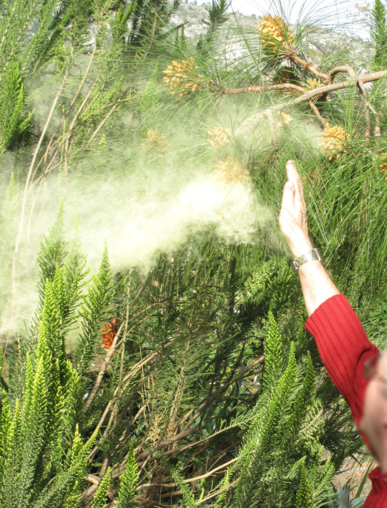
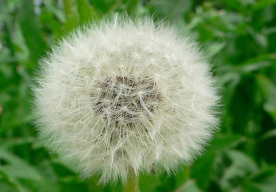
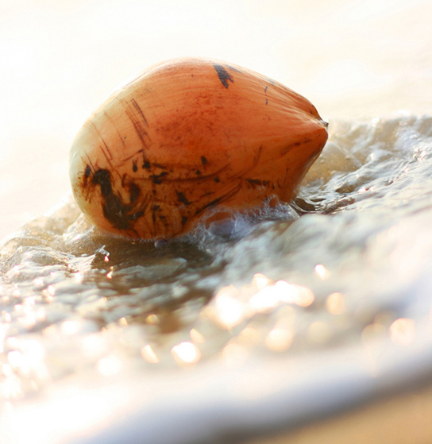
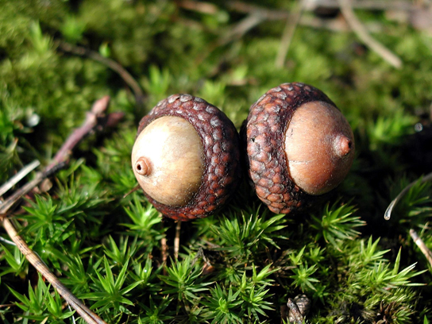

By the end of this section, you will be able to:
* Describe what must occur for plant fertilization
* Explain cross-pollination and the ways in which it takes place
* Describe the process that leads to the development of a seed
* Define double fertilization

In angiosperms, **pollination**{: data-type="term"} is defined as the placement or transfer of pollen from the anther to the stigma of the same flower or another flower. In gymnosperms, pollination involves pollen transfer from the male cone to the female cone. Upon transfer, the pollen germinates to form the pollen tube and the sperm for fertilizing the egg. Pollination has been well studied since the time of Gregor Mendel. Mendel successfully carried out self- as well as cross-pollination in garden peas while studying how characteristics were passed on from one generation to the next. Today’s crops are a result of plant breeding, which employs artificial selection to produce the present-day cultivars. A case in point is today\'s corn, which is a result of years of breeding that started with its ancestor, teosinte. The teosinte that the ancient Mayans originally began cultivating had tiny seeds—vastly different from today’s relatively giant ears of corn. Interestingly, though these two plants appear to be entirely different, the genetic difference between them is miniscule.

Pollination takes two forms: self-pollination and cross-pollination. **Self-pollination**{: data-type="term"} occurs when the pollen from the anther is deposited on the stigma of the same flower, or another flower on the same plant. **Cross-pollination**{: data-type="term"} is the transfer of pollen from the anther of one flower to the stigma of another flower on a different individual of the same species. Self-pollination occurs in flowers where the stamen and carpel mature at the same time, and are positioned so that the pollen can land on the flower’s stigma. This method of pollination does not require an investment from the plant to provide nectar and pollen as food for pollinators.

Link to Learning

  
Explore this [interactive website][1]{: target="_window"} to review self-pollination and cross-pollination.

Living species are designed to ensure survival of their progeny; those that fail become extinct. Genetic diversity is therefore required so that in changing environmental or stress conditions, some of the progeny can survive. Self-pollination leads to the production of plants with less genetic diversity, since genetic material from the same plant is used to form gametes, and eventually, the zygote. In contrast, cross-pollination—or out-crossing—leads to greater genetic diversity because the microgametophyte and megagametophyte are derived from different plants.

Because cross-pollination allows for more genetic diversity, plants have developed many ways to avoid self-pollination. In some species, the pollen and the ovary mature at different times. These flowers make self-pollination nearly impossible. By the time pollen matures and has been shed, the stigma of this flower is mature and can only be pollinated by pollen from another flower. Some flowers have developed physical features that prevent self-pollination. The primrose is one such flower. Primroses have evolved two flower types with differences in anther and stigma length: the pin-eyed flower has anthers positioned at the pollen tube’s halfway point, and the thrum-eyed flower’s stigma is likewise located at the halfway point. Insects easily cross-pollinate while seeking the nectar at the bottom of the pollen tube. This phenomenon is also known as heterostyly. Many plants, such as cucumber, have male and female flowers located on different parts of the plant, thus making self-pollination difficult. In yet other species, the male and female flowers are borne on different plants (dioecious). All of these are barriers to self-pollination; therefore, the plants depend on pollinators to transfer pollen. The majority of pollinators are biotic agents such as insects (like bees, flies, and butterflies), bats, birds, and other animals. Other plant species are pollinated by abiotic agents, such as wind and water.

Everyday Connection

Incompatibility Genes in FlowersIn recent decades, incompatibility genes—which prevent pollen from germinating or growing into the stigma of a flower—have been discovered in many angiosperm species. If plants do not have compatible genes, the pollen tube stops growing. Self-incompatibility is controlled by the S (sterility) locus. Pollen tubes have to grow through the tissue of the stigma and style before they can enter the ovule. The carpel is selective in the type of pollen it allows to grow inside. The interaction is primarily between the pollen and the stigma epidermal cells. In some plants, like cabbage, the pollen is rejected at the surface of the stigma, and the unwanted pollen does not germinate. In other plants, pollen tube germination is arrested after growing one-third the length of the style, leading to pollen tube death. Pollen tube death is due either to apoptosis (programmed cell death) or to degradation of pollen tube RNA. The degradation results from the activity of a ribonuclease encoded by the S locus. The ribonuclease is secreted from the cells of the style in the extracellular matrix, which lies alongside the growing pollen tube.

In summary, self-incompatibility is a mechanism that prevents self-fertilization in many flowering plant species. The working of this self-incompatibility mechanism has important consequences for plant breeders because it inhibits the production of inbred and hybrid plants.

# Pollination by Insects

Bees are perhaps the most important pollinator of many garden plants and most commercial fruit trees ([\[link\]](#fig-ch32_02_01)). The most common species of bees are bumblebees and honeybees. Since bees cannot see the color red, bee-pollinated flowers usually have shades of blue, yellow, or other colors. Bees collect energy-rich pollen or nectar for their survival and energy needs. They visit flowers that are open during the day, are brightly colored, have a strong aroma or scent, and have a tubular shape, typically with the presence of a nectar guide. A **nectar guide**{: data-type="term"} includes regions on the flower petals that are visible only to bees, and not to humans; it helps to guide bees to the center of the flower, thus making the pollination process more efficient. The pollen sticks to the bees’ fuzzy hair, and when the bee visits another flower, some of the pollen is transferred to the second flower. Recently, there have been many reports about the declining population of honeybees. Many flowers will remain unpollinated and not bear seed if honeybees disappear. The impact on commercial fruit growers could be devastating.

 "){: #fig-ch32_02_01}

Many flies are attracted to flowers that have a decaying smell or an odor of rotting flesh. These flowers, which produce nectar, usually have dull colors, such as brown or purple. They are found on the corpse flower or voodoo lily (*Amorphophallus*), dragon arum (*Dracunculus*), and carrion flower (*Stapleia*, *Rafflesia*). The nectar provides energy, whereas the pollen provides protein. Wasps are also important insect pollinators, and pollinate many species of figs.

Butterflies, such as the monarch, pollinate many garden flowers and wildflowers, which usually occur in clusters. These flowers are brightly colored, have a strong fragrance, are open during the day, and have nectar guides to make access to nectar easier. The pollen is picked up and carried on the butterfly’s limbs. Moths, on the other hand, pollinate flowers during the late afternoon and night. The flowers pollinated by moths are pale or white and are flat, enabling the moths to land. One well-studied example of a moth-pollinated plant is the yucca plant, which is pollinated by the yucca moth. The shape of the flower and moth have adapted in such a way as to allow successful pollination. The moth deposits pollen on the sticky stigma for fertilization to occur later. The female moth also deposits eggs into the ovary. As the eggs develop into larvae, they obtain food from the flower and developing seeds. Thus, both the insect and flower benefit from each other in this symbiotic relationship. The corn earworm moth and Gaura plant have a similar relationship ([\[link\]](#fig-ch32_02_02)).

"){: #fig-ch32_02_02}

# Pollination by Bats

In the tropics and deserts, bats are often the pollinators of nocturnal flowers such as agave, guava, and morning glory. The flowers are usually large and white or pale-colored; thus, they can be distinguished from the dark surroundings at night. The flowers have a strong, fruity, or musky fragrance and produce large amounts of nectar. They are naturally large and wide-mouthed to accommodate the head of the bat. As the bats seek the nectar, their faces and heads become covered with pollen, which is then transferred to the next flower.

# Pollination by Birds

Many species of small birds, such as the hummingbird ([\[link\]](#fig-ch32_02_03)) and sun birds, are pollinators for plants such as orchids and other wildflowers. Flowers visited by birds are usually sturdy and are oriented in such a way as to allow the birds to stay near the flower without getting their wings entangled in the nearby flowers. The flower typically has a curved, tubular shape, which allows access for the bird’s beak. Brightly colored, odorless flowers that are open during the day are pollinated by birds. As a bird seeks energy-rich nectar, pollen is deposited on the bird’s head and neck and is then transferred to the next flower it visits. Botanists have been known to determine the range of extinct plants by collecting and identifying pollen from 200-year-old bird specimens from the same site.

 "){: #fig-ch32_02_03}

# Pollination by Wind

Most species of conifers, and many angiosperms, such as grasses, maples and oaks, are pollinated by wind. Pine cones are brown and unscented, while the flowers of wind-pollinated angiosperm species are usually green, small, may have small or no petals, and produce large amounts of pollen. Unlike the typical insect-pollinated flowers, flowers adapted to pollination by wind do not produce nectar or scent. In wind-pollinated species, the microsporangia hang out of the flower, and, as the wind blows, the lightweight pollen is carried with it ([\[link\]](#fig-ch32_02_04)). The flowers usually emerge early in the spring, before the leaves, so that the leaves do not block the movement of the wind. The pollen is deposited on the exposed feathery stigma of the flower ([\[link\]](#fig-ch32_02_05)).

 {: #fig-ch32_02_04}

 and female (b) catkins are from the goat willow tree (Salix caprea). Note how both structures are light and feathery to better disperse and catch the wind-blown pollen."){: #fig-ch32_02_05}

# Pollination by Water

Some weeds, such as Australian sea grass and pond weeds, are pollinated by water. The pollen floats on water, and when it comes into contact with the flower, it is deposited inside the flower.

Evolution Connection

Pollination by DeceptionOrchids are highly valued flowers, with many rare varieties ([\[link\]](#fig-ch32_02_06)). They grow in a range of specific habitats, mainly in the tropics of Asia, South America, and Central America. At least 25,000 species of orchids have been identified.

. (credit: David Evans)"){: #fig-ch32_02_06}

Flowers often attract pollinators with food rewards, in the form of nectar. However, some species of orchid are an exception to this standard: they have evolved different ways to attract the desired pollinators. They use a method known as food deception, in which bright colors and perfumes are offered, but no food. *Anacamptis morio*, commonly known as the green-winged orchid, bears bright purple flowers and emits a strong scent. The bumblebee, its main pollinator, is attracted to the flower because of the strong scent—which usually indicates food for a bee—and in the process, picks up the pollen to be transported to another flower.

Other orchids use sexual deception. *Chiloglottis trapeziformis* emits a compound that smells the same as the pheromone emitted by a female wasp to attract male wasps. The male wasp is attracted to the scent, lands on the orchid flower, and in the process, transfers pollen. Some orchids, like the Australian hammer orchid, use scent as well as visual trickery in yet another sexual deception strategy to attract wasps. The flower of this orchid mimics the appearance of a female wasp and emits a pheromone. The male wasp tries to mate with what appears to be a female wasp, and in the process, picks up pollen, which it then transfers to the next counterfeit mate.

# Double Fertilization

After pollen is deposited on the stigma, it must germinate and grow through the style to reach the ovule. The microspores, or the pollen, contain two cells: the pollen tube cell and the generative cell. The pollen tube cell grows into a pollen tube through which the generative cell travels. The germination of the pollen tube requires water, oxygen, and certain chemical signals. As it travels through the style to reach the embryo sac, the pollen tube’s growth is supported by the tissues of the style. In the meantime, if the generative cell has not already split into two cells, it now divides to form two sperm cells. The pollen tube is guided by the chemicals secreted by the synergids present in the embryo sac, and it enters the ovule sac through the micropyle. Of the two sperm cells, one sperm fertilizes the egg cell, forming a diploid zygote; the other sperm fuses with the two polar nuclei, forming a triploid cell that develops into the **endosperm**{: data-type="term"}. Together, these two fertilization events in angiosperms are known as **double fertilization**{: data-type="term"} ([\[link\]](#fig-ch32_02_07)). After fertilization is complete, no other sperm can enter. The fertilized ovule forms the seed, whereas the tissues of the ovary become the fruit, usually enveloping the seed.

 ![ Illustration shows the gynoecium of a flowering plant. A pollen grain adheres to the stigma. The pollen contains two cells: a generative cell and a tube cell. The pollen tube cell grows into the style. The generative cell travels inside the pollen tube. It divides to form two sperm. The pollen tube penetrates an opening in the ovule called a micropyle. One of the sperm fertilizes the egg to form the zygote. The other sperm fertilizes two polar nuclei to form a triploid endosperm, which becomes a food source for the growing embryo.](../resources/Figure_32_02_07.jpg "In angiosperms, one sperm fertilizes the egg to form the 2n zygote, and the other sperm fertilizes the central cell to form the 3n endosperm. This is called a double fertilization."){: #fig-ch32_02_07}

After fertilization, the zygote divides to form two cells: the upper cell, or terminal cell, and the lower, or basal, cell. The division of the basal cell gives rise to the **suspensor**{: data-type="term"}, which eventually makes connection with the maternal tissue. The suspensor provides a route for nutrition to be transported from the mother plant to the growing embryo. The terminal cell also divides, giving rise to a globular-shaped proembryo ([\[link\]](#fig-ch32_02_08)**a**). In dicots (eudicots), the developing embryo has a heart shape, due to the presence of the two rudimentary **cotyledons**{: data-type="term"} ([\[link\]](#fig-ch32_02_08)**b**). In non-endospermic dicots, such as *Capsella bursa*, the endosperm develops initially, but is then digested, and the food reserves are moved into the two cotyledons. As the embryo and cotyledons enlarge, they run out of room inside the developing seed, and are forced to bend ([\[link\]](#fig-ch32_02_08)**c**). Ultimately, the embryo and cotyledons fill the seed ([\[link\]](#fig-ch32_02_08)**d**), and the seed is ready for dispersal. Embryonic development is suspended after some time, and growth is resumed only when the seed germinates. The developing seedling will rely on the food reserves stored in the cotyledons until the first set of leaves begin photosynthesis.

![ Micrograph A shows a seed in the initial stage of development. The proembryo grows inside an oval-shaped ovary with an opening at the bottom. The basal cell is at the bottom ovary, and suspensor cells are above it. The globular proembryo grows at the top of the suspensor. Micrograph B shows the second stage of development, in which the embryo grows into a heart-shape. Each bump in the heart is a cotyledon. Micrograph C shows the third stage of development. The embryo has grown longer and wider, and the cotyledons have grown into long extensions resembling bunny ears bent so they fit inside the seed. Cells inside the embryo grow in vertical columns. The central column, between the two ears, is called the embryonic axis. Micrograph D shows the fourth stage of development. The bunny ears are now as large as the main part of the embryo, and completely folded over. The base of the embryo is the root meristem, and the space between the two ears is the shoot meristem. A seed coat has formed over the ovary.](../resources/Figure_32_02_08abcd_a.jpg "Shown are the stages of embryo development in the ovule of a shepherd&#x2019;s purse (Capsella bursa). After fertilization, the zygote divides to form an upper terminal cell and a lower basal cell. (a) In the first stage of development, the terminal cell divides, forming a globular pro-embryo. The basal cell also divides, giving rise to the suspensor. (b) In the second stage, the developing embryo has a heart shape due to the presence of cotyledons. (c) In the third stage, the growing embryo runs out of room and starts to bend. (d) Eventually, it completely fills the seed. (credit: modification of work by Robert R. Wise; scale-bar data from Matt Russell)"){: #fig-ch32_02_08}

## Development of the Seed

The mature ovule develops into the seed. A typical seed contains a seed coat, cotyledons, endosperm, and a single embryo ([\[link\]](#fig-ch32_02_09)).

Art Connection

![ Illustration shows the structure of a monocot corn seed and a dicot bean seed. The lower half of the monocot seed contains the cotyledon, and the upper half contains the endosperm. The dicot seed does not contain an endosperm, but has two cotyledons, one on each side of the bean. Both the monocot and the dicot seed have an epicotyl that is attached to a hypocotyl. The hypocotyl terminates in a radicle. In the dicot, the epicotyl is in the upper middle part of the seed. In the monocot, the epicotyl is in the lower cotyledon. Both the monocot and dicot seed are surrounded by a seed coat.](../resources/Figure_32_02_09.png "The structures of dicot and monocot seeds are shown. Dicots (left) have two cotyledons. Monocots, such as corn (right), have one cotyledon, called the scutellum; it channels nutrition to the growing embryo. Both monocot and dicot embryos have a plumule that forms the leaves, a hypocotyl that forms the stem, and a radicle that forms the root. The embryonic axis comprises everything between the plumule and the radicle, not including the cotyledon(s)."){: #fig-ch32_02_09}

What is of the following statements is true?

1.  Both monocots and dicots have an endosperm.
2.  The radicle develops into the root.
3.  The plumule is part of the epicotyl
4.  The endosperm is part of the embryo.
{: data-number-style="lower-alpha"}

<!-- <para><link target-id="fig-ch32_02_09" document=""/> B</para> -->

The storage of food reserves in angiosperm seeds differs between monocots and dicots. In monocots, such as corn and wheat, the single cotyledon is called a **scutellum**{: data-type="term"}; the scutellum is connected directly to the embryo via vascular tissue (xylem and phloem). Food reserves are stored in the large endosperm. Upon germination, enzymes are secreted by the **aleurone**{: data-type="term"}, a single layer of cells just inside the seed coat that surrounds the endosperm and embryo. The enzymes degrade the stored carbohydrates, proteins and lipids, the products of which are absorbed by the scutellum and transported via a vasculature strand to the developing embryo. Therefore, the scutellum can be seen to be an absorptive organ, not a storage organ.

The two cotyledons in the dicot seed also have vascular connections to the embryo. In **endospermic dicots**{: data-type="term"}, the food reserves are stored in the endosperm. During germination, the two cotyledons therefore act as absorptive organs to take up the enzymatically released food reserves, much like in monocots (monocots, by definition, also have endospermic seeds). Tobacco (*Nicotiana tabaccum*), tomato (*Solanum lycopersicum*), and pepper (*Capsicum annuum*) are examples of endospermic dicots. In **non-endospermic dicots**{: data-type="term"}, the triploid endosperm develops normally following double fertilization, but the endosperm food reserves are quickly remobilized and moved into the developing cotyledon for storage. The two halves of a peanut seed (*Arachis hypogaea*) and the split peas (*Pisum sativum*) of split pea soup are individual cotyledons loaded with food reserves.

The seed, along with the ovule, is protected by a seed coat that is formed from the integuments of the ovule sac. In dicots, the seed coat is further divided into an outer coat known as the **testa**{: data-type="term"} and inner coat known as the **tegmen**{: data-type="term"}.

The embryonic axis consists of three parts: the plumule, the radicle, and the hypocotyl. The portion of the embryo between the cotyledon attachment point and the radicle is known as the **hypocotyl**{: data-type="term"} (hypocotyl means “below the cotyledons”). The embryonic axis terminates in a **radicle**{: data-type="term"} (the embryonic root), which is the region from which the root will develop. In dicots, the hypocotyls extend above ground, giving rise to the stem of the plant. In monocots, the hypocotyl does not show above ground because monocots do not exhibit stem elongation. The part of the embryonic axis that projects above the cotyledons is known as the **epicotyl**{: data-type="term"}. The **plumule**{: data-type="term"} is composed of the epicotyl, young leaves, and the shoot apical meristem.

Upon germination in dicot seeds, the epicotyl is shaped like a hook with the plumule pointing downwards. This shape is called the plumule hook, and it persists as long as germination proceeds in the dark. Therefore, as the epicotyl pushes through the tough and abrasive soil, the plumule is protected from damage. Upon exposure to light, the hypocotyl hook straightens out, the young foliage leaves face the sun and expand, and the epicotyl continues to elongate. During this time, the radicle is also growing and producing the primary root. As it grows downward to form the tap root, lateral roots branch off to all sides, producing the typical dicot tap root system.

In monocot seeds ([\[link\]](#fig-ch32_02_10)), the testa and tegmen of the seed coat are fused. As the seed germinates, the primary root emerges, protected by the root-tip covering: the **coleorhiza**{: data-type="term"}. Next, the primary shoot emerges, protected by the **coleoptile**{: data-type="term"}\: the covering of the shoot tip. Upon exposure to light (i.e. when the plumule has exited the soil and the protective coleoptile is no longer needed), elongation of the coleoptile ceases and the leaves expand and unfold. At the other end of the embryonic axis, the primary root soon dies, while other, adventitious roots (roots that do not arise from the usual place – i.e. the root) emerge from the base of the stem. This gives the monocot a fibrous root system.

 {: #fig-ch32_02_10}

## Seed Germination

Many mature seeds enter a period of inactivity, or extremely low metabolic activity: a process known as **dormancy**{: data-type="term"}, which may last for months, years or even centuries. Dormancy helps keep seeds viable during unfavorable conditions. Upon a return to favorable conditions, seed germination takes place. Favorable conditions could be as diverse as moisture, light, cold, fire, or chemical treatments. After heavy rains, many new seedlings emerge. Forest fires also lead to the emergence of new seedlings. Some seeds require **vernalization**{: data-type="term"} (cold treatment) before they can germinate. This guarantees that seeds produced by plants in temperate climates will not germinate until the spring. Plants growing in hot climates may have seeds that need a heat treatment in order to germinate, to avoid germination in the hot, dry summers. In many seeds, the presence of a thick seed coat retards the ability to germinate. **Scarification**{: data-type="term"}, which includes mechanical or chemical processes to soften the seed coat, is often employed before germination. Presoaking in hot water, or passing through an acid environment, such as an animal’s digestive tract, may also be employed.

Depending on seed size, the time taken for a seedling to emerge may vary. Species with large seeds have enough food reserves to germinate deep below ground, and still extend their epicotyl all the way to the soil surface. Seeds of small-seeded species usually require light as a germination cue. This ensures the seeds only germinate at or near the soil surface (where the light is greatest). If they were to germinate too far underneath the surface, the developing seedling would not have enough food reserves to reach the sunlight.

# Development of Fruit and Fruit Types

After fertilization, the ovary of the flower usually develops into the fruit. Fruits are usually associated with having a sweet taste; however, not all fruits are sweet. Botanically, the term “fruit” is used for a ripened ovary. In most cases, flowers in which fertilization has taken place will develop into fruits, and flowers in which fertilization has not taken place will not. Some fruits develop from the ovary and are known as true fruits, whereas others develop from other parts of the female gametophyte and are known as accessory fruits. The fruit encloses the seeds and the developing embryo, thereby providing it with protection. Fruits are of many types, depending on their origin and texture. The sweet tissue of the blackberry, the red flesh of the tomato, the shell of the peanut, and the hull of corn (the tough, thin part that gets stuck in your teeth when you eat popcorn) are all fruits. As the fruit matures, the seeds also mature.

Fruits may be classified as simple, aggregate, multiple, or accessory, depending on their origin ([\[link\]](#fig-ch32_02_11)). If the fruit develops from a single carpel or fused carpels of a single ovary, it is known as a **simple fruit**{: data-type="term"}, as seen in nuts and beans. An **aggregate fruit**{: data-type="term"} is one that develops from more than one carpel, but all are in the same flower: the mature carpels fuse together to form the entire fruit, as seen in the raspberry. **Multiple fruit**{: data-type="term"} develops from an inflorescence or a cluster of flowers. An example is the pineapple, where the flowers fuse together to form the fruit. **Accessory fruits**{: data-type="term"} (sometimes called false fruits) are not derived from the ovary, but from another part of the flower, such as the receptacle (strawberry) or the hypanthium (apples and pears).

 "){: #fig-ch32_02_11}

Fruits generally have three parts: the **exocarp**{: data-type="term"} (the outermost skin or covering), the **mesocarp**{: data-type="term"} (middle part of the fruit), and the **endocarp**{: data-type="term"} (the inner part of the fruit). Together, all three are known as the **pericarp**{: data-type="term"}. The mesocarp is usually the fleshy, edible part of the fruit; however, in some fruits, such as the almond, the endocarp is the edible part. In many fruits, two or all three of the layers are fused, and are indistinguishable at maturity. Fruits can be dry or fleshy. Furthermore, fruits can be divided into dehiscent or indehiscent types. Dehiscent fruits, such as peas, readily release their seeds, while indehiscent fruits, like peaches, rely on decay to release their seeds.

# Fruit and Seed Dispersal

The fruit has a single purpose: seed dispersal. Seeds contained within fruits need to be dispersed far from the mother plant, so they may find favorable and less competitive conditions in which to germinate and grow.

Some fruit have built-in mechanisms so they can disperse by themselves, whereas others require the help of agents like wind, water, and animals ([\[link\]](#fig-ch32_02_12)). Modifications in seed structure, composition, and size help in dispersal. Wind-dispersed fruit are lightweight and may have wing-like appendages that allow them to be carried by the wind. Some have a parachute-like structure to keep them afloat. Some fruits—for example, the dandelion—have hairy, weightless structures that are suited to dispersal by wind.

Seeds dispersed by water are contained in light and buoyant fruit, giving them the ability to float. Coconuts are well known for their ability to float on water to reach land where they can germinate. Similarly, willow and silver birches produce lightweight fruit that can float on water.

Animals and birds eat fruits, and the seeds that are not digested are excreted in their droppings some distance away. Some animals, like squirrels, bury seed-containing fruits for later use; if the squirrel does not find its stash of fruit, and if conditions are favorable, the seeds germinate. Some fruits, like the cocklebur, have hooks or sticky structures that stick to an animal\'s coat and are then transported to another place. Humans also play a big role in dispersing seeds when they carry fruits to new places and throw away the inedible part that contains the seeds.

All of the above mechanisms allow for seeds to be dispersed through space, much like an animal’s offspring can move to a new location. Seed dormancy, which was described earlier, allows plants to disperse their progeny through time: something animals cannot do. Dormant seeds can wait months, years, or even decades for the proper conditions for germination and propagation of the species.

<figure markdown="1" id="fig-ch32_02_12" class=" " data-orient="horizontal">
<figcaption>
Fruits and seeds are dispersed by various means. (a) Dandelion seeds are dispersed by wind, the (b) coconut seed is dispersed by water, and the (c) acorn is dispersed by animals that cache and then forget it. (credit a: modification of work by "Rosendahl"/Flickr; credit b: modification of work by Shine Oa; credit c: modification of work by Paolo Neo)
</figcaption>
{:}

{:}

{:}

</figure>

# Section Summary

For fertilization to occur in angiosperms, pollen has to be transferred to the stigma of a flower: a process known as pollination. Gymnosperm pollination involves the transfer of pollen from a male cone to a female cone. When the pollen of the flower is transferred to the stigma of the same flower, it is called self-pollination. Cross-pollination occurs when pollen is transferred from one flower to another flower on the same plant, or another plant. Cross-pollination requires pollinating agents such as water, wind, or animals, and increases genetic diversity. After the pollen lands on the stigma, the tube cell gives rise to the pollen tube, through which the generative nucleus migrates. The pollen tube gains entry through the micropyle on the ovule sac. The generative cell divides to form two sperm cells: one fuses with the egg to form the diploid zygote, and the other fuses with the polar nuclei to form the endosperm, which is triploid in nature. This is known as double fertilization. After fertilization, the zygote divides to form the embryo and the fertilized ovule forms the seed. The walls of the ovary form the fruit in which the seeds develop. The seed, when mature, will germinate under favorable conditions and give rise to the diploid sporophyte.

# Art Connections

[[link]](#fig-ch32_02_09) What is the function of the cotyledon?

1.  It develops into the root.
2.  It provides nutrition for the embryo.
3.  It forms the embryo.
4.  It protects the embryo.
{: data-number-style="lower-alpha"}

[[link]](#fig-ch32_02_09) B

# Review Questions

After double fertilization, a zygote and \_\_\_\_\_\_\_\_ form.

1.  an ovule
2.  endosperm
3.  a cotyledon
4.  a suspensor
{: data-number-style="lower-alpha"}

B

The fertilized ovule gives rise to the \_\_\_\_\_\_\_\_.

1.  fruit
2.  seed
3.  endosperm
4.  embryo
{: data-number-style="lower-alpha"}

B

What is the term for a fruit that develops from tissues other than the ovary?

1.  simple fruit
2.  aggregate fruit
3.  multiple fruit
4.  accessory fruit
{: data-number-style="lower-alpha"}

D

The \_\_\_\_\_\_\_\_ is the outermost covering of a fruit.

1.  endocarp
2.  pericarp
3.  exocarp
4.  mesocarp
{: data-number-style="lower-alpha"}

C

# Free Response

Why do some seeds undergo a period of dormancy, and how do they break dormancy?

Many seeds enter a period of inactivity or extremely low metabolic activity, a process known as dormancy. Dormancy allows seeds to tide over unfavorable conditions and germinate on return to favorable conditions. Favorable conditions could be as diverse as moisture, light, cold, fire, or chemical treatments. After heavy rains, many new seedlings emerge. Forest fires also lead to the emergence of new seedlings.

Discuss some ways in which fruit seeds are dispersed.

Some fruits have built-in mechanisms that allow them to disperse seeds by themselves, but others require the assistance of agents like wind, water, and animals. Fruit that are dispersed by the wind are light in weight and often have wing-like appendages that allow them to be carried by the wind; other have structures resembling a parachute that keep them afloat in the wind. Some fruits, such as those of dandelions, have hairy, weightless structures that allow them to float in the wind. Fruits dispersed by water are light and buoyant, giving them the ability to float; coconuts are one example. Animals and birds eat fruits and disperse their seeds by leaving droppings at distant locations. Other animals bury fruit that may later germinate. Some fruits stick to animals’ bodies and are carried to new locations. People also contribute to seed dispersal when they carry fruits to new places.

[1]: http://openstaxcollege.org/l/pollination
