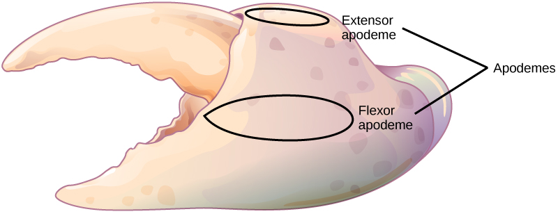

By the end of this section, you will be able to:
* Describe the various types of body plans that occur in animals
* Describe limits on animal size and shape
* Relate bioenergetics to body size, levels of activity, and the environment

Animals vary in form and function. From a sponge to a worm to a goat, an organism has a distinct body plan that limits its size and shape. Animals’ bodies are also designed to interact with their environments, whether in the deep sea, a rainforest canopy, or the desert. Therefore, a large amount of information about the structure of an organism\'s body (anatomy) and the function of its cells, tissues and organs (physiology) can be learned by studying that organism\'s environment.

# Body Plans

 ![Illustration A shows an asymmetrical sponge with a tube-like body and a growth off to one side. Illustration B shows a sea anemone with a tube-like, radial symmetrical body. Tentacles grow from the top of the tube. Three vertical planes arranged 120 degrees apart dissect the body. The half of the body on one side of each plane is a mirror image of the body on the other side. Illustration C shows a goat with a bilaterally symmetrical body. A plane runs from front to back through the middle of the goat, dissecting the body into left and right halves, which are mirror images of each other. The top part of the goat is defined as dorsal, and the bottom part is defined as ventral. The front of the goat is defined as anterior, and the back is defined as posterior.](../resources/Figure_33_01_01.jpg "Animals exhibit different types of body symmetry. The sponge is asymmetrical, the sea anemone has radial symmetry, and the goat has bilateral symmetry."){: #fig-ch33_01_01 data-media-type="image/jpg"}

Animal body plans follow set patterns related to symmetry. They are asymmetrical, radial, or bilateral in form as illustrated in [\[link\]](#fig-ch33_01_01). **Asymmetrical**{: data-type="term"} animals are animals with no pattern or symmetry; an example of an asymmetrical animal is a sponge. Radial symmetry, as illustrated in [\[link\]](#fig-ch33_01_01), describes when an animal has an up-and-down orientation: any plane cut along its longitudinal axis through the organism produces equal halves, but not a definite right or left side. This plan is found mostly in aquatic animals, especially organisms that attach themselves to a base, like a rock or a boat, and extract their food from the surrounding water as it flows around the organism. Bilateral symmetry is illustrated in the same figure by a goat. The goat also has an upper and lower component to it, but a plane cut from front to back separates the animal into definite right and left sides. Additional terms used when describing positions in the body are anterior (front), posterior (rear), dorsal (toward the back), and ventral (toward the stomach). Bilateral symmetry is found in both land-based and aquatic animals; it enables a high level of mobility.

# Limits on Animal Size and Shape

Animals with bilateral symmetry that live in water tend to have a **fusiform**{: data-type="term"} shape: this is a tubular shaped body that is tapered at both ends. This shape decreases the drag on the body as it moves through water and allows the animal to swim at high speeds. [\[link\]](#eip-idp129543248) lists the maximum speed of various animals. Certain types of sharks can swim at fifty kilometers an hour and some dolphins at 32 to 40 kilometers per hour. Land animals frequently travel faster, although the tortoise and snail are significantly slower than cheetahs. Another difference in the adaptations of aquatic and land-dwelling organisms is that aquatic organisms are constrained in shape by the forces of drag in the water since water has higher viscosity than air. On the other hand, land-dwelling organisms are constrained mainly by gravity, and drag is relatively unimportant. For example, most adaptations in birds are for gravity not for drag.

<table id="eip-idp129543248" summary=""><thead>
    <tr><th colspan="3">Maximum Speed of Assorted Land Marine Animals</th></tr>
        <tr><th>Animal</th><th>Speed (kmh)</th><th>Speed (mph)</th></tr>
    </thead><tbody>
    <tr><td>Cheetah</td>
        <td>113</td>
        <td>70</td>
    </tr>
    <tr>
        <td>Quarter horse</td>
        <td>77</td>
        <td>48</td>
    </tr>
    <tr>
        <td>Fox</td>
        <td>68</td>
        <td>42</td>
    </tr>
        <tr>
            <td>Shortfin mako shark</td>
            <td>50</td>
            <td>31</td>
        </tr>
        <tr>
            <td>Domestic house cat</td>
            <td>48</td>
            <td>30</td>
        </tr>
        <tr>
            <td>Human</td>
            <td>45</td>
            <td>28</td>
        </tr>
        <tr>
            <td>Dolphin</td>
            <td>32–40</td>
            <td>20–25</td>
        </tr>
        <tr>
            <td>Mouse</td>
            <td>13</td>
            <td>8</td>
        </tr>
        <tr>
            <td>Snail</td>
            <td>0.05</td>
            <td>0.03</td>
        </tr>
    </tbody></table>

Most animals have an exoskeleton, including insects, spiders, scorpions, horseshoe crabs, centipedes, and crustaceans. Scientists estimate that, of insects alone, there are over 30 million species on our planet. The exoskeleton is a hard covering or shell that provides benefits to the animal, such as protection against damage from predators and from water loss (for land animals); it also provides for the attachments of muscles.

As the tough and resistant outer cover of an arthropod, the exoskeleton may be constructed of a tough polymer such as chitin and is often biomineralized with materials such as calcium carbonate. This is fused to the animal’s epidermis. Ingrowths of the exoskeleton, called **apodemes**{: data-type="term"}, function as attachment sites for muscles, similar to tendons in more advanced animals ([\[link\]](#fig-ch33_01_02)). In order to grow, the animal must first synthesize a new exoskeleton underneath the old one and then shed or molt the original covering. This limits the animal’s ability to grow continually, and may limit the individual’s ability to mature if molting does not occur at the proper time. The thickness of the exoskeleton must be increased significantly to accommodate any increase in weight. It is estimated that a doubling of body size increases body weight by a factor of eight. The increasing thickness of the chitin necessary to support this weight limits most animals with an exoskeleton to a relatively small size. The same principles apply to endoskeletons, but they are more efficient because muscles are attached on the outside, making it easier to compensate for increased mass.

 {: #fig-ch33_01_02 data-media-type="image/jpg"}

An animal with an endoskeleton has its size determined by the amount of skeletal system it needs in order to support the other tissues and the amount of muscle it needs for movement. As the body size increases, both bone and muscle mass increase. The speed achievable by the animal is a balance between its overall size and the bone and muscle that provide support and movement.

# Limiting Effects of Diffusion on Size and Development

The exchange of nutrients and wastes between a cell and its watery environment occurs through the process of diffusion. All living cells are bathed in liquid, whether they are in a single-celled organism or a multicellular one. Diffusion is effective over a specific distance and limits the size that an individual cell can attain. If a cell is a single-celled microorganism, such as an amoeba, it can satisfy all of its nutrient and waste needs through diffusion. If the cell is too large, then diffusion is ineffective and the center of the cell does not receive adequate nutrients nor is it able to effectively dispel its waste.

An important concept in understanding how efficient diffusion is as a means of transport is the surface to volume ratio. Recall that any three-dimensional object has a surface area and volume; the ratio of these two quantities is the surface-to-volume ratio. Consider a cell shaped like a perfect sphere: it has a surface area of 4πr2, and a volume of (4/3)πr3. The surface-to-volume ratio of a sphere is 3/r; as the cell gets bigger, its surface to volume ratio decreases, making diffusion less efficient. The larger the size of the sphere, or animal, the less surface area for diffusion it possesses.

The solution to producing larger organisms is for them to become multicellular. Specialization occurs in complex organisms, allowing cells to become more efficient at doing fewer tasks. For example, circulatory systems bring nutrients and remove waste, while respiratory systems provide oxygen for the cells and remove carbon dioxide from them. Other organ systems have developed further specialization of cells and tissues and efficiently control body functions. Moreover, surface-to-volume ratio applies to other areas of animal development, such as the relationship between muscle mass and cross-sectional surface area in supporting skeletons, and in the relationship between muscle mass and the generation of dissipation of heat.

Link to Learning

 {: data-media-type="image/png"} 
Visit [this interactive site][1]{: target="_window"} to see an entire animal (a zebrafish embryo) at the cellular and sub-cellular level. Use the zoom and navigation functions for a virtual nanoscopy exploration.

# Animal Bioenergetics

All animals must obtain their energy from food they ingest or absorb. These nutrients are converted to adenosine triphosphate (ATP) for short-term storage and use by all cells. Some animals store energy for slightly longer times as glycogen, and others store energy for much longer times in the form of triglycerides housed in specialized adipose tissues. No energy system is one hundred percent efficient, and an animal’s metabolism produces waste energy in the form of heat. If an animal can conserve that heat and maintain a relatively constant body temperature, it is classified as a warm-blooded animal and called an **endotherm**{: data-type="term"}. The insulation used to conserve the body heat comes in the forms of fur, fat, or feathers. The absence of insulation in **ectothermic**{: data-type="term"} animals increases their dependence on the environment for body heat.

The amount of energy expended by an animal over a specific time is called its metabolic rate. The rate is measured variously in joules, calories, or kilocalories (1000 calories). Carbohydrates and proteins contain about 4.5 to 5 kcal/g, and fat contains about 9 kcal/g. Metabolic rate is estimated as the **basal metabolic rate (BMR)**{: data-type="term"} in endothermic animals at rest and as the **standard metabolic rate (SMR)**{: data-type="term"} in ectotherms. Human males have a BMR of 1600 to 1800 kcal/day, and human females have a BMR of 1300 to 1500 kcal/day. Even with insulation, endothermal animals require extensive amounts of energy to maintain a constant body temperature. An ectotherm such as an alligator has an SMR of 60 kcal/day.

## Energy Requirements Related to Body Size

Smaller endothermic animals have a greater surface area for their mass than larger ones ([\[link\]](#fig-ch33_01_03)). Therefore, smaller animals lose heat at a faster rate than larger animals and require more energy to maintain a constant internal temperature. This results in a smaller endothermic animal having a higher BMR, per body weight, than a larger endothermic animal.

"){: #fig-ch33_01_03 data-media-type="image/jpg"}

## Energy Requirements Related to Levels of Activity

The more active an animal is, the more energy is needed to maintain that activity, and the higher its BMR or SMR. The average daily rate of energy consumption is about two to four times an animal’s BMR or SMR. Humans are more sedentary than most animals and have an average daily rate of only 1.5 times the BMR. The diet of an endothermic animal is determined by its BMR. For example: the type of grasses, leaves, or shrubs that an herbivore eats affects the number of calories that it takes in. The relative caloric content of herbivore foods, in descending order, is tall grasses &gt; legumes &gt; short grasses &gt; forbs (any broad-leaved plant, not a grass) &gt; subshrubs &gt; annuals/biennials.

## Energy Requirements Related to Environment

Animals adapt to extremes of temperature or food availability through torpor. **Torpor**{: data-type="term"} is a process that leads to a decrease in activity and metabolism and allows animals to survive adverse conditions. Torpor can be used by animals for long periods, such as entering a state of **hibernation**{: data-type="term"} during the winter months, in which case it enables them to maintain a reduced body temperature. During hibernation, ground squirrels can achieve an abdominal temperature of 0° C (32° F), while a bear’s internal temperature is maintained higher at about 37° C (99° F).

If torpor occurs during the summer months with high temperatures and little water, it is called **estivation**{: data-type="term"}. Some desert animals use this to survive the harshest months of the year. Torpor can occur on a daily basis; this is seen in bats and hummingbirds. While endothermy is limited in smaller animals by surface to volume ratio, some organisms can be smaller and still be endotherms because they employ daily torpor during the part of the day that is coldest. This allows them to conserve energy during the colder parts of the day, when they consume more energy to maintain their body temperature.

# Animal Body Planes and Cavities

A standing vertebrate animal can be divided by several planes. A **sagittal plane**{: data-type="term"} divides the body into right and left portions. A **midsagittal plane**{: data-type="term"} divides the body exactly in the middle, making two equal right and left halves. A **frontal plane**{: data-type="term"} (also called a coronal plane) separates the front from the back. A **transverse plane**{: data-type="term"} (or, horizontal plane) divides the animal into upper and lower portions. This is sometimes called a cross section, and, if the transverse cut is at an angle, it is called an oblique plane. [\[link\]](#fig-ch33_01_04) illustrates these planes on a goat (a four-legged animal) and a human being.

 ![Illustration A shows the planes of a goat body. The midsagittal plane runs through the middle of the goat from front to back, separating the right and left sides. The frontal plane also runs from front to back, but separates the upper half of the body from the lower half. The transverse plane runs across the middle of the goat, and separate the front and back halves of the body. Illustration B shows the planes of a human body. The midsagittal plane runs from top to bottom and separates the right and left halves of the body. The Frontal plane also runs from top to bottom and separates the front and back halves of the body. The Transverse plane dissects the middle of the body between the chest and abdomen, separating the top of the body from the bottom. The midline is an imaginary line running through the middle of the body, from top to bottom.](../resources/Figure_33_01_04.jpg "Shown are the planes of a quadruped goat and a bipedal human. The midsagittal plane divides the body exactly in half, into right and left portions. The frontal plane divides the front and back, and the transverse plane divides the body into upper and lower portions."){: #fig-ch33_01_04 data-media-type="image/jpg"}

Vertebrate animals have a number of defined body cavities, as illustrated in [\[link\]](#fig-ch33_01_05). Two of these are major cavities that contain smaller cavities within them. The **dorsal cavity**{: data-type="term"} contains the cranial and the vertebral (or spinal) cavities. The **ventral cavity**{: data-type="term"} contains the thoracic cavity, which in turn contains the pleural cavity around the lungs and the pericardial cavity, which surrounds the heart. The ventral cavity also contains the abdominopelvic cavity, which can be separated into the abdominal and the pelvic cavities.

 ![Illustration shows a cross-sectional side view of the upper part of a human body. The entire head region above the eyes and to the back of the head and a long thin strip from this region down the back is shaded to indicate the dorsal cavity. The head is labeled cranial cavity and the long thin region down the back is the spinal cavity. A large oblong area shaded at the front of the body indicates the ventral cavity. It is labeled from top to bottom as thoracic cavity, diaphragm (thin line separating regions), abdominal cavity, and pelvic cavity. The abdominal and pelvic cavities are separated by a thin dashed line and together they are labeled the abdominopelvic cavity.](../resources/Figure_33_01_05.jpg "Vertebrate animals have two major body cavities. The dorsal cavity, indicated in green, contains the cranial and the spinal cavity. The ventral cavity, indicated in yellow, contains the thoracic cavity and the abdominopelvic cavity. The thoracic cavity is separated from the abdominopelvic cavity by the diaphragm. The thoracic cavity is separated into the abdominal cavity and the pelvic cavity by an imaginary line parallel to the pelvis bones. (credit: modification of work by NCI)"){: #fig-ch33_01_05 data-media-type="image/jpg"}

Career Connections

Physical AnthropologistPhysical anthropologists study the adaption, variability, and evolution of human beings, plus their living and fossil relatives. They can work in a variety of settings, although most will have an academic appointment at a university, usually in an anthropology department or a biology, genetics, or zoology department.

Non-academic positions are available in the automotive and aerospace industries where the focus is on human size, shape, and anatomy. Research by these professionals might range from studies of how the human body reacts to car crashes to exploring how to make seats more comfortable. Other non-academic positions can be obtained in museums of natural history, anthropology, archaeology, or science and technology. These positions involve educating students from grade school through graduate school. Physical anthropologists serve as education coordinators, collection managers, writers for museum publications, and as administrators. Zoos employ these professionals, especially if they have an expertise in primate biology; they work in collection management and captive breeding programs for endangered species. Forensic science utilizes physical anthropology expertise in identifying human and animal remains, assisting in determining the cause of death, and for expert testimony in trials.

# Section Summary

Animal bodies come in a variety of sizes and shapes. Limits on animal size and shape include impacts to their movement. Diffusion affects their size and development. Bioenergetics describes how animals use and obtain energy in relation to their body size, activity level, and environment.

# Review Questions

Which type of animal maintains a constant internal body temperature?

1.  endotherm
2.  ectotherm
3.  coelomate
4.  mesoderm
{: data-number-style="lower-alpha"}

A

The symmetry found in animals that move swiftly is ________.

1.  radial
2.  bilateral
3.  sequential
4.  interrupted
{: data-number-style="lower-alpha"}

B

What term describes the condition of a desert mouse that lowers its metabolic rate and “sleeps” during the hot day?

1.  turgid
2.  hibernation
3.  estivation
4.  normal sleep pattern
{: data-number-style="lower-alpha"}

C

A plane that divides an animal into equal right and left portions is ________.

1.  diagonal
2.  midsagittal
3.  coronal
4.  transverse
{: data-number-style="lower-alpha"}

B

A plane that divides an animal into dorsal and ventral portions is ________.

1.  sagittal
2.  midsagittal
3.  coronal
4.  transverse
{: data-number-style="lower-alpha"}

D

The pleural cavity is a part of which cavity?

1.  dorsal cavity
2.  thoracic cavity
3.  abdominal cavity
4.  pericardial cavity
{: data-number-style="lower-alpha"}

B

# Free Response

How does diffusion limit the size of an organism? How is this counteracted?

Diffusion is effective over a very short distance. If a cell exceeds this distance in its size, the center of the cell cannot get adequate nutrients nor can it expel enough waste to survive. To compensate for this, cells can loosely adhere to each other in a liquid medium, or develop into multi-celled organisms that use circulatory and respiratory systems to deliver nutrients and remove wastes.

What is the relationship between BMR and body size? Why?

Basal Metabolic Rate is an expression of the metabolic processes that occur to maintain an individual’s functioning and body temperature. Smaller bodied animals have a relatively large surface area compared to a much larger animal. The large animal’s large surface area leads to increased heat loss that the animal must compensate for, resulting in a higher BMR. A small animal, having less relative surface area, does not lose as much heat and has a correspondingly lower BMR.

[1]: http://openstaxcollege.org/l/nanoscopy
