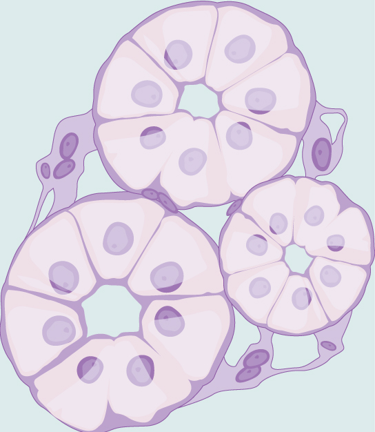
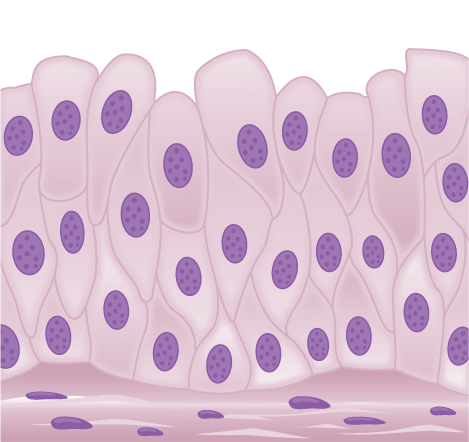
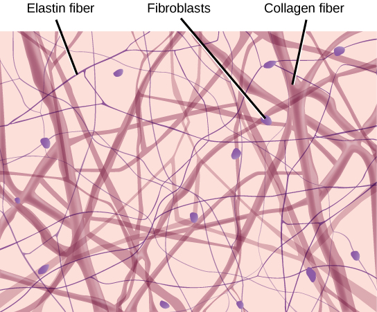
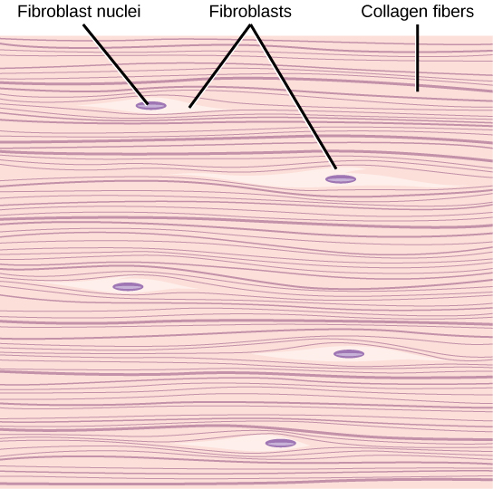
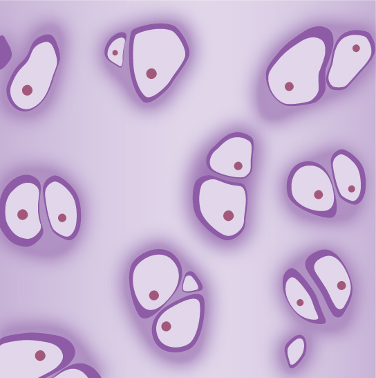
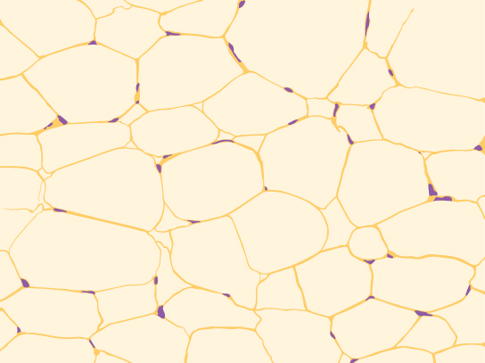

By the end of this section, you will be able to:
* Describe epithelial tissues
* Discuss the different types of connective tissues in animals
* Describe three types of muscle tissues
* Describe nervous tissue

The tissues of multicellular, complex animals are four primary types: epithelial, connective, muscle, and nervous. Recall that tissues are groups of similar cells group of similar cells carrying out related functions. These tissues combine to form organs—like the skin or kidney—that have specific, specialized functions within the body. Organs are organized into organ systems to perform functions; examples include the circulatory system, which consists of the heart and blood vessels, and the digestive system, consisting of several organs, including the stomach, intestines, liver, and pancreas. Organ systems come together to create an entire organism.

# Epithelial Tissues

**Epithelial tissues**{: data-type="term"} cover the outside of organs and structures in the body and line the lumens of organs in a single layer or multiple layers of cells. The types of epithelia are classified by the shapes of cells present and the number of layers of cells. Epithelia composed of a single layer of cells is called **simple epithelia**{: data-type="term"}; epithelial tissue composed of multiple layers is called **stratified epithelia**{: data-type="term"}. [\[link\]](#fs-idp5954256) summarizes the different types of epithelial tissues.

<table summary=""><thead>
    <tr><th colspan="3">Different Types of Epithelial Tissues</th></tr>
        <tr><th>Cell shape</th><th>Description</th><th>Location</th></tr>
    </thead><tbody>
    <tr><td>squamous</td><td>flat, irregular round shape</td><td>simple: lung alveoli, capillaries stratified: skin, mouth, vagina</td></tr>
        <tr><td>cuboidal</td><td>cube shaped, central nucleus</td><td>glands, renal tubules</td></tr>
        <tr><td>columnar</td><td>tall, narrow, nucleus toward base
tall, narrow, nucleus along cell</td><td>simple: digestive tract
pseudostratified: respiratory tract</td></tr>
        <tr><td>transitional</td><td>round, simple but appear stratified</td><td>urinary bladder</td></tr>
    </tbody></table>

## Squamous Epithelia

**Squamous epithelial**{: data-type="term"} cells are generally round, flat, and have a small, centrally located nucleus. The cell outline is slightly irregular, and cells fit together to form a covering or lining. When the cells are arranged in a single layer (simple epithelia), they facilitate diffusion in tissues, such as the areas of gas exchange in the lungs and the exchange of nutrients and waste at blood capillaries.

  have a slightly irregular shape, and a small, centrally located nucleus. These cells can be stratified into layers, as in (b) this human cervix specimen. (credit b: modification of work by Ed Uthman; scale-bar data from Matt Russell)"){: #fig-ch33_02_01}

[\[link\]](#fig-ch33_02_01)**a** illustrates a layer of squamous cells with their membranes joined together to form an epithelium. Image [\[link\]](#fig-ch33_02_01)**b** illustrates squamous epithelial cells arranged in stratified layers, where protection is needed on the body from outside abrasion and damage. This is called a stratified squamous epithelium and occurs in the skin and in tissues lining the mouth and vagina.

## Cuboidal Epithelia

**Cuboidal epithelial**{: data-type="term"} cells, shown in [\[link\]](#fig-ch33_02_02), are cube-shaped with a single, central nucleus. They are most commonly found in a single layer representing a simple epithelia in glandular tissues throughout the body where they prepare and secrete glandular material. They are also found in the walls of tubules and in the ducts of the kidney and liver.

{: #fig-ch33_02_02}

## Columnar Epithelia

**Columnar epithelial**{: data-type="term"} cells are taller than they are wide: they resemble a stack of columns in an epithelial layer, and are most commonly found in a single-layer arrangement. The nuclei of columnar epithelial cells in the digestive tract appear to be lined up at the base of the cells, as illustrated in [\[link\]](#fig-ch33_02_03). These cells absorb material from the lumen of the digestive tract and prepare it for entry into the body through the circulatory and lymphatic systems.

 {: #fig-ch33_02_03}

Columnar epithelial cells lining the respiratory tract appear to be stratified. However, each cell is attached to the base membrane of the tissue and, therefore, they are simple tissues. The nuclei are arranged at different levels in the layer of cells, making it appear as though there is more than one layer, as seen in [\[link\]](#fig-ch33_02_04). This is called **pseudostratified**{: data-type="term"}, columnar epithelia. This cellular covering has cilia at the apical, or free, surface of the cells. The cilia enhance the movement of mucous and trapped particles out of the respiratory tract, helping to protect the system from invasive microorganisms and harmful material that has been breathed into the body. Goblet cells are interspersed in some tissues (such as the lining of the trachea). The goblet cells contain mucous that traps irritants, which in the case of the trachea keep these irritants from getting into the lungs.

 ![Illustration shows columnar cells arranged side-by-side. The cells are wide at the top, and thin at the bottom. Shorter columnar cells are interspersed between the lower, thin part of the tall columnar cells. Some of these cells extend to the surface of the epithelium, but they are very thin at the top. The nuclei of the tall columnar cells are located near the top, and the nuclei of the shorter columnar cells are located near the bottom, giving the appearance of two layers of cells. Cilia extend from the top of the tall columnar cells. Oval goblet cells are interspersed among the columnar epithelial cells. Beneath the columnar cells is a layer of horizontal cells.](../resources/Figure_33_02_04.png "Pseudostratified columnar epithelia line the respiratory tract. They exist in one layer, but the arrangement of nuclei at different levels makes it appear that there is more than one layer. Goblet cells interspersed between the columnar epithelial cells secrete mucous into the respiratory tract."){: #fig-ch33_02_04}

## Transitional Epithelia

**Transitional**{: data-type="term"} or uroepithelial cells appear only in the urinary system, primarily in the bladder and ureter. These cells are arranged in a stratified layer, but they have the capability of appearing to pile up on top of each other in a relaxed, empty bladder, as illustrated in [\[link\]](#fig-ch33_02_05). As the urinary bladder fills, the epithelial layer unfolds and expands to hold the volume of urine introduced into it. As the bladder fills, it expands and the lining becomes thinner. In other words, the tissue transitions from thick to thin.

Art Connection

{: #fig-ch33_02_05}

Which of the following statements about types of epithelial cells is false?

1.  Simple columnar epithelial cells line the tissue of the lung.
2.  Simple cuboidal epithelial cells are involved in the filtering of blood in the kidney.
3.  Pseudostratisfied columnar epithilia occur in a single layer, but the arrangement of nuclei makes it appear that more than one layer is present.
4.  Transitional epithelia change in thickness depending on how full the bladder is.
{: data-number-style="lower-alpha"}

<!--<para><link target-id="fig-ch33_02_05" document=""/>A</para>-->

# Connective Tissues

**Connective tissues**{: data-type="term"} are made up of a matrix consisting of living cells and a non-living substance, called the ground substance. The ground substance is made of an organic substance (usually a protein) and an inorganic substance (usually a mineral or water). The principal cell of connective tissues is the fibroblast. This cell makes the fibers found in nearly all of the connective tissues. Fibroblasts are motile, able to carry out mitosis, and can synthesize whichever connective tissue is needed. Macrophages, lymphocytes, and, occasionally, leukocytes can be found in some of the tissues. Some tissues have specialized cells that are not found in the others. The **matrix**{: data-type="term"} in connective tissues gives the tissue its density. When a connective tissue has a high concentration of cells or fibers, it has proportionally a less dense matrix.

The organic portion or protein fibers found in connective tissues are either collagen, elastic, or reticular fibers. Collagen fibers provide strength to the tissue, preventing it from being torn or separated from the surrounding tissues. Elastic fibers are made of the protein elastin; this fiber can stretch to one and one half of its length and return to its original size and shape. Elastic fibers provide flexibility to the tissues. Reticular fibers are the third type of protein fiber found in connective tissues. This fiber consists of thin strands of collagen that form a network of fibers to support the tissue and other organs to which it is connected. The various types of connective tissues, the types of cells and fibers they are made of, and sample locations of the tissues is summarized in [\[link\]](#fs-idp129333216).

<table summary=""><thead>
        <tr><th colspan="4">Connective Tissues</th></tr>
        <tr>
            <th>Tissue</th>
            <th>Cells</th>
            <th>Fibers</th>
            <th>Location</th>
        </tr>
    </thead><tbody>
    <tr>
        <td>loose/areolar</td>
        <td>fibroblasts, macrophages, some lymphocytes, some neutrophils</td>
        <td>few: collagen, elastic, reticular</td>
        <td>around blood vessels; anchors epithelia</td>
       </tr>
    <tr>
        <td>dense, fibrous connective tissue</td>
        <td>fibroblasts, macrophages,</td>
        <td>mostly collagen</td>
        <td>irregular: skin regular: tendons, ligaments</td>
    </tr>
            <tr>
        <td>cartilage</td>
        <td>chondrocytes, chondroblasts</td>
        <td>hyaline: few collagen fibrocartilage: large amount of collagen</td>
        <td>shark skeleton, fetal bones, human ears, intervertebral discs</td>
            </tr>
            <tr>
        <td>bone</td>
        <td>osteoblasts, osteocytes, osteoclasts</td>
        <td>some: collagen, elastic</td>
        <td>vertebrate skeletons</td>
            </tr>
            <tr>
        <td>adipose</td>
        <td>adipocytes</td>
        <td>few</td>
        <td>adipose (fat)</td>
            </tr>
            <tr>
        <td>blood</td>
        <td>red blood cells, white blood cells</td>
        <td>none</td>
        <td>blood</td>
       </tr>
    </tbody></table>

## Loose/Areolar Connective Tissue

**Loose connective tissue**{: data-type="term"}, also called areolar connective tissue, has a sampling of all of the components of a connective tissue. As illustrated in [\[link\]](#fig-ch33_02_06), loose connective tissue has some fibroblasts; macrophages are present as well. Collagen fibers are relatively wide and stain a light pink, while elastic fibers are thin and stain dark blue to black. The space between the formed elements of the tissue is filled with the matrix. The material in the connective tissue gives it a loose consistency similar to a cotton ball that has been pulled apart. Loose connective tissue is found around every blood vessel and helps to keep the vessel in place. The tissue is also found around and between most body organs. In summary, areolar tissue is tough, yet flexible, and comprises membranes.

 {: #fig-ch33_02_06}

## Fibrous Connective Tissue

**Fibrous connective tissues**{: data-type="term"} contain large amounts of collagen fibers and few cells or matrix material. The fibers can be arranged irregularly or regularly with the strands lined up in parallel. Irregularly arranged fibrous connective tissues are found in areas of the body where stress occurs from all directions, such as the dermis of the skin. Regular fibrous connective tissue, shown in [\[link\]](#fig-ch33_02_07), is found in tendons (which connect muscles to bones) and ligaments (which connect bones to bones).

 {: #fig-ch33_02_07}

## Cartilage

**Cartilage**{: data-type="term"} is a connective tissue with a large amount of the matrix and variable amounts of fibers. The cells, called **chondrocytes**{: data-type="term"}, make the matrix and fibers of the tissue. Chondrocytes are found in spaces within the tissue called **lacunae**{: data-type="term"}.

A cartilage with few collagen and elastic fibers is hyaline cartilage, illustrated in [\[link\]](#fig-ch33_02_08). The lacunae are randomly scattered throughout the tissue and the matrix takes on a milky or scrubbed appearance with routine histological stains. Sharks have cartilaginous skeletons, as does nearly the entire human skeleton during a specific pre-birth developmental stage. A remnant of this cartilage persists in the outer portion of the human nose. Hyaline cartilage is also found at the ends of long bones, reducing friction and cushioning the articulations of these bones.

 {: #fig-ch33_02_08}

Elastic cartilage has a large amount of elastic fibers, giving it tremendous flexibility. The ears of most vertebrate animals contain this cartilage as do portions of the larynx, or voice box. Fibrocartilage contains a large amount of collagen fibers, giving the tissue tremendous strength. Fibrocartilage comprises the intervertebral discs in vertebrate animals. Hyaline cartilage found in movable joints such as the knee and shoulder becomes damaged as a result of age or trauma. Damaged hyaline cartilage is replaced by fibrocartilage and results in the joints becoming “stiff.”

## Bone

Bone, or osseous tissue, is a connective tissue that has a large amount of two different types of matrix material. The organic matrix is similar to the matrix material found in other connective tissues, including some amount of collagen and elastic fibers. This gives strength and flexibility to the tissue. The inorganic matrix consists of mineral salts—mostly calcium salts—that give the tissue hardness. Without adequate organic material in the matrix, the tissue breaks; without adequate inorganic material in the matrix, the tissue bends.

There are three types of cells in bone: osteoblasts, osteocytes, and osteoclasts. Osteoblasts are active in making bone for growth and remodeling. Osteoblasts deposit bone material into the matrix and, after the matrix surrounds them, they continue to live, but in a reduced metabolic state as osteocytes. Osteocytes are found in lacunae of the bone. Osteoclasts are active in breaking down bone for bone remodeling, and they provide access to calcium stored in tissues. Osteoclasts are usually found on the surface of the tissue.

Bone can be divided into two types: compact and spongy. Compact bone is found in the shaft (or diaphysis) of a long bone and the surface of the flat bones, while spongy bone is found in the end (or epiphysis) of a long bone. Compact bone is organized into subunits called **osteons**{: data-type="term"}, as illustrated in [\[link\]](#fig-ch33_02_09). A blood vessel and a nerve are found in the center of the structure within the Haversian canal, with radiating circles of lacunae around it known as lamellae. The wavy lines seen between the lacunae are microchannels called **canaliculi**{: data-type="term"}; they connect the lacunae to aid diffusion between the cells. Spongy bone is made of tiny plates called **trabeculae**{: data-type="term"} these plates serve as struts to give the spongy bone strength. Over time, these plates can break causing the bone to become less resilient. Bone tissue forms the internal skeleton of vertebrate animals, providing structure to the animal and points of attachment for tendons.

 ![ Illustration A shows a cross section of a long bone with wide protrusions at either end. The outer part is compact bone. Inside the compact bone is porous spongy bone made of web-like trabreculae. The spongy bone fills the wide part at either end of the bone. In the middle, a hollow exists inside the spongy bone. Illustration B shows several circular osteons clustered together in compact bone. At the hub of each osteon is an opening called the Haversian canal filled with blood and lymph vessels and nerves. The lamellae surrounding the Haversian canal resemble tree rings.  Lacunae are wide spaces in the rings between the lamellae. Microchannels called canaliculi radiate through the rings out from the central Haversian canal, connecting the lacunae together. Illustration C shows small osteoclasts surrounding the outside of bone. Larger osteoclasts are also on the outer surface, forming a hollow in the bone. Osteocytes are long, thin cells in the lacunae.](../resources/Figure_33_02_09.jpg "(a) Compact bone is a dense matrix on the outer surface of bone. Spongy bone, inside the compact bone, is porous with web-like trabeculae. (b) Compact bone is organized into rings called osteons. Blood vessels, nerves, and lymphatic vessels are found in the central Haversian canal. Rings of lamellae surround the Haversian canal. Between the lamellae are cavities called lacunae. Canaliculi are microchannels connecting the lacunae together. (c) Osteoblasts surround the exterior of the bone. Osteoclasts bore tunnels into the bone and osteocytes are found in the lacunae."){: #fig-ch33_02_09}

## Adipose Tissue

Adipose tissue, or fat tissue, is considered a connective tissue even though it does not have fibroblasts or a real matrix and only has a few fibers. Adipose tissue is made up of cells called adipocytes that collect and store fat in the form of triglycerides, for energy metabolism. Adipose tissues additionally serve as insulation to help maintain body temperatures, allowing animals to be endothermic, and they function as cushioning against damage to body organs. Under a microscope, adipose tissue cells appear empty due to the extraction of fat during the processing of the material for viewing, as seen in [\[link\]](#fig-ch33_02_10). The thin lines in the image are the cell membranes, and the nuclei are the small, black dots at the edges of the cells.

 {: #fig-ch33_02_10}

## Blood

Blood is considered a connective tissue because it has a matrix, as shown in [\[link\]](#fig-ch33_02_11). The living cell types are red blood cells (RBC), also called erythrocytes, and white blood cells (WBC), also called leukocytes. The fluid portion of whole blood, its matrix, is commonly called plasma.

 ![Different types of blood cells are shown. Red blood cells are disc-shaped, with a central indentation. Platelets are much smaller than red blood cells, narrow and long. Neutrophils, eosinophils, lymphocytes, monocytes and basophils are all about three times the diameter of a red blood cell and round. They differ in the shape of the nucleus, and in the presence or absence of granules in the cytoplasm. Macrophages, which are the largest cell type, have pseudopods which give them an irregular shape.](../resources/Figure_33_02_11.jpg "Blood is a connective tissue that has a fluid matrix, called plasma, and no fibers. Erythrocytes (red blood cells), the predominant cell type, are involved in the transport of oxygen and carbon dioxide. Also present are various leukocytes (white blood cells) involved in immune response."){: #fig-ch33_02_11}

The cell found in greatest abundance in blood is the erythrocyte. Erythrocytes are counted in millions in a blood sample: the average number of red blood cells in primates is 4.7 to 5.5 million cells per microliter. Erythrocytes are consistently the same size in a species, but vary in size between species. For example, the average diameter of a primate red blood cell is 7.5 µl, a dog is close at 7.0 µl, but a cat’s RBC diameter is 5.9 µl. Sheep erythrocytes are even smaller at 4.6 µl. Mammalian erythrocytes lose their nuclei and mitochondria when they are released from the bone marrow where they are made. Fish, amphibian, and avian red blood cells maintain their nuclei and mitochondria throughout the cell’s life. The principal job of an erythrocyte is to carry and deliver oxygen to the tissues.

Leukocytes are the predominant white blood cells found in the peripheral blood. Leukocytes are counted in the thousands in the blood with measurements expressed as ranges: primate counts range from 4,800 to 10,800 cells per µl, dogs from 5,600 to 19,200 cells per µl, cats from 8,000 to 25,000 cells per µl, cattle from 4,000 to 12,000 cells per µl, and pigs from 11,000 to 22,000 cells per µl.

Lymphocytes function primarily in the immune response to foreign antigens or material. Different types of lymphocytes make antibodies tailored to the foreign antigens and control the production of those antibodies. Neutrophils are phagocytic cells and they participate in one of the early lines of defense against microbial invaders, aiding in the removal of bacteria that has entered the body. Another leukocyte that is found in the peripheral blood is the monocyte. Monocytes give rise to phagocytic macrophages that clean up dead and damaged cells in the body, whether they are foreign or from the host animal. Two additional leukocytes in the blood are eosinophils and basophils—both help to facilitate the inflammatory response.

The slightly granular material among the cells is a cytoplasmic fragment of a cell in the bone marrow. This is called a platelet or thrombocyte. Platelets participate in the stages leading up to coagulation of the blood to stop bleeding through damaged blood vessels. Blood has a number of functions, but primarily it transports material through the body to bring nutrients to cells and remove waste material from them.

# Muscle Tissues

There are three types of muscle in animal bodies: smooth, skeletal, and cardiac. They differ by the presence or absence of striations or bands, the number and location of nuclei, whether they are voluntarily or involuntarily controlled, and their location within the body. [\[link\]](#fs-idm39762304) summarizes these differences.

<table summary=""><thead>
        <tr><th colspan="5">Types of Muscles</th></tr>
            <tr>
                <th>Type of Muscle</th>
                <th>Striations</th>
                <th>Nuclei</th>
                <th>Control</th>
                <th>Location</th>
            </tr>
        </thead><tbody>
        <tr>
        <td>smooth</td>
            <td>no</td>
            <td>single, in center</td>
            <td>involuntary</td>
            <td>visceral organs</td>
        </tr>
            <tr>
            <td>skeletal</td>
                <td>yes</td>
                <td>many, at periphery</td>
                <td>voluntary</td>
                <td>skeletal muscles</td>
            </tr>
            <tr>
            <td>cardiac</td>
                <td>yes</td>
                <td>single, in center</td>
                <td>involuntary</td>
                <td>heart</td>
            </tr>
        </tbody></table>

## Smooth Muscle

Smooth muscle does not have striations in its cells. It has a single, centrally located nucleus, as shown in [\[link\]](#fig-ch33_02_12). Constriction of smooth muscle occurs under involuntary, autonomic nervous control and in response to local conditions in the tissues. Smooth muscle tissue is also called non-striated as it lacks the banded appearance of skeletal and cardiac muscle. The walls of blood vessels, the tubes of the digestive system, and the tubes of the reproductive systems are composed of mostly smooth muscle.

{: #fig-ch33_02_12}

## Skeletal Muscle

Skeletal muscle has striations across its cells caused by the arrangement of the contractile proteins actin and myosin. These muscle cells are relatively long and have multiple nuclei along the edge of the cell. Skeletal muscle is under voluntary, somatic nervous system control and is found in the muscles that move bones. [\[link\]](#fig-ch33_02_12) illustrates the histology of skeletal muscle.

## Cardiac Muscle

Cardiac muscle, shown in [\[link\]](#fig-ch33_02_12), is found only in the heart. Like skeletal muscle, it has cross striations in its cells, but cardiac muscle has a single, centrally located nucleus. Cardiac muscle is not under voluntary control but can be influenced by the autonomic nervous system to speed up or slow down. An added feature to cardiac muscle cells is a line than extends along the end of the cell as it abuts the next cardiac cell in the row. This line is called an intercalated disc: it assists in passing electrical impulse efficiently from one cell to the next and maintains the strong connection between neighboring cardiac cells.

# Nervous Tissues

Nervous tissues are made of cells specialized to receive and transmit electrical impulses from specific areas of the body and to send them to specific locations in the body. The main cell of the nervous system is the neuron, illustrated in [\[link\]](#fig-ch33_02_13). The large structure with a central nucleus is the cell body of the neuron. Projections from the cell body are either dendrites specialized in receiving input or a single axon specialized in transmitting impulses. Some glial cells are also shown. Astrocytes regulate the chemical environment of the nerve cell, and oligodendrocytes insulate the axon so the electrical nerve impulse is transferred more efficiently. Other glial cells that are not shown support the nutritional and waste requirements of the neuron. Some of the glial cells are phagocytic and remove debris or damaged cells from the tissue. A nerve consists of neurons and glial cells.

 {: #fig-ch33_02_13}

Link to Learning

  
Click through the [interactive review][1]{: target="_window"} to learn more about epithelial tissues.

Career Connections

## Pathologist

A pathologist is a medical doctor or veterinarian who has specialized in the laboratory detection of disease in animals, including humans. These professionals complete medical school education and follow it with an extensive post-graduate residency at a medical center. A pathologist may oversee clinical laboratories for the evaluation of body tissue and blood samples for the detection of disease or infection. They examine tissue specimens through a microscope to identify cancers and other diseases. Some pathologists perform autopsies to determine the cause of death and the progression of disease.

# Section Summary

The basic building blocks of complex animals are four primary tissues. These are combined to form organs, which have a specific, specialized function within the body, such as the skin or kidney. Organs are organized together to perform common functions in the form of systems. The four primary tissues are epithelia, connective tissues, muscle tissues, and nervous tissues.

# Art Connections

[[link]](#fig-ch33_02_05) Which of the following statements about types of epithelial cells is false?

1.  Simple columnar epithelial cells line the tissue of the lung.
2.  Simple cuboidal epithelial cells are involved in the filtering of blood in the kidney.
3.  Pseudostratisfied columnar epithilia occur in a single layer, but the arrangement of nuclei makes it appear that more than one layer is present.
4.  Transitional epithelia change in thickness depending on how full the bladder is.
{: data-number-style="lower-alpha"}

[[link]](#fig-ch33_02_05) A

# Review Questions

Which type of epithelial cell is best adapted to aid diffusion?

1.  squamous
2.  cuboidal
3.  columnar
4.  transitional
{: data-number-style="lower-alpha"}

C

Which type of epithelial cell is found in glands?

1.  squamous
2.  cuboidal
3.  columnar
4.  transitional
{: data-number-style="lower-alpha"}

B

Which type of epithelial cell is found in the urinary bladder?

1.  squamous
2.  cuboidal
3.  columnar
4.  transitional
{: data-number-style="lower-alpha"}

D

Which type of connective tissue has the most fibers?

1.  loose connective tissue
2.  fibrous connective tissue
3.  cartilage
4.  bone
{: data-number-style="lower-alpha"}

B

Which type of connective tissue has a mineralized different matrix?

1.  loose connective tissue
2.  fibrous connective tissue
3.  cartilage
4.  bone
{: data-number-style="lower-alpha"}

D

The cell found in bone that breaks it down is called an \_\_\_\_\_\_\_\_.

1.  osteoblast
2.  osteocyte
3.  osteoclast
4.  osteon
{: data-number-style="lower-alpha"}

C

The cell found in bone that makes the bone is called an \_\_\_\_\_\_\_\_.

1.  osteoblast
2.  osteocyte
3.  osteoclast
4.  osteon
{: data-number-style="lower-alpha"}

A

Plasma is the \_\_\_\_\_\_\_\_.

1.  fibers in blood
2.  matrix of blood
3.  cell that phagocytizes bacteria
4.  cell fragment found in the tissue
{: data-number-style="lower-alpha"}

B

The type of muscle cell under voluntary control is the \_\_\_\_\_\_\_\_.

1.  smooth muscle
2.  skeletal muscle
3.  cardiac muscle
4.  visceral muscle
{: data-number-style="lower-alpha"}

B

The part of a neuron that contains the nucleus is the

1.  cell body
2.  dendrite
3.  axon
4.  glial
{: data-number-style="lower-alpha"}

B

# Free Response

How can squamous epithelia both facilitate diffusion and prevent damage from abrasion?

Squamous epithelia can be either simple or stratified. As a single layer of cells, it presents a very thin epithelia that minimally inhibits diffusion. As a stratified epithelia, the surface cells can be sloughed off and the cells in deeper layers protect the underlying tissues from damage.

What are the similarities between cartilage and bone?

Both contain cells other than the traditional fibroblast. Both have cells that lodge in spaces within the tissue called lacunae. Both collagen and elastic fibers are found in bone and cartilage. Both tissues participate in vertebrate skeletal development and formation.

[1]: http://openstaxcollege.org/l/tissues
