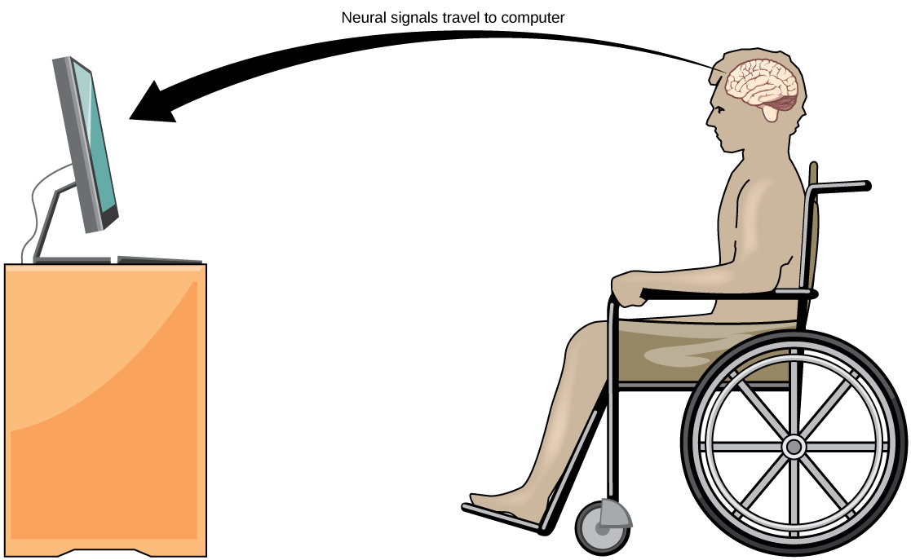

By the end of this section, you will be able to:
* Describe the basis of the resting membrane potential
* Explain the stages of an action potential and how action potentials are propagated
* Explain the similarities and differences between chemical and electrical synapses
* Describe long-term potentiation and long-term depression

All functions performed by the nervous system—from a simple motor reflex to more advanced functions like making a memory or a decision—require neurons to communicate with one another. While humans use words and body language to communicate, neurons use electrical and chemical signals. Just like a person in a committee, one neuron usually receives and synthesizes messages from multiple other neurons before “making the decision” to send the message on to other neurons.

# Nerve Impulse Transmission within a Neuron

For the nervous system to function, neurons must be able to send and receive signals. These signals are possible because each neuron has a charged cellular membrane (a voltage difference between the inside and the outside), and the charge of this membrane can change in response to neurotransmitter molecules released from other neurons and environmental stimuli. To understand how neurons communicate, one must first understand the basis of the baseline or ‘resting’ membrane charge.

## Neuronal Charged Membranes

The lipid bilayer membrane that surrounds a neuron is impermeable to charged molecules or ions. To enter or exit the neuron, ions must pass through special proteins called ion channels that span the membrane. Ion channels have different configurations: open, closed, and inactive, as illustrated in [\[link\]](#fig-ch35_02_01). Some ion channels need to be activated in order to open and allow ions to pass into or out of the cell. These ion channels are sensitive to the environment and can change their shape accordingly. Ion channels that change their structure in response to voltage changes are called voltage-gated ion channels. Voltage-gated ion channels regulate the relative concentrations of different ions inside and outside the cell. The difference in total charge between the inside and outside of the cell is called the **membrane potential**{: data-type="term"}.

 {: #fig-ch35_02_01 data-media-type="image/jpg"}

Link to Learning

 {: data-media-type="image/png"} 
This [video][1]{: target="_window"} discusses the basis of the resting membrane potential.

## Resting Membrane Potential

A neuron at rest is negatively charged: the inside of a cell is approximately 70 millivolts more negative than the outside (−70 mV, note that this number varies by neuron type and by species). This voltage is called the resting membrane potential; it is caused by differences in the concentrations of ions inside and outside the cell. If the membrane were equally permeable to all ions, each type of ion would flow across the membrane and the system would reach equilibrium. Because ions cannot simply cross the membrane at will, there are different concentrations of several ions inside and outside the cell, as shown in [\[link\]](#tab-ch35_02_01). The difference in the number of positively charged potassium ions (K+) inside and outside the cell dominates the resting membrane potential ([\[link\]](#fig-ch35_02_02)). When the membrane is at rest, K+ ions accumulate inside the cell due to a net movement with the concentration gradient. The negative resting membrane potential is created and maintained by increasing the concentration of cations outside the cell (in the extracellular fluid) relative to inside the cell (in the cytoplasm). The negative charge within the cell is created by the cell membrane being more permeable to potassium ion movement than sodium ion movement. In neurons, potassium ions are maintained at high concentrations within the cell while sodium ions are maintained at high concentrations outside of the cell. The cell possesses potassium and sodium leakage channels that allow the two cations to diffuse down their concentration gradient. However, the neurons have far more potassium leakage channels than sodium leakage channels. Therefore, potassium diffuses out of the cell at a much faster rate than sodium leaks in. Because more cations are leaving the cell than are entering, this causes the interior of the cell to be negatively charged relative to the outside of the cell. The actions of the sodium potassium pump help to maintain the resting potential, once established. Recall that sodium potassium pumps brings two K+ ions into the cell while removing three Na+ ions per ATP consumed. As more cations are expelled from the cell than taken in, the inside of the cell remains negatively charged relative to the extracellular fluid. It should be noted that calcium ions (Cl–) tend to accumulate outside of the cell because they are repelled by negatively-charged proteins within the cytoplasm.

<table id="tab-ch35_02_01" summary=""><caption>The resting membrane potential is a result of different concentrations inside and outside the cell.</caption><thead>
        <tr>
            <th colspan="4">Ion Concentration Inside and Outside Neurons</th>
        </tr>
        <tr>
            <th>Ion</th>
            <th>Extracellular concentration (mM)</th>
            <th>Intracellular concentration (mM)</th>
            <th>Ratio outside/inside</th>
        </tr>
    </thead><tbody>
        <tr>
            <td>Na+</td>
            <td>145</td>
            <td>12</td>
            <td>12</td>
        </tr>
        <tr>
            <td>K+</td>
            <td>4</td>
            <td>155</td>
            <td>0.026</td>
        </tr>
        <tr>
            <td>Cl−</td>
            <td>120</td>
            <td>4</td>
            <td>30</td>
        </tr>
        <tr>
            <td>Organic anions (A−)</td>
            <td>—</td>
            <td>100</td>
            <td />
        </tr>
    </tbody></table>

![The resting membrane potential of minus seventy volts is maintained by a sodium/potassium transporter that transports sodium ions out of the cell and potassium ions in. Voltage gated sodium and potassium channels are closed. In response to a nerve impulse, some sodium channels open, allowing sodium ions to enter the cell. The membrane starts to depolarize; in other words, the charge across the membrane lessens. If the membrane potential increases to the threshold of excitation, all the sodium channels open. At the peak action potential, potassium channels open and potassium ions leave the cell. The membrane eventually becomes hyperpolarized.](../resources/Figure_35_02_02.jpg "The (a) resting membrane potential is a result of different concentrations of Na+ and K+ ions inside and outside the cell. A nerve impulse causes Na+ to enter the cell, resulting in (b) depolarization. At the peak action potential, K+ channels open and the cell becomes (c) hyperpolarized."){: #fig-ch35_02_02 data-media-type="image/jpg"}

## Action Potential

A neuron can receive input from other neurons and, if this input is strong enough, send the signal to downstream neurons. Transmission of a signal between neurons is generally carried by a chemical called a neurotransmitter. Transmission of a signal within a neuron (from dendrite to axon terminal) is carried by a brief reversal of the resting membrane potential called an **action potential**{: data-type="term"}. When neurotransmitter molecules bind to receptors located on a neuron’s dendrites, ion channels open. At excitatory synapses, this opening allows positive ions to enter the neuron and results in **depolarization**{: data-type="term"} of the membrane—a decrease in the difference in voltage between the inside and outside of the neuron. A stimulus from a sensory cell or another neuron depolarizes the target neuron to its threshold potential (-55 mV). Na+ channels in the axon hillock open, allowing positive ions to enter the cell ([\[link\]](#fig-ch35_02_02) and [\[link\]](#fig-ch35_02_03)). Once the sodium channels open, the neuron completely depolarizes to a membrane potential of about +40 mV. Action potentials are considered an \"all-or nothing\" event, in that, once the threshold potential is reached, the neuron always completely depolarizes. Once depolarization is complete, the cell must now \"reset\" its membrane voltage back to the resting potential. To accomplish this, the Na+ channels close and cannot be opened. This begins the neuron\'s **refractory period**{: data-type="term"}, in which it cannot produce another action potential because its sodium channels will not open. At the same time, voltage-gated K+ channels open, allowing K+ to leave the cell. As K+ ions leave the cell, the membrane potential once again becomes negative. The diffusion of K+ out of the cell actually **hyperpolarizes**{: data-type="term"} the cell, in that the membrane potential becomes more negative than the cell\'s normal resting potential. At this point, the sodium channels will return to their resting state, meaning they are ready to open again if the membrane potential again exceeds the threshold potential. Eventually the extra K+ ions diffuse out of the cell through the potassium leakage channels, bringing the cell from its hyperpolarized state, back to its resting membrane potential.

Art Connection

![Graph plots membrane potential in millivolts versus time. The membrane remains at the resting potential of -70 millivolts until a nerve impulse occurs in step 1. Some sodium channels open, and the potential begins to rapidly climb past the threshold of excitation of -55 millivolts, at which point all the sodium channels open. At the peak action potential, the potential begins to rapidly drop as potassium channels open and sodium channels close. As a result, the membrane repolarizes past the resting membrane potential and becomes hyperpolarized. The membrane potential then gradually returns to normal.](../resources/Figure_35_02_03.png "The formation of an action potential can be divided into five steps: (1)  A stimulus from a sensory cell or another neuron causes the target cell to depolarize toward the threshold potential. (2) If the threshold of excitation is reached, all Na+ channels open and the membrane depolarizes. (3) At the peak action potential, K+ channels open and K+ begins to leave the cell. At the same time, Na+ channels close. (4) The membrane becomes hyperpolarized as K+ ions continue to leave the cell. The hyperpolarized membrane is in a refractory period and cannot fire. (5) The K+ channels close and the Na+/K+ transporter restores the resting potential."){: #fig-ch35_02_03 data-media-type="image/png"}

Potassium channel blockers, such as amiodarone and procainamide, which are used to treat abnormal electrical activity in the heart, called cardiac dysrhythmia, impede the movement of K+ through voltage-gated K+ channels. Which part of the action potential would you expect potassium channels to affect?

<!--<para><link target-id="fig-ch35_02_03" document=""/> Potassium channel blockers slow the repolarization phase, but have no effect on depolarization.</para>-->

{: #fig-ch35_02_04 data-media-type="image/png"}

Link to Learning

 {: data-media-type="image/png"} 
This [video][2]{: target="_window"} presents an overview of action potential.

## Myelin and the Propagation of the Action Potential

For an action potential to communicate information to another neuron, it must travel along the axon and reach the axon terminals where it can initiate neurotransmitter release. The speed of conduction of an action potential along an axon is influenced by both the diameter of the axon and the axon’s resistance to current leak. Myelin acts as an insulator that prevents current from leaving the axon; this increases the speed of action potential conduction. In demyelinating diseases like multiple sclerosis, action potential conduction slows because current leaks from previously insulated axon areas. The nodes of Ranvier, illustrated in [\[link\]](#fig-ch35_02_05) are gaps in the myelin sheath along the axon. These unmyelinated spaces are about one micrometer long and contain voltage gated Na+ and K+ channels. Flow of ions through these channels, particularly the Na+ channels, regenerates the action potential over and over again along the axon. This ‘jumping’ of the action potential from one node to the next is called **saltatory conduction**{: data-type="term"}. If nodes of Ranvier were not present along an axon, the action potential would propagate very slowly since Na+ and K+ channels would have to continuously regenerate action potentials at every point along the axon instead of at specific points. Nodes of Ranvier also save energy for the neuron since the channels only need to be present at the nodes and not along the entire axon.

![Illustration shows an axon covered in three bands of myelin sheath. Between the sheath coverings the axon is exposed. The uncovered parts of the axon are called nodes of Ranvier. In the illustration, the left node of Ranvier is depolarized such that the membrane potential is positive inside and negative outside. The right membrane of the right node is at the resting potential, negative inside and positive outside. An arrow indicates that the depolarization jumps from the left node to the right, so that the right node becomes depolarized.](../resources/Figure_35_02_05.jpg "Nodes of Ranvier are gaps in myelin coverage along axons. Nodes contain voltage-gated K+ and Na+ channels. Action potentials travel down the axon by jumping from one node to the next."){: #fig-ch35_02_05 data-media-type="image/jpg"}

# Synaptic Transmission

The synapse or “gap” is the place where information is transmitted from one neuron to another. Synapses usually form between axon terminals and dendritic spines, but this is not universally true. There are also axon-to-axon, dendrite-to-dendrite, and axon-to-cell body synapses. The neuron transmitting the signal is called the presynaptic neuron, and the neuron receiving the signal is called the postsynaptic neuron. Note that these designations are relative to a particular synapse—most neurons are both presynaptic and postsynaptic. There are two types of synapses: chemical and electrical.

## Chemical Synapse

When an action potential reaches the axon terminal it depolarizes the membrane and opens voltage-gated Na+ channels. Na+ ions enter the cell, further depolarizing the presynaptic membrane. This depolarization causes voltage-gated Ca2+ channels to open. Calcium ions entering the cell initiate a signaling cascade that causes small membrane-bound vesicles, called **synaptic vesicles**{: data-type="term"}, containing neurotransmitter molecules to fuse with the presynaptic membrane. Synaptic vesicles are shown in [\[link\]](#fig-ch35_02_06), which is an image from a scanning electron microscope.

  inside the neuron. (credit: modification of work by Tina Carvalho, NIH-NIGMS; scale-bar data from Matt Russell)"){: #fig-ch35_02_06 data-media-type="image/jpg"}

Fusion of a vesicle with the presynaptic membrane causes neurotransmitter to be released into the **synaptic cleft**{: data-type="term"}, the extracellular space between the presynaptic and postsynaptic membranes, as illustrated in [\[link\]](#fig-ch35_02_07). The neurotransmitter diffuses across the synaptic cleft and binds to receptor proteins on the postsynaptic membrane.

 ![Illustration shows a narrow axon of a presynaptic cell widening into a bulb-like axon terminal. A narrow synaptic cleft separates the axon terminal of the presynaptic cell from the postsynaptic cell. In step 1, an action potential arrives at the axon terminal. In step 2, the action potential causes voltage-gated calcium channels in the axon terminal open, allowing calcium to enter. In step 3, calcium influx causes neurotransmitter-containing synaptic vesicles to fuse with the plasma membrane. Contents of the vesicles are released into the synaptic cleft by exocytosis. In step 4, neurotransmitter diffuses across the synaptic cleft and binds ligand-gated ion channels on the postsynaptic membrane, causing the channels to open. In step 5, the open channels cause ion movement into or out of the cell, resulting in a localized change in membrane potential. In step 6, reuptake by the presynaptic neuron, enzymatic degradation and diffusion reduce neurotransmitter levels, terminating the signal.](../resources/Figure_35_02_07.jpg "Communication at chemical synapses requires release of neurotransmitters. When the presynaptic membrane is depolarized, voltage-gated Ca2+ channels open and allow Ca2+ to enter the cell. The calcium entry causes synaptic vesicles to fuse with the membrane and release neurotransmitter molecules into the synaptic cleft. The neurotransmitter diffuses across the synaptic cleft and binds to ligand-gated ion channels in the postsynaptic membrane, resulting in a localized depolarization or hyperpolarization of the postsynaptic neuron."){: #fig-ch35_02_07 data-media-type="image/jpg"}

The binding of a specific neurotransmitter causes particular ion channels, in this case ligand-gated channels, on the postsynaptic membrane to open. Neurotransmitters can either have excitatory or inhibitory effects on the postsynaptic membrane, as detailed in [\[link\]](#tab-ch35_02_01). For example, when acetylcholine is released at the synapse between a nerve and muscle (called the neuromuscular junction) by a presynaptic neuron, it causes postsynaptic Na+ channels to open. Na+ enters the postsynaptic cell and causes the postsynaptic membrane to depolarize. This depolarization is called an **excitatory postsynaptic potential (EPSP)**{: data-type="term"} and makes the postsynaptic neuron more likely to fire an action potential. Release of neurotransmitter at inhibitory synapses causes **inhibitory postsynaptic potentials (IPSPs)**{: data-type="term"}, a hyperpolarization of the presynaptic membrane. For example, when the neurotransmitter GABA (gamma-aminobutyric acid) is released from a presynaptic neuron, it binds to and opens Cl- channels. Cl- ions enter the cell and hyperpolarizes the membrane, making the neuron less likely to fire an action potential.

Once neurotransmission has occurred, the neurotransmitter must be removed from the synaptic cleft so the postsynaptic membrane can “reset” and be ready to receive another signal. This can be accomplished in three ways: the neurotransmitter can diffuse away from the synaptic cleft, it can be degraded by enzymes in the synaptic cleft, or it can be recycled (sometimes called reuptake) by the presynaptic neuron. Several drugs act at this step of neurotransmission. For example, some drugs that are given to Alzheimer’s patients work by inhibiting acetylcholinesterase, the enzyme that degrades acetylcholine. This inhibition of the enzyme essentially increases neurotransmission at synapses that release acetylcholine. Once released, the acetylcholine stays in the cleft and can continually bind and unbind to postsynaptic receptors.

<table id="tab-ch35_02_02" summary=""><thead>
            <tr>
                <th colspan="3">Neurotransmitter Function and Location</th>
            </tr>
            <tr>
                <th>Neurotransmitter</th>
                <th>Example</th>
                <th>Location</th>
            </tr>
        </thead><tbody>
            <tr>
                <td>Acetylcholine</td>
                <td>—</td>
                <td>CNS and/or PNS</td>
            </tr>
            <tr>
                <td>Biogenic amine</td>
                <td>Dopamine, serotonin, norepinephrine</td>
                <td>CNS and/or PNS</td>
            </tr>
            <tr>
                <td>Amino acid</td>
                <td>Glycine, glutamate, aspartate, gamma aminobutyric acid</td>
                <td>CNS</td>
            </tr>
            <tr>
                <td>Neuropeptide</td>
                <td>Substance P, endorphins</td>
                <td>CNS and/or PNS</td>
            </tr>
        </tbody></table>

## Electrical Synapse

While electrical synapses are fewer in number than chemical synapses, they are found in all nervous systems and play important and unique roles. The mode of neurotransmission in electrical synapses is quite different from that in chemical synapses. In an electrical synapse, the presynaptic and postsynaptic membranes are very close together and are actually physically connected by channel proteins forming gap junctions. Gap junctions allow current to pass directly from one cell to the next. In addition to the ions that carry this current, other molecules, such as ATP, can diffuse through the large gap junction pores.

There are key differences between chemical and electrical synapses. Because chemical synapses depend on the release of neurotransmitter molecules from synaptic vesicles to pass on their signal, there is an approximately one millisecond delay between when the axon potential reaches the presynaptic terminal and when the neurotransmitter leads to opening of postsynaptic ion channels. Additionally, this signaling is unidirectional. Signaling in electrical synapses, in contrast, is virtually instantaneous (which is important for synapses involved in key reflexes), and some electrical synapses are bidirectional. Electrical synapses are also more reliable as they are less likely to be blocked, and they are important for synchronizing the electrical activity of a group of neurons. For example, electrical synapses in the thalamus are thought to regulate slow-wave sleep, and disruption of these synapses can cause seizures.

# Signal Summation

Sometimes a single EPSP is strong enough to induce an action potential in the postsynaptic neuron, but often multiple presynaptic inputs must create EPSPs around the same time for the postsynaptic neuron to be sufficiently depolarized to fire an action potential. This process is called **summation**{: data-type="term"} and occurs at the axon hillock, as illustrated in [\[link\]](#fig-ch35_02_08). Additionally, one neuron often has inputs from many presynaptic neurons—some excitatory and some inhibitory—so IPSPs can cancel out EPSPs and vice versa. It is the net change in postsynaptic membrane voltage that determines whether the postsynaptic cell has reached its threshold of excitation needed to fire an action potential. Together, synaptic summation and the threshold for excitation act as a filter so that random “noise” in the system is not transmitted as important information.

 ![Illustration shows the location of the axon hillock, which is the area connecting the neuron body to the axon. A graph shows the summation of membrane potentials at the axon hillock, plotted as membrane potential in millivolts versus time. Initially, the membrane potential at the axon hillock is -70 millivolts. A series of EPSPs and IPSPs cause the potential to rise and fall. Eventually, the potential increases to the threshold of excitation. At this point the nerve fires, resulting in a sharp increase in membrane potential, followed by a rapid decrease. The hillock becomes hyperpolarizes such that the membrane potential is lower than the resting potential. The hillock then gradually returns to the resting potential.](../resources/Figure_35_02_08.jpg "A single neuron can receive both excitatory and inhibitory inputs from multiple neurons, resulting in local membrane depolarization (EPSP input) and hyperpolarization (IPSP input). All these inputs are added together at the axon hillock. If the EPSPs are strong enough to overcome the IPSPs and reach the threshold of excitation, the neuron will fire."){: #fig-ch35_02_08 data-media-type="image/jpg"}

Everyday Connection

Brain-computer interface Amyotrophic lateral sclerosis (ALS, also called Lou Gehrig’s Disease) is a neurological disease characterized by the degeneration of the motor neurons that control voluntary movements. The disease begins with muscle weakening and lack of coordination and eventually destroys the neurons that control speech, breathing, and swallowing; in the end, the disease can lead to paralysis. At that point, patients require assistance from machines to be able to breathe and to communicate. Several special technologies have been developed to allow “locked-in” patients to communicate with the rest of the world. One technology, for example, allows patients to type out sentences by twitching their cheek. These sentences can then be read aloud by a computer.

A relatively new line of research for helping paralyzed patients, including those with ALS, to communicate and retain a degree of self-sufficiency is called brain-computer interface (BCI) technology and is illustrated in [\[link\]](#fig-ch35_02_09). This technology sounds like something out of science fiction: it allows paralyzed patients to control a computer using only their thoughts. There are several forms of BCI. Some forms use EEG recordings from electrodes taped onto the skull. These recordings contain information from large populations of neurons that can be decoded by a computer. Other forms of BCI require the implantation of an array of electrodes smaller than a postage stamp in the arm and hand area of the motor cortex. This form of BCI, while more invasive, is very powerful as each electrode can record actual action potentials from one or more neurons. These signals are then sent to a computer, which has been trained to decode the signal and feed it to a tool—such as a cursor on a computer screen. This means that a patient with ALS can use e-mail, read the Internet, and communicate with others by thinking of moving his or her hand or arm (even though the paralyzed patient cannot make that bodily movement). Recent advances have allowed a paralyzed locked-in patient who suffered a stroke 15 years ago to control a robotic arm and even to feed herself coffee using BCI technology.

Despite the amazing advancements in BCI technology, it also has limitations. The technology can require many hours of training and long periods of intense concentration for the patient; it can also require brain surgery to implant the devices.

{: #fig-ch35_02_09 data-media-type="image/jpg"}

Link to Learning

 {: data-media-type="image/png"} 
Watch [this video][3]{: target="_window"} in which a paralyzed woman use a brain-controlled robotic arm to bring a drink to her mouth, among other images of brain-computer interface technology in action.

# Synaptic Plasticity

Synapses are not static structures. They can be weakened or strengthened. They can be broken, and new synapses can be made. Synaptic plasticity allows for these changes, which are all needed for a functioning nervous system. In fact, synaptic plasticity is the basis of learning and memory. Two processes in particular, long-term potentiation (LTP) and long-term depression (LTD) are important forms of synaptic plasticity that occur in synapses in the hippocampus, a brain region that is involved in storing memories.

## Long-term Potentiation (LTP)

**Long-term potentiation (LTP)**{: data-type="term"} is a persistent strengthening of a synaptic connection. LTP is based on the Hebbian principle: cells that fire together wire together. There are various mechanisms, none fully understood, behind the synaptic strengthening seen with LTP. One known mechanism involves a type of postsynaptic glutamate receptor, called NMDA (N-Methyl-D-aspartate) receptors, shown in [\[link\]](#fig-ch35_02_10). These receptors are normally blocked by magnesium ions; however, when the postsynaptic neuron is depolarized by multiple presynaptic inputs in quick succession (either from one neuron or multiple neurons), the magnesium ions are forced out allowing Ca ions to pass into the postsynaptic cell. Next, Ca2+ ions entering the cell initiate a signaling cascade that causes a different type of glutamate receptor, called AMPA (α-amino-3-hydroxy-5-methyl-4-isoxazolepropionic acid) receptors, to be inserted into the postsynaptic membrane, since activated AMPA receptors allow positive ions to enter the cell. So, the next time glutamate is released from the presynaptic membrane, it will have a larger excitatory effect (EPSP) on the postsynaptic cell because the binding of glutamate to these AMPA receptors will allow more positive ions into the cell. The insertion of additional AMPA receptors strengthens the synapse and means that the postsynaptic neuron is more likely to fire in response to presynaptic neurotransmitter release. Some drugs of abuse co-opt the LTP pathway, and this synaptic strengthening can lead to addiction.

## Long-term Depression (LTD)

**Long-term depression (LTD)**{: data-type="term"} is essentially the reverse of LTP: it is a long-term weakening of a synaptic connection. One mechanism known to cause LTD also involves AMPA receptors. In this situation, calcium that enters through NMDA receptors initiates a different signaling cascade, which results in the removal of AMPA receptors from the postsynaptic membrane, as illustrated in [\[link\]](#fig-ch35_02_10). The decrease in AMPA receptors in the membrane makes the postsynaptic neuron less responsive to glutamate released from the presynaptic neuron. While it may seem counterintuitive, LTD may be just as important for learning and memory as LTP. The weakening and pruning of unused synapses allows for unimportant connections to be lost and makes the synapses that have undergone LTP that much stronger by comparison.

![Illustration shows the mechanism of LTP and LTD. Normally, the NMDA receptor in the postsynaptic neuron is activated by glutamate binding, but only after depolarization removes an inhibitory magnesium ion. Once the magnesium is removed, calcium can enter the cell. In response to an increase in intracellular calcium, AMPA receptors are inserted into the plasma membrane, which amplifies the signal resulting in LTP. LDP occurs when low-frequency stimulation results in the activation of a different calcium-signaling cascade that causes AMPA receptors to be removed from the plasma membrane. As a result, the nerve cell becomes less responsive to glutamate.](../resources/Figure_35_02_10.jpg "Calcium entry through postsynaptic NMDA receptors can initiate two different forms of synaptic plasticity: long-term potentiation (LTP) and long-term depression (LTD). LTP arises when a single synapse is repeatedly stimulated. This stimulation causes a calcium- and CaMKII-dependent cellular cascade, which results in the insertion of more AMPA receptors into the postsynaptic membrane. The next time glutamate is released from the presynaptic cell, it will bind to both NMDA and the newly inserted AMPA receptors, thus depolarizing the membrane more efficiently. LTD occurs when few glutamate molecules bind to NMDA receptors at a synapse (due to a low firing rate of the presynaptic neuron). The calcium that does flow through NMDA receptors initiates a different calcineurin and protein phosphatase 1-dependent cascade, which results in the endocytosis of AMPA receptors. This makes the postsynaptic neuron less responsive to glutamate released from the presynaptic neuron."){: #fig-ch35_02_10 data-media-type="image/jpg"}

# Section Summary

Neurons have charged membranes because there are different concentrations of ions inside and outside of the cell. Voltage-gated ion channels control the movement of ions into and out of a neuron. When a neuronal membrane is depolarized to at least the threshold of excitation, an action potential is fired. The action potential is then propagated along a myelinated axon to the axon terminals. In a chemical synapse, the action potential causes release of neurotransmitter molecules into the synaptic cleft. Through binding to postsynaptic receptors, the neurotransmitter can cause excitatory or inhibitory postsynaptic potentials by depolarizing or hyperpolarizing, respectively, the postsynaptic membrane. In electrical synapses, the action potential is directly communicated to the postsynaptic cell through gap junctions—large channel proteins that connect the pre-and postsynaptic membranes. Synapses are not static structures and can be strengthened and weakened. Two mechanisms of synaptic plasticity are long-term potentiation and long-term depression.

# Art Connections

[[link]](#fig-ch35_02_03) Potassium channel blockers, such as amiodarone and procainamide, which are used to treat abnormal electrical activity in the heart, called cardiac dysrhythmia, impede the movement of K+ through voltage-gated K+ channels. Which part of the action potential would you expect potassium channels to affect?

[[link]](#fig-ch35_02_03) Potassium channel blockers slow the repolarization phase, but have no effect on depolarization.

# Review Questions

For a neuron to fire an action potential, its membrane must reach ________.

1.  hyperpolarization
2.  the threshold of excitation
3.  the refractory period
4.  inhibitory postsynaptic potential
{: data-number-style="lower-alpha"}

B

After an action potential, the opening of additional voltage-gated ________ channels and the inactivation of sodium channels, cause the membrane to return to its resting membrane potential.

1.  sodium
2.  potassium
3.  calcium
4.  chloride
{: data-number-style="lower-alpha"}

B

What is the term for protein channels that connect two neurons at an electrical synapse?

1.  synaptic vesicles
2.  voltage-gated ion channels
3.  gap junction protein
4.  sodium-potassium exchange pumps
{: data-number-style="lower-alpha"}

C

# Free Response

How does myelin aid propagation of an action potential along an axon? How do the nodes of Ranvier help this process?

Myelin prevents the leak of current from the axon. Nodes of Ranvier allow the action potential to be regenerated at specific points along the axon. They also save energy for the cell since voltage-gated ion channels and sodium-potassium transporters are not needed along myelinated portions of the axon.

What are the main steps in chemical neurotransmission?

An action potential travels along an axon until it depolarizes the membrane at an axon terminal. Depolarization of the membrane causes voltage-gated Ca2+ channels to open and Ca2+ to enter the cell. The intracellular calcium influx causes synaptic vesicles containing neurotransmitter to fuse with the presynaptic membrane. The neurotransmitter diffuses across the synaptic cleft and binds to receptors on the postsynaptic membrane. Depending on the specific neurotransmitter and postsynaptic receptor, this action can cause positive (excitatory postsynaptic potential) or negative (inhibitory postsynaptic potential) ions to enter the cell.

[1]: http://openstaxcollege.org/l/resting_neuron
[2]: http://openstaxcollege.org/l/actionpotential
[3]: http://openstaxcollege.org/l/paralyzation
