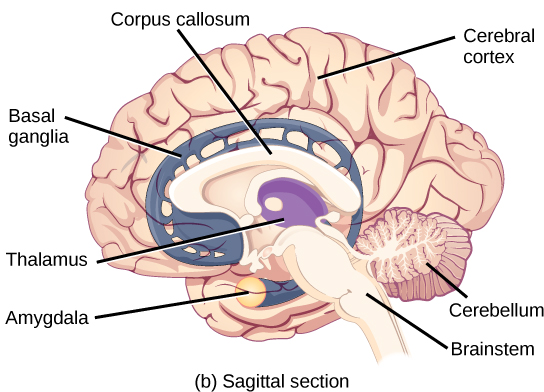
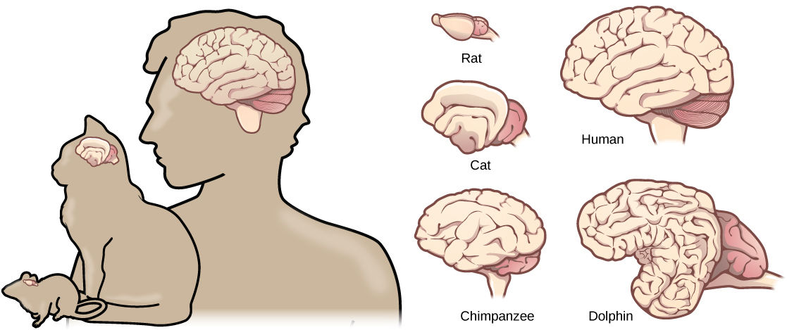

By the end of this section, you will be able to:
* Identify the spinal cord, cerebral lobes, and other brain areas on a diagram of the brain
* Describe the basic functions of the spinal cord, cerebral lobes, and other brain areas

The central nervous system (CNS) is made up of the brain, a part of which is shown in [\[link\]](#fig-ch35_03_01) and spinal cord and is covered with three layers of protective coverings called **meninges**{: data-type="term"} (from the Greek word for membrane). The outermost layer is the **dura mater**{: data-type="term"} (Latin for “hard mother”). As the Latin suggests, the primary function for this thick layer is to protect the brain and spinal cord. The dura mater also contains vein-like structures that carry blood from the brain back to the heart. The middle layer is the web-like **arachnoid mater**{: data-type="term"}. The last layer is the **pia mater**{: data-type="term"} (Latin for “soft mother”), which directly contacts and covers the brain and spinal cord like plastic wrap. The space between the arachnoid and pia maters is filled with **cerebrospinal fluid (CSF)**{: data-type="term"}. CSF is produced by a tissue called **choroid plexus**{: data-type="term"} in fluid-filled compartments in the CNS called **ventricles**{: data-type="term"}. The brain floats in CSF, which acts as a cushion and shock absorber and makes the brain neutrally buoyant. CSF also functions to circulate chemical substances throughout the brain and into the spinal cord.

The entire brain contains only about 8.5 tablespoons of CSF, but CSF is constantly produced in the ventricles. This creates a problem when a ventricle is blocked—the CSF builds up and creates swelling and the brain is pushed against the skull. This swelling condition is called hydrocephalus (“water head”) and can cause seizures, cognitive problems, and even death if a shunt is not inserted to remove the fluid and pressure.

 "){: #fig-ch35_03_01}

# Brain

The brain is the part of the central nervous system that is contained in the cranial cavity of the skull. It includes the cerebral cortex, limbic system, basal ganglia, thalamus, hypothalamus, and cerebellum. There are three different ways that a brain can be sectioned in order to view internal structures: a sagittal section cuts the brain left to right, as shown in [\[link\]](#fig-ch35_03_03)**b**, a coronal section cuts the brain front to back, as shown in [\[link\]](#fig-ch35_03_02)**a**, and a horizontal section cuts the brain top to bottom.

## Cerebral Cortex

The outermost part of the brain is a thick piece of nervous system tissue called the **cerebral cortex**{: data-type="term"}, which is folded into hills called **gyri**{: data-type="term"} (singular: gyrus) and valleys called **sulci**{: data-type="term"} (singular: sulcus). The cortex is made up of two hemispheres—right and left—which are separated by a large sulcus. A thick fiber bundle called the **corpus callosum**{: data-type="term"} (Latin: “tough body”) connects the two hemispheres and allows information to be passed from one side to the other. Although there are some brain functions that are localized more to one hemisphere than the other, the functions of the two hemispheres are largely redundant. In fact, sometimes (very rarely) an entire hemisphere is removed to treat severe epilepsy. While patients do suffer some deficits following the surgery, they can have surprisingly few problems, especially when the surgery is performed on children who have very immature nervous systems.

<figure markdown="1" id="fig-ch35_03_02" class=" " data-orient="horizontal">
<figcaption>
These illustrations show the (a) coronal and (b) sagittal sections of the human brain.
</figcaption>
![Illustration shows coronal (front) and sagittal (side) sections of a human brain. In the coronal section, the large upper part of the brain, called the cerebral cortex, is divided into left and right hemispheres. A cavity resembling butterfly wings exists between the left and right cortex. The corpus callosum is a band that connects the two hemispheres together, just above this cavity. The surface of the cerebral cortex contains bumpy protrusions called gyri. The cerebral cortex is anchored by the brain stem, which connects with the spinal cord. On either side of the brainstem tucked beneath the cerebral cortex is the cerebellum. The surface of the cerebellum is bumpy, but not as bumpy as the cerebral cortex. The sagittal section reveals that the cerebral cortex makes up the front and top part of the brain, while the brainstem and cerebellum make up the lower back part. The oval thalamus sits in the cavity in the middle of the cerebral cortex. The corpus callosum wraps around the top part thalamus. The basal ganglia wraps around the corpus callosum, starting at the lower front part of the brain and continuing three-quarters of the way around so the back end almost meets the front end. The basal ganglia is separated into segments that are connected along the top and bottom. The amygdala is a spherical structure at the end of the basal ganglia.](../resources/Figure_35_03_02a.jpg){:}

{:}

</figure>

In other surgeries to treat severe epilepsy, the corpus callosum is cut instead of removing an entire hemisphere. This causes a condition called split-brain, which gives insights into unique functions of the two hemispheres. For example, when an object is presented to patients’ left visual field, they may be unable to verbally name the object (and may claim to not have seen an object at all). This is because the visual input from the left visual field crosses and enters the right hemisphere and cannot then signal to the speech center, which generally is found in the left side of the brain. Remarkably, if a split-brain patient is asked to pick up a specific object out of a group of objects with the left hand, the patient will be able to do so but will still be unable to vocally identify it.

Link to Learning

  
See [this website][1]{: target="_window"} to learn more about split-brain patients and to play a game where you can model the split-brain experiments yourself.

Each cortical hemisphere contains regions called lobes that are involved in different functions. Scientists use various techniques to determine what brain areas are involved in different functions: they examine patients who have had injuries or diseases that affect specific areas and see how those areas are related to functional deficits. They also conduct animal studies where they stimulate brain areas and see if there are any behavioral changes. They use a technique called transmagnetic stimulation (TMS) to temporarily deactivate specific parts of the cortex using strong magnets placed outside the head; and they use functional magnetic resonance imaging (fMRI) to look at changes in oxygenated blood flow in particular brain regions that correlate with specific behavioral tasks. These techniques, and others, have given great insight into the functions of different brain regions but have also showed that any given brain area can be involved in more than one behavior or process, and any given behavior or process generally involves neurons in multiple brain areas. That being said, each hemisphere of the mammalian cerebral cortex can be broken down into four functionally and spatially defined lobes: frontal, parietal, temporal, and occipital. [\[link\]](#fig-ch35_03_03) illustrates these four lobes of the human cerebral cortex.

 ![Sagittal, or side view of the human brain shows the different lobes of the cerebral cortex. The frontal lobe is at the front center of the brain. The parietal lobe is at the top back part of the brain. The occipital lobe is at the back of the brain, and the temporal lobe is at the bottom center of the brain. The motor cortex is the back of the frontal lobe, and the olfactory bulb is the bottom part. The somatosensory cortex is the front part of the parietal lobe. The brainstem is beneath the temporal lobe, and the cerebellum is beneath the occipital lobe.](../resources/Figure_35_03_03.png "The human cerebral cortex includes the frontal, parietal, temporal, and occipital lobes."){: #fig-ch35_03_03}

The **frontal lobe**{: data-type="term"} is located at the front of the brain, over the eyes. This lobe contains the olfactory bulb, which processes smells. The frontal lobe also contains the motor cortex, which is important for planning and implementing movement. Areas within the motor cortex map to different muscle groups, and there is some organization to this map, as shown in [\[link\]](#fig-ch35_03_04). For example, the neurons that control movement of the fingers are next to the neurons that control movement of the hand. Neurons in the frontal lobe also control cognitive functions like maintaining attention, speech, and decision-making. Studies of humans who have damaged their frontal lobes show that parts of this area are involved in personality, socialization, and assessing risk.

 {: #fig-ch35_03_04}

The **parietal**{: data-type="term"} **lobe**{: data-type="term"} is located at the top of the brain. Neurons in the parietal lobe are involved in speech and also reading. Two of the parietal lobe’s main functions are processing **somatosensation**{: data-type="term"}—touch sensations like pressure, pain, heat, cold—and processing **proprioception**{: data-type="term"}—the sense of how parts of the body are oriented in space. The parietal lobe contains a somatosensory map of the body similar to the motor cortex.

The **occipital**{: data-type="term"} **lobe**{: data-type="term"} is located at the back of the brain. It is primarily involved in vision—seeing, recognizing, and identifying the visual world.

The **temporal**{: data-type="term"} **lobe**{: data-type="term"} is located at the base of the brain by your ears and is primarily involved in processing and interpreting sounds. It also contains the **hippocampus**{: data-type="term"} (Greek for “seahorse”)—a structure that processes memory formation. The hippocampus is illustrated in [\[link\]](#fig-ch35_03_06). The role of the hippocampus in memory was partially determined by studying one famous epileptic patient, HM, who had both sides of his hippocampus removed in an attempt to cure his epilepsy. His seizures went away, but he could no longer form new memories (although he could remember some facts from before his surgery and could learn new motor tasks).

Evolution Connection

### Cerebral Cortex

Compared to other vertebrates, mammals have exceptionally large brains for their body size. An entire alligator’s brain, for example, would fill about one and a half teaspoons. This increase in brain to body size ratio is especially pronounced in apes, whales, and dolphins. While this increase in overall brain size doubtlessly played a role in the evolution of complex behaviors unique to mammals, it does not tell the whole story. Scientists have found a relationship between the relatively high surface area of the cortex and the intelligence and complex social behaviors exhibited by some mammals. This increased surface area is due, in part, to increased folding of the cortical sheet (more sulci and gyri). For example, a rat cortex is very smooth with very few sulci and gyri. Cat and sheep cortices have more sulci and gyri. Chimps, humans, and dolphins have even more.

{: #fig-ch35_03_05}

## Basal Ganglia

Interconnected brain areas called the **basal ganglia**{: data-type="term"} (or **basal nuclei**{: data-type="term"}), shown in [\[link\]](#fig-ch35_03_02)**b**, play important roles in movement control and posture. Damage to the basal ganglia, as in Parkinson’s disease, leads to motor impairments like a shuffling gait when walking. The basal ganglia also regulate motivation. For example, when a wasp sting led to bilateral basal ganglia damage in a 25-year-old businessman, he began to spend all his days in bed and showed no interest in anything or anybody. But when he was externally stimulated—as when someone asked to play a card game with him—he was able to function normally. Interestingly, he and other similar patients do not report feeling bored or frustrated by their state.

## Thalamus

The **thalamus**{: data-type="term"} (Greek for “inner chamber”), illustrated in [\[link\]](#fig-ch35_03_06), acts as a gateway to and from the cortex. It receives sensory and motor inputs from the body and also receives feedback from the cortex. This feedback mechanism can modulate conscious awareness of sensory and motor inputs depending on the attention and arousal state of the animal. The thalamus helps regulate consciousness, arousal, and sleep states. A rare genetic disorder called fatal familial insomnia causes the degeneration of thalamic neurons and glia. This disorder prevents affected patients from being able to sleep, among other symptoms, and is eventually fatal.

 {: #fig-ch35_03_06}

## Hypothalamus

Below the thalamus is the **hypothalamus**{: data-type="term"}, shown in [\[link\]](#fig-ch35_03_06). The hypothalamus controls the endocrine system by sending signals to the pituitary gland, a pea-sized endocrine gland that releases several different hormones that affect other glands as well as other cells. This relationship means that the hypothalamus regulates important behaviors that are controlled by these hormones. The hypothalamus is the body’s thermostat—it makes sure key functions like food and water intake, energy expenditure, and body temperature are kept at appropriate levels. Neurons within the hypothalamus also regulate circadian rhythms, sometimes called sleep cycles.

## Limbic System

The **limbic system**{: data-type="term"} is a connected set of structures that regulates emotion, as well as behaviors related to fear and motivation. It plays a role in memory formation and includes parts of the thalamus and hypothalamus as well as the hippocampus. One important structure within the limbic system is a temporal lobe structure called the **amygdala**{: data-type="term"} (Greek for “almond”), illustrated in [\[link\]](#fig-ch35_03_06). The two amygdala are important both for the sensation of fear and for recognizing fearful faces. The **cingulate gyrus**{: data-type="term"} helps regulate emotions and pain.

## Cerebellum

The **cerebellum**{: data-type="term"} (Latin for “little brain”), shown in [\[link\]](#fig-ch35_03_03), sits at the base of the brain on top of the brainstem. The cerebellum controls balance and aids in coordinating movement and learning new motor tasks.

## Brainstem

The **brainstem**{: data-type="term"}, illustrated in [\[link\]](#fig-ch35_03_03), connects the rest of the brain with the spinal cord. It consists of the midbrain, medulla oblongata, and the pons. Motor and sensory neurons extend through the brainstem allowing for the relay of signals between the brain and spinal cord. Ascending neural pathways cross in this section of the brain allowing the left hemisphere of the cerebrum to control the right side of the body and vice versa. The brainstem coordinates motor control signals sent from the brain to the body. The brainstem controls several important functions of the body including alertness, arousal, breathing, blood pressure, digestion, heart rate, swallowing, walking, and sensory and motor information integration.

# Spinal Cord

Connecting to the brainstem and extending down the body through the spinal column is the **spinal cord**{: data-type="term"}, shown in [\[link\]](#fig-ch35_03_03). The spinal cord is a thick bundle of nerve tissue that carries information about the body to the brain and from the brain to the body. The spinal cord is contained within the bones of the vertebrate column but is able to communicate signals to and from the body through its connections with spinal nerves (part of the peripheral nervous system). A cross-section of the spinal cord looks like a white oval containing a gray butterfly-shape, as illustrated in [\[link\]](#fig-ch35_03_07). Myelinated axons make up the “white matter” and neuron and glial cell bodies make up the “gray matter.” Gray matter is also composed of interneurons, which connect two neurons each located in different parts of the body. Axons and cell bodies in the dorsal (facing the back of the animal) spinal cord convey mostly sensory information from the body to the brain. Axons and cell bodies in the ventral (facing the front of the animal) spinal cord primarily transmit signals controlling movement from the brain to the body.

The spinal cord also controls motor reflexes. These reflexes are quick, unconscious movements—like automatically removing a hand from a hot object. Reflexes are so fast because they involve local synaptic connections. For example, the knee reflex that a doctor tests during a routine physical is controlled by a single synapse between a sensory neuron and a motor neuron. While a reflex may only require the involvement of one or two synapses, synapses with interneurons in the spinal column transmit information to the brain to convey what happened (the knee jerked, or the hand was hot).

In the United States, there around 10,000 spinal cord injuries each year. Because the spinal cord is the information superhighway connecting the brain with the body, damage to the spinal cord can lead to paralysis. The extent of the paralysis depends on the location of the injury along the spinal cord and whether the spinal cord was completely severed. For example, if the spinal cord is damaged at the level of the neck, it can cause paralysis from the neck down, whereas damage to the spinal column further down may limit paralysis to the legs. Spinal cord injuries are notoriously difficult to treat because spinal nerves do not regenerate, although ongoing research suggests that stem cell transplants may be able to act as a bridge to reconnect severed nerves. Researchers are also looking at ways to prevent the inflammation that worsens nerve damage after injury. One such treatment is to pump the body with cold saline to induce hypothermia. This cooling can prevent swelling and other processes that are thought to worsen spinal cord injuries.

  and white matter (containing axons)."){: #fig-ch35_03_07}

# Section Summary

The vertebrate central nervous system contains the brain and the spinal cord, which are covered and protected by three meninges. The brain contains structurally and functionally defined regions. In mammals, these include the cortex (which can be broken down into four primary functional lobes: frontal, temporal, occipital, and parietal), basal ganglia, thalamus, hypothalamus, limbic system, cerebellum, and brainstem—although structures in some of these designations overlap. While functions may be primarily localized to one structure in the brain, most complex functions, like language and sleep, involve neurons in multiple brain regions. The spinal cord is the information superhighway that connects the brain with the rest of the body through its connections with peripheral nerves. It transmits sensory and motor input and also controls motor reflexes.

# Review Questions

The \_\_\_\_\_\_\_\_ lobe contains the visual cortex.

1.  frontal
2.  parietal
3.  temporal
4.  occipital
{: data-number-style="lower-alpha"}

D

The \_\_\_\_\_\_\_\_ connects the two cerebral hemispheres.

1.  limbic system
2.  corpus callosum
3.  cerebellum
4.  pituitary
{: data-number-style="lower-alpha"}

B

Neurons in the \_\_\_\_\_\_\_\_ control motor reflexes.

1.  thalamus
2.  spinal cord
3.  parietal lobe
4.  hippocampus
{: data-number-style="lower-alpha"}

B

# Free Response

What methods can be used to determine the function of a particular brain region?

To determine the function of a specific brain area, scientists can look at patients who have damage in that brain area and see what symptoms they exhibit. Researchers can disable the brain structure temporarily using transcranial magnetic stimulation. They can disable or remove the area in an animal model. fMRI can be used to correlate specific functions with increased blood flow to brain regions.

What are the main functions of the spinal cord?

The spinal cord transmits sensory information from the body to the brain and motor commands from the brain to the body through its connections with peripheral nerves. It also controls motor reflexes.

## Glossary
{: data-type="glossary-title"}

amygdala
: structure within the limbic system that processes fear
{: .definition}

arachnoid mater
: spiderweb-like middle layer of the meninges that cover the central nervous system
{: .definition}

basal ganglia
: interconnected collections of cells in the brain that are involved in movement and motivation; also known as basal nuclei
{: .definition}

basal nuclei
: see basal ganglia
{: .definition}

brainstem
: portion of the brain that connects with the spinal cord; controls basic nervous system functions like breathing, heart rate, and swallowing
{: .definition}

cerebellum
: brain structure involved in posture, motor coordination, and learning new motor actions
{: .definition}

cerebral cortex
: outermost sheet of brain tissue; involved in many higher-order functions
{: .definition}

choroid plexus
: spongy tissue within ventricles that produces cerebrospinal fluid
{: .definition}

cingulate gyrus
: helps regulate emotions and pain; thought to directly drive the body’s conscious response to unpleasant experiences
{: .definition}

corpus callosum
: thick fiber bundle that connects the cerebral hemispheres
{: .definition}

cerebrospinal fluid (CSF)
: clear liquid that surrounds the brain and spinal cord and fills the ventricles and central canal; acts as a shock absorber and circulates material throughout the brain and spinal cord.
{: .definition}

dura mater
: tough outermost layer that covers the central nervous system
{: .definition}

frontal lobe
: part of the cerebral cortex that contains the motor cortex and areas involved in planning, attention, and language
{: .definition}

gyrus
: (plural: gyri) ridged protrusions in the cortex
{: .definition}

hippocampus
: brain structure in the temporal lobe involved in processing memories
{: .definition}

hypothalamus
: brain structure that controls hormone release and body homeostasis
{: .definition}

limbic system
: connected brain areas that process emotion and motivation
{: .definition}

meninge
: membrane that covers and protects the central nervous system
{: .definition}

occipital lobe
: part of the cerebral cortex that contains visual cortex and processes visual stimuli
{: .definition}

parietal lobe
: part of the cerebral cortex involved in processing touch and the sense of the body in space
{: .definition}

pia mater
: thin membrane layer directly covering the brain and spinal cord
{: .definition}

proprioception
: sense about how parts of the body are oriented in space
{: .definition}

somatosensation
: sense of touch
{: .definition}

spinal cord
: thick fiber bundle that connects the brain with peripheral nerves; transmits sensory and motor information; contains neurons that control motor reflexes
{: .definition}

sulcus
: (plural: sulci) indents or “valleys” in the cortex
{: .definition}

temporal lobe
: part of the cerebral cortex that processes auditory input; parts of the temporal lobe are involved in speech, memory, and emotion processing
{: .definition}

thalamus
: brain area that relays sensory information to the cortex
{: .definition}

ventricle
: cavity within brain that contains cerebrospinal fluid
{: .definition}

[1]: http://openstaxcollege.org/l/split-brain
