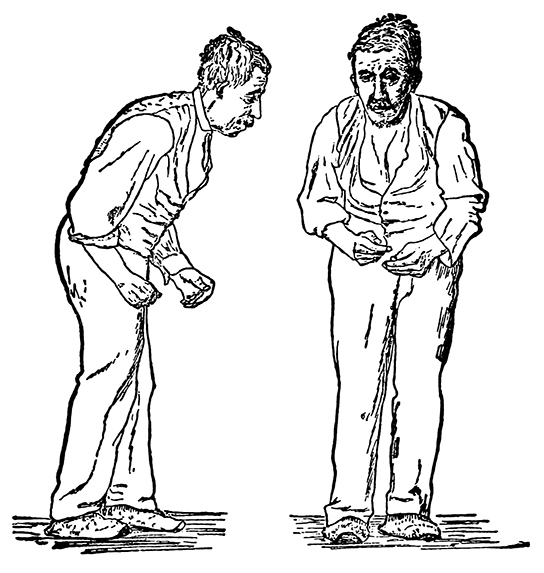

By the end of this section, you will be able to:
* Describe the symptoms, potential causes, and treatment of several examples of nervous system disorders

A nervous system that functions correctly is a fantastically complex, well-oiled machine—synapses fire appropriately, muscles move when needed, memories are formed and stored, and emotions are well regulated. Unfortunately, each year millions of people in the United States deal with some sort of nervous system disorder. While scientists have discovered potential causes of many of these diseases, and viable treatments for some, ongoing research seeks to find ways to better prevent and treat all of these disorders.

# Neurodegenerative Disorders

**Neurodegenerative disorders**{: data-type="term"} are illnesses characterized by a loss of nervous system functioning that are usually caused by neuronal death. These diseases generally worsen over time as more and more neurons die. The symptoms of a particular neurodegenerative disease are related to where in the nervous system the death of neurons occurs. Spinocerebellar ataxia, for example, leads to neuronal death in the cerebellum. The death of these neurons causes problems in balance and walking. Neurodegenerative disorders include Huntington’s disease, amyotrophic lateral sclerosis, Alzheimer’s disease and other types of dementia disorders, and Parkinson’s disease. Here, Alzheimer’s and Parkinson’s disease will be discussed in more depth.

## Alzheimer’s Disease

**Alzheimer’s disease**{: data-type="term"} is the most common cause of dementia in the elderly. In 2012, an estimated 5.4 million Americans suffered from Alzheimer’s disease, and payments for their care are estimated at $200 billion. Roughly one in every eight people age 65 or older has the disease. Due to the aging of the baby-boomer generation, there are projected to be as many as 13 million Alzheimer’s patients in the United States in the year 2050.

Symptoms of Alzheimer’s disease include disruptive memory loss, confusion about time or place, difficulty planning or executing tasks, poor judgment, and personality changes. Problems smelling certain scents can also be indicative of Alzheimer’s disease and may serve as an early warning sign. Many of these symptoms are also common in people who are aging normally, so it is the severity and longevity of the symptoms that determine whether a person is suffering from Alzheimer’s.

Alzheimer’s disease was named for Alois Alzheimer, a German psychiatrist who published a report in 1911 about a woman who showed severe dementia symptoms. Along with his colleagues, he examined the woman’s brain following her death and reported the presence of abnormal clumps, which are now called amyloid plaques, along with tangled brain fibers called neurofibrillary tangles. Amyloid plaques, neurofibrillary tangles, and an overall shrinking of brain volume are commonly seen in the brains of Alzheimer’s patients. Loss of neurons in the hippocampus is especially severe in advanced Alzheimer’s patients. [\[link\]](#fig-ch35_05_01) compares a normal brain to the brain of an Alzheimer’s patient. Many research groups are examining the causes of these hallmarks of the disease.

One form of the disease is usually caused by mutations in one of three known genes. This rare form of early onset Alzheimer’s disease affects fewer than five percent of patients with the disease and causes dementia beginning between the ages of 30 and 60. The more prevalent, late-onset form of the disease likely also has a genetic component. One particular gene, apolipoprotein E (APOE) has a variant (E4) that increases a carrier’s likelihood of getting the disease. Many other genes have been identified that might be involved in the pathology.

Link to Learning

  
Visit [this website][1]{: target="_window"} for video links discussing genetics and Alzheimer’s disease.

Unfortunately, there is no cure for Alzheimer’s disease. Current treatments focus on managing the symptoms of the disease. Because decrease in the activity of cholinergic neurons (neurons that use the neurotransmitter acetylcholine) is common in Alzheimer’s disease, several drugs used to treat the disease work by increasing acetylcholine neurotransmission, often by inhibiting the enzyme that breaks down acetylcholine in the synaptic cleft. Other clinical interventions focus on behavioral therapies like psychotherapy, sensory therapy, and cognitive exercises. Since Alzheimer’s disease appears to hijack the normal aging process, research into prevention is prevalent. Smoking, obesity, and cardiovascular problems may be risk factors for the disease, so treatments for those may also help to prevent Alzheimer’s disease. Some studies have shown that people who remain intellectually active by playing games, reading, playing musical instruments, and being socially active in later life have a reduced risk of developing the disease.

 , the brain from a patient with Alzheimer&#x2019;s disease (right) shows a dramatic neurodegeneration, particularly within the ventricles and hippocampus. (credit: modification of work by &#x201C;Garrando&#x201D;/Wikimedia Commons based on original images by ADEAR: &quot;Alzheimer's Disease Education and Referral Center, a service of the National Institute on Aging&#x201D;)&#10;"){: #fig-ch35_05_01}

## Parkinson’s Disease

Like Alzheimer’s disease, **Parkinson’s disease**{: data-type="term"} is a neurodegenerative disease. It was first characterized by James Parkinson in 1817. Each year, 50,000-60,000 people in the United States are diagnosed with the disease. Parkinson’s disease causes the loss of dopamine neurons in the substantia nigra, a midbrain structure that regulates movement. Loss of these neurons causes many symptoms including tremor (shaking of fingers or a limb), slowed movement, speech changes, balance and posture problems, and rigid muscles. The combination of these symptoms often causes a characteristic slow hunched shuffling walk, illustrated in [\[link\]](#fig-ch35_05_02). Patients with Parkinson’s disease can also exhibit psychological symptoms, such as dementia or emotional problems.

Although some patients have a form of the disease known to be caused by a single mutation, for most patients the exact causes of Parkinson’s disease remain unknown: the disease likely results from a combination of genetic and environmental factors (similar to Alzheimer’s disease). Post-mortem analysis of brains from Parkinson’s patients shows the presence of Lewy bodies—abnormal protein clumps—in dopaminergic neurons. The prevalence of these Lewy bodies often correlates with the severity of the disease.

There is no cure for Parkinson’s disease, and treatment is focused on easing symptoms. One of the most commonly prescribed drugs for Parkinson’s is L-DOPA, which is a chemical that is converted into dopamine by neurons in the brain. This conversion increases the overall level of dopamine neurotransmission and can help compensate for the loss of dopaminergic neurons in the substantia nigra. Other drugs work by inhibiting the enzyme that breaks down dopamine.

 {: #fig-ch35_05_02}

# Neurodevelopmental Disorders

Neurodevelopmental disorders occur when the development of the nervous system is disturbed. There are several different classes of neurodevelopmental disorders. Some, like Down Syndrome, cause intellectual deficits. Others specifically affect communication, learning, or the motor system. Some disorders like autism spectrum disorder and attention deficit/hyperactivity disorder have complex symptoms.

## Autism

**Autism spectrum disorder (ASD)**{: data-type="term"} is a neurodevelopmental disorder. Its severity differs from person to person. Estimates for the prevalence of the disorder have changed rapidly in the past few decades. Current estimates suggest that one in 88 children will develop the disorder. ASD is four times more prevalent in males than females.

Link to Learning

  
[This video][2]{: target="_window"} discusses possible reasons why there has been a recent increase in the number of people diagnosed with autism.

A characteristic symptom of ASD is impaired social skills. Children with autism may have difficulty making and maintaining eye contact and reading social cues. They also may have problems feeling empathy for others. Other symptoms of ASD include repetitive motor behaviors (such as rocking back and forth), preoccupation with specific subjects, strict adherence to certain rituals, and unusual language use. Up to 30 percent of patients with ASD develop epilepsy, and patients with some forms of the disorder (like Fragile X) also have intellectual disability. Because it is a spectrum disorder, other ASD patients are very functional and have good-to-excellent language skills. Many of these patients do not feel that they suffer from a disorder and instead think that their brains just process information differently.

Except for some well-characterized, clearly genetic forms of autism (like Fragile X and Rett’s Syndrome), the causes of ASD are largely unknown. Variants of several genes correlate with the presence of ASD, but for any given patient, many different mutations in different genes may be required for the disease to develop. At a general level, ASD is thought to be a disease of “incorrect” wiring. Accordingly, brains of some ASD patients lack the same level of synaptic pruning that occurs in non-affected people. In the 1990s, a research paper linked autism to a common vaccine given to children. This paper was retracted when it was discovered that the author falsified data, and follow-up studies showed no connection between vaccines and autism.

Treatment for autism usually combines behavioral therapies and interventions, along with medications to treat other disorders common to people with autism (depression, anxiety, obsessive compulsive disorder). Although early interventions can help mitigate the effects of the disease, there is currently no cure for ASD.

## Attention Deficit Hyperactivity Disorder (ADHD)

Approximately three to five percent of children and adults are affected by **attention deficit/hyperactivity disorder (ADHD)**{: data-type="term"}. Like ASD, ADHD is more prevalent in males than females. Symptoms of the disorder include inattention (lack of focus), executive functioning difficulties, impulsivity, and hyperactivity beyond what is characteristic of the normal developmental stage. Some patients do not have the hyperactive component of symptoms and are diagnosed with a subtype of ADHD: attention deficit disorder (ADD). Many people with ADHD also show comorbitity, in that they develop secondary disorders in addition to ADHD. Examples include depression or obsessive compulsive disorder (OCD). [\[link\]](#fig-ch35_05_03) provides some statistics concerning comorbidity with ADHD.

The cause of ADHD is unknown, although research points to a delay and dysfunction in the development of the prefrontal cortex and disturbances in neurotransmission. According to studies of twins, the disorder has a strong genetic component. There are several candidate genes that may contribute to the disorder, but no definitive links have been discovered. Environmental factors, including exposure to certain pesticides, may also contribute to the development of ADHD in some patients. Treatment for ADHD often involves behavioral therapies and the prescription of stimulant medications, which paradoxically cause a calming effect in these patients.

 ."){: #fig-ch35_05_03}

Career Connection

Neurologist Neurologists are physicians who specialize in disorders of the nervous system. They diagnose and treat disorders such as epilepsy, stroke, dementia, nervous system injuries, Parkinson’s disease, sleep disorders, and multiple sclerosis. Neurologists are medical doctors who have attended college, medical school, and completed three to four years of neurology residency.

When examining a new patient, a neurologist takes a full medical history and performs a complete physical exam. The physical exam contains specific tasks that are used to determine what areas of the brain, spinal cord, or peripheral nervous system may be damaged. For example, to check whether the hypoglossal nerve is functioning correctly, the neurologist will ask the patient to move his or her tongue in different ways. If the patient does not have full control over tongue movements, then the hypoglossal nerve may be damaged or there may be a lesion in the brainstem where the cell bodies of these neurons reside (or there could be damage to the tongue muscle itself).

Neurologists have other tools besides a physical exam they can use to diagnose particular problems in the nervous system. If the patient has had a seizure, for example, the neurologist can use electroencephalography (EEG), which involves taping electrodes to the scalp to record brain activity, to try to determine which brain regions are involved in the seizure. In suspected stroke patients, a neurologist can use a computerized tomography (CT) scan, which is a type of X-ray, to look for bleeding in the brain or a possible brain tumor. To treat patients with neurological problems, neurologists can prescribe medications or refer the patient to a neurosurgeon for surgery.

Link to Learning

  
[This website][3]{: target="_window"} allows you to see the different tests a neurologist might use to see what regions of the nervous system may be damaged in a patient.

## Mental Illnesses

Mental illnesses are nervous system disorders that result in problems with thinking, mood, or relating with other people. These disorders are severe enough to affect a person’s quality of life and often make it difficult for people to perform the routine tasks of daily living. Debilitating mental disorders plague approximately 12.5 million Americans (about 1 in 17 people) at an annual cost of more than $300 billion. There are several types of mental disorders including schizophrenia, major depression, bipolar disorder, anxiety disorders and phobias, post-traumatic stress disorders, and obsessive-compulsive disorder (OCD), among others. The American Psychiatric Association publishes the Diagnostic and Statistical Manual of Mental Disorders (or DSM), which describes the symptoms required for a patient to be diagnosed with a particular mental disorder. Each newly released version of the DSM contains different symptoms and classifications as scientists learn more about these disorders, their causes, and how they relate to each other. A more detailed discussion of two mental illnesses—schizophrenia and major depression—is given below.

## Schizophrenia

**Schizophrenia**{: data-type="term"} is a serious and often debilitating mental illness affecting one percent of people in the United States. Symptoms of the disease include the inability to differentiate between reality and imagination, inappropriate and unregulated emotional responses, difficulty thinking, and problems with social situations. People with schizophrenia can suffer from hallucinations and hear voices; they may also suffer from delusions. Patients also have so-called “negative” symptoms like a flattened emotional state, loss of pleasure, and loss of basic drives. Many schizophrenic patients are diagnosed in their late adolescence or early 20s. The development of schizophrenia is thought to involve malfunctioning dopaminergic neurons and may also involve problems with glutamate signaling. Treatment for the disease usually requires antipsychotic medications that work by blocking dopamine receptors and decreasing dopamine neurotransmission in the brain. This decrease in dopamine can cause Parkinson’s disease-like symptoms in some patients. While some classes of antipsychotics can be quite effective at treating the disease, they are not a cure, and most patients must remain medicated for the rest of their lives.

## Depression

**Major depression**{: data-type="term"} affects approximately 6.7 percent of the adults in the United States each year and is one of the most common mental disorders. To be diagnosed with major depressive disorder, a person must have experienced a severely depressed mood lasting longer than two weeks along with other symptoms including a loss of enjoyment in activities that were previously enjoyed, changes in appetite and sleep schedules, difficulty concentrating, feelings of worthlessness, and suicidal thoughts. The exact causes of major depression are unknown and likely include both genetic and environmental risk factors. Some research supports the “classic monoamine hypothesis,” which suggests that depression is caused by a decrease in norepinephrine and serotonin neurotransmission. One argument against this hypothesis is the fact that some antidepressant medications cause an increase in norepinephrine and serotonin release within a few hours of beginning treatment—but clinical results of these medications are not seen until weeks later. This has led to alternative hypotheses: for example, dopamine may also be decreased in depressed patients, or it may actually be an increase in norepinephrine and serotonin that causes the disease, and antidepressants force a feedback loop that decreases this release. Treatments for depression include psychotherapy, electroconvulsive therapy, deep-brain stimulation, and prescription medications. There are several classes of antidepressant medications that work through different mechanisms. For example, monoamine oxidase inhibitors (MAO inhibitors) block the enzyme that degrades many neurotransmitters (including dopamine, serotonin, norepinephrine), resulting in increased neurotransmitter in the synaptic cleft. Selective serotonin reuptake inhibitors (SSRIs) block the reuptake of serotonin into the presynaptic neuron. This blockage results in an increase in serotonin in the synaptic cleft. Other types of drugs such as norepinephrine-dopamine reuptake inhibitors and norepinephrine-serotonin reuptake inhibitors are also used to treat depression.

# Other Neurological Disorders

There are several other neurological disorders that cannot be easily placed in the above categories. These include chronic pain conditions, cancers of the nervous system, epilepsy disorders, and stroke. Epilepsy and stroke are discussed below.

## Epilepsy

Estimates suggest that up to three percent of people in the United States will be diagnosed with **epilepsy**{: data-type="term"} in their lifetime. While there are several different types of epilepsy, all are characterized by recurrent seizures. Epilepsy itself can be a symptom of a brain injury, disease, or other illness. For example, people who have intellectual disability or ASD can experience seizures, presumably because the developmental wiring malfunctions that caused their disorders also put them at risk for epilepsy. For many patients, however, the cause of their epilepsy is never identified and is likely to be a combination of genetic and environmental factors. Often, seizures can be controlled with anticonvulsant medications. However, for very severe cases, patients may undergo brain surgery to remove the brain area where seizures originate.

## Stroke

A stroke results when blood fails to reach a portion of the brain for a long enough time to cause damage. Without the oxygen supplied by blood flow, neurons in this brain region die. This neuronal death can cause many different symptoms—depending on the brain area affected— including headache, muscle weakness or paralysis, speech disturbances, sensory problems, memory loss, and confusion. Stroke is often caused by blood clots and can also be caused by the bursting of a weak blood vessel. Strokes are extremely common and are the third most common cause of death in the United States. On average one person experiences a stroke every 40 seconds in the United States. Approximately 75 percent of strokes occur in people older than 65. Risk factors for stroke include high blood pressure, diabetes, high cholesterol, and a family history of stroke. Smoking doubles the risk of stroke. Because a stroke is a medical emergency, patients with symptoms of a stroke should immediately go to the emergency room, where they can receive drugs that will dissolve any clot that may have formed. These drugs will not work if the stroke was caused by a burst blood vessel or if the stroke occurred more than three hours before arriving at the hospital. Treatment following a stroke can include blood pressure medication (to prevent future strokes) and (sometimes intense) physical therapy.

# Section Summary

Some general themes emerge from the sampling of nervous system disorders presented above. The causes for most disorders are not fully understood—at least not for all patients—and likely involve a combination of nature (genetic mutations that become risk factors) and nurture (emotional trauma, stress, hazardous chemical exposure). Because the causes have yet to be fully determined, treatment options are often lacking and only address symptoms.

# Review Questions

Parkinson’s disease is a caused by the degeneration of neurons that release \_\_\_\_\_\_\_\_.

1.  serotonin
2.  dopamine
3.  glutamate
4.  norepinephrine
{: data-number-style="lower-alpha"}

B

\_\_\_\_\_\_\_\_ medications are often used to treat patients with ADHD.

1.  Tranquilizer
2.  Antibiotic
3.  Stimulant
4.  Anti-seizure
{: data-number-style="lower-alpha"}

C

Strokes are often caused by \_\_\_\_\_\_\_\_.

1.  neurodegeneration
2.  blood clots or burst blood vessels
3.  seizures
4.  viruses
{: data-number-style="lower-alpha"}

B

# Free Response

What are the main symptoms of Alzheimer’s disease?

Symptoms of Alzheimer’s disease include disruptive memory loss, confusion about time or place, difficulties planning or executing tasks, poor judgment, and personality changes.

What are possible treatments for patients with major depression?

Possible treatments for patients with major depression include psychotherapy and prescription medications. MAO inhibitor drugs inhibit the breakdown of certain neurotransmitters (including dopamine, serotonin, norepinephrine) in the synaptic cleft. SSRI medications inhibit the reuptake of serotonin into the presynaptic neuron.

## Glossary
{: data-type="glossary-title"}

Alzheimer’s disease
: neurodegenerative disorder characterized by problems with memory and thinking
{: .definition}

attention deficit hyperactivity disorder (ADHD)
: neurodevelopmental disorder characterized by difficulty maintaining attention and controlling impulses
{: .definition}

autism spectrum disorder (ASD)
: neurodevelopmental disorder characterized by impaired social interaction and communication abilities
{: .definition}

epilepsy
: neurological disorder characterized by recurrent seizures
{: .definition}

major depression
: mental illness characterized by prolonged periods of sadness
{: .definition}

neurodegenerative disorder
: nervous system disorder characterized by the progressive loss of neurological functioning, usually caused by neuron death
{: .definition}

Parkinson’s disease
: neurodegenerative disorder that affects the control of movement
{: .definition}

schizophrenia
: mental disorder characterized by the inability to accurately perceive reality; patients often have difficulty thinking clearly and can suffer from delusions
{: .definition}

[1]: http://openstaxcollege.org/l/alzheimers
[2]: http://openstaxcollege.org/l/autism
[3]: http://openstaxcollege.org/l/neurologic_exam
