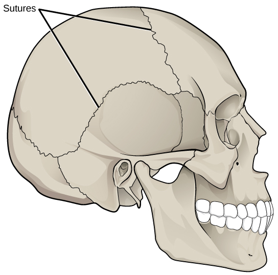
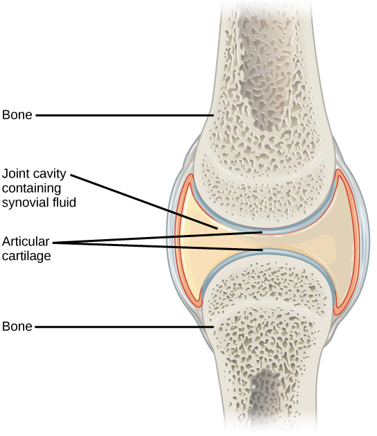
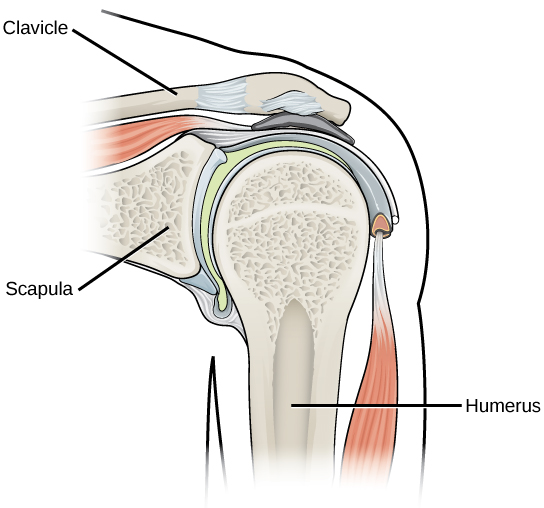

By the end of this section, you will be able to:
* Classify the different types of joints on the basis of structure
* Explain the role of joints in skeletal movement

The point at which two or more bones meet is called a **joint**{: data-type="term"}, or **articulation**{: data-type="term"}. Joints are responsible for movement, such as the movement of limbs, and stability, such as the stability found in the bones of the skull.

### Classification of Joints on the Basis of Structure

There are two ways to classify joints: on the basis of their structure or on the basis of their function. The structural classification divides joints into bony, fibrous, cartilaginous, and synovial joints depending on the material composing the joint and the presence or absence of a cavity in the joint.

#### Fibrous Joints

The bones of **fibrous joints**{: data-type="term"} are held together by fibrous connective tissue. There is no cavity, or space, present between the bones and so most fibrous joints do not move at all, or are only capable of minor movements. There are three types of fibrous joints: sutures, syndesmoses, and gomphoses. **Sutures**{: data-type="term"} are found only in the skull and possess short fibers of connective tissue that hold the skull bones tightly in place ([\[link\]](#fig-ch38_03_01)).

 {: #fig-ch38_03_01}

**Syndesmoses**{: data-type="term"} are joints in which the bones are connected by a band of connective tissue, allowing for more movement than in a suture. An example of a syndesmosis is the joint of the tibia and fibula in the ankle. The amount of movement in these types of joints is determined by the length of the connective tissue fibers. **Gomphoses**{: data-type="term"} occur between teeth and their sockets; the term refers to the way the tooth fits into the socket like a peg ([\[link\]](#fig-ch38_03_02)). The tooth is connected to the socket by a connective tissue referred to as the periodontal ligament.

 "){: #fig-ch38_03_02}

#### Cartilaginous Joints

**Cartilaginous joints**{: data-type="term"} are joints in which the bones are connected by cartilage. There are two types of cartilaginous joints: synchondroses and symphyses. In a **synchondrosis**{: data-type="term"}, the bones are joined by hyaline cartilage. Synchondroses are found in the epiphyseal plates of growing bones in children. In **symphyses**{: data-type="term"}, hyaline cartilage covers the end of the bone but the connection between bones occurs through fibrocartilage. Symphyses are found at the joints between vertebrae. Either type of cartilaginous joint allows for very little movement.

#### Synovial Joints

**Synovial joints**{: data-type="term"} are the only joints that have a space between the adjoining bones ([\[link\]](#fig-ch38_03_03)). This space is referred to as the synovial (or joint) cavity and is filled with synovial fluid. Synovial fluid lubricates the joint, reducing friction between the bones and allowing for greater movement. The ends of the bones are covered with articular cartilage, a hyaline cartilage, and the entire joint is surrounded by an articular capsule composed of connective tissue that allows movement of the joint while resisting dislocation. Articular capsules may also possess ligaments that hold the bones together. Synovial joints are capable of the greatest movement of the three structural joint types; however, the more mobile a joint, the weaker the joint. Knees, elbows, and shoulders are examples of synovial joints.

 {: #fig-ch38_03_03}

### Classification of Joints on the Basis of Function

The functional classification divides joints into three categories: synarthroses, amphiarthroses, and diarthroses. A **synarthrosis**{: data-type="term"} is a joint that is immovable. This includes sutures, gomphoses, and synchondroses. **Amphiarthroses**{: data-type="term"} are joints that allow slight movement, including syndesmoses and symphyses. **Diarthroses**{: data-type="term"} are joints that allow for free movement of the joint, as in synovial joints.

### Movement at Synovial Joints

The wide range of movement allowed by synovial joints produces different types of movements. The movement of synovial joints can be classified as one of four different types: gliding, angular, rotational, or special movement.

#### Gliding Movement

**Gliding movements**{: data-type="term"} occur as relatively flat bone surfaces move past each other. Gliding movements produce very little rotation or angular movement of the bones. The joints of the carpal and tarsal bones are examples of joints that produce gliding movements.

#### Angular Movement

**Angular movements**{: data-type="term"} are produced when the angle between the bones of a joint changes. There are several different types of angular movements, including flexion, extension, hyperextension, abduction, adduction, and circumduction. **Flexion**{: data-type="term"}, or bending, occurs when the angle between the bones decreases. Moving the forearm upward at the elbow or moving the wrist to move the hand toward the forearm are examples of flexion. **Extension**{: data-type="term"} is the opposite of flexion in that the angle between the bones of a joint increases. Straightening a limb after flexion is an example of extension. Extension past the regular anatomical position is referred to as **hyperextension**{: data-type="term"}. This includes moving the neck back to look upward, or bending the wrist so that the hand moves away from the forearm.

**Abduction**{: data-type="term"} occurs when a bone moves away from the midline of the body. Examples of abduction are moving the arms or legs laterally to lift them straight out to the side. **Adduction**{: data-type="term"} is the movement of a bone toward the midline of the body. Movement of the limbs inward after abduction is an example of adduction. **Circumduction**{: data-type="term"} is the movement of a limb in a circular motion, as in moving the arm in a circular motion.

#### Rotational Movement

**Rotational movement**{: data-type="term"} is the movement of a bone as it rotates around its longitudinal axis. Rotation can be toward the midline of the body, which is referred to as **medial rotation**{: data-type="term"}, or away from the midline of the body, which is referred to as **lateral rotation**{: data-type="term"}. Movement of the head from side to side is an example of rotation.

#### Special Movements

Some movements that cannot be classified as gliding, angular, or rotational are called special movements. **Inversion**{: data-type="term"} involves the soles of the feet moving inward, toward the midline of the body. **Eversion**{: data-type="term"} is the opposite of inversion, movement of the sole of the foot outward, away from the midline of the body. **Protraction**{: data-type="term"} is the anterior movement of a bone in the horizontal plane. **Retraction**{: data-type="term"} occurs as a joint moves back into position after protraction. Protraction and retraction can be seen in the movement of the mandible as the jaw is thrust outwards and then back inwards. **Elevation**{: data-type="term"} is the movement of a bone upward, such as when the shoulders are shrugged, lifting the scapulae. **Depression**{: data-type="term"} is the opposite of elevation—movement downward of a bone, such as after the shoulders are shrugged and the scapulae return to their normal position from an elevated position. **Dorsiflexion**{: data-type="term"} is a bending at the ankle such that the toes are lifted toward the knee. **Plantar flexion**{: data-type="term"} is a bending at the ankle when the heel is lifted, such as when standing on the toes. **Supination**{: data-type="term"} is the movement of the radius and ulna bones of the forearm so that the palm faces forward. **Pronation**{: data-type="term"} is the opposite movement, in which the palm faces backward. **Opposition**{: data-type="term"} is the movement of the thumb toward the fingers of the same hand, making it possible to grasp and hold objects.

### Types of Synovial Joints

Synovial joints are further classified into six different categories on the basis of the shape and structure of the joint. The shape of the joint affects the type of movement permitted by the joint ([\[link\]](#fig-ch38_03_04)). These joints can be described as planar, hinge, pivot, condyloid, saddle, or ball-and-socket joints.

 {: #fig-ch38_03_04}

#### Planar Joints

**Planar joints**{: data-type="term"} have bones with articulating surfaces that are flat or slightly curved faces. These joints allow for gliding movements, and so the joints are sometimes referred to as gliding joints. The range of motion is limited in these joints and does not involve rotation. Planar joints are found in the carpal bones in the hand and the tarsal bones of the foot, as well as between vertebrae ([\[link\]](#fig-ch38_03_05)).

 "){: #fig-ch38_03_05}

#### Hinge Joints

In **hinge joints**{: data-type="term"}, the slightly rounded end of one bone fits into the slightly hollow end of the other bone. In this way, one bone moves while the other remains stationary, like the hinge of a door. The elbow is an example of a hinge joint. The knee is sometimes classified as a modified hinge joint ([\[link\]](#fig-ch38_03_06)).

 "){: #fig-ch38_03_06}

#### Pivot Joints

**Pivot joints**{: data-type="term"} consist of the rounded end of one bone fitting into a ring formed by the other bone. This structure allows rotational movement, as the rounded bone moves around its own axis. An example of a pivot joint is the joint of the first and second vertebrae of the neck that allows the head to move back and forth ([\[link\]](#fig-ch38_03_07)). The joint of the wrist that allows the palm of the hand to be turned up and down is also a pivot joint.

 {: #fig-ch38_03_07}

#### Condyloid Joints

**Condyloid joints**{: data-type="term"} consist of an oval-shaped end of one bone fitting into a similarly oval-shaped hollow of another bone ([\[link\]](#fig-ch38_03_08)). This is also sometimes called an ellipsoidal joint. This type of joint allows angular movement along two axes, as seen in the joints of the wrist and fingers, which can move both side to side and up and down.

 "){: #fig-ch38_03_08}

#### Saddle Joints

**Saddle joints**{: data-type="term"} are so named because the ends of each bone resemble a saddle, with concave and convex portions that fit together. Saddle joints allow angular movements similar to condyloid joints but with a greater range of motion. An example of a saddle joint is the thumb joint, which can move back and forth and up and down, but more freely than the wrist or fingers ([\[link\]](#fig-ch38_03_09)).

 "){: #fig-ch38_03_09}

#### Ball-and-Socket Joints

**Ball-and-socket joints**{: data-type="term"} possess a rounded, ball-like end of one bone fitting into a cuplike socket of another bone. This organization allows the greatest range of motion, as all movement types are possible in all directions. Examples of ball-and-socket joints are the shoulder and hip joints ([\[link\]](#fig-ch38_03_10)).

 {: #fig-ch38_03_10}

Link to Learning

Watch this animation showing the six types of synovial joints.

<iframe width="660" height="371.4" src="https://www.openstaxcollege.org/l/synovial_joints"></iframe>

Career Connection

Rheumatologist Rheumatologists are medical doctors who specialize in the diagnosis and treatment of disorders of the joints, muscles, and bones. They diagnose and treat diseases such as arthritis, musculoskeletal disorders, osteoporosis, and autoimmune diseases such as ankylosing spondylitis and rheumatoid arthritis.

Rheumatoid arthritis (RA) is an inflammatory disorder that primarily affects the synovial joints of the hands, feet, and cervical spine. Affected joints become swollen, stiff, and painful. Although it is known that RA is an autoimmune disease in which the body’s immune system mistakenly attacks healthy tissue, the cause of RA remains unknown. Immune cells from the blood enter joints and the synovium causing cartilage breakdown, swelling, and inflammation of the joint lining. Breakdown of cartilage causes bones to rub against each other causing pain. RA is more common in women than men and the age of onset is usually 40–50 years of age.

Rheumatologists can diagnose RA on the basis of symptoms such as joint inflammation and pain, X-ray and MRI imaging, and blood tests. Arthrography is a type of medical imaging of joints that uses a contrast agent, such as a dye, that is opaque to X-rays. This allows the soft tissue structures of joints—such as cartilage, tendons, and ligaments—to be visualized. An arthrogram differs from a regular X-ray by showing the surface of soft tissues lining the joint in addition to joint bones. An arthrogram allows early degenerative changes in joint cartilage to be detected before bones become affected.

There is currently no cure for RA; however, rheumatologists have a number of treatment options available. Early stages can be treated with rest of the affected joints by using a cane or by using joint splints that minimize inflammation. When inflammation has decreased, exercise can be used to strengthen the muscles that surround the joint and to maintain joint flexibility. If joint damage is more extensive, medications can be used to relieve pain and decrease inflammation. Anti-inflammatory drugs such as aspirin, topical pain relievers, and corticosteroid injections may be used. Surgery may be required in cases in which joint damage is severe.

### Section Summary

The structural classification of joints divides them into bony, fibrous, cartilaginous, and synovial joints. The bones of fibrous joints are held together by fibrous connective tissue; the three types of fibrous joints are sutures, syndesomes, and gomphoses. Cartilaginous joints are joints in which the bones are connected by cartilage; the two types of cartilaginous joints are synchondroses and symphyses. Synovial joints are joints that have a space between the adjoining bones. The functional classification divides joints into three categories: synarthroses, amphiarthroses, and diarthroses. The movement of synovial joints can be classified as one of four different types: gliding, angular, rotational, or special movement. Gliding movements occur as relatively flat bone surfaces move past each other. Angular movements are produced when the angle between the bones of a joint changes. Rotational movement is the movement of a bone as it rotates around its own longitudinal axis. Special movements include inversion, eversion, protraction, retraction, elevation, depression, dorsiflexion, plantar flexion, supination, pronation, and opposition. Synovial joints are also classified into six different categories on the basis of the shape and structure of the joint: planar, hinge, pivot, condyloid, saddle, and ball-and-socket.

### Review Questions

Synchondroses and symphyses are:

1.  synovial joints
2.  cartilaginous joints
3.  fibrous joints
4.  condyloid joints
{: data-number-style="lower-alpha"}

B

The movement of bone away from the midline of the body is called \_\_\_\_\_\_\_\_.

1.  circumduction
2.  extension
3.  adduction
4.  abduction
{: data-number-style="lower-alpha"}

D

Which of the following is not a characteristic of the synovial fluid?

1.  lubrication
2.  shock absorption
3.  regulation of water balance in the joint
4.  protection of articular cartilage
{: data-number-style="lower-alpha"}

C

The elbow is an example of which type of joint?

1.  hinge
2.  pivot
3.  saddle
4.  gliding
{: data-number-style="lower-alpha"}

A

### Free Response

What movements occur at the hip joint and knees as you bend down to touch your toes?

The hip joint is flexed and the knees are extended.

What movement(s) occur(s) at the scapulae when you shrug your shoulders?

Elevation is the movement of a bone upward, such as when the shoulders are shrugged, lifting the scapulae. Depression is the downward movement of a bone, such as after the shoulders are shrugged and the scapulae return to their normal position from an elevated position.

### Glossary
{: data-type="glossary-title"}

abduction
: when a bone moves away from the midline of the body
^

adduction
: movement of the limbs inward after abduction
^

amphiarthrosis
: joint that allows slight movement; includes syndesmoses and symphyses
^

angular movement
: produced when the angle between the bones of a joint changes
^

ball-and-socket joint
: joint with a rounded, ball-like end of one bone fitting into a cuplike socket of another bone
^

cartilaginous joint
: joint in which the bones are connected by cartilage
^

circumduction
: movement of a limb in a circular motion.
^

condyloid joint
: oval-shaped end of one bone fitting into a similarly oval-shaped hollow of another bone
^

depression
: movement downward of a bone, such as after the shoulders are shrugged and the scapulae return to their normal position from an elevated position; opposite of elevation
^

diarthrosis
: joint that allows for free movement of the joint; found in synovial joints
^

dorsiflexion
: bending at the ankle such that the toes are lifted toward the knee
^

elevation
: movement of a bone upward, such as when the shoulders are shrugged, lifting the scapulae
^

eversion
: movement of the sole of the foot outward, away from the midline of the body; opposite of inversion
^

extension
: movement in which the angle between the bones of a joint increases; opposite of flexion
^

fibrous joint
: joint held together by fibrous connective tissue
^

flexion
: movement in which the angle between the bones decreases; opposite of extension
^

gliding movement
: when relatively flat bone surfaces move past each other
^

gomphosis
: the joint in which the tooth fits into the socket like a peg
^

hinge joint
: slightly rounded end of one bone fits into the slightly hollow end of the other bone
^

hyperextension
: extension past the regular anatomical position
^

inversion
: soles of the feet moving inward, toward the midline of the body
^

joint
: point at which two or more bones meet
^

lateral rotation
: rotation away from the midline of the body
^

medial rotation
: rotation toward the midline of the body
^

opposition
: movement of the thumb toward the fingers of the same hand, making it possible to grasp and hold objects
^

plantar flexion
: bending at the ankle such that the heel is lifted, such as when standing on the toes
^

planar joint
: joint with bones whose articulating surfaces are flat
^

pivot joint
: joint with the rounded end of one bone fitting into a ring formed by the other bone
^

pronation
: movement in which the palm faces backward
^

protraction
: anterior movement of a bone in the horizontal plane
^

retraction
: movement in which a joint moves back into position after protraction
^

rotational movement
: movement of a bone as it rotates around its own longitudinal axis
^

saddle joint
: joint with concave and convex portions that fit together; named because the ends of each bone resemble a saddle
^

supination
: movement of the radius and ulna bones of the forearm so that the palm faces forward
^

suture
: short fiber of connective tissue that holds the skull bones tightly in place; found only in the skull
^

synarthrosis
: joint that is immovable
^

symphysis
: hyaline cartilage covers the end of the bone, but the connection between bones occurs through fibrocartilage; symphyses are found at the joints between vertebrae
^

synchondrosis
: bones joined by hyaline cartilage; synchondroses are found in the epiphyseal plates of growing bones in children
^

syndesmosis
: joint in which the bones are connected by a band of connective tissue, allowing for more movement than in a suture
^

synovial joint
: only joint that has a space between the adjoining bones

