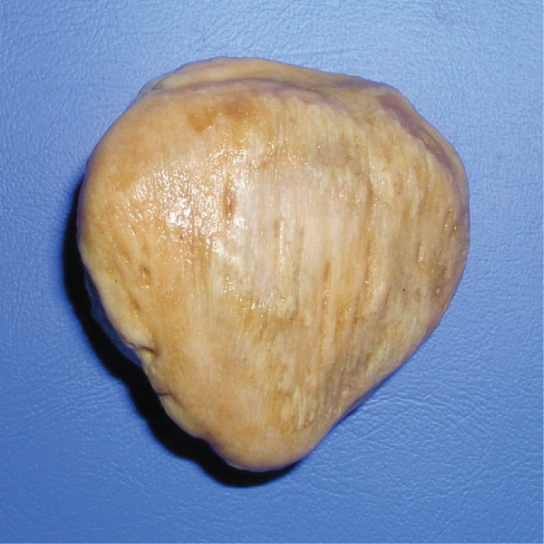
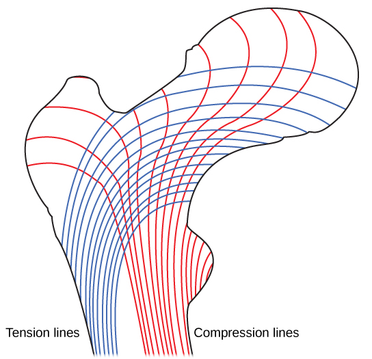

By the end of this section, you will be able to:
* Classify the different types of bones in the skeleton
* Explain the role of the different cell types in bone
* Explain how bone forms during development

**Bone**{: data-type="term"}, or **osseous tissue**{: data-type="term"}, is a connective tissue that constitutes the endoskeleton. It contains specialized cells and a matrix of mineral salts and collagen fibers.

The mineral salts primarily include hydroxyapatite, a mineral formed from calcium phosphate. **Calcification**{: data-type="term"} is the process of deposition of mineral salts on the collagen fiber matrix that crystallizes and hardens the tissue. The process of calcification only occurs in the presence of collagen fibers.

The bones of the human skeleton are classified by their shape: long bones, short bones, flat bones, sutural bones, sesamoid bones, and irregular bones ([\[link\]](#fig-ch38_02_01)).

 {: #fig-ch38_02_01}

**Long bones**{: data-type="term"} are longer than they are wide and have a shaft and two ends. The **diaphysis**{: data-type="term"}, or central shaft, contains bone marrow in a marrow cavity. The rounded ends, the **epiphyses**{: data-type="term"}, are covered with articular cartilage and are filled with red bone marrow, which produces blood cells ([\[link\]](#fig-ch38_02_02)). Most of the limb bones are long bones—for example, the femur, tibia, ulna, and radius. Exceptions to this include the patella and the bones of the wrist and ankle.

  in the marrow cavity."){: #fig-ch38_02_02}

**Short bones**{: data-type="term"}, or cuboidal bones, are bones that are the same width and length, giving them a cube-like shape. For example, the bones of the wrist (carpals) and ankle (tarsals) are short bones ([\[link\]](#fig-ch38_02_01)).

**Flat bones**{: data-type="term"} are thin and relatively broad bones that are found where extensive protection of organs is required or where broad surfaces of muscle attachment are required. Examples of flat bones are the sternum (breast bone), ribs, scapulae (shoulder blades), and the roof of the skull ([\[link\]](#fig-ch38_02_01)).

**Irregular bones**{: data-type="term"} are bones with complex shapes. These bones may have short, flat, notched, or ridged surfaces. Examples of irregular bones are the vertebrae, hip bones, and several skull bones.

**Sesamoid bones**{: data-type="term"} are small, flat bones and are shaped similarly to a sesame seed. The patellae are sesamoid bones ([\[link\]](#fig-ch38_02_03)). Sesamoid bones develop inside tendons and may be found near joints at the knees, hands, and feet.

 {: #fig-ch38_02_03}

**Sutural bones**{: data-type="term"} are small, flat, irregularly shaped bones. They may be found between the flat bones of the skull. They vary in number, shape, size, and position.

# Bone Tissue

Bones are considered organs because they contain various types of tissue, such as blood, connective tissue, nerves, and bone tissue. Osteocytes, the living cells of bone tissue, form the mineral matrix of bones. There are two types of bone tissue: compact and spongy.

## Compact Bone Tissue

**Compact bone**{: data-type="term"} (or cortical bone) forms the hard external layer of all bones and surrounds the medullary cavity, or bone marrow. It provides protection and strength to bones. Compact bone tissue consists of units called osteons or Haversian systems. **Osteons**{: data-type="term"} are cylindrical structures that contain a mineral matrix and living osteocytes connected by canaliculi, which transport blood. They are aligned parallel to the long axis of the bone. Each osteon consists of **lamellae**{: data-type="term"}, which are layers of compact matrix that surround a central canal called the Haversian canal. The **Haversian canal**{: data-type="term"} (osteonic canal) contains the bone’s blood vessels and nerve fibers ([\[link\]](#fig-ch38_02_04)). Osteons in compact bone tissue are aligned in the same direction along lines of stress and help the bone resist bending or fracturing. Therefore, compact bone tissue is prominent in areas of bone at which stresses are applied in only a few directions.

Art Connection

"){: #fig-ch38_02_04}

Which of the following statements about bone tissue is false?

1.  Compact bone tissue is made of cylindrical osteons that are aligned such that they travel the length of the bone.
2.  Haversian canals contain blood vessels only.
3.  Haversian canals contain blood vessels and nerve fibers.
4.  Spongy tissue is found on the interior of the bone, and compact bone tissue is found on the exterior.
{: data-number-style="lower-alpha"}

<!--<para><link target-id="fig-ch38_02_04" document=""/>B</para>-->

## Spongy Bone Tissue

Whereas compact bone tissue forms the outer layer of all bones, **spongy bone**{: data-type="term"} or cancellous bone forms the inner layer of all bones. Spongy bone tissue does not contain osteons that constitute compact bone tissue. Instead, it consists of **trabeculae**{: data-type="term"}, which are lamellae that are arranged as rods or plates. Red bone marrow is found between the trabuculae. Blood vessels within this tissue deliver nutrients to osteocytes and remove waste. The red bone marrow of the femur and the interior of other large bones, such as the ileum, forms blood cells.

Spongy bone reduces the density of bone and allows the ends of long bones to compress as the result of stresses applied to the bone. Spongy bone is prominent in areas of bones that are not heavily stressed or where stresses arrive from many directions. The epiphyses of bones, such as the neck of the femur, are subject to stress from many directions. Imagine laying a heavy framed picture flat on the floor. You could hold up one side of the picture with a toothpick if the toothpick was perpendicular to the floor and the picture. Now drill a hole and stick the toothpick into the wall to hang up the picture. In this case, the function of the toothpick is to transmit the downward pressure of the picture to the wall. The force on the picture is straight down to the floor, but the force on the toothpick is both the picture wire pulling down and the bottom of the hole in the wall pushing up. The toothpick will break off right at the wall.

The neck of the femur is horizontal like the toothpick in the wall. The weight of the body pushes it down near the joint, but the vertical diaphysis of the femur pushes it up at the other end. The neck of the femur must be strong enough to transfer the downward force of the body weight horizontally to the vertical shaft of the femur ([\[link\]](#fig-ch38_02_05)).

 {: #fig-ch38_02_05}

Link to Learning

  
View [micrographs][1]{: target="_window"} of musculoskeletal tissues as you review the anatomy.

# Cell Types in Bones

Bone consists of four types of cells: osteoblasts, osteoclasts, osteocytes, and osteoprogenitor cells. **Osteoblasts**{: data-type="term"} are bone cells that are responsible for bone formation. Osteoblasts synthesize and secrete the organic part and inorganic part of the extracellular matrix of bone tissue, and collagen fibers. Osteoblasts become trapped in these secretions and differentiate into less active osteocytes. **Osteoclasts**{: data-type="term"} are large bone cells with up to 50 nuclei. They remove bone structure by releasing lysosomal enzymes and acids that dissolve the bony matrix. These minerals, released from bones into the blood, help regulate calcium concentrations in body fluids. Bone may also be resorbed for remodeling, if the applied stresses have changed. **Osteocytes**{: data-type="term"} are mature bone cells and are the main cells in bony connective tissue; these cells cannot divide. Osteocytes maintain normal bone structure by recycling the mineral salts in the bony matrix. **Osteoprogenitor cells**{: data-type="term"} are squamous stem cells that divide to produce daughter cells that differentiate into osteoblasts. Osteoprogenitor cells are important in the repair of fractures.

# Development of Bone

**Ossification**{: data-type="term"}, or osteogenesis, is the process of bone formation by osteoblasts. Ossification is distinct from the process of calcification; whereas calcification takes place during the ossification of bones, it can also occur in other tissues. Ossification begins approximately six weeks after fertilization in an embryo. Before this time, the embryonic skeleton consists entirely of fibrous membranes and hyaline cartilage. The development of bone from fibrous membranes is called intramembranous ossification; development from hyaline cartilage is called endochondral ossification. Bone growth continues until approximately age 25. Bones can grow in thickness throughout life, but after age 25, ossification functions primarily in bone remodeling and repair.

# Intramembranous Ossification

**Intramembranous ossification**{: data-type="term"} is the process of bone development from fibrous membranes. It is involved in the formation of the flat bones of the skull, the mandible, and the clavicles. Ossification begins as mesenchymal cells form a template of the future bone. They then differentiate into osteoblasts at the ossification center. Osteoblasts secrete the extracellular matrix and deposit calcium, which hardens the matrix. The non-mineralized portion of the bone or osteoid continues to form around blood vessels, forming spongy bone. Connective tissue in the matrix differentiates into red bone marrow in the fetus. The spongy bone is remodeled into a thin layer of compact bone on the surface of the spongy bone.

## Endochondral Ossification

**Endochondral ossification**{: data-type="term"} is the process of bone development from hyaline cartilage. All of the bones of the body, except for the flat bones of the skull, mandible, and clavicles, are formed through endochondral ossification.

In long bones, chondrocytes form a template of the hyaline cartilage diaphysis. Responding to complex developmental signals, the matrix begins to calcify. This calcification prevents diffusion of nutrients into the matrix, resulting in chondrocytes dying and the opening up of cavities in the diaphysis cartilage. Blood vessels invade the cavities, and osteoblasts and osteoclasts modify the calcified cartilage matrix into spongy bone. Osteoclasts then break down some of the spongy bone to create a marrow, or medullary, cavity in the center of the diaphysis. Dense, irregular connective tissue forms a sheath (periosteum) around the bones. The periosteum assists in attaching the bone to surrounding tissues, tendons, and ligaments. The bone continues to grow and elongate as the cartilage cells at the epiphyses divide.

In the last stage of prenatal bone development, the centers of the epiphyses begin to calcify. Secondary ossification centers form in the epiphyses as blood vessels and osteoblasts enter these areas and convert hyaline cartilage into spongy bone. Until adolescence, hyaline cartilage persists at the **epiphyseal plate**{: data-type="term"} (growth plate), which is the region between the diaphysis and epiphysis that is responsible for the lengthwise growth of long bones ([\[link\]](#fig-ch38_02_06)).

 ![Illustration shows bone growth, which begins with a hyaline cartilage model that has the appearance of a small bone. A primary ossification center forms in the center of the narrow part of the bone, and a bone collar forms around the outside. The periosteum forms around the outside of the bone. Next, blood vessels begin to form in the bone and secondary ossification centers form in the epiphyses. The primary ossification center hollows out to form the medullary cavity, and an epiphyseal plate grows, separating the epiphyses from the diaphysis.](../resources/Figure_38_02_06.jpg "Endochondral ossification is the process of bone development from hyaline cartilage. The periosteum is the connective tissue on the outside of bone that acts as the interface between bone, blood vessels, tendons, and ligaments."){: #fig-ch38_02_06}

# Growth of Bone

Long bones continue to lengthen, potentially until adolescence, through the addition of bone tissue at the epiphyseal plate. They also increase in width through appositional growth.

## Lengthening of Long Bones

Chondrocytes on the epiphyseal side of the epiphyseal plate divide; one cell remains undifferentiated near the epiphysis, and one cell moves toward the diaphysis. The cells, which are pushed from the epiphysis, mature and are destroyed by calcification. This process replaces cartilage with bone on the diaphyseal side of the plate, resulting in a lengthening of the bone.

Long bones stop growing at around the age of 18 in females and the age of 21 in males in a process called epiphyseal plate closure. During this process, cartilage cells stop dividing and all of the cartilage is replaced by bone. The epiphyseal plate fades, leaving a structure called the epiphyseal line or epiphyseal remnant, and the epiphysis and diaphysis fuse.

## Thickening of Long Bones

**Appositional growth**{: data-type="term"} is the increase in the diameter of bones by the addition of bony tissue at the surface of bones. Osteoblasts at the bone surface secrete bone matrix, and osteoclasts on the inner surface break down bone. The osteoblasts differentiate into osteocytes. A balance between these two processes allows the bone to thicken without becoming too heavy.

# Bone Remodeling and Repair

Bone renewal continues after birth into adulthood. **Bone remodeling**{: data-type="term"} is the replacement of old bone tissue by new bone tissue. It involves the processes of bone deposition by osteoblasts and bone resorption by osteoclasts. Normal bone growth requires vitamins D, C, and A, plus minerals such as calcium, phosphorous, and magnesium. Hormones such as parathyroid hormone, growth hormone, and calcitonin are also required for proper bone growth and maintenance.

Bone turnover rates are quite high, with five to seven percent of bone mass being recycled every week. Differences in turnover rate exist in different areas of the skeleton and in different areas of a bone. For example, the bone in the head of the femur may be fully replaced every six months, whereas the bone along the shaft is altered much more slowly.

Bone remodeling allows bones to adapt to stresses by becoming thicker and stronger when subjected to stress. Bones that are not subject to normal stress, for example when a limb is in a cast, will begin to lose mass. A fractured or broken bone undergoes repair through four stages:

1.  Blood vessels in the broken bone tear and hemorrhage, resulting in the formation of clotted blood, or a hematoma, at the site of the break. The severed blood vessels at the broken ends of the bone are sealed by the clotting process, and bone cells that are deprived of nutrients begin to die.
2.  Within days of the fracture, capillaries grow into the hematoma, and phagocytic cells begin to clear away the dead cells. Though fragments of the blood clot may remain, fibroblasts and osteoblasts enter the area and begin to reform bone. Fibroblasts produce collagen fibers that connect the broken bone ends, and osteoblasts start to form spongy bone. The repair tissue between the broken bone ends is called the fibrocartilaginous callus, as it is composed of both hyaline and fibrocartilage ([\[link\]](#fig-ch38_02_07)). Some bone spicules may also appear at this point.
3.  The fibrocartilaginous callus is converted into a bony callus of spongy bone. It takes about two months for the broken bone ends to be firmly joined together after the fracture. This is similar to the endochondral formation of bone, as cartilage becomes ossified; osteoblasts, osteoclasts, and bone matrix are present.
4.  The bony callus is then remodelled by osteoclasts and osteoblasts, with excess material on the exterior of the bone and within the medullary cavity being removed. Compact bone is added to create bone tissue that is similar to the original, unbroken bone. This remodeling can take many months, and the bone may remain uneven for years.

"){: #fig-ch38_02_07}

Scientific Method Connection

Decalcification of Bones **Question:** What effect does the removal of calcium and collagen have on bone structure?

**Background:** Conduct a literature search on the role of calcium and collagen in maintaining bone structure. Conduct a literature search on diseases in which bone structure is compromised.

**Hypothesis:** Develop a hypothesis that states predictions of the flexibility, strength, and mass of bones that have had the calcium and collagen components removed. Develop a hypothesis regarding the attempt to add calcium back to decalcified bones.

**Test the hypothesis:** Test the prediction by removing calcium from chicken bones by placing them in a jar of vinegar for seven days. Test the hypothesis regarding adding calcium back to decalcified bone by placing the decalcified chicken bones into a jar of water with calcium supplements added. Test the prediction by denaturing the collagen from the bones by baking them at 250°C for three hours.

**Analyze the data:** Create a table showing the changes in bone flexibility, strength, and mass in the three different environments.

**Report the results:** Under which conditions was the bone most flexible? Under which conditions was the bone the strongest?

**Draw a conclusion:** Did the results support or refute the hypothesis? How do the results observed in this experiment correspond to diseases that destroy bone tissue?

# Section Summary

Bone, or osseous tissue, is connective tissue that includes specialized cells, mineral salts, and collagen fibers. The human skeleton can be divided into long bones, short bones, flat bones, and irregular bones. Compact bone tissue is composed of osteons and forms the external layer of all bones. Spongy bone tissue is composed of trabeculae and forms the inner part of all bones. Four types of cells compose bony tissue: osteocytes, osteoclasts, osteoprogenitor cells, and osteoblasts. Ossification is the process of bone formation by osteoblasts. Intramembranous ossification is the process of bone development from fibrous membranes. Endochondral ossification is the process of bone development from hyaline cartilage. Long bones lengthen as chondrocytes divide and secrete hyaline cartilage. Osteoblasts replace cartilage with bone. Appositional growth is the increase in the diameter of bones by the addition of bone tissue at the surface of bones. Bone remodeling involves the processes of bone deposition by osteoblasts and bone resorption by osteoclasts. Bone repair occurs in four stages and can take several months.

# Art Exercise

[[link]](#fig-ch38_02_04)Which of the following statements about bone tissue is false?

1.  Compact bone tissue is made of cylindrical osteons that are aligned such that they travel the length of the bone.
2.  Haversian canals contain blood vessels only.
3.  Haversian canals contain blood vessels and nerve fibers.
4.  Spongy tissue is found on the interior of the bone, and compact bone tissue is found on the exterior.
{: data-number-style="lower-alpha"}

[[link]](#fig-ch38_02_04)B

# Review Questions

The Haversian canal:

1.  is arranged as rods or plates
2.  contains the bone’s blood vessels and nerve fibers
3.  is responsible for the lengthwise growth of long bones
4.  synthesizes and secretes matrix
{: data-number-style="lower-alpha"}

B

The epiphyseal plate:

1.  is arranged as rods or plates
2.  contains the bone’s blood vessels and nerve fibers
3.  is responsible for the lengthwise growth of long bones
4.  synthesizes and secretes bone matrix
{: data-number-style="lower-alpha"}

C

The cells responsible for bone resorption are \_\_\_\_\_\_\_\_.

1.  osteoclasts
2.  osteoblasts
3.  fibroblasts
4.  osteocytes
{: data-number-style="lower-alpha"}

A

Compact bone is composed of \_\_\_\_\_\_\_\_.

1.  trabeculae
2.  compacted collagen
3.  osteons
4.  calcium phosphate only
{: data-number-style="lower-alpha"}

C

# Free Response

What are the major differences between spongy bone and compact bone?

Compact bone tissue forms the hard external layer of all bones and consists of osteons. Compact bone tissue is prominent in areas of bone at which stresses are applied in only a few directions. Spongy bone tissue forms the inner layer of all bones and consists of trabeculae. Spongy bone is prominent in areas of bones that are not heavily stressed or at which stresses arrive from many directions.

What are the roles of osteoblasts, osteocytes, and osteoclasts?

Osteocytes function in the exchange of nutrients and wastes with the blood. They also maintain normal bone structure by recycling the mineral salts in the bony matrix. Osteoclasts remove bone tissue by releasing lysosomal enzymes and acids that dissolve the bony matrix. Osteoblasts are bone cells that are responsible for bone formation.

## Glossary
{: data-type="glossary-title"}

appositional growth
: increase in the diameter of bones by the addition of bone tissue at the surface of bones
{: .definition}

bone
: (also, osseous tissue) connective tissue that constitutes the endoskeleton
{: .definition}

bone remodeling
: replacement of old bone tissue by new bone tissue
{: .definition}

calcification
: process of deposition of mineral salts in the collagen fiber matrix that crystallizes and hardens the tissue
{: .definition}

compact bone
: forms the hard external layer of all bones
{: .definition}

diaphysis
: central shaft of bone, contains bone marrow in a marrow cavity
{: .definition}

endochondral ossification
: process of bone development from hyaline cartilage
{: .definition}

epiphyseal plate
: region between the diaphysis and epiphysis that is responsible for the lengthwise growth of long bones
{: .definition}

epiphysis
: rounded end of bone, covered with articular cartilage and filled with red bone marrow, which produces blood cells
{: .definition}

flat bone
: thin and relatively broad bone found where extensive protection of organs is required or where broad surfaces of muscle attachment are required
{: .definition}

Haversian canal
: contains the bone’s blood vessels and nerve fibers
{: .definition}

intramembranous ossification
: process of bone development from fibrous membranes
{: .definition}

irregular bone
: bone with complex shapes; examples include vertebrae and hip bones
{: .definition}

lamella
: layer of compact tissue that surrounds a central canal called the Haversian canal
{: .definition}

long bone
: bone that is longer than wide, and has a shaft and two ends
{: .definition}

osteoblast
: bone cell responsible for bone formation
{: .definition}

osteoclast
: large bone cells with up to 50 nuclei, responsible for bone remodeling
{: .definition}

osteocyte
: mature bone cells and the main cell in bone tissue
{: .definition}

osseous tissue
: connective tissue that constitutes the endoskeleton
{: .definition}

ossification
: (also, osteogenesis) process of bone formation by osteoblasts
{: .definition}

osteon
: cylindrical structure aligned parallel to the long axis of the bone
{: .definition}

resorption
: process by which osteoclasts release minerals stored in bones
{: .definition}

sesamoid bone
: small, flat bone shaped like a sesame seed; develops inside tendons
{: .definition}

short bone
: bone that has the same width and length, giving it a cube-like shape
{: .definition}

spongy bone tissue
: forms the inner layer of all bones
{: .definition}

suture bone
: small, flat, irregularly shaped bone that forms between the flat bones of the cranium
{: .definition}

trabeculae
: lamellae that are arranged as rods or plates
{: .definition}

[1]: http://openstaxcollege.org/l/muscle_tissue
