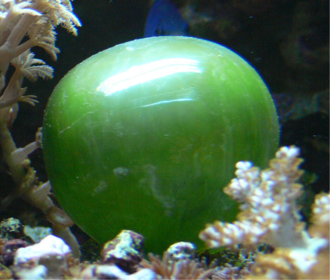
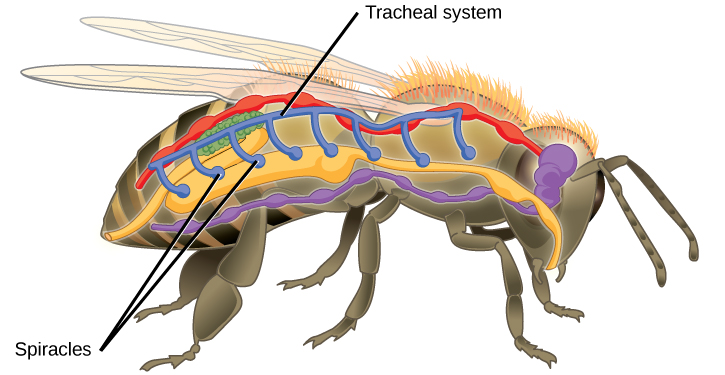

By the end of this section, you will be able to:
* Describe the passage of air from the outside environment to the lungs
* Explain how the lungs are protected from particulate matter

The primary function of the respiratory system is to deliver oxygen to the cells of the body’s tissues and remove carbon dioxide, a cell waste product. The main structures of the human respiratory system are the nasal cavity, the trachea, and lungs.

All aerobic organisms require oxygen to carry out their metabolic functions. Along the evolutionary tree, different organisms have devised different means of obtaining oxygen from the surrounding atmosphere. The environment in which the animal lives greatly determines how an animal respires. The complexity of the respiratory system is correlated with the size of the organism. As animal size increases, diffusion distances increase and the ratio of surface area to volume drops. In unicellular organisms, diffusion across the cell membrane is sufficient for supplying oxygen to the cell ([\[link\]](#fig-ch39_01_01)). Diffusion is a slow, passive transport process. In order for diffusion to be a feasible means of providing oxygen to the cell, the rate of oxygen uptake must match the rate of diffusion across the membrane. In other words, if the cell were very large or thick, diffusion would not be able to provide oxygen quickly enough to the inside of the cell. Therefore, dependence on diffusion as a means of obtaining oxygen and removing carbon dioxide remains feasible only for small organisms or those with highly-flattened bodies, sucs as many flatworms (Platyhelminthes). Larger organisms had to evolve specialized respiratory tissues, such as gills, lungs, and respiratory passages accompanied by a complex circulatory systems, to transport oxygen throughout their entire body.

{: #fig-ch39_01_01 data-media-type="image/jpg"}

#  Direct Diffusion

For small multicellular organisms, diffusion across the outer membrane is sufficient to meet their oxygen needs. Gas exchange by direct diffusion across surface membranes is efficient for organisms less than 1 mm in diameter. In simple organisms, such as cnidarians and flatworms, every cell in the body is close to the external environment. Their cells are kept moist and gases diffuse quickly via direct diffusion. Flatworms are small, literally flat worms, which ‘breathe’ through diffusion across the outer membrane ([\[link\]](#fig-ch39_01_02)). The flat shape of these organisms increases the surface area for diffusion, ensuring that each cell within the body is close to the outer membrane surface and has access to oxygen. If the flatworm had a cylindrical body, then the cells in the center would not be able to get oxygen.

 "){: #fig-ch39_01_02 data-media-type="image/jpg"}

# Skin and Gills

Earthworms and amphibians use their skin (integument) as a respiratory organ. A dense network of capillaries lies just below the skin and facilitates gas exchange between the external environment and the circulatory system. The respiratory surface must be kept moist in order for the gases to dissolve and diffuse across cell membranes.

Organisms that live in water need to obtain oxygen from the water. Oxygen dissolves in water but at a lower concentration than in the atmosphere. The atmosphere has roughly 21 percent oxygen. In water, the oxygen concentration is much smaller than that. Fish and many other aquatic organisms have evolved gills to take up the dissolved oxygen from water ([\[link\]](#fig-ch39_01_03)). Gills are thin tissue filaments that are highly branched and folded. When water passes over the gills, the dissolved oxygen in water rapidly diffuses across the gills into the bloodstream. The circulatory system can then carry the oxygenated blood to the other parts of the body. In animals that contain coelomic fluid instead of blood, oxygen diffuses across the gill surfaces into the coelomic fluid. Gills are found in mollusks, annelids, and crustaceans.

 "){: #fig-ch39_01_03 data-media-type="image/jpg"}

The folded surfaces of the gills provide a large surface area to ensure that the fish gets sufficient oxygen. Diffusion is a process in which material travels from regions of high concentration to low concentration until equilibrium is reached. In this case, blood with a low concentration of oxygen molecules circulates through the gills. The concentration of oxygen molecules in water is higher than the concentration of oxygen molecules in gills. As a result, oxygen molecules diffuse from water (high concentration) to blood (low concentration), as shown in [\[link\]](#fig-ch39_01_04). Similarly, carbon dioxide molecules in the blood diffuse from the blood (high concentration) to water (low concentration).

 ![The illustration shows a fish, with a box indicating the location of the gills, behind the head. A close-up image shows the gills, each of which resembles a feathery worm. Two stacks of gills attach to a structure called a columnar gill arch, forming a tall V. Water travels in from the outside of the V, between each gill, then travels out of the top of the V. Veins travel into the gill from the base of the gill arch, and arteries travel back out on the opposite side. A close-up image of a single gill shows that water travels over the gill, passing over deoxygenated veins first, then over oxygenated arteries.](../resources/Figure_39_01_04.jpg "As water flows over the gills, oxygen is transferred to blood via the veins. (credit &quot;fish&quot;: modification of work by Duane Raver, NOAA)"){: #fig-ch39_01_04 data-media-type="image/jpg"}

# Tracheal Systems

Insect respiration is independent of its circulatory system; therefore, the blood does not play a direct role in oxygen transport. Insects have a highly specialized type of respiratory system called the tracheal system, which consists of a network of small tubes that carries oxygen to the entire body. The tracheal system is the most direct and efficient respiratory system in active animals. The tubes in the tracheal system are made of a polymeric material called chitin.

Insect bodies have openings, called spiracles, along the thorax and abdomen. These openings connect to the tubular network, allowing oxygen to pass into the body ([\[link\]](#fig-ch39_01_05)) and regulating the diffusion of CO2 and water vapor. Air enters and leaves the tracheal system through the spiracles. Some insects can ventilate the tracheal system with body movements.

{: #fig-ch39_01_05 data-media-type="image/jpg"}

# Mammalian Systems

In mammals, pulmonary ventilation occurs via inhalation (breathing). During inhalation, air enters the body through the **nasal cavity**{: data-type="term"} located just inside the nose ([\[link\]](#fig-ch39_01_06)). As air passes through the nasal cavity, the air is warmed to body temperature and humidified. The respiratory tract is coated with mucus to seal the tissues from direct contact with air. Mucus is high in water. As air crosses these surfaces of the mucous membranes, it picks up water. These processes help equilibrate the air to the body conditions, reducing any damage that cold, dry air can cause. Particulate matter that is floating in the air is removed in the nasal passages via mucus and cilia. The processes of warming, humidifying, and removing particles are important protective mechanisms that prevent damage to the trachea and lungs. Thus, inhalation serves several purposes in addition to bringing oxygen into the respiratory system.

Art Connection

![The illustration shows the flow of air through the human respiratory system. The nasal cavity is a wide cavity above and behind the nostrils, and the pharynx is the passageway behind the mouth. The nasal cavity and pharynx join and enter the trachea through the larynx. The larynx is somewhat wider than the trachea and flat. The trachea has concentric, ring-like grooves, giving it a bumpy appearance. The trachea bifurcates into two primary bronchi, which are also grooved. The primary bronchi enter the lungs, and branch into secondary bronchi. The secondary bronchi in turn branch into many tertiary bronchi. The tertiary bronchi branch into bronchioles, which branch into terminal bronchioles. Each terminal bronchiole ends in an alveolar sac. Each alveolar sac contains many alveoli clustered together, like bunches of grapes. The alveolar duct is the air passage into the alveolar sac. The alveoli are hollow, and air empties into them. Pulmonary arteries bring deoxygenated blood to the alveolar sac (and thus appear blue), and pulmonary veins return oxygenated blood (and thus appear red) to the heart. Capillaries form a web around each alveolus. The diaphragm is a membrane that pushes up against the lungs.](../resources/Figure_39_01_06.png "Air enters the respiratory system through the nasal cavity and pharynx, and then passes through the trachea and into the bronchi, which bring air into the lungs. (credit: modification of work by NCI)"){: #fig-ch39_01_06 data-media-type="image/jpg"}

Which of the following statements about the mammalian respiratory system is false?

1.  When we breathe in, air travels from the pharynx to the trachea.
2.  The bronchioles branch into bronchi.
3.  Alveolar ducts connect to alveolar sacs.
4.  Gas exchange between the lung and blood takes place in the alveolus.
{: data-number-style="lower-alpha"}

<!--<para><link target-id="fig-ch39_01_06" document=""/> B</para>-->

From the nasal cavity, air passes through the **pharynx**{: data-type="term"} (throat) and the **larynx**{: data-type="term"} (voice box), as it makes its way to the **trachea**{: data-type="term"} ([\[link\]](#fig-ch39_01_06)). The main function of the trachea is to funnel the inhaled air to the lungs and the exhaled air back out of the body. The human trachea is a cylinder about 10 to 12 cm long and 2 cm in diameter that sits in front of the esophagus and extends from the larynx into the chest cavity where it divides into the two primary bronchi at the midthorax. It is made of incomplete rings of hyaline cartilage and smooth muscle ([\[link\]](#fig-ch39_01_07)). The trachea is lined with mucus-producing goblet cells and ciliated epithelia. The cilia propel foreign particles trapped in the mucus toward the pharynx. The cartilage provides strength and support to the trachea to keep the passage open. The smooth muscle can contract, decreasing the trachea’s diameter, which causes expired air to rush upwards from the lungs at a great force. The forced exhalation helps expel mucus when we cough. Smooth muscle can contract or relax, depending on stimuli from the external environment or the body’s nervous system.

 "){: #fig-ch39_01_07 data-media-type="image/jpg"}

## Lungs: Bronchi and Alveoli

The end of the trachea bifurcates (divides) to the right and left lungs. The lungs are not identical. The right lung is larger and contains three lobes, whereas the smaller left lung contains two lobes ([\[link\]](#fig-ch39_01_08)). The muscular **diaphragm**{: data-type="term"}, which facilitates breathing, is inferior (below) to the lungs and marks the end of the thoracic cavity.

![The illustration shows the trachea, which starts at the top of the neck and continues down into the chest, where it branches into the bronchi, which enter the lungs. The left lung has two lobes. The upper lobe is located in front of and above the lower lobe. The right lung has three lobes. The upper lobe is on the top, the lower lobe is on the bottom, and the middle lobe is sandwiched between them. The diaphragm presses against the bottom of the lungs and has the appearance of skin stretched over the top of a drum. Wide flaps of the diaphragm extend downward on the front left and right sides of the body. On the back, thin flaps of diaphragm stretch downward on either side of the spine.](../resources/Figure_39_01_08.jpg "The trachea bifurcates into the right and left bronchi in the lungs. The right lung is made of three lobes and is larger. To accommodate the heart, the left lung is smaller and has only two lobes."){: #fig-ch39_01_08 data-media-type="image/jpg"}

In the lungs, air is diverted into smaller and smaller passages, or **bronchi**{: data-type="term"}. Air enters the lungs through the two **primary (main) bronchi**{: data-type="term"} (singular: bronchus). Each bronchus divides into secondary bronchi, then into tertiary bronchi, which in turn divide, creating smaller and smaller diameter **bronchioles**{: data-type="term"} as they split and spread through the lung. Like the trachea, the bronchi are made of cartilage and smooth muscle. At the bronchioles, the cartilage is replaced with elastic fibers. Bronchi are innervated by nerves of both the parasympathetic and sympathetic nervous systems that control muscle contraction (parasympathetic) or relaxation (sympathetic) in the bronchi and bronchioles, depending on the nervous system’s cues. In humans, bronchioles with a diameter smaller than 0.5 mm are the **respiratory bronchioles**{: data-type="term"}. They lack cartilage and therefore rely on inhaled air to support their shape. As the passageways decrease in diameter, the relative amount of smooth muscle increases.

The **terminal bronchioles**{: data-type="term"} subdivide into microscopic branches called respiratory bronchioles. The respiratory bronchioles subdivide into several alveolar ducts. Numerous alveoli and alveolar sacs surround the alveolar ducts. The alveolar sacs resemble bunches of grapes tethered to the end of the bronchioles ([\[link\]](#fig-ch39_01_09)). In the acinar region, the **alveolar ducts**{: data-type="term"} are attached to the end of each bronchiole. At the end of each duct are approximately 100 **alveolar sacs**{: data-type="term"}, each containing 20 to 30 **alveoli**{: data-type="term"} that are 200 to 300 microns in diameter. Gas exchange occurs only in alveoli. Alveoli are made of thin-walled parenchymal cells, typically one-cell thick, that look like tiny bubbles within the sacs. Alveoli are in direct contact with capillaries (one-cell thick) of the circulatory system. Such intimate contact ensures that oxygen will diffuse from alveoli into the blood and be distributed to the cells of the body. In addition, the carbon dioxide that was produced by cells as a waste product will diffuse from the blood into alveoli to be exhaled. The anatomical arrangement of capillaries and alveoli emphasizes the structural and functional relationship of the respiratory and circulatory systems. Because there are so many alveoli (~300 million per lung) within each alveolar sac and so many sacs at the end of each alveolar duct, the lungs have a sponge-like consistency. This organization produces a very large surface area that is available for gas exchange. The surface area of alveoli in the lungs is approximately 75 m2. This large surface area, combined with the thin-walled nature of the alveolar parenchymal cells, allows gases to easily diffuse across the cells.

 ![The illustration shows a terminal bronchial tube branching into three alveolar ducts. At the end of each duct is an alveolar sac made up of 20 to 30 alveoli clustered together, like grapes. The airspace in the middle of the alveolar sac, called the atrium, is continuous with the air space inside the alveolus so that air can circulate from the atrium to the alveolus. Capillaries surround each alveolus, and this is where gas exchange occurs. A pulmonary artery (shown in blue) runs along the terminal bronchiole, bringing deoxygenated blood from the heart to the alveoli. A pulmonary vein (shown in red) running along the bronchiole brings oxygenated blood back to the heart. Small, flat mucous glands are associated with the outside of the bronchial tubes.](../resources/Figure_39_01_09.jpg "Terminal bronchioles are connected by respiratory bronchioles to alveolar ducts and alveolar sacs. Each alveolar sac contains 20 to 30 spherical alveoli and has the appearance of a bunch of grapes. Air flows into the atrium of the alveolar sac, then circulates into alveoli where gas exchange occurs with the capillaries. Mucous glands secrete mucous into the airways, keeping them moist and flexible. (credit: modification of work by Mariana Ruiz Villareal)"){: #fig-ch39_01_09 data-media-type="image/jpg"}

Link to Learning

 {: data-media-type="image/png"} 
Watch the following [video][1]{: target="_window"} to review the respiratory system.

# Protective Mechanisms

The air that organisms breathe contains **particulate matter**{: data-type="term"} such as dust, dirt, viral particles, and bacteria that can damage the lungs or trigger allergic immune responses. The respiratory system contains several protective mechanisms to avoid problems or tissue damage. In the nasal cavity, hairs and mucus trap small particles, viruses, bacteria, dust, and dirt to prevent their entry.

If particulates do make it beyond the nose, or enter through the mouth, the bronchi and bronchioles of the lungs also contain several protective devices. The lungs produce **mucus**{: data-type="term"}—a sticky substance made of **mucin**{: data-type="term"}, a complex glycoprotein, as well as salts and water—that traps particulates. The bronchi and bronchioles contain cilia, small hair-like projections that line the walls of the bronchi and bronchioles ([\[link\]](#fig-ch39_01_10)). These cilia beat in unison and move mucus and particles out of the bronchi and bronchioles back up to the throat where it is swallowed and eliminated via the esophagus.

In humans, for example, tar and other substances in cigarette smoke destroy or paralyze the cilia, making the removal of particles more difficult. In addition, smoking causes the lungs to produce more mucus, which the damaged cilia are not able to move. This causes a persistent cough, as the lungs try to rid themselves of particulate matter, and makes smokers more susceptible to respiratory ailments.

 "){: #fig-ch39_01_10 data-media-type="image/jpg"}

# Section Summary

Animal respiratory systems are designed to facilitate gas exchange. In mammals, air is warmed and humidified in the nasal cavity. Air then travels down the pharynx, through the trachea, and into the lungs. In the lungs, air passes through the branching bronchi, reaching the respiratory bronchioles, which house the first site of gas exchange. The respiratory bronchioles open into the alveolar ducts, alveolar sacs, and alveoli. Because there are so many alveoli and alveolar sacs in the lung, the surface area for gas exchange is very large. Several protective mechanisms are in place to prevent damage or infection. These include the hair and mucus in the nasal cavity that trap dust, dirt, and other particulate matter before they can enter the system. In the lungs, particles are trapped in a mucus layer and transported via cilia up to the esophageal opening at the top of the trachea to be swallowed.

<section data-depth="1" class="art-exercise">

[[link]](#fig-ch39_01_06) Which of the following statements about the mammalian respiratory system is false?

1.  When we breathe in, air travels from the pharynx to the trachea.
2.  The bronchioles branch into bronchi.
3.  Alveolar ducts connect to alveolar sacs.
4.  Gas exchange between the lung and blood takes place in the alveolus.
{: data-number-style="lower-alpha"}

[[link]](#fig-ch39_01_06) B

</section>

# Review Questions

The respiratory system \_\_\_\_\_\_\_\_.

1.  provides body tissues with oxygen
2.  provides body tissues with oxygen and carbon dioxide
3.  establishes how many breaths are taken per minute
4.  provides the body with carbon dioxide
{: data-number-style="lower-alpha"}

A

Air is warmed and humidified in the nasal passages. This helps to \_\_\_\_\_\_\_\_.

1.  ward off infection
2.  decrease sensitivity during breathing
3.  prevent damage to the lungs
4.  all of the above
{: data-number-style="lower-alpha"}

C

Which is the order of airflow during inhalation?

1.  nasal cavity, trachea, larynx, bronchi, bronchioles, alveoli
2.  nasal cavity, larynx, trachea, bronchi, bronchioles, alveoli
3.  nasal cavity, larynx, trachea, bronchioles, bronchi, alveoli
4.  nasal cavity, trachea, larynx, bronchi, bronchioles, alveoli
{: data-number-style="lower-alpha"}

B

# Free Response

Describe the function of these terms and describe where they are located: main bronchus, trachea, alveoli, and acinus.

The main bronchus is the conduit in the lung that funnels air to the airways where gas exchange occurs. The main bronchus attaches the lungs to the very end of the trachea where it bifurcates. The trachea is the cartilaginous structure that extends from the pharynx to the primary bronchi. It serves to funnel air to the lungs. The alveoli are the sites of gas exchange; they are located at the terminal regions of the lung and are attached to the respiratory bronchioles. The acinus is the structure in the lung where gas exchange occurs.

How does the structure of alveoli maximize gas exchange?

The sac-like structure of the alveoli increases their surface area. In addition, the alveoli are made of thin-walled parenchymal cells. These features allow gases to easily diffuse across the cells.

[1]: http://openstaxcollege.org/l/lungs_pulmonary
