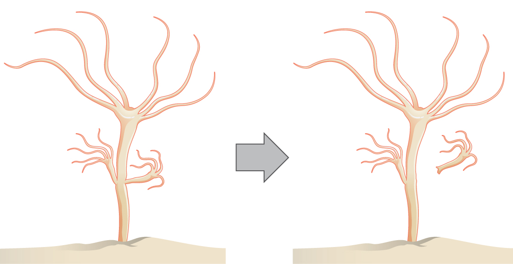
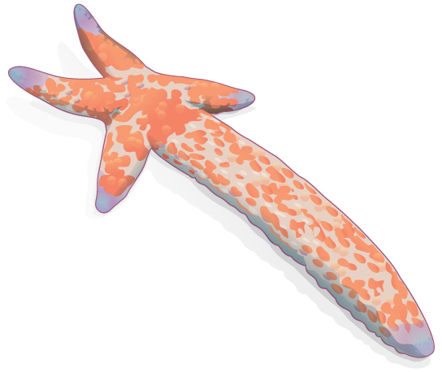

By the end of this section, you will be able to:
* Describe advantages and disadvantages of asexual and sexual reproduction
* Discuss asexual reproduction methods
* Discuss sexual reproduction methods

Animals produce offspring through asexual and/or sexual reproduction. Both methods have advantages and disadvantages. **Asexual reproduction**{: data-type="term"} produces offspring that are genetically identical to the parent because the offspring are all clones of the original parent. A single individual can produce offspring asexually and large numbers of offspring can be produced quickly. In a stable or predictable environment, asexual reproduction is an effective means of reproduction because all the offspring will be adapted to that environment. In an unstable or unpredictable environment asexually-reproducing species may be at a disadvantage because all the offspring are genetically identical and may not have the genetic variation to survive in new or different conditions. On the other hand, the rapid rates of asexual reproduction may allow for a speedy response to environmental changes if individuals have mutations. An additional advantage of asexual reproduction is that colonization of new habitats may be easier when an individual does not need to find a mate to reproduce.

During **sexual reproduction**{: data-type="term"} the genetic material of two individuals is combined to produce genetically diverse offspring that differ from their parents. The genetic diversity of sexually produced offspring is thought to give species a better chance of surviving in an unpredictable or changing environment. Species that reproduce sexually must maintain two different types of individuals, males and females, which can limit the ability to colonize new habitats as both sexes must be present.

# Asexual Reproduction

Asexual reproduction occurs in prokaryotic microorganisms (bacteria) and in some eukaryotic single-celled and multi-celled organisms. There are a number of ways that animals reproduce asexually.

## Fission

**Fission**{: data-type="term"}, also called binary fission, occurs in prokaryotic microorganisms and in some invertebrate, multi-celled organisms. After a period of growth, an organism splits into two separate organisms. Some unicellular eukaryotic organisms undergo binary fission by mitosis. In other organisms, part of the individual separates and forms a second individual. This process occurs, for example, in many asteroid echinoderms through splitting of the central disk. Some sea anemones and some coral polyps ([\[link\]](#fig-ch43_01_01)) also reproduce through fission.

 "){: #fig-ch43_01_01}

## Budding

**Budding**{: data-type="term"} is a form of asexual reproduction that results from the outgrowth of a part of a cell or body region leading to a separation from the original organism into two individuals. Budding occurs commonly in some invertebrate animals such as corals and hydras. In hydras, a bud forms that develops into an adult and breaks away from the main body, as illustrated in [\[link\]](#fig-ch43_01_02), whereas in coral budding, the bud does not detach and multiplies as part of a new colony.

 {: #fig-ch43_01_02}

Link to Learning

  
Watch a [video][1]{: target="_window"} of a hydra budding.

## Fragmentation

**Fragmentation**{: data-type="term"} is the breaking of the body into two parts with subsequent regeneration. If the animal is capable of fragmentation, and the part is big enough, a separate individual will regrow.

For example, in many sea stars, asexual reproduction is accomplished by fragmentation. [\[link\]](#fig-ch43_01_03) illustrates a sea star for which an arm of the individual is broken off and regenerates a new sea star. Fisheries workers have been known to try to kill the sea stars eating their clam or oyster beds by cutting them in half and throwing them back into the ocean. Unfortunately for the workers, the two parts can each regenerate a new half, resulting in twice as many sea stars to prey upon the oysters and clams. Fragmentation also occurs in annelid worms, turbellarians, and poriferans.

 {: #fig-ch43_01_03}

Note that in fragmentation, there is generally a noticeable difference in the size of the individuals, whereas in fission, two individuals of approximate size are formed.

## Parthenogenesis

**Parthenogenesis**{: data-type="term"} is a form of asexual reproduction where an egg develops into a complete individual without being fertilized. The resulting offspring can be either haploid or diploid, depending on the process and the species. Parthenogenesis occurs in invertebrates such as water flees, rotifers, aphids, stick insects, some ants, wasps, and bees. Bees use parthenogenesis to produce haploid males (drones) and diploid females (workers). If an egg is fertilized, a queen is produced. The queen bee controls the reproduction of the hive bees to regulate the type of bee produced.

Some vertebrate animals—such as certain reptiles, amphibians, and fish—also reproduce through parthenogenesis. Although more common in plants, parthenogenesis has been observed in animal species that were segregated by sex in terrestrial or marine zoos. Two female Komodo dragons, a hammerhead shark, and a blacktop shark have produced parthenogenic young when the females have been isolated from males.

# Sexual Reproduction

Sexual reproduction is the combination of (usually haploid) reproductive cells from two individuals to form a third (usually diploid) unique offspring. Sexual reproduction produces offspring with novel combinations of genes. This can be an adaptive advantage in unstable or unpredictable environments. As humans, we are used to thinking of animals as having two separate sexes—male and female—determined at conception. However, in the animal kingdom, there are many variations on this theme.

## Hermaphroditism

**Hermaphroditism**{: data-type="term"} occurs in animals where one individual has both male and female reproductive parts. Invertebrates such as earthworms, slugs, tapeworms and snails, shown in [\[link\]](#fig-ch43_01_04), are often hermaphroditic. Hermaphrodites may self-fertilize or may mate with another of their species, fertilizing each other and both producing offspring. Self fertilization is common in animals that have limited mobility or are not motile, such as barnacles and clams.

 "){: #fig-ch43_01_04}

# Sex Determination

Mammalian sex determination is determined genetically by the presence of X and Y chromosomes. Individuals homozygous for X (XX) are female and heterozygous individuals (XY) are male. The presence of a Y chromosome causes the development of male characteristics and its absence results in female characteristics. The XY system is also found in some insects and plants.

Avian sex determination is dependent on the presence of Z and W chromosomes. Homozygous for Z (ZZ) results in a male and heterozygous (ZW) results in a female. The W appears to be essential in determining the sex of the individual, similar to the Y chromosome in mammals. Some fish, crustaceans, insects (such as butterflies and moths), and reptiles use this system.

The sex of some species is not determined by genetics but by some aspect of the environment. Sex determination in some crocodiles and turtles, for example, is often dependent on the temperature during critical periods of egg development. This is referred to as environmental sex determination, or more specifically as temperature-dependent sex determination. In many turtles, cooler temperatures during egg incubation produce males and warm temperatures produce females. In some crocodiles, moderate temperatures produce males and both warm and cool temperatures produce females. In some species, sex is both genetic- and temperature-dependent.

Individuals of some species change their sex during their lives, alternating between male and female. If the individual is female first, it is termed protogyny or “first female,” if it is male first, its termed protandry or “first male.” Oysters, for example, are born male, grow, and become female and lay eggs; some oyster species change sex multiple times.

# Section Summary

Reproduction may be asexual when one individual produces genetically identical offspring, or sexual when the genetic material from two individuals is combined to produce genetically diverse offspring. Asexual reproduction occurs through fission, budding, and fragmentation. Sexual reproduction may mean the joining of sperm and eggs within animals’ bodies or it may mean the release of sperm and eggs into the environment. An individual may be one sex, or both; it may start out as one sex and switch during its life, or it may stay male or female.

# Review Questions

Which form of reproduction is thought to be best in a stable environment?

1.  asexual
2.  sexual
3.  budding
4.  parthenogenesis
{: data-number-style="lower-alpha"}

A

Which form of reproduction can result from damage to the original animal?

1.  asexual
2.  fragmentation
3.  budding
4.  parthenogenesis
{: data-number-style="lower-alpha"}

B

Which form of reproduction is useful to an animal with little mobility that reproduces sexually?

1.  fission
2.  budding
3.  parthenogenesis
4.  hermaphroditism
{: data-number-style="lower-alpha"}

D

Genetically unique individuals are produced through \_\_\_\_\_\_\_\_.

1.  sexual reproduction
2.  parthenogenesis
3.  budding
4.  fragmentation
{: data-number-style="lower-alpha"}

A

# Free Response

Why is sexual reproduction useful if only half the animals can produce offspring and two separate cells must be combined to form a third?

Sexual reproduction produces a new combination of genes in the offspring that may better enable them to survive changes in the environment and assist in the survival of the species.

What determines which sex will result in offspring of birds and mammals?

The presence of the W chromosome in birds determines femaleness and the presence of the Y chromosome in mammals determines maleness. The absence of those chromosomes and the homogeneity of the offspring (ZZ or XX) leads to the development of the other sex.

[1]: http://openstaxcollege.org/l/budding_hydra
