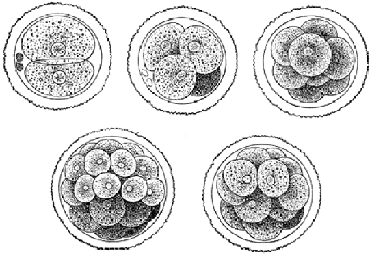

By the end of this section, you will be able to:
* Discuss how fertilization occurs
* Explain how the embryo forms from the zygote
* Discuss the role of cleavage and gastrulation in animal development

The process in which an organism develops from a single-celled zygote to a multi-cellular organism is complex and well-regulated. The early stages of embryonic development are also crucial for ensuring the fitness of the organism.

# Fertilization

Fertilization, pictured in [\[link\]](#fig-ch43_05_01ab)**a** is the process in which gametes (an egg and sperm) fuse to form a zygote. The egg and sperm each contain one set of chromosomes. To ensure that the offspring has only one complete diploid set of chromosomes, only one sperm must fuse with one egg. In mammals, the egg is protected by a layer of extracellular matrix consisting mainly of glycoproteins called the **zona pellucida**{: data-type="term"}. When a sperm binds to the zona pellucida, a series of biochemical events, called the **acrosomal reactions**{: data-type="term"}, take place. In placental mammals, the acrosome contains digestive enzymes that initiate the degradation of the glycoprotein matrix protecting the egg and allowing the sperm plasma membrane to fuse with the egg plasma membrane, as illustrated in [\[link\]](#fig-ch43_05_01ab)**b**. The fusion of these two membranes creates an opening through which the sperm nucleus is transferred into the ovum. The nuclear membranes of the egg and sperm break down and the two haploid genomes condense to form a diploid genome.

 Fertilization is the process in which sperm and egg fuse to form a zygote. (b) Acrosomal reactions help the sperm degrade the glycoprotein matrix protecting the egg and allow the sperm to transfer its nucleus. (credit: (b) modification of work by Mariana Ruiz Villareal; scale-bar data from Matt Russell)"){: #fig-ch43_05_01ab}

To ensure that no more than one sperm fertilizes the egg, once the acrosomal reactions take place at one location of the egg membrane, the egg releases proteins in other locations to prevent other sperm from fusing with the egg. If this mechanism fails, multiple sperm can fuse with the egg, resulting in **polyspermy**{: data-type="term"}. The resulting embryo is not genetically viable and dies within a few days.

# Cleavage and Blastula Stage

The development of multi-cellular organisms begins from a single-celled zygote, which undergoes rapid cell division to form the blastula. The rapid, multiple rounds of cell division are termed cleavage. Cleavage is illustrated in ([\[link\]](#fig-ch43_05_02ab)**a**). After the cleavage has produced over 100 cells, the embryo is called a blastula. The blastula is usually a spherical layer of cells (the blastoderm) surrounding a fluid-filled or yolk-filled cavity (the blastocoel). Mammals at this stage form a structure called the blastocyst, characterized by an inner cell mass that is distinct from the surrounding blastula, shown in [\[link\]](#fig-ch43_05_02ab)**b**. During cleavage, the cells divide without an increase in mass; that is, one large single-celled zygote divides into multiple smaller cells. Each cell within the blastula is called a blastomere.

<figure markdown="1" id="fig-ch43_05_02ab" data-orient="horizontal">
<figcaption>
(a) During cleavage, the zygote rapidly divides into multiple cells without increasing in size. (b) The cells rearrange themselves to form a hollow ball with a fluid-filled or yolk-filled cavity called the blastula. (credit a: modification of work by Gray’s Anatomy; credit b: modification of work by Pearson Scott Foresman, donated to the Wikimedia Foundation)
</figcaption>
{:}

{:}

</figure>

Cleavage can take place in two ways: **holoblastic**{: data-type="term"} (total) cleavage or **meroblastic**{: data-type="term"} (partial) cleavage. The type of cleavage depends on the amount of yolk in the eggs. In placental mammals (including humans) where nourishment is provided by the mother’s body, the eggs have a very small amount of yolk and undergo holoblastic cleavage. Other species, such as birds, with a lot of yolk in the egg to nourish the embryo during development, undergo meroblastic cleavage.

In mammals, the blastula forms the **blastocyst**{: data-type="term"} in the next stage of development. Here the cells in the blastula arrange themselves in two layers: the **inner cell mass**{: data-type="term"}, and an outer layer called the **trophoblast**{: data-type="term"}. The inner cell mass is also known as the embryoblast and this mass of cells will go on to form the embryo. At this stage of development, illustrated in [\[link\]](#fig-ch43_05_03) the inner cell mass consists of embryonic stem cells that will differentiate into the different cell types needed by the organism. The trophoblast will contribute to the placenta and nourish the embryo.

 {: #fig-ch43_05_03}

Link to Learning

  
Visit the [Virtual Human Embryo project][1]{: target="_window"} at the Endowment for Human Development site to step through an interactive that shows the stages of embryo development, including micrographs and rotating 3-D images.

# Gastrulation

The typical blastula is a ball of cells. The next stage in embryonic development is the formation of the body plan. The cells in the blastula rearrange themselves spatially to form three layers of cells. This process is called **gastrulation**{: data-type="term"}. During gastrulation, the blastula folds upon itself to form the three layers of cells. Each of these layers is called a germ layer and each germ layer differentiates into different organ systems.

The three germs layers, shown in [\[link\]](#fig-ch43_05_04), are the endoderm, the ectoderm, and the mesoderm. The ectoderm gives rise to the nervous system and the epidermis. The mesoderm gives rise to the muscle cells and connective tissue in the body. The endoderm gives rise to columnar cells found in the digestive system and many internal organs.

 "){: #fig-ch43_05_04}

Everyday Connection

Are Designer Babies in Our Future? {: #fig-ch43_05_05}

If you could prevent your child from getting a devastating genetic disease, would you do it? Would you select the sex of your child or select for their attractiveness, strength, or intelligence? How far would you go to maximize the possibility of resistance to disease? The genetic engineering of a human child, the production of \"designer babies\" with desirable phenotypic characteristics, was once a topic restricted to science fiction. This is the case no longer: science fiction is now overlapping into science fact. Many phenotypic choices for offspring are already available, with many more likely to be possible in the not too distant future. Which traits should be selected and how they should be selected are topics of much debate within the worldwide medical community. The ethical and moral line is not always clear or agreed upon, and some fear that modern reproductive technologies could lead to a new form of eugenics.

Eugenics is the use of information and technology from a variety of sources to improve the genetic makeup of the human race. The goal of creating genetically superior humans was quite prevalent (although controversial) in several countries during the early 20th century, but fell into disrepute when Nazi Germany developed an extensive eugenics program in the 1930\'s and 40\'s. As part of their program, the Nazis forcibly sterilized hundreds of thousands of the so-called \"unfit\" and killed tens of thousands of institutionally disabled people as part of a systematic program to develop a genetically superior race of Germans known as Aryans. Ever since, eugenic ideas have not been as publicly expressed, but there are still those who promote them.

Efforts have been made in the past to control traits in human children using donated sperm from men with desired traits. In fact, eugenicist Robert Klark Graham established a sperm bank in 1980 that included samples exclusively from donors with high IQs. The \"genius\" sperm bank failed to capture the public\'s imagination and the operation closed in 1999.

In more recent times, the procedure known as prenatal genetic diagnosis (PGD) has been developed. PGD involves the screening of human embryos as part of the process of *in vitro* fertilization, during which embryos are conceived and grown outside the mother\'s body for some period of time before they are implanted. The term PGD usually refers to both the diagnosis, selection, and the implantation of the selected embryos.

In the least controversial use of PGD, embryos are tested for the presence of alleles which cause genetic diseases such as sickle cell disease, muscular dystrophy, and hemophilia, in which a single disease-causing allele or pair of alleles has been identified. By excluding embryos containing these alleles from implantation into the mother, the disease is prevented, and the unused embryos are either donated to science or discarded. There are relatively few in the worldwide medical community that question the ethics of this type of procedure, which allows individuals scared to have children because of the alleles they carry to do so successfully. The major limitation to this procedure is its expense. Not usually covered by medical insurance and thus out of reach financially for most couples, only a very small percentage of all live births use such complicated methodologies. Yet, even in cases like these where the ethical issues may seem to be clear-cut, not everyone agrees with the morality of these types of procedures. For example, to those who take the position that human life begins at conception, the discarding of unused embryos, a necessary result of PGD, is unacceptable under any circumstances.

A murkier ethical situation is found in the selection of a child\'s sex, which is easily performed by PGD. Currently, countries such as Great Britain have banned the selection of a child\'s sex for reasons other than preventing sex-linked diseases. Other countries allow the procedure for \"family balancing\", based on the desire of some parents to have at least one child of each sex. Still others, including the United States, have taken a scattershot approach to regulating these practices, essentially leaving it to the individual practicing physician to decide which practices are acceptable and which are not.

Even murkier are rare instances of disabled parents, such as those with deafness or dwarfism, who select embryos via PGD to ensure that they share their disability. These parents usually cite many positive aspects of their disabilities and associated culture as reasons for their choice, which they see as their moral right. To others, to purposely cause a disability in a child violates the basic medical principle of *Primum non nocere,* \"first, do no harm.\" This procedure, although not illegal in most countries, demonstrates the complexity of ethical issues associated with choosing genetic traits in offspring.

Where could this process lead? Will this technology become more affordable and how should it be used? With the ability of technology to progress rapidly and unpredictably, a lack of definitive guidelines for the use of reproductive technologies before they arise might make it difficult for legislators to keep pace once they are in fact realized, assuming the process needs any government regulation at all. Other bioethicists argue that we should only deal with technologies that exist now, and not in some uncertain future. They argue that these types of procedures will always be expensive and rare, so the fears of eugenics and \"master\" races are unfounded and overstated. The debate continues.

# Section Summary

The early stages of embryonic development begin with fertilization. The process of fertilization is tightly controlled to ensure that only one sperm fuses with one egg. After fertilization, the zygote undergoes cleavage to form the blastula. The blastula, which in some species is a hollow ball of cells, undergoes a process called gastrulation, in which the three germ layers form. The ectoderm gives rise to the nervous system and the epidermal skin cells, the mesoderm gives rise to the muscle cells and connective tissue in the body, and the endoderm gives rise to columnar cells and internal organs.

# Review Questions

Which of the following is false?

1.  The endoderm, mesoderm, ectoderm are germ layers.
2.  The trophoblast is a germ layer.
3.  The inner cell mass is a source of embryonic stem cells.
4.  The blastula is often a hollow ball of cells.
{: data-number-style="lower-alpha"}

B

During cleavage, the mass of cells:

1.  increases
2.  decreases
3.  doubles with every cell division
4.  does not change significantly
{: data-number-style="lower-alpha"}

D

# Free Response

What do you think would happen if multiple sperm fused with one egg?

Multiple sperm can fuse with the egg, resulting in polyspermy. The resulting embryo is not genetically viable and dies within a few days.

Why do mammalian eggs have a small concentration of yolk, while bird and reptile eggs have a large concentration of yolk?

Mammalian eggs do not need a lot of yolk because the developing fetus obtains nutrients from the mother. Other species, in which the fetus develops outside of the mother’s body, such as occurs with birds, require a lot of yolk in the egg to nourish the embryo during development.

[1]: http://openstaxcollege.org/l/human_embryo
