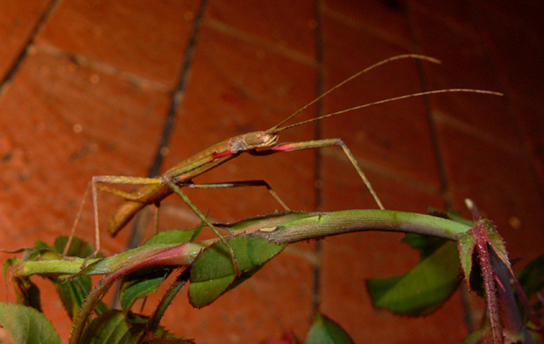
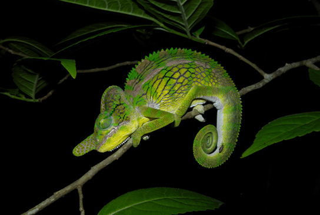
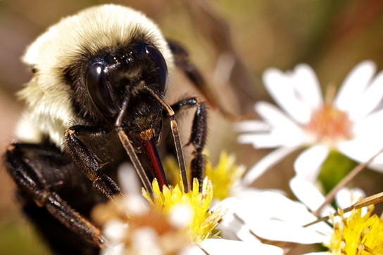
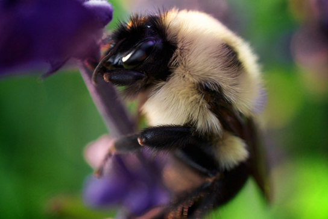
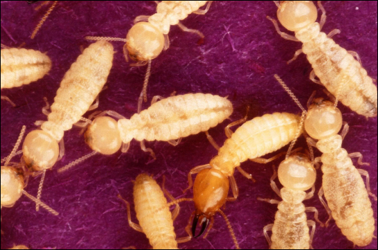
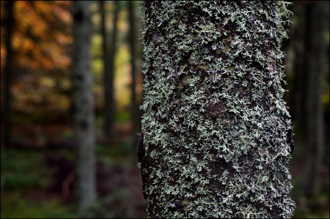

By the end of this section, you will be able to:
* Discuss the predator-prey cycle
* Give examples of defenses against predation and herbivory
* Describe the competitive exclusion principle
* Give examples of symbiotic relationships between species
* Describe community structure and succession

Populations rarely, if ever, live in isolation from populations of other species. In most cases, numerous species share a habitat. The interactions between these populations play a major role in regulating population growth and abundance. All populations occupying the same habitat form a community: populations inhabiting a specific area at the same time. The number of species occupying the same habitat and their relative abundance is known as species diversity. Areas with low diversity, such as the glaciers of Antarctica, still contain a wide variety of living things, whereas the diversity of tropical rainforests is so great that it cannot be counted. Ecology is studied at the community level to understand how species interact with each other and compete for the same resources.

# Predation and Herbivory

Perhaps the classical example of species interaction is predation: the hunting of prey by its predator. Nature shows on television highlight the drama of one living organism killing another. Populations of predators and prey in a community are not constant over time: in most cases, they vary in cycles that appear to be related. The most often cited example of predator-prey dynamics is seen in the cycling of the lynx (predator) and the snowshoe hare (prey), using nearly 200 year-old trapping data from North American forests ([\[link\]](#fig-ch45_06_01)). This cycle of predator and prey lasts approximately 10 years, with the predator population lagging 1–2 years behind that of the prey population. As the hare numbers increase, there is more food available for the lynx, allowing the lynx population to increase as well. When the lynx population grows to a threshold level, however, they kill so many hares that hare population begins to decline, followed by a decline in the lynx population because of scarcity of food. When the lynx population is low, the hare population size begins to increase due, at least in part, to low predation pressure, starting the cycle anew.

 {: #fig-ch45_06_01 data-media-type="image/jpg"}

The idea that the population cycling of the two species is entirely controlled by predation models has come under question. More recent studies have pointed to undefined density-dependent factors as being important in the cycling, in addition to predation. One possibility is that the cycling is inherent in the hare population due to density-dependent effects such as lower fecundity (maternal stress) caused by crowding when the hare population gets too dense. The hare cycling would then induce the cycling of the lynx because it is the lynxes’ major food source. The more we study communities, the more complexities we find, allowing ecologists to derive more accurate and sophisticated models of population dynamics.

Herbivory describes the consumption of plants by insects and other animals, and it is another interspecific relationship that affects populations. Unlike animals, most plants cannot outrun predators or use mimicry to hide from hungry animals. Some plants have developed mechanisms to defend against herbivory. Other species have developed mutualistic relationships; for example, herbivory provides a mechanism of seed distribution that aids in plant reproduction.

## Defense Mechanisms against Predation and Herbivory

The study of communities must consider evolutionary forces that act on the members of the various populations contained within it. Species are not static, but slowly changing and adapting to their environment by natural selection and other evolutionary forces. Species have evolved numerous mechanisms to escape predation and herbivory. These defenses may be mechanical, chemical, physical, or behavioral.

Mechanical defenses, such as the presence of thorns on plants or the hard shell on turtles, discourage animal predation and herbivory by causing physical pain to the predator or by physically preventing the predator from being able to eat the prey. Chemical defenses are produced by many animals as well as plants, such as the foxglove which is extremely toxic when eaten. [\[link\]](#fig-ch45_06_02) shows some organisms’ defenses against predation and herbivory.

  honey locust tree (Gleditsia triacanthos) uses thorns, a mechanical defense, against herbivores, while the (b) Florida red-bellied turtle (Pseudemys nelsoni) uses its shell as a mechanical defense against predators. (c) Foxglove (Digitalis sp.) uses a chemical defense: toxins produced by the plant can cause nausea, vomiting, hallucinations, convulsions, or death when consumed. (d) The North American millipede (Narceus americanus) uses both mechanical and chemical defenses: when threatened, the millipede curls into a defensive ball and produces a noxious substance that irritates eyes and skin. (credit a: modification of work by Huw Williams; credit b: modification of work by &#x201C;JamieS93&#x201D;/Flickr; credit c: modification of work by Philip J&#xE4;genstedt; credit d: modification of work by Cory Zanker)"){: #fig-ch45_06_02 data-media-type="image/jpg"}

Many species use their body shape and coloration to avoid being detected by predators. The tropical walking stick is an insect with the coloration and body shape of a twig which makes it very hard to see when stationary against a background of real twigs ([\[link\]](#fig-ch45_06_03)**a**). In another example, the chameleon can change its color to match its surroundings ([\[link\]](#fig-ch45_06_03)**b**). Both of these are examples of **camouflage**{: data-type="term"}, or avoiding detection by blending in with the background.

<figure markdown="1" id="fig-ch45_06_03" class="380">
<figcaption>
(a) The tropical walking stick and (b) the chameleon use body shape and/or coloration to prevent detection by predators. (credit a: modification of work by Linda Tanner; credit b: modification of work by Frank Vassen)
</figcaption>
{: #eip-idp207021088 data-media-type="image/jpg"}

{: #eip-idp4019456 data-media-type="image/jpg"}

</figure>

Some species use coloration as a way of warning predators that they are not good to eat. For example, the cinnabar moth caterpillar, the fire-bellied toad, and many species of beetle have bright colors that warn of a foul taste, the presence of toxic chemical, and/or the ability to sting or bite, respectively. Predators that ignore this coloration and eat the organisms will experience their unpleasant taste or presence of toxic chemicals and learn not to eat them in the future. This type of defensive mechanism is called **aposematic coloration**{: data-type="term"}, or warning coloration ([\[link\]](#fig-ch45_06_04)).

  The strawberry poison dart frog (Oophaga pumilio) uses aposematic coloration to warn predators that it is toxic, while the (b) striped skunk (Mephitis mephitis) uses aposematic coloration to warn predators of the unpleasant odor it produces. (credit a: modification of work by Jay Iwasaki; credit b: modification of work by Dan Dzurisin)"){: #fig-ch45_06_04 data-media-type="image/jpg"}

While some predators learn to avoid eating certain potential prey because of their coloration, other species have evolved mechanisms to mimic this coloration to avoid being eaten, even though they themselves may not be unpleasant to eat or contain toxic chemicals. In **Batesian mimicry**{: data-type="term"}, a harmless species imitates the warning coloration of a harmful one. Assuming they share the same predators, this coloration then protects the harmless ones, even though they do not have the same level of physical or chemical defenses against predation as the organism they mimic. Many insect species mimic the coloration of wasps or bees, which are stinging, venomous insects, thereby discouraging predation ([\[link\]](#fig-ch45_06_05)).

<figure markdown="1" id="fig-ch45_06_05" class="308">
<figcaption>
Batesian mimicry occurs when a harmless species mimics the coloration of a harmful species, as is seen with the (a) bumblebee and (b) bee-like robber fly. (credit a, b: modification of work by Cory Zanker)
</figcaption>
{: #eip-idm81838144 data-media-type="image/jpg"}

{: #eip-idm98126496 data-media-type="image/jpg"}

</figure>

In **Müllerian mimicry**{: data-type="term"}, multiple species share the same warning coloration, but all of them actually have defenses. [\[link\]](#fig-ch45_06_06) shows a variety of foul-tasting butterflies with similar coloration. In **Emsleyan/Mertensian mimicry**{: data-type="term"}, a deadly prey mimics a less dangerous one, such as the venomous coral snake mimicking the non-venomous milk snake. This type of mimicry is extremely rare and more difficult to understand than the previous two types. For this type of mimicry to work, it is essential that eating the milk snake has unpleasant but not fatal consequences. Then, these predators learn not to eat snakes with this coloration, protecting the coral snake as well. If the snake were fatal to the predator, there would be no opportunity for the predator to learn not to eat it, and the benefit for the less toxic species would disappear.

 "){: #fig-ch45_06_06 data-media-type="image/jpg"}

Link to Learning

 {: data-media-type="image/jpeg"} 
Go to this [website][1]{: target="_window"} to view stunning examples of mimicry.

# Competitive Exclusion Principle

Resources are often limited within a habitat and multiple species may compete to obtain them. All species have an ecological niche in the ecosystem, which describes how they acquire the resources they need and how they interact with other species in the community. The **competitive exclusion principle**{: data-type="term"} states that two species cannot occupy the same niche in a habitat. In other words, different species cannot coexist in a community if they are competing for all the same resources. An example of this principle is shown in [\[link\]](#fig-ch45_06_07), with two protozoan species, *Paramecium aurelia* and *Paramecium caudatum*. When grown individually in the laboratory, they both thrive. But when they are placed together in the same test tube (habitat), *P. aurelia* outcompetes <em>P. caudatum </em>for food, leading to the latter’s eventual extinction.

 ![Graphs a, b, and c all plot number of cells versus time in days. In Graph (a), P. aurelia is grown alone. In graph (b), P. caudatum is grown alone. In graph (c), both species are grown together. When grown together, the two species both exhibit logistic growth and grow to a relatively high cell density. When the two species are grown together, P. aurelia shows logistic growth to nearly the same cell density as it exhibited when grown alone, but P. caudatum hardly grows at all, and eventually its population drops to zero.](../resources/Figure_45_06_07abc.jpg "Paramecium aurelia and Paramecium caudatum grow well individually, but when they compete for the same resources, the P. aurelia outcompetes the P. caudatum."){: #fig-ch45_06_07 data-media-type="image/jpg"}

This exclusion may be avoided if a population evolves to make use of a different resource, a different area of the habitat, or feeds during a different time of day, called resource partitioning. The two organisms are then said to occupy different microniches. These organisms coexist by minimizing direct competition.

# Symbiosis

Symbiotic relationships, or **symbioses**{: data-type="term"} (plural), are close interactions between individuals of different species over an extended period of time which impact the abundance and distribution of the associating populations. Most scientists accept this definition, but some restrict the term to only those species that are mutualistic, where both individuals benefit from the interaction. In this discussion, the broader definition will be used.

## Commensalism

A **commensal**{: data-type="term"} relationship occurs when one species benefits from the close, prolonged interaction, while the other neither benefits nor is harmed. Birds nesting in trees provide an example of a commensal relationship ([\[link\]](#fig-ch45_06_08)). The tree is not harmed by the presence of the nest among its branches. The nests are light and produce little strain on the structural integrity of the branch, and most of the leaves, which the tree uses to get energy by photosynthesis, are above the nest so they are unaffected. The bird, on the other hand, benefits greatly. If the bird had to nest in the open, its eggs and young would be vulnerable to predators. Another example of a commensal relationship is the clown fish and the sea anemone. The sea anemone is not harmed by the fish, and the fish benefits with protection from predators who would be stung upon nearing the sea anemone.

  benefits, while the other (the tree) neither benefits nor is harmed. (credit: &#x201C;Hanay&#x201D;/Wikimedia Commons)"){: #fig-ch45_06_08 data-media-type="image/jpg"}

## Mutualism

A second type of symbiotic relationship is called **mutualism**{: data-type="term"}, where two species benefit from their interaction. Some scientists believe that these are the only true examples of symbiosis. For example, termites have a mutualistic relationship with protozoa that live in the insect’s gut ([\[link\]](#fig-ch45_06_09)**a**). The termite benefits from the ability of bacterial symbionts within the protozoa to digest cellulose. The termite itself cannot do this, and without the protozoa, it would not be able to obtain energy from its food (cellulose from the wood it chews and eats). The protozoa and the bacterial symbionts benefit by having a protective environment and a constant supply of food from the wood chewing actions of the termite. Lichens have a mutualistic relationship between fungus and photosynthetic algae or bacteria ([\[link\]](#fig-ch45_06_09)**b**). As these symbionts grow together, the glucose produced by the algae provides nourishment for both organisms, whereas the physical structure of the lichen protects the algae from the elements and makes certain nutrients in the atmosphere more available to the algae.

<figure markdown="1" id="fig-ch45_06_09" class=" ">
<figcaption>
(a) Termites form a mutualistic relationship with symbiotic protozoa in their guts, which allow both organisms to obtain energy from the cellulose the termite consumes. (b) Lichen is a fungus that has symbiotic photosynthetic algae living inside its cells. (credit a: modification of work by Scott Bauer, USDA; credit b: modification of work by Cory Zanker)
</figcaption>
{: #eip-idm25174288 data-media-type="image/jpg"}

{: #eip-idp156118720 data-media-type="image/jpg"}

</figure>

## Parasitism

A **parasite**{: data-type="term"} is an organism that lives in or on another living organism and derives nutrients from it. In this relationship, the parasite benefits, but the organism being fed upon, the **host**{: data-type="term"} is harmed. The host is usually weakened by the parasite as it siphons resources the host would normally use to maintain itself. The parasite, however, is unlikely to kill the host, especially not quickly, because this would allow no time for the organism to complete its reproductive cycle by spreading to another host.

The reproductive cycles of parasites are often very complex, sometimes requiring more than one host species. A tapeworm is a parasite that causes disease in humans when contaminated, undercooked meat such as pork, fish, or beef is consumed ([\[link\]](#fig-ch45_06_10)). The tapeworm can live inside the intestine of the host for several years, benefiting from the food the host is bringing into its gut by eating, and may grow to be over 50 ft long by adding segments. The parasite moves from species to species in a cycle, making two hosts necessary to complete its life cycle. Another common parasite is *Plasmodium falciparum*, the protozoan cause of malaria, a significant disease in many parts of the world. Living in human liver and red blood cells, the organism reproduces asexually in the gut of blood-feeding mosquitoes to complete its life cycle. Thus malaria is spread from human to human by mosquitoes, one of many arthropod-borne infectious diseases.

 ![The life cycle of a tapeworm begins when eggs or tapeworm segments in the feces are ingested by pigs or humans. The embryos hatch, penetrate the intestinal wall, and circulate to the musculature in both pigs and humans. Humans may acquire a tapeworm infection by ingesting raw or undercooked meat. Infection may results in cysts in the musculature, or in tapeworms in the intestine. Tapeworms attach themselves to the intestine via a hook-like structure called the scolex. Tapeworm segments and eggs are excreted in the feces, completing the cycle.](../resources/Figure_45_06_10ab.jpg "This diagram shows the life cycle of a pork tapeworm (Taenia solium), a human worm parasite. (credit: modification of work by CDC)"){: #fig-ch45_06_10 data-media-type="imgae/jpg"}

# Characteristics of Communities

Communities are complex entities that can be characterized by their structure (the types and numbers of species present) and dynamics (how communities change over time). Understanding community structure and dynamics enables community ecologists to manage ecosystems more effectively.

## Foundation Species

**Foundation species**{: data-type="term"} are considered the “base” or “bedrock” of a community, having the greatest influence on its overall structure. They are usually the primary producers: organisms that bring most of the energy into the community. Kelp, brown algae, is a foundation species, forming the basis of the kelp forests off the coast of California.

Foundation species may physically modify the environment to produce and maintain habitats that benefit the other organisms that use them. An example is the photosynthetic corals of the coral reef ([\[link\]](#fig-ch45_06_11)). Corals themselves are not photosynthetic, but harbor symbionts within their body tissues (dinoflagellates called zooxanthellae) that perform photosynthesis; this is another example of a mutualism. The exoskeletons of living and dead coral make up most of the reef structure, which protects many other species from waves and ocean currents.

 "){: #fig-ch45_06_11 data-media-type="image/jpg"}

## Biodiversity, Species Richness, and Relative Species Abundance

Biodiversity describes a community’s biological complexity: it is measured by the number of different species (species richness) in a particular area and their relative abundance (species evenness). The area in question could be a habitat, a biome, or the entire biosphere. **Species richness**{: data-type="term"} is the term that is used to describe the number of species living in a habitat or biome. Species richness varies across the globe ([\[link\]](#fig-ch45_06_12)). One factor in determining species richness is latitude, with the greatest species richness occurring in ecosystems near the equator, which often have warmer temperatures, large amounts of rainfall, and low seasonality. The lowest species richness occurs near the poles, which are much colder, drier, and thus less conducive to life in Geologic time (time since glaciations). The predictability of climate or productivity is also an important factor. Other factors influence species richness as well. For example, the study of **island biogeography**{: data-type="term"} attempts to explain the relatively high species richness found in certain isolated island chains, including the Galápagos Islands that inspired the young Darwin. **Relative species abundance**{: data-type="term"} is the number of individuals in a species relative to the total number of individuals in all species within a habitat, ecosystem, or biome. Foundation species often have the highest relative abundance of species.

 "){: #fig-ch45_06_12 data-media-type="image/jpg"}

## Keystone Species

A **keystone species**{: data-type="term"} is one whose presence is key to maintaining biodiversity within an ecosystem and to upholding an ecological community’s structure. The intertidal sea star, *Pisaster ochraceus*, of the northwestern United States is a keystone species ([\[link\]](#fig-ch45_06_13)). Studies have shown that when this organism is removed from communities, populations of their natural prey (mussels) increase, completely altering the species composition and reducing biodiversity. Another keystone species is the banded tetra, a fish in tropical streams, which supplies nearly all of the phosphorus, a necessary inorganic nutrient, to the rest of the community. If these fish were to become extinct, the community would be greatly affected.

 "){: #fig-ch45_06_13 data-media-type="image/jpg"}

Everyday Connection

Invasive SpeciesInvasive species are non-native organisms that, when introduced to an area out of their native range, threaten the ecosystem balance of that habitat. Many such species exist in the United States, as shown in [\[link\]](#fig-ch45_06_14). Whether enjoying a forest hike, taking a summer boat trip, or simply walking down an urban street, you have likely encountered an invasive species.

 purple loosestrife (Lythrum salicaria) and the (b) zebra mussel (Dreissena polymorpha) threaten certain aquatic ecosystems. Some forests are threatened by the spread of (c) common buckthorn (Rhamnus cathartica), (d) garlic mustard (Alliaria petiolata), and (e) the emerald ash borer (Agrilus planipennis). The (f) European starling (Sturnus vulgaris) may compete with native bird species for nest holes. (credit a: modification of work by Liz West; credit b: modification of work by M. McCormick, NOAA; credit c: modification of work by E. Dronkert; credit d: modification of work by Dan Davison; credit e: modification of work by USDA; credit f: modification of work by Don DeBold)"){: #fig-ch45_06_14 data-media-type="image/jpg"}

One of the many recent proliferations of an invasive species concerns the growth of Asian carp populations. Asian carp were introduced to the United States in the 1970s by fisheries and sewage treatment facilities that used the fish’s excellent filter feeding capabilities to clean their ponds of excess plankton. Some of the fish escaped, however, and by the 1980s they had colonized many waterways of the Mississippi River basin, including the Illinois and Missouri Rivers.

Voracious eaters and rapid reproducers, Asian carp may outcompete native species for food, potentially leading to their extinction. For example, black carp are voracious eaters of native mussels and snails, limiting this food source for native fish species. Silver carp eat plankton that native mussels and snails feed on, reducing this food source by a different alteration of the food web. In some areas of the Mississippi River, Asian carp species have become the most predominant, effectively outcompeting native fishes for habitat. In some parts of the Illinois River, Asian carp constitute 95 percent of the community\'s biomass. Although edible, the fish is bony and not a desired food in the United States. Moreover, their presence threatens the native fish and fisheries of the Great Lakes, which are important to local economies and recreational anglers. Asian carp have even injured humans. The fish, frightened by the sound of approaching motorboats, thrust themselves into the air, often landing in the boat or directly hitting the boaters.

The Great Lakes and their prized salmon and lake trout fisheries are also being threatened by these invasive fish. Asian carp have already colonized rivers and canals that lead into Lake Michigan. One infested waterway of particular importance is the Chicago Sanitary and Ship Channel, the major supply waterway linking the Great Lakes to the Mississippi River. To prevent the Asian carp from leaving the canal, a series of electric barriers have been successfully used to discourage their migration; however, the threat is significant enough that several states and Canada have sued to have the Chicago channel permanently cut off from Lake Michigan. Local and national politicians have weighed in on how to solve the problem, but no one knows whether the Asian carp will ultimately be considered a nuisance, like other invasive species such as the water hyacinth and zebra mussel, or whether it will be the destroyer of the largest freshwater fishery of the world.

The issues associated with Asian carp show how population and community ecology, fisheries management, and politics intersect on issues of vital importance to the human food supply and economy. Socio-political issues like this make extensive use of the sciences of population ecology (the study of members of a particular species occupying a particular area known as a habitat) and community ecology (the study of the interaction of all species within a habitat).

# Community Dynamics

Community dynamics are the changes in community structure and composition over time. Sometimes these changes are induced by **environmental disturbances**{: data-type="term"} such as volcanoes, earthquakes, storms, fires, and climate change. Communities with a stable structure are said to be at equilibrium. Following a disturbance, the community may or may not return to the equilibrium state.

Succession describes the sequential appearance and disappearance of species in a community over time. In **primary succession**{: data-type="term"}, newly exposed or newly formed land is colonized by living things; in **secondary succession**{: data-type="term"}, part of an ecosystem is disturbed and remnants of the previous community remain.

## Primary Succession and Pioneer Species

Primary succession occurs when new land is formed or rock is exposed: for example, following the eruption of volcanoes, such as those on the Big Island of Hawaii. As lava flows into the ocean, new land is continually being formed. On the Big Island, approximately 32 acres of land is added each year. First, weathering and other natural forces break down the substrate enough for the establishment of certain hearty plants and lichens with few soil requirements, known as **pioneer species**{: data-type="term"} ([\[link\]](#fig-ch45_06_15)). These species help to further break down the mineral rich lava into soil where other, less hardy species will grow and eventually replace the pioneer species. In addition, as these early species grow and die, they add to an ever-growing layer of decomposing organic material and contribute to soil formation. Over time the area will reach an equilibrium state, with a set of organisms quite different from the pioneer species.

 "){: #fig-ch45_06_15 data-media-type="image/jpg"}

## Secondary succession

A classic example of secondary succession occurs in oak and hickory forests cleared by wildfire ([\[link\]](#fig-ch45_06_16)). Wildfires will burn most vegetation and kill those animals unable to flee the area. Their nutrients, however, are returned to the ground in the form of ash. Thus, even when areas are devoid of life due to severe fires, the area will soon be ready for new life to take hold.

Before the fire, the vegetation was dominated by tall trees with access to the major plant energy resource: sunlight. Their height gave them access to sunlight while also shading the ground and other low-lying species. After the fire, though, these trees are no longer dominant. Thus, the first plants to grow back are usually annual plants followed within a few years by quickly growing and spreading grasses and other pioneer species. Due to, at least in part, changes in the environment brought on by the growth of the grasses and other species, over many years, shrubs will emerge along with small pine, oak, and hickory trees. These organisms are called intermediate species. Eventually, over 150 years, the forest will reach its equilibrium point where species composition is no longer changing and resembles the community before the fire. This equilibrium state is referred to as the **climax community**{: data-type="term"}, which will remain stable until the next disturbance.

 {: #fig-ch45_06_16 data-media-type="image/jpg"}

# Section Summary

Communities include all the different species living in a given area. The variety of these species is called species richness. Many organisms have developed defenses against predation and herbivory, including mechanical defenses, warning coloration, and mimicry, as a result of evolution and the interaction with other members of the community. Two species cannot exist in the same habitat competing directly for the same resources. Species may form symbiotic relationships such as commensalism or mutualism. Community structure is described by its foundation and keystone species. Communities respond to environmental disturbances by succession (the predictable appearance of different types of plant species) until a stable community structure is established.

# Review Questions

The first species to live on new land, such as that formed from volcanic lava, are called \_\_\_\_\_\_\_\_.

1.  climax community
2.  keystone species
3.  foundation species
4.  pioneer species
{: data-number-style="lower-alpha"}

D

Which type of mimicry involves multiple species with similar warning coloration that are all toxic to predators?

1.  Batesian mimicry
2.  Müllerian mimicry
3.  Emsleyan/Mertensian mimicry
4.  Mertensian mimicry
{: data-number-style="lower-alpha"}

B

A symbiotic relationship where both of the coexisting species benefit from the interaction is called \_\_\_\_\_\_\_\_.

1.  commensalism
2.  parasitism
3.  mutualism
4.  communism
{: data-number-style="lower-alpha"}

C

# Free Response

Describe the competitive exclusion principle and its effects on competing species.

The competitive exclusion principle states that no two species competing for the same resources at the same time and place can coexist over time. Thus, one of the competing species will eventually dominate. On the other hand, if the species evolve such that they use resources from different parts of the habitat or at different times of day, the two species can exist together indefinitely.

[1]: http://openstaxcollege.org/l/find_the_mimic
