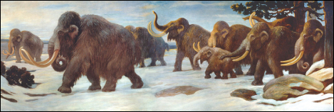
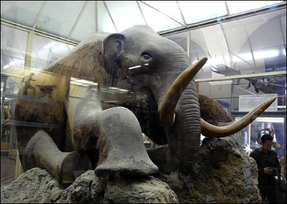
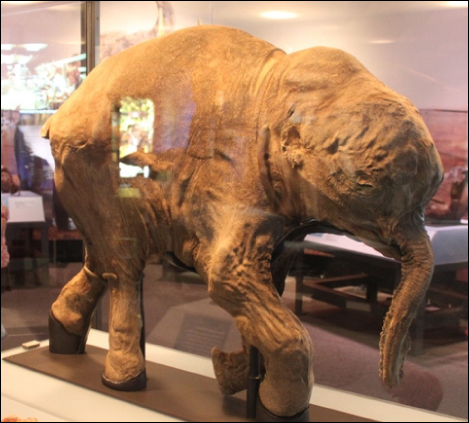

By the end of this section, you will be able to:
* Give examples of how the carrying capacity of a habitat may change
* Compare and contrast density-dependent growth regulation and density-independent growth regulation, giving examples
* Give examples of exponential and logistic growth in wild animal populations
* Describe how natural selection and environmental adaptation leads to the evolution of particular life-history patterns

The logistic model of population growth, while valid in many natural populations and a useful model, is a simplification of real-world population dynamics. Implicit in the model is that the carrying capacity of the environment does not change, which is not the case. The carrying capacity varies annually: for example, some summers are hot and dry whereas others are cold and wet. In many areas, the carrying capacity during the winter is much lower than it is during the summer. Also, natural events such as earthquakes, volcanoes, and fires can alter an environment and hence its carrying capacity. Additionally, populations do not usually exist in isolation. They engage in **interspecific competition**{: data-type="term"}\: that is, they share the environment with other species, competing with them for the same resources. These factors are also important to understanding how a specific population will grow.

Nature regulates population growth in a variety of ways. These are grouped into **density-dependent**{: data-type="term"} factors, in which the density of the population at a given time affects growth rate and mortality, and **density-independent**{: data-type="term"} factors, which influence mortality in a population regardless of population density. Note that in the former, the effect of the factor on the population depends on the density of the population at onset. Conservation biologists want to understand both types because this helps them manage populations and prevent extinction or overpopulation.

# Density-dependent Regulation

Most density-dependent factors are biological in nature (biotic), and include predation, inter- and intraspecific competition, accumulation of waste, and diseases such as those caused by parasites. Usually, the denser a population is, the greater its mortality rate. For example, during intra- and interspecific competition, the reproductive rates of the individuals will usually be lower, reducing their population’s rate of growth. In addition, low prey density increases the mortality of its predator because it has more difficulty locating its food source.

An example of density-dependent regulation is shown in [\[link\]](#fig-ch45_04_01) with results from a study focusing on the giant intestinal roundworm (*Ascaris lumbricoides*), a parasite of humans and other mammals.

N.A. Croll et al., “The Population Biology and Control of *Ascaris lumbricoides* in a Rural Community in Iran.” *Transactions of the Royal Society of Tropical Medicine and Hygiene* 76, no. 2 (1982): 187-197, doi:10.1016/0035-9203(82)90272-3.

 Denser populations of the parasite exhibited lower fecundity: they contained fewer eggs. One possible explanation for this is that females would be smaller in more dense populations (due to limited resources) and that smaller females would have fewer eggs. This hypothesis was tested and disproved in a 2009 study which showed that female weight had no influence.

Martin Walker et al., “Density-Dependent Effects on the Weight of Female *Ascaris lumbricoides* Infections of Humans and its Impact on Patterns of Egg Production.” *Parasites &amp; Vectors* 2, no. 11 (February 2009), doi:10.1186/1756-3305-2-11.

 The actual cause of the density-dependence of fecundity in this organism is still unclear and awaiting further investigation.

 decreases with population density.N.A. Croll et al., &#x201C;The Population Biology and Control of Ascaris lumbricoides in a Rural Community in Iran.&#x201D; Transactions of the Royal Society of Tropical Medicine and Hygiene 76, no. 2 (1982): 187-197, doi:10.1016/0035-9203(82)90272-3."){: #fig-ch45_04_01 data-media-type="image/jpeg"}

# Density-independent Regulation and Interaction with Density-dependent Factors

Many factors, typically physical or chemical in nature (abiotic), influence the mortality of a population regardless of its density, including weather, natural disasters, and pollution. An individual deer may be killed in a forest fire regardless of how many deer happen to be in that area. Its chances of survival are the same whether the population density is high or low. The same holds true for cold winter weather.

In real-life situations, population regulation is very complicated and density-dependent and independent factors can interact. A dense population that is reduced in a density-independent manner by some environmental factor(s) will be able to recover differently than a sparse population. For example, a population of deer affected by a harsh winter will recover faster if there are more deer remaining to reproduce.

Evolution Connection

Why Did the Woolly Mammoth Go Extinct? <figure markdown="1" id="fig-ch45_04_02" data-orient="horizontal">
<figcaption>
The three photos include: (a) 1916 mural of a mammoth herd from the American Museum of Natural History, (b) the only stuffed mammoth in the world, from the Museum of Zoology located in St. Petersburg, Russia, and (c) a one-month-old baby mammoth, named Lyuba, discovered in Siberia in 2007. (credit a: modification of work by Charles R. Knight; credit b: modification of work by “Tanapon”/Flickr; credit c: modification of work by Matt Howry)
</figcaption>
{: #fig-ch45_04_02a data-media-type="image/jpeg"}

{: #fig-ch45_04_02b data-media-type="image/jpeg"}

{: #fig-ch45_04_02c data-media-type="image/jpeg"}

</figure>

It\'s easy to get lost in the discussion of dinosaurs and theories about why they went extinct 65 million years ago. Was it due to a meteor slamming into Earth near the coast of modern-day Mexico, or was it from some long-term weather cycle that is not yet understood? One hypothesis that will never be proposed is that humans had something to do with it. Mammals were small, insignificant creatures of the forest 65 million years ago, and no humans existed.

Woolly mammoths, however, began to go extinct about 10,000 years ago, when they shared the Earth with humans who were no different anatomically than humans today ([\[link\]](#fig-ch45_04_02)). Mammoths survived in isolated island populations as recently as 1700 BC. We know a lot about these animals from carcasses found frozen in the ice of Siberia and other regions of the north. Scientists have sequenced at least 50 percent of its genome and believe mammoths are between 98 and 99 percent identical to modern elephants.

It is commonly thought that climate change and human hunting led to their extinction. A 2008 study estimated that climate change reduced the mammoth’s range from 3,000,000 square miles 42,000 years ago to 310,000 square miles 6,000 years ago.

David Nogués-Bravo et al., “Climate Change, Humans, and the Extinction of the Woolly Mammoth.” *PLoS Biol* 6 (April 2008): e79, doi:10.1371/journal.pbio.0060079.

 It is also well documented that humans hunted these animals. A 2012 study showed that no single factor was exclusively responsible for the extinction of these magnificent creatures.

G.M. MacDonald et al., “Pattern of Extinction of the Woolly Mammoth in Beringia.” *Nature Communications* 3, no. 893 (June 2012), doi:10.1038/ncomms1881.

 In addition to human hunting, climate change, and reduction of habitat, these scientists demonstrated another important factor in the mammoth’s extinction was the migration of humans across the Bering Strait to North America during the last ice age 20,000 years ago.

The maintenance of stable populations was and is very complex, with many interacting factors determining the outcome. It is important to remember that humans are also part of nature. Once we contributed to a species’ decline using primitive hunting technology only.

# Life Histories of *K*-selected and *r*-selected Species

While reproductive strategies play a key role in life histories, they do not account for important factors like limited resources and competition. The regulation of population growth by these factors can be used to introduce a classical concept in population biology, that of *K*-selected versus *r*-selected species.

## Early Theories about Life History: *K*-selected and *r*-selected Species

By the second half of the twentieth century, the concept of K- and r-selected species was used extensively and successfully to study populations. The concept relates not only reproductive strategies, but also to a species’ habitat and behavior, especially in the way that they obtain resources and care for their young. It includes length of life and survivorship factors as well. For this analysis, population biologists have grouped species into the two large categories—*K*-selected and *r*-selected—although they are really two ends of a continuum.

***K*-selected species**{: data-type="term"} are species selected by stable, predictable environments. Populations of *K*-selected species tend to exist close to their carrying capacity (hence the term *K*-selected) where intraspecific competition is high. These species have few, large offspring, a long gestation period, and often give long-term care to their offspring (Table B45\\\_04\\\_01). While larger in size when born, the offspring are relatively helpless and immature at birth. By the time they reach adulthood, they must develop skills to compete for natural resources. In plants, scientists think of parental care more broadly: how long fruit takes to develop or how long it remains on the plant are determining factors in the time to the next reproductive event. Examples of *K*-selected species are primates including humans), elephants, and plants such as oak trees ([\[link\]](#fig-ch45_04_03)**a**).

Oak trees grow very slowly and take, on average, 20 years to produce their first seeds, known as acorns. As many as 50,000 acorns can be produced by an individual tree, but the germination rate is low as many of these rot or are eaten by animals such as squirrels. In some years, oaks may produce an exceptionally large number of acorns, and these years may be on a two- or three-year cycle depending on the species of oak (*r*-selection).

As oak trees grow to a large size and for many years before they begin to produce acorns, they devote a large percentage of their energy budget to growth and maintenance. The tree’s height and size allow it to dominate other plants in the competition for sunlight, the oak’s primary energy resource. Furthermore, when it does reproduce, the oak produces large, energy-rich seeds that use their energy reserve to become quickly established (*K*-selection).

In contrast, ***r*-selected species**{: data-type="term"} have a large number of small offspring (hence their *r* designation ([\[link\]](#tab-ch45_04_01)). This strategy is often employed in unpredictable or changing environments. Animals that are *r*-selected do not give long-term parental care and the offspring are relatively mature and self-sufficient at birth. Examples of *r*-selected species are marine invertebrates, such as jellyfish, and plants, such as the dandelion ([\[link\]](#fig-ch45_04_03)**b**). Dandelions have small seeds that are wind dispersed long distances. Many seeds are produced simultaneously to ensure that at least some of them reach a hospitable environment. Seeds that land in inhospitable environments have little chance for survival since their seeds are low in energy content. Note that survival is not necessarily a function of energy stored in the seed itself.

<table id="tab-ch45_04_01" summary=""><thead>
                    <tr>
                        <th colspan="2">Characteristics of <em>K</em>-selected and <em>r</em>-selected species</th>
                    </tr>
                    <tr>
                        <th>Characteristics of <em>K</em>-selected species</th>
                        <th>Characteristics of <em>r</em>-selected species </th>
                    </tr>
                </thead><tbody>
                    <tr>
                        <td>Mature late</td>
                        <td>Mature early</td>
                    </tr>
                    <tr>
                        <td>Greater longevity</td>
                        <td>Lower longevity</td>
                    </tr>
                    <tr>
                        <td>Increased parental care</td>
                        <td>Decreased parental care</td>
                    </tr>
                    <tr>
                        <td>Increased competition</td>
                        <td>Decreased competition</td>
                    </tr>
                    <tr>
                        <td>Fewer offspring</td>
                        <td>More offspring</td>
                    </tr>
                    <tr>
                        <td>Larger offspring</td>
                        <td>Smaller offspring</td>
                    </tr>
                </tbody></table>

  Elephants are considered K-selected species as they live long, mature late, and provide long-term parental care to few offspring. Oak trees produce many offspring that do not receive parental care, but are considered K-selected species based on longevity and late maturation. (b) Dandelions and jellyfish are both considered r-selected species as they mature early, have short lifespans, and produce many offspring that receive no parental care."){: #fig-ch45_04_03 data-media-type="image/jpg"}

# Modern Theories of Life History

The *r*- and *K*-selection theory, although accepted for decades and used for much groundbreaking research, has now been reconsidered, and many population biologists have abandoned or modified it. Over the years, several studies attempted to confirm the theory, but these attempts have largely failed. Many species were identified that did not follow the theory’s predictions. Furthermore, the theory ignored the age-specific mortality of the populations which scientists now know is very important. New **demographic-based models**{: data-type="term"} of life history evolution have been developed which incorporate many ecological concepts included in *r*- and *K*-selection theory as well as population age structure and mortality factors.

# Section Summary

Populations are regulated by a variety of density-dependent and density-independent factors. Species are divided into two categories based on a variety of features of their life history patterns: *r*-selected species, which have large numbers of offspring, and *K*-selected species, which have few offspring. The *r*- and *K*-selection theory has fallen out of use; however, many of its key features are still used in newer, demographically-based models of population dynamics.

# Review Questions

Species that have many offspring at one time are usually:

1.  *r*-selected
2.  *K*-selected
3.  both *r*- and *K*-selected
4.  not selected
{: data-number-style="lower-alpha"}

A

A forest fire is an example of \_\_\_\_\_\_\_\_ regulation.

1.  density-dependent
2.  density-independent
3.  *r*-selected
4.  *K*-selected
{: data-number-style="lower-alpha"}

B

Primates are examples of:

1.  density-dependent species
2.  density-independent species
3.  *r*-selected species
4.  *K*-selected species
{: data-number-style="lower-alpha"}

D

# Free Response

Give an example of how density-dependent and density-independent factors might interact.

If a natural disaster such as a fire happened in the winter, when populations are low, it would have a greater effect on the overall population and its recovery than if the same disaster occurred during the summer, when population levels are high.

