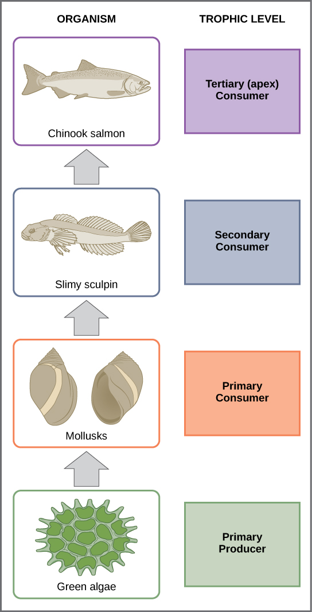

By the end of this section, you will be able to:
* Describe the basic types of ecosystems on Earth
* Explain the methods that ecologists use to study ecosystem structure and dynamics
* Identify the different methods of ecosystem modeling
* Differentiate between food chains and food webs and recognize the importance of each

Life in an ecosystem is often about competition for limited resources, a characteristic of the theory of natural selection. Competition in communities (all living things within specific habitats) is observed both within species and among different species. The resources for which organisms compete include organic material from living or previously living organisms, sunlight, and mineral nutrients, which provide the energy for living processes and the matter to make up organisms’ physical structures. Other critical factors influencing community dynamics are the components of its physical and geographic environment: a habitat’s latitude, amount of rainfall, topography (elevation), and available species. These are all important environmental variables that determine which organisms can exist within a particular area.

An **ecosystem**{: data-type="term"} is a community of living organisms and their interactions with their abiotic (non-living) environment. Ecosystems can be small, such as the tide pools found near the rocky shores of many oceans, or large, such as the Amazon Rainforest in Brazil ([\[link\]](#fig-ch46_01_01)).

 tidal pool ecosystem in Matinicus Island in Maine is a small ecosystem, while the (b) Amazon Rainforest in Brazil is a large ecosystem. (credit a: modification of work by &#x201C;takomabibelot&#x201D;/Flickr; credit b: modification of work by Ivan Mlinaric)"){: #fig-ch46_01_01 data-media-type="image/jpg"}

There are three broad categories of ecosystems based on their general environment: freshwater, ocean water, and terrestrial. Within these broad categories are individual ecosystem types based on the organisms present and the type of environmental habitat.

Ocean ecosystems are the most common, comprising 75 percent of the Earth\'s surface and consisting of three basic types: shallow ocean, deep ocean water, and deep ocean surfaces (the low depth areas of the deep oceans). The shallow ocean ecosystems include extremely biodiverse coral reef ecosystems, and the deep ocean surface is known for its large numbers of plankton and krill (small crustaceans) that support it. These two environments are especially important to aerobic respirators worldwide as the phytoplankton perform 40 percent of all photosynthesis on Earth. Although not as diverse as the other two, deep ocean ecosystems contain a wide variety of marine organisms. Such ecosystems exist even at the bottom of the ocean where light is unable to penetrate through the water.

Freshwater ecosystems are the rarest, occurring on only 1.8 percent of the Earth\'s surface. Lakes, rivers, streams, and springs comprise these systems; they are quite diverse, and they support a variety of fish, amphibians, reptiles, insects, phytoplankton, fungi, and bacteria.

Terrestrial ecosystems, also known for their diversity, are grouped into large categories called biomes, such as tropical rain forests, savannas, deserts, coniferous forests, deciduous forests, and tundra. Grouping these ecosystems into just a few biome categories obscures the great diversity of the individual ecosystems within them. For example, there is great variation in desert vegetation: the saguaro cacti and other plant life in the Sonoran Desert, in the United States, are relatively abundant compared to the desolate rocky desert of Boa Vista, an island off the coast of Western Africa ([\[link\]](#fig-ch46_01_02)).

 Saguaro National Park, Arizona, has abundant plant life, while the rocky desert of (b) Boa Vista island, Cape Verde, Africa, is devoid of plant life. (credit a: modification of work by Jay Galvin; credit b: modification of work by Ingo W&#xF6;lbern)"){: #fig-ch46_01_02 data-media-type="image/jpg"}

Ecosystems are complex with many interacting parts. They are routinely exposed to various disturbances, or changes in the environment that effect their compositions: yearly variations in rainfall and temperature and the slower processes of plant growth, which may take several years. Many of these disturbances are a result of natural processes. For example, when lightning causes a forest fire and destroys part of a forest ecosystem, the ground is eventually populated by grasses, then by bushes and shrubs, and later by mature trees, restoring the forest to its former state. The impact of environmental disturbances caused by human activities is as important as the changes wrought by natural processes. Human agricultural practices, air pollution, acid rain, global deforestation, overfishing, eutrophication, oil spills, and illegal dumping on land and into the ocean are all issues of concern to conservationists.

**Equilibrium**{: data-type="term"} is the steady state of an ecosystem where all organisms are in balance with their environment and with each other. In ecology, two parameters are used to measure changes in ecosystems: resistance and resilience. The ability of an ecosystem to remain at equilibrium in spite of disturbances is called **resistance**{: data-type="term"}. The speed at which an ecosystem recovers equilibrium after being disturbed, called its **resilience**{: data-type="term"}. Ecosystem resistance and resilience are especially important when considering human impact. The nature of an ecosystem may change to such a degree that it can lose its resilience entirely. This process can lead to the complete destruction or irreversible altering of the ecosystem.

# Food Chains and Food Webs

The term “food chain” is sometimes used metaphorically to describe human social situations. In this sense, food chains are thought of as a competition for survival, such as “who eats whom?” Someone eats and someone is eaten. Therefore, it is not surprising that in our competitive “dog-eat-dog” society, individuals who are considered successful are seen as being at the top of the food chain, consuming all others for their benefit, whereas the less successful are seen as being at the bottom.

The scientific understanding of a food chain is more precise than in its everyday usage. In ecology, a **food chain**{: data-type="term"} is a linear sequence of organisms through which nutrients and energy pass: primary producers, primary consumers, and higher-level consumers are used to describe ecosystem structure and dynamics. There is a single path through the chain. Each organism in a food chain occupies what is called a **trophic level**{: data-type="term"}. Depending on their role as producers or consumers, species or groups of species can be assigned to various trophic levels.

In many ecosystems, the bottom of the food chain consists of photosynthetic organisms (plants and/or phytoplankton), which are called **primary producers**{: data-type="term"}. The organisms that consume the primary producers are herbivores: the **primary consumers**{: data-type="term"}. **Secondary consumers**{: data-type="term"} are usually carnivores that eat the primary consumers. **Tertiary consumers**{: data-type="term"} are carnivores that eat other carnivores. Higher-level consumers feed on the next lower tropic levels, and so on, up to the organisms at the top of the food chain: the **apex consumers**{: data-type="term"}. In the Lake Ontario food chain shown in [\[link\]](#fig-ch46_01_03), the Chinook salmon is the apex consumer at the top of this food chain.

 {: #fig-ch46_01_03 data-media-type="image/jpg"}

One major factor that limits the length of food chains is energy. Energy is lost as heat between each trophic level due to the second law of thermodynamics. Thus, after a limited number of trophic energy transfers, the amount of energy remaining in the food chain may not be great enough to support viable populations at yet a higher trophic level.

The loss of energy between trophic levels is illustrated by the pioneering studies of Howard T. Odum in the Silver Springs, Florida, ecosystem in the 1940s ([\[link\]](#fig-ch46_01_04)). The primary producers generated 20,819 kcal/m2/yr (kilocalories per square meter per year), the primary consumers generated 3368 kcal/m2/yr, the secondary consumers generated 383 kcal/m2/yr, and the tertiary consumers only generated 21 kcal/m2/yr. Thus, there is little energy remaining for another level of consumers in this ecosystem.

 {: #fig-ch46_01_04 data-media-type="image/jpg"}

There is a one problem when using food chains to accurately describe most ecosystems. Even when all organisms are grouped into appropriate trophic levels, some of these organisms can feed on species from more than one trophic level; likewise, some of these organisms can be eaten by species from multiple trophic levels. In other words, the linear model of ecosystems, the food chain, is not completely descriptive of ecosystem structure. A holistic model—which accounts for all the interactions between different species and their complex interconnected relationships with each other and with the environment—is a more accurate and descriptive model for ecosystems. A **food web**{: data-type="term"} is a graphic representation of a holistic, non-linear web of primary producers, primary consumers, and higher-level consumers used to describe ecosystem structure and dynamics ([\[link\]](#fig-ch46_01_05)).

 ![ The bottom level of the illustration shows primary producers, which include diatoms, green algae, blue-green algae, flagellates, and rotifers. The next level includes the primary consumers that eat primary producers. These include calanoids, waterfleas, and cyclopoids, rotifers and amphipods. The shrimp also eats primary producers. Primary consumers are in turn eaten by secondary consumers, which are typically small fish. The small fish are eaten by larger fish, the tertiary, or apex consumers. The yellow perch, a secondary consumer, eats small fish within its own trophic level. All fish are eaten by the sea lamprey. Thus, the food web is complex with interwoven layers.](../resources/Figure_46_01_05.jpg "This food web shows the interactions between organisms across trophic levels in the Lake Ontario ecosystem. Primary producers are outlined in green, primary consumers in orange, secondary consumers in blue, and tertiary (apex) consumers in purple. Arrows point from an organism that is consumed to the organism that consumes it. Notice how some lines point to more than one trophic level. For example, the opossum shrimp eats both primary producers and primary consumers. (credit: NOAA, GLERL)"){: #fig-ch46_01_05 data-media-type="image/jpg"}

A comparison of the two types of structural ecosystem models shows strength in both. Food chains are more flexible for analytical modeling, are easier to follow, and are easier to experiment with, whereas food web models more accurately represent ecosystem structure and dynamics, and data can be directly used as input for simulation modeling.

Link to Learning

 {: data-media-type="image/png"} 
Head to this [online interactive simulator][1]{: target="_window"} to investigate food web function. In the *Interactive Labs* box, under <u data-effect="underline">Food Web</u>

, click **Step 1**. Read the instructions first, and then click <strong>Step 2 </strong>for additional instructions. When you are ready to create a simulation, in the upper-right corner of the *Interactive Labs* box, click **OPEN SIMULATOR**.

Two general types of food webs are often shown interacting within a single ecosystem. A **grazing food web**{: data-type="term"} (such as the Lake Ontario food web in [\[link\]](#fig-ch46_01_05)) has plants or other photosynthetic organisms at its base, followed by herbivores and various carnivores. A **detrital food web**{: data-type="term"} consists of a base of organisms that feed on decaying organic matter (dead organisms), called decomposers or detritivores. These organisms are usually bacteria or fungi that recycle organic material back into the biotic part of the ecosystem as they themselves are consumed by other organisms. As all ecosystems require a method to recycle material from dead organisms, most grazing food webs have an associated detrital food web. For example, in a meadow ecosystem, plants may support a grazing food web of different organisms, primary and other levels of consumers, while at the same time supporting a detrital food web of bacteria, fungi, and detrivorous invertebrates feeding off dead plants and animals.

Evolution Conenction

Three-spined SticklebackIt is well established by the theory of natural selection that changes in the environment play a major role in the evolution of species within an ecosystem. However, little is known about how the evolution of species within an ecosystem can alter the ecosystem environment. In 2009, Dr. Luke Harmon, from the University of Idaho in Moscow, published a paper that for the first time showed that the evolution of organisms into subspecies can have direct effects on their ecosystem environment.

*Nature* (Vol. 458, April 1, 2009)

The three-spines stickleback (*Gasterosteus aculeatus*) is a freshwater fish that evolved from a saltwater fish to live in freshwater lakes about 10,000 years ago, which is considered a recent development in evolutionary time ([\[link\]](#fig-ch46_01_06)). Over the last 10,000 years, these freshwater fish then became isolated from each other in different lakes. Depending on which lake population was studied, findings showed that these sticklebacks then either remained as one species or evolved into two species. The divergence of species was made possible by their use of different areas of the pond for feeding called micro niches.

Dr. Harmon and his team created artificial pond microcosms in 250-gallon tanks and added muck from freshwater ponds as a source of zooplankton and other invertebrates to sustain the fish. In different experimental tanks they introduced one species of stickleback from either a single-species or double-species lake.

Over time, the team observed that some of the tanks bloomed with algae while others did not. This puzzled the scientists, and they decided to measure the water\'s dissolved organic carbon (DOC), which consists of mostly large molecules of decaying organic matter that give pond-water its slightly brownish color. It turned out that the water from the tanks with two-species fish contained larger particles of DOC (and hence darker water) than water with single-species fish. This increase in DOC blocked the sunlight and prevented algal blooming. Conversely, the water from the single-species tank contained smaller DOC particles, allowing more sunlight penetration to fuel the algal blooms.

This change in the environment, which is due to the different feeding habits of the stickleback species in each lake type, probably has a great impact on the survival of other species in these ecosystems, especially other photosynthetic organisms. Thus, the study shows that, at least in these ecosystems, the environment and the evolution of populations have reciprocal effects that may now be factored into simulation models.

"){: #fig-ch46_01_06 data-media-type="image/jpg"}

# Research into Ecosystem Dynamics: Ecosystem Experimentation and Modeling

The study of the changes in ecosystem structure caused by changes in the environment (disturbances) or by internal forces is called **ecosystem dynamics**{: data-type="term"}. Ecosystems are characterized using a variety of research methodologies. Some ecologists study ecosystems using controlled experimental systems, while some study entire ecosystems in their natural state, and others use both approaches.

A **holistic ecosystem model**{: data-type="term"} attempts to quantify the composition, interaction, and dynamics of entire ecosystems; it is the most representative of the ecosystem in its natural state. A food web is an example of a holistic ecosystem model. However, this type of study is limited by time and expense, as well as the fact that it is neither feasible nor ethical to do experiments on large natural ecosystems. To quantify all different species in an ecosystem and the dynamics in their habitat is difficult, especially when studying large habitats such as the Amazon Rainforest, which covers 1.4 billion acres (5.5 million km2) of the Earth’s surface.

For these reasons, scientists study ecosystems under more controlled conditions. Experimental systems usually involve either partitioning a part of a natural ecosystem that can be used for experiments, termed a **mesocosm**{: data-type="term"}, or by re-creating an ecosystem entirely in an indoor or outdoor laboratory environment, which is referred to as a **microcosm**{: data-type="term"}. A major limitation to these approaches is that removing individual organisms from their natural ecosystem or altering a natural ecosystem through partitioning may change the dynamics of the ecosystem. These changes are often due to differences in species numbers and diversity and also to environment alterations caused by partitioning (mesocosm) or re-creating (microcosm) the natural habitat. Thus, these types of experiments are not totally predictive of changes that would occur in the ecosystem from which they were gathered.

As both of these approaches have their limitations, some ecologists suggest that results from these experimental systems should be used only in conjunction with holistic ecosystem studies to obtain the most representative data about ecosystem structure, function, and dynamics.

Scientists use the data generated by these experimental studies to develop ecosystem models that demonstrate the structure and dynamics of ecosystems. Three basic types of ecosystem modeling are routinely used in research and ecosystem management: a conceptual model, an analytical model, and a simulation model. A **conceptual model**{: data-type="term"} is an ecosystem model that consists of flow charts to show interactions of different compartments of the living and nonliving components of the ecosystem. A conceptual model describes ecosystem structure and dynamics and shows how environmental disturbances affect the ecosystem; however, its ability to predict the effects of these disturbances is limited. Analytical and simulation models, in contrast, are mathematical methods of describing ecosystems that are indeed capable of predicting the effects of potential environmental changes without direct experimentation, although with some limitations as to accuracy. An **analytical model**{: data-type="term"} is an ecosystem model that is created using simple mathematical formulas to predict the effects of environmental disturbances on ecosystem structure and dynamics. A **simulation model**{: data-type="term"} is an ecosystem model that is created using complex computer algorithms to holistically model ecosystems and to predict the effects of environmental disturbances on ecosystem structure and dynamics. Ideally, these models are accurate enough to determine which components of the ecosystem are particularly sensitive to disturbances, and they can serve as a guide to ecosystem managers (such as conservation ecologists or fisheries biologists) in the practical maintenance of ecosystem health.

## Conceptual Models

Conceptual models are useful for describing ecosystem structure and dynamics and for demonstrating the relationships between different organisms in a community and their environment. Conceptual models are usually depicted graphically as flow charts. The organisms and their resources are grouped into specific compartments with arrows showing the relationship and transfer of energy or nutrients between them. Thus, these diagrams are sometimes called compartment models.

To model the cycling of mineral nutrients, organic and inorganic nutrients are subdivided into those that are bioavailable (ready to be incorporated into biological macromolecules) and those that are not. For example, in a terrestrial ecosystem near a deposit of coal, carbon will be available to the plants of this ecosystem as carbon dioxide gas in a short-term period, not from the carbon-rich coal itself. However, over a longer period, microorganisms capable of digesting coal will incorporate its carbon or release it as natural gas (methane, CH4), changing this unavailable organic source into an available one. This conversion is greatly accelerated by the combustion of fossil fuels by humans, which releases large amounts of carbon dioxide into the atmosphere. This is thought to be a major factor in the rise of the atmospheric carbon dioxide levels in the industrial age. The carbon dioxide released from burning fossil fuels is produced faster than photosynthetic organisms can use it. This process is intensified by the reduction of photosynthetic trees because of worldwide deforestation. Most scientists agree that high atmospheric carbon dioxide is a major cause of global climate change.

Conceptual models are also used to show the flow of energy through particular ecosystems. [\[link\]](#fig-ch46_01_07) is based on Howard T. Odum’s classical study of the Silver Springs, Florida, holistic ecosystem in the mid-twentieth century.

Howard T. Odum, “Trophic Structure and Productivity of Silver Springs, Florida,” *Ecological Monographs* 27, no. 1 (1957): 47–112.

 This study shows the energy content and transfer between various ecosystem compartments.

Art Connection

![ Flow chart shows that the ecosystem absorbs 1,700,00 calories per meter squared per year of sunlight. Primary producers have a gross productivity of 20,810 calories per meter squared per year. 13,187 calories per meter squared per year is lost to respiration and heat, so the net productivity of primary producers is 7,618 calories per meter squared per year. 4,250 calories per meter squared per year is passed on to decomposers, and the remaining 3,368 calories per meter squared per year is passed on to primary consumers. Thus, the gross productivity of primary consumers is 3,368 calories per meter squared per year. 2,265 calories per meter squared per year is lost to heat and respiration, resulting in a net productivity for primary consumers of 1,103 calories per meter squared per year. 720 calories per meter squared per year is lost to decomposers, and 383 calories per meter squared per year becomes the gross productivity of secondary consumers. 272 calories per meter squared per year is lost to heat and respiration, so the net productivity for secondary consumers is 111 calories per meter squared per year. 90 calories per meter squared per year is lost to decomposers, and the remaining 21 calories per meter squared per year becomes the gross productivity of tertiary consumers. Sixteen calories per meter squared per year is lost to respiration and heat, so the net productivity of tertiary consumers is 5 calories per meter squared per year. All this energy is lost to decomposers. In total, decomposers use 5,060 calories per meter squared per year of energy, and 20,810 calories per meter squared per year is lost to respiration and heat.](../resources/Figure_46_01_07.png "This conceptual model shows the flow of energy through a spring ecosystem in Silver Springs, Florida. Notice that the energy decreases with each increase in trophic level."){: #fig-ch46_01_07 data-media-type="image/png"}

Why do you think the value for gross productivity of the primary producers is the same as the value for total heat and respiration (20,810 kcal/m2/yr)?

<!--<para><link target-id="fig-ch46_01_07" document=""/>According to the first law of thermodynamics, energy can neither be created nor destroyed. Eventually, all energy consumed by living systems is lost as heat or used for respiration, and the total energy output of the system must equal the energy that went into it.]</para>-->

## Analytical and Simulation Models

The major limitation of conceptual models is their inability to predict the consequences of changes in ecosystem species and/or environment. Ecosystems are dynamic entities and subject to a variety of abiotic and biotic disturbances caused by natural forces and/or human activity. Ecosystems altered from their initial equilibrium state can often recover from such disturbances and return to a state of equilibrium. As most ecosystems are subject to periodic disturbances and are often in a state of change, they are usually either moving toward or away from their equilibrium state. There are many of these equilibrium states among the various components of an ecosystem, which affects the ecosystem overall. Furthermore, as humans have the ability to greatly and rapidly alter the species content and habitat of an ecosystem, the need for predictive models that enable understanding of how ecosystems respond to these changes becomes more crucial.

Analytical models often use simple, linear components of ecosystems, such as food chains, and are known to be complex mathematically; therefore, they require a significant amount of mathematical knowledge and expertise. Although analytical models have great potential, their simplification of complex ecosystems is thought to limit their accuracy. Simulation models that use computer programs are better able to deal with the complexities of ecosystem structure.

A recent development in simulation modeling uses supercomputers to create and run individual-based simulations, which accounts for the behavior of individual organisms and their effects on the ecosystem as a whole. These simulations are considered to be the most accurate and predictive of the complex responses of ecosystems to disturbances.

Link to Learning

 {: data-media-type="image/png"} 
Visit [The Darwin Project][2]{: target="_window"} to view a variety of ecosystem models.

# Section Summary

Ecosystems exist on land, at sea, in the air, and underground. Different ways of modeling ecosystems are necessary to understand how environmental disturbances will affect ecosystem structure and dynamics. Conceptual models are useful to show the general relationships between organisms and the flow of materials or energy between them. Analytical models are used to describe linear food chains, and simulation models work best with holistic food webs.

# Art Connections

[[link]](#fig-ch46_01_07) Why do you think the value for gross productivity of the primary producers is the same as the value for total heat and respiration (20,810 kcal/m2/yr)?

[[link]](#fig-ch46_01_07) According to the first law of thermodynamics, energy can neither be created nor destroyed. Eventually, all energy consumed by living systems is lost as heat or used for respiration, and the total energy output of the system must equal the energy that went into it.

# Review Questions

The ability of an ecosystem to return to its equilibrium state after an environmental disturbance is called \_\_\_\_\_\_\_\_.

1.  resistance
2.  restoration
3.  reformation
4.  resilience
{: data-number-style="lower-alpha"}

D

A re-created ecosystem in a laboratory environment is known as a \_\_\_\_\_\_\_\_.

1.  mesocosm
2.  simulation
3.  microcosm
4.  reproduction
{: data-number-style="lower-alpha"}

C

Decomposers are associated with which class of food web?

1.  grazing
2.  detrital
3.  inverted
4.  aquatic
{: data-number-style="lower-alpha"}

B

The primary producers in an ocean grazing food web are usually \_\_\_\_\_\_\_\_.

1.  plants
2.  animals
3.  fungi
4.  phytoplankton
{: data-number-style="lower-alpha"}

D

What term describes the use of mathematical equations in the modeling of linear aspects of ecosystems?

1.  analytical modeling
2.  simulation modeling
3.  conceptual modeling
4.  individual-based modeling
{: data-number-style="lower-alpha"}

A

The position of an organism along a food chain is known as its \_\_\_\_\_\_\_\_.

1.  locus
2.  location
3.  trophic level
4.  microcosm
{: data-number-style="lower-alpha"}

C

# Free Response

Compare and contrast food chains and food webs. What are the strengths of each concept in describing ecosystems?

Food webs show interacting groups of different species and their many interconnections with each other and the environment. Food chains are linear aspects of food webs that describe the succession of organisms consuming one another at defined trophic levels. Food webs are a more accurate representation of the structure and dynamics of an ecosystem. Food chains are easier to model and use for experimental studies.

Describe freshwater, ocean, and terrestrial ecosystems.

Freshwater ecosystems are the rarest, but have great diversity of freshwater fish and other aquatic life. Ocean ecosystems are the most common and are responsible for much of the photosynthesis that occurs on Earth. Terrestrial ecosystems are very diverse; they are grouped based on their species and environment (biome), which includes forests, deserts, and tundras.

Compare grazing and detrital food webs. Why would they both be present in the same ecosystem?

Grazing food webs have a primary producer at their base, which is either a plant for terrestrial ecosystems or a phytoplankton for aquatic ecosystems. The producers pass their energy to the various trophic levels of consumers. At the base of detrital food webs are the decomposers, which pass this energy to a variety of other consumers. Detrital food webs are important for the health of many grazing food webs because they eliminate dead and decaying organic material, thus, clearing space for new organisms and removing potential causes of disease. By breaking down dead organic matter, decomposers also make mineral nutrients available to primary producers; this process is a vital link in nutrient cycling.

[1]: http://openstaxcollege.org/l/food_web
[2]: http://openstaxcollege.org/l/Darwin_project
