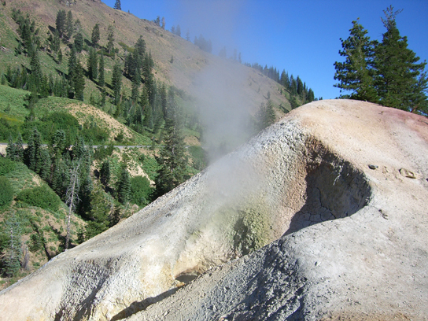

By the end of this section, you will be able to:
* Discuss the biogeochemical cycles of water, carbon, nitrogen, phosphorus, and sulfur
* Explain how human activities have impacted these cycles and the potential consequences for Earth

Energy flows directionally through ecosystems, entering as sunlight (or inorganic molecules for chemoautotrophs) and leaving as heat during the many transfers between trophic levels. However, the matter that makes up living organisms is conserved and recycled. The six most common elements associated with organic molecules—carbon, nitrogen, hydrogen, oxygen, phosphorus, and sulfur—take a variety of chemical forms and may exist for long periods in the atmosphere, on land, in water, or beneath the Earth’s surface. Geologic processes, such as weathering, erosion, water drainage, and the subduction of the continental plates, all play a role in this recycling of materials. Because geology and chemistry have major roles in the study of this process, the recycling of inorganic matter between living organisms and their environment is called a **biogeochemical cycle**{: data-type="term"}.

Water contains hydrogen and oxygen, which is essential to all living processes. The **hydrosphere**{: data-type="term"} is the area of the Earth where water movement and storage occurs: as liquid water on the surface and beneath the surface or frozen (rivers, lakes, oceans, groundwater, polar ice caps, and glaciers), and as water vapor in the atmosphere. Carbon is found in all organic macromolecules and is an important constituent of fossil fuels. Nitrogen is a major component of our nucleic acids and proteins and is critical to human agriculture. Phosphorus, a major component of nucleic acid (along with nitrogen), is one of the main ingredients in artificial fertilizers used in agriculture and their associated environmental impacts on our surface water. Sulfur, critical to the 3–D folding of proteins (as in disulfide binding), is released into the atmosphere by the burning of fossil fuels, such as coal.

The cycling of these elements is interconnected. For example, the movement of water is critical for the leaching of nitrogen and phosphate into rivers, lakes, and oceans. Furthermore, the ocean itself is a major reservoir for carbon. Thus, mineral nutrients are cycled, either rapidly or slowly, through the entire biosphere, from one living organism to another, and between the biotic and abiotic world.

Link to Learning

 {: data-media-type="image/png"} 
Head to this [website][1]{: target="_window"} to learn more about biogeochemical cycles.

# The Water (Hydrologic) Cycle

Water is the basis of all living processes. The human body is more than 1/2 water and human cells are more than 70 percent water. Thus, most land animals need a supply of fresh water to survive. However, when examining the stores of water on Earth, 97.5 percent of it is non-potable salt water ([\[link\]](#fig-ch46_03_01)). Of the remaining water, 99 percent is locked underground as water or as ice. Thus, less than 1 percent of fresh water is easily accessible from lakes and rivers. Many living things, such as plants, animals, and fungi, are dependent on the small amount of fresh surface water supply, a lack of which can have massive effects on ecosystem dynamics. Humans, of course, have developed technologies to increase water availability, such as digging wells to harvest groundwater, storing rainwater, and using desalination to obtain drinkable water from the ocean. Although this pursuit of drinkable water has been ongoing throughout human history, the supply of fresh water is still a major issue in modern times.

{: #fig-ch46_03_01 data-media-type="image/jpg"}

Water cycling is extremely important to ecosystem dynamics. Water has a major influence on climate and, thus, on the environments of ecosystems, some located on distant parts of the Earth. Most of the water on Earth is stored for long periods in the oceans, underground, and as ice. [\[link\]](#fig-ch46_03_02) illustrates the average time that an individual water molecule may spend in the Earth’s major water reservoirs. **Residence time**{: data-type="term"} is a measure of the average time an individual water molecule stays in a particular reservoir. A large amount of the Earth’s water is locked in place in these reservoirs as ice, beneath the ground, and in the ocean, and, thus, is unavailable for short-term cycling (only surface water can evaporate).

 ![ Bars on the graph show the average residence time for water molecules in various reservoirs. The residence time for glaciers and permafrost is 1,000 to 10,000 years. The residence time for groundwater is 2 weeks to 10,000 years. The residence time for oceans and seas is 4,000 years. The residence time for lakes and reservoirs is 10 years. The residence time for swamps is 1 to ten years. The residence time for soil moisture is 2 weeks to 1 year. The residence time for rivers is 2 weeks. The atmospheric residence time is 1.5 weeks. The biospheric residence time, or residence time in living organisms, is 1 week.](../resources/Figure_46_03_02.jpg "This graph shows the average residence time for water molecules in the Earth&#x2019;s water reservoirs."){: #fig-ch46_03_02 data-media-type="image/jpg"}

There are various processes that occur during the cycling of water, shown in [\[link\]](#fig-ch46_03_03). These processes include the following:

* evaporation/sublimation
* condensation/precipitation
* subsurface water flow
* surface runoff/snowmelt
* streamflow

The water cycle is driven by the sun’s energy as it warms the oceans and other surface waters. This leads to the evaporation (water to water vapor) of liquid surface water and the sublimation (ice to water vapor) of frozen water, which deposits large amounts of water vapor into the atmosphere. Over time, this water vapor condenses into clouds as liquid or frozen droplets and is eventually followed by precipitation (rain or snow), which returns water to the Earth’s surface. Rain eventually permeates into the ground, where it may evaporate again if it is near the surface, flow beneath the surface, or be stored for long periods. More easily observed is surface runoff: the flow of fresh water either from rain or melting ice. Runoff can then make its way through streams and lakes to the oceans or flow directly to the oceans themselves.

Link to Learning

 {: data-media-type="image/png"} 
Head to this [website][2]{: target="_window"} to learn more about the world’s fresh water supply.

Rain and surface runoff are major ways in which minerals, including carbon, nitrogen, phosphorus, and sulfur, are cycled from land to water. The environmental effects of runoff will be discussed later as these cycles are described.

 ![ Illustration shows the water cycle. Water enters the atmosphere through evaporation, evapotranspiration, sublimation, and volcanic steam. Condensation in the atmosphere turns water vapor into clouds. Water from the atmosphere returns to the Earth via precipitation or desublimation. Some of this water infiltrates the ground to become groundwater. Seepage, freshwater springs, and plant uptake return some of this water to the surface. The remaining water seeps into the oceans. The remaining surface water enters streams and freshwater lakes, where it eventually enters the ocean via surface runoff. Some water also enters the ocean via underwater vents or volcanoes.](../resources/Figure_46_03_03.jpg "Water from the land and oceans enters the atmosphere by evaporation or sublimation, where it condenses into clouds and falls as rain or snow. Precipitated water may enter freshwater bodies or infiltrate the soil. The cycle is complete when surface or groundwater reenters the ocean. (credit: modification of work by John M. Evans and Howard Perlman, USGS)"){: #fig-ch46_03_03 data-media-type="image/jpg"}

# The Carbon Cycle

Carbon is the second most abundant element in living organisms. Carbon is present in all organic molecules, and its role in the structure of macromolecules is of primary importance to living organisms. Carbon compounds contain especially high energy, particularly those derived from fossilized organisms, mainly plants, which humans use as fuel. Since the 1800s, the number of countries using massive amounts of fossil fuels has increased. Since the beginning of the Industrial Revolution, global demand for the Earth’s limited fossil fuel supplies has risen; therefore, the amount of carbon dioxide in our atmosphere has increased. This increase in carbon dioxide has been associated with climate change and other disturbances of the Earth’s ecosystems and is a major environmental concern worldwide. Thus, the “carbon footprint” is based on how much carbon dioxide is produced and how much fossil fuel countries consume.

The carbon cycle is most easily studied as two interconnected sub-cycles: one dealing with rapid carbon exchange among living organisms and the other dealing with the long-term cycling of carbon through geologic processes. The entire carbon cycle is shown in [\[link\]](#fig-ch46_03_04).

 "){: #fig-ch46_03_04 data-media-type="image/jpg"}

Link to Learning

 {: data-media-type="image/png"} 
Click this [link][3]{: target="_window"} to read information about the United States Carbon Cycle Science Program.

## The Biological Carbon Cycle

Living organisms are connected in many ways, even between ecosystems. A good example of this connection is the exchange of carbon between autotrophs and heterotrophs within and between ecosystems by way of atmospheric carbon dioxide. Carbon dioxide is the basic building block that most autotrophs use to build multi-carbon, high energy compounds, such as glucose. The energy harnessed from the sun is used by these organisms to form the covalent bonds that link carbon atoms together. These chemical bonds thereby store this energy for later use in the process of respiration. Most terrestrial autotrophs obtain their carbon dioxide directly from the atmosphere, while marine autotrophs acquire it in the dissolved form (carbonic acid, H2CO3−). However carbon dioxide is acquired, a by-product of the process is oxygen. The photosynthetic organisms are responsible for depositing approximately 21 percent oxygen content of the atmosphere that we observe today.

Heterotrophs and autotrophs are partners in biological carbon exchange (especially the primary consumers, largely herbivores). Heterotrophs acquire the high-energy carbon compounds from the autotrophs by consuming them, and breaking them down by respiration to obtain cellular energy, such as ATP. The most efficient type of respiration, aerobic respiration, requires oxygen obtained from the atmosphere or dissolved in water. Thus, there is a constant exchange of oxygen and carbon dioxide between the autotrophs (which need the carbon) and the heterotrophs (which need the oxygen). Gas exchange through the atmosphere and water is one way that the carbon cycle connects all living organisms on Earth.

## The Biogeochemical Carbon Cycle

The movement of carbon through the land, water, and air is complex, and in many cases, it occurs much more slowly geologically than as seen between living organisms. Carbon is stored for long periods in what are known as carbon reservoirs, which include the atmosphere, bodies of liquid water (mostly oceans), ocean sediment, soil, land sediments (including fossil fuels), and the Earth’s interior.

As stated, the atmosphere is a major reservoir of carbon in the form of carbon dioxide and is essential to the process of photosynthesis. The level of carbon dioxide in the atmosphere is greatly influenced by the reservoir of carbon in the oceans. The exchange of carbon between the atmosphere and water reservoirs influences how much carbon is found in each location, and each one affects the other reciprocally. Carbon dioxide (CO2) from the atmosphere dissolves in water and combines with water molecules to form carbonic acid, and then it ionizes to carbonate and bicarbonate ions ([\[link\]](#fig-ch46_03_05))

 {: #fig-ch46_03_05 data-media-type="image/jpg"}

The equilibrium coefficients are such that more than 90 percent of the carbon in the ocean is found as bicarbonate ions. Some of these ions combine with seawater calcium to form calcium carbonate (CaCO3), a major component of marine organism shells. These organisms eventually form sediments on the ocean floor. Over geologic time, the calcium carbonate forms limestone, which comprises the largest carbon reservoir on Earth.

On land, carbon is stored in soil as a result of the decomposition of living organisms (by decomposers) or from weathering of terrestrial rock and minerals. This carbon can be leached into the water reservoirs by surface runoff. Deeper underground, on land and at sea, are fossil fuels: the anaerobically decomposed remains of plants that take millions of years to form. Fossil fuels are considered a non-renewable resource because their use far exceeds their rate of formation. A **non-renewable resource**{: data-type="term"}, such as fossil fuel, is either regenerated very slowly or not at all. Another way for carbon to enter the atmosphere is from land (including land beneath the surface of the ocean) by the eruption of volcanoes and other geothermal systems. Carbon sediments from the ocean floor are taken deep within the Earth by the process of **subduction**{: data-type="term"}\: the movement of one tectonic plate beneath another. Carbon is released as carbon dioxide when a volcano erupts or from volcanic hydrothermal vents.

Carbon dioxide is also added to the atmosphere by the animal husbandry practices of humans. The large numbers of land animals raised to feed the Earth’s growing population results in increased carbon dioxide levels in the atmosphere due to farming practices and the respiration and methane production. This is another example of how human activity indirectly affects biogeochemical cycles in a significant way. Although much of the debate about the future effects of increasing atmospheric carbon on climate change focuses on fossils fuels, scientists take natural processes, such as volcanoes and respiration, into account as they model and predict the future impact of this increase.

# The Nitrogen Cycle

Getting nitrogen into the living world is difficult. Plants and phytoplankton are not equipped to incorporate nitrogen from the atmosphere (which exists as tightly bonded, triple covalent N2) even though this molecule comprises approximately 78 percent of the atmosphere. Nitrogen enters the living world via free-living and symbiotic bacteria, which incorporate nitrogen into their macromolecules through nitrogen fixation (conversion of N2). Cyanobacteria live in most aquatic ecosystems where sunlight is present; they play a key role in nitrogen fixation. Cyanobacteria are able to use inorganic sources of nitrogen to “fix” nitrogen. *Rhizobium* bacteria live symbiotically in the root nodules of legumes (such as peas, beans, and peanuts) and provide them with the organic nitrogen they need. Free-living bacteria, such as *Azotobacter*, are also important nitrogen fixers.

Organic nitrogen is especially important to the study of ecosystem dynamics since many ecosystem processes, such as primary production and decomposition, are limited by the available supply of nitrogen. As shown in [\[link\]](#fig-ch46_03_06), the nitrogen that enters living systems by nitrogen fixation is successively converted from organic nitrogen back into nitrogen gas by bacteria. This process occurs in three steps in terrestrial systems: ammonification, nitrification, and denitrification. First, the ammonification process converts nitrogenous waste from living animals or from the remains of dead animals into ammonium (NH4+) by certain bacteria and fungi. Second, the ammonium is converted to nitrites (NO2−) by nitrifying bacteria, such as *Nitrosomonas*, through nitrification. Subsequently, nitrites are converted to nitrates (NO3−) by similar organisms. Third, the process of denitrification occurs, whereby bacteria, such as *Pseudomonas* and *Clostridium*, convert the nitrates into nitrogen gas, allowing it to re-enter the atmosphere.

Art Connection

![ This illustration shows the nitrogen cycle. Nitrogen gas from the atmosphere is fixed into organic nitrogen by nitrogen-fixing bacteria. This organic nitrogen enters terrestrial food webs, and it leaves the food webs as nitrogenous wastes in the soil. Ammonification of this nitrogenous waste by bacteria and fungi in the soil converts the organic nitrogen to ammonium ion (NH4 plus). Ammonium is converted to nitrite (NO2 minus), then to nitrate (NO3 minus) by nitrifying bacteria. Denitrifying bacteria convert the nitrate back into nitrogen gas, which re-enters the atmosphere. Nitrogen from runoff and fertilizers enters the ocean, where it enters marine food webs. Some organic nitrogen falls to the ocean floor as sediment. Other organic nitrogen in the ocean is converted to nitrite and nitrate ions, which is then converted to nitrogen gas in a process analogous to the one that occurs on land.](../resources/Figure_46_03_06.png "Nitrogen enters the living world from the atmosphere via nitrogen-fixing bacteria. This nitrogen and nitrogenous waste from animals is then processed back into gaseous nitrogen by soil bacteria, which also supply terrestrial food webs with the organic nitrogen they need. (credit: modification of work by John M. Evans and Howard Perlman, USGS)"){: #fig-ch46_03_06 data-media-type="image/png"}

Which of the following statements about the nitrogen cycle is false?

1.  Ammonification converts organic nitrogenous matter from living organisms into ammonium (NH4+).
2.  Denitrification by bacteria converts nitrates (NO3−) to nitrogen gas (N2).
3.  Nitrification by bacteria converts nitrates (NO3−) to nitrites (NO2−).
4.  Nitrogen fixing bacteria convert nitrogen gas (N2) into organic compounds.
{: data-number-style="lower-alpha"}

<!--<para><link target-id="fig-ch46_03_05" document=""/>C</para>-->

Human activity can release nitrogen into the environment by two primary means: the combustion of fossil fuels, which releases different nitrogen oxides, and by the use of artificial fertilizers in agriculture, which are then washed into lakes, streams, and rivers by surface runoff. Atmospheric nitrogen is associated with several effects on Earth’s ecosystems including the production of acid rain (as nitric acid, HNO3) and greenhouse gas (as nitrous oxide, N2O) potentially causing climate change. A major effect from fertilizer runoff is saltwater and freshwater **eutrophication**{: data-type="term"}, a process whereby nutrient runoff causes the excess growth of microorganisms, depleting dissolved oxygen levels and killing ecosystem fauna.

A similar process occurs in the marine nitrogen cycle, where the ammonification, nitrification, and denitrification processes are performed by marine bacteria. Some of this nitrogen falls to the ocean floor as sediment, which can then be moved to land in geologic time by uplift of the Earth’s surface and thereby incorporated into terrestrial rock. Although the movement of nitrogen from rock directly into living systems has been traditionally seen as insignificant compared with nitrogen fixed from the atmosphere, a recent study showed that this process may indeed be significant and should be included in any study of the global nitrogen cycle.

Scott L. Morford, Benjamin Z. Houlton, and Randy A. Dahlgren, “Increased Forest Ecosystem Carbon and Nitrogen Storage from Nitrogen Rich Bedrock,” *Nature* 477, no. 7362 (2011): 78–81.

# The Phosphorus Cycle

Phosphorus is an essential nutrient for living processes; it is a major component of nucleic acid and phospholipids, and, as calcium phosphate, makes up the supportive components of our bones. Phosphorus is often the limiting nutrient (necessary for growth) in aquatic ecosystems ([\[link\]](#fig-ch46_03_07)).

Phosphorus occurs in nature as the phosphate ion (PO43−). In addition to phosphate runoff as a result of human activity, natural surface runoff occurs when it is leached from phosphate-containing rock by weathering, thus sending phosphates into rivers, lakes, and the ocean. This rock has its origins in the ocean. Phosphate-containing ocean sediments form primarily from the bodies of ocean organisms and from their excretions. However, in remote regions, volcanic ash, aerosols, and mineral dust may also be significant phosphate sources. This sediment then is moved to land over geologic time by the uplifting of areas of the Earth’s surface.

Phosphorus is also reciprocally exchanged between phosphate dissolved in the ocean and marine ecosystems. The movement of phosphate from the ocean to the land and through the soil is extremely slow, with the average phosphate ion having an oceanic residence time between 20,000 and 100,000 years.

 ![The illustration shows the phosphorus cycle. Phosphate enters the atmosphere from volcanic aerosols. As this aerosol precipitates to Earth, it enters terrestrial food webs. Some of the phosphate from terrestrial food webs dissolves in streams and lakes, and the remainder enters the soil. Another source of phosphate is fertilizers. Phosphate enters the ocean via leaching and runoff, where it becomes dissolved in ocean water or enters marine food webs. Some phosphate falls to the ocean floor where it becomes sediment. If uplifting occurs, this sediment can return to land.](../resources/Figure_46_03_07.jpg "In nature, phosphorus exists as the phosphate ion (PO43&#x2212;). Weathering of rocks and volcanic activity releases phosphate into the soil, water, and air, where it becomes available to terrestrial food webs. Phosphate enters the oceans via surface runoff, groundwater flow, and river flow. Phosphate dissolved in ocean water cycles into marine food webs. Some phosphate from the marine food webs falls to the ocean floor, where it forms sediment. (credit: modification of work by John M. Evans and Howard Perlman, USGS)"){: #fig-ch46_03_07 data-media-type="image/jpg"}

Excess phosphorus and nitrogen that enters these ecosystems from fertilizer runoff and from sewage causes excessive growth of microorganisms and depletes the dissolved oxygen, which leads to the death of many ecosystem fauna, such as shellfish and finfish. This process is responsible for dead zones in lakes and at the mouths of many major rivers ([\[link\]](#fig-ch46_03_07)).

 "){: #fig-ch46_03_08 data-media-type="image/jpg"}

A **dead zone**{: data-type="term"} is an area within a freshwater or marine ecosystem where large areas are depleted of their normal flora and fauna; these zones can be caused by eutrophication, oil spills, dumping of toxic chemicals, and other human activities. The number of dead zones has been increasing for several years, and more than 400 of these zones were present as of 2008. One of the worst dead zones is off the coast of the United States in the Gulf of Mexico, where fertilizer runoff from the Mississippi River basin has created a dead zone of over 8463 square miles. Phosphate and nitrate runoff from fertilizers also negatively affect several lake and bay ecosystems including the Chesapeake Bay in the eastern United States.

Everyday Connection

Chesapeake Bay

 satellite image shows the Chesapeake Bay, an ecosystem affected by phosphate and nitrate runoff. A (b) member of the Army Corps of Engineers holds a clump of oysters being used as a part of the oyster restoration effort in the bay. (credit a: modification of work by NASA/MODIS; credit b: modification of work by U.S. Army)"){: #fig-ch46_03_09 data-media-type="image/png"}

The Chesapeake Bay has long been valued as one of the most scenic areas on Earth; it is now in distress and is recognized as a declining ecosystem. In the 1970s, the Chesapeake Bay was one of the first ecosystems to have identified dead zones, which continue to kill many fish and bottom-dwelling species, such as clams, oysters, and worms. Several species have declined in the Chesapeake Bay due to surface water runoff containing excess nutrients from artificial fertilizer used on land. The source of the fertilizers (with high nitrogen and phosphate content) is not limited to agricultural practices. There are many nearby urban areas and more than 150 rivers and streams empty into the bay that are carrying fertilizer runoff from lawns and gardens. Thus, the decline of the Chesapeake Bay is a complex issue and requires the cooperation of industry, agriculture, and everyday homeowners.

Of particular interest to conservationists is the oyster population; it is estimated that more than 200,000 acres of oyster reefs existed in the bay in the 1700s, but that number has now declined to only 36,000 acres. Oyster harvesting was once a major industry for Chesapeake Bay, but it declined 88 percent between 1982 and 2007. This decline was due not only to fertilizer runoff and dead zones but also to overharvesting. Oysters require a certain minimum population density because they must be in close proximity to reproduce. Human activity has altered the oyster population and locations, greatly disrupting the ecosystem.

The restoration of the oyster population in the Chesapeake Bay has been ongoing for several years with mixed success. Not only do many people find oysters good to eat, but they also clean up the bay. Oysters are filter feeders, and as they eat, they clean the water around them. In the 1700s, it was estimated that it took only a few days for the oyster population to filter the entire volume of the bay. Today, with changed water conditions, it is estimated that the present population would take nearly a year to do the same job.

Restoration efforts have been ongoing for several years by non-profit organizations, such as the Chesapeake Bay Foundation. The restoration goal is to find a way to increase population density so the oysters can reproduce more efficiently. Many disease-resistant varieties (developed at the Virginia Institute of Marine Science for the College of William and Mary) are now available and have been used in the construction of experimental oyster reefs. Efforts to clean and restore the bay by Virginia and Delaware have been hampered because much of the pollution entering the bay comes from other states, which stresses the need for inter-state cooperation to gain successful restoration.

The new, hearty oyster strains have also spawned a new and economically viable industry—oyster aquaculture—which not only supplies oysters for food and profit, but also has the added benefit of cleaning the bay.

# The Sulfur Cycle

Sulfur is an essential element for the macromolecules of living things. As a part of the amino acid cysteine, it is involved in the formation of disulfide bonds within proteins, which help to determine their 3-D folding patterns, and hence their functions. As shown in [\[link\]](#fig-ch46_03_09), sulfur cycles between the oceans, land, and atmosphere. Atmospheric sulfur is found in the form of sulfur dioxide (SO2) and enters the atmosphere in three ways: from the decomposition of organic molecules, from volcanic activity and geothermal vents, and from the burning of fossil fuels by humans.

![This illustration shows the sulfur cycle. Sulfur enters the atmosphere as sulfur dioxide (SO2) via human emissions, decomposition of H2S, and volcanic eruptions. Precipitation and fallout from the atmosphere return sulfur to the Earth, where it enters terrestrial ecosystems. Sulfur enters the oceans via runoff, where it becomes incorporated in marine ecosystems. Some marine sulfur becomes pyrite, which is trapped in sediment. If upwelling occurs, the pyrite enters the soil and is converted to soil sulfates.](../resources/Figure_46_03_10.jpg "Sulfur dioxide from the atmosphere becomes available to terrestrial and marine ecosystems when it is dissolved in precipitation as weak sulfuric acid or when it falls directly to the Earth as fallout. Weathering of rocks also makes sulfates available to terrestrial ecosystems. Decomposition of living organisms returns sulfates to the ocean, soil and atmosphere. (credit: modification of work by John M. Evans and Howard Perlman, USGS)"){: #fig-ch46_03_10 data-media-type="image/jpg"}

On land, sulfur is deposited in four major ways: precipitation, direct fallout from the atmosphere, rock weathering, and geothermal vents ([\[link\]](#fig-ch46_03_10)). Atmospheric sulfur is found in the form of sulfur dioxide (SO2), and as rain falls through the atmosphere, sulfur is dissolved in the form of weak sulfuric acid (H2SO4). Sulfur can also fall directly from the atmosphere in a process called **fallout**{: data-type="term"}. Also, the weathering of sulfur-containing rocks releases sulfur into the soil. These rocks originate from ocean sediments that are moved to land by the geologic uplifting of ocean sediments. Terrestrial ecosystems can then make use of these soil sulfates (<math xmlns="http://www.w3.org/1998/Math/MathML" display="left"> <mrow> <msub> <mrow> <mtext>SO</mtext> </mrow> <mrow> <msup> <mtext>4</mtext> <mo>−</mo> </msup> </mrow> </msub> </mrow> </math>

), and upon the death and decomposition of these organisms, release the sulfur back into the atmosphere as hydrogen sulfide (H2S) gas.

{: #fig-ch46_03_11 data-media-type="image/jpg"}

Sulfur enters the ocean via runoff from land, from atmospheric fallout, and from underwater geothermal vents. Some ecosystems ([\[link\]](/m44887#fig-ch46_02_01)) rely on chemoautotrophs using sulfur as a biological energy source. This sulfur then supports marine ecosystems in the form of sulfates.

Human activities have played a major role in altering the balance of the global sulfur cycle. The burning of large quantities of fossil fuels, especially from coal, releases larger amounts of hydrogen sulfide gas into the atmosphere. As rain falls through this gas, it creates the phenomenon known as acid rain. **Acid rain**{: data-type="term"} is corrosive rain caused by rainwater falling to the ground through sulfur dioxide gas, turning it into weak sulfuric acid, which causes damage to aquatic ecosystems. Acid rain damages the natural environment by lowering the pH of lakes, which kills many of the resident fauna; it also affects the man-made environment through the chemical degradation of buildings. For example, many marble monuments, such as the Lincoln Memorial in Washington, DC, have suffered significant damage from acid rain over the years. These examples show the wide-ranging effects of human activities on our environment and the challenges that remain for our future.

Link to Learning

 {: data-media-type="image/png"} 
Click this [link][4]{: target="_window"} to learn more about global climate change.

# Section Summary

Mineral nutrients are cycled through ecosystems and their environment. Of particular importance are water, carbon, nitrogen, phosphorus, and sulfur. All of these cycles have major impacts on ecosystem structure and function. As human activities have caused major disturbances to these cycles, their study and modeling is especially important. A variety of human activities, such as pollution, oil spills, and events) have damaged ecosystems, potentially causing global climate change. The health of Earth depends on understanding these cycles and how to protect the environment from irreversible damage.

# Art Connections

[[link]](#fig-ch46_03_06) Which of the following statements about the nitrogen cycle is false?

1.  Ammonification converts organic nitrogenous matter from living organisms into ammonium (NH4+).
2.  Denitrification by bacteria converts nitrates (NO3−) to nitrogen gas (N2).
3.  Nitrification by bacteria converts nitrates (NO3−) to nitrites (NO2−).
4.  Nitrogen fixing bacteria convert nitrogen gas (N2) into organic compounds.
{: data-number-style="lower-alpha"}

[[link]](#fig-ch46_03_06) C: Nitrification by bacteria converts nitrates (NO3−) to nitrites (NO2−).

# Review Questions

The movement of mineral nutrients through organisms and their environment is called a \_\_\_\_\_\_\_\_ cycle.

1.  biological
2.  bioaccumulation
3.  biogeochemical
4.  biochemical
{: data-number-style="lower-alpha"}

C

Carbon is present in the atmosphere as \_\_\_\_\_\_\_\_.

1.  carbon dioxide
2.  carbonate ion
3.  carbon dust
4.  carbon monoxide
{: data-number-style="lower-alpha"}

A

The majority of water found on Earth is:

1.  ice
2.  water vapor
3.  fresh water
4.  salt water
{: data-number-style="lower-alpha"}

D

The average time a molecule spends in its reservoir is known as \_\_\_\_\_\_\_\_.

1.  residence time
2.  restriction time
3.  resilience time
4.  storage time
{: data-number-style="lower-alpha"}

A

The process whereby oxygen is depleted by the growth of microorganisms due to excess nutrients in aquatic systems is called \_\_\_\_\_\_\_\_.

1.  dead zoning
2.  eutrophication
3.  retrofication
4.  depletion
{: data-number-style="lower-alpha"}

B

The process whereby nitrogen is brought into organic molecules is called \_\_\_\_\_\_\_\_.

1.  nitrification
2.  denitrification
3.  nitrogen fixation
4.  nitrogen cycling
{: data-number-style="lower-alpha"}

C

# Free Response

Describe nitrogen fixation and why it is important to agriculture.

Nitrogen fixation is the process of bringing nitrogen gas from the atmosphere and incorporating it into organic molecules. Most plants do not have this capability and must rely on free-living or symbiotic bacteria to do this. As nitrogen is often the limiting nutrient in the growth of crops, farmers make use of artificial fertilizers to provide a nitrogen source to the plants as they grow.

What are the factors that cause dead zones? Describe eutrophication, in particular, as a cause.

Many factors can kill life in a lake or ocean, such as eutrophication by nutrient-rich surface runoff, oil spills, toxic waste spills, changes in climate, and the dumping of garbage into the ocean. Eutrophication is a result of nutrient-rich runoff from land using artificial fertilizers high in nitrogen and phosphorus. These nutrients cause the rapid and excessive growth of microorganisms, which deplete local dissolved oxygen and kill many fish and other aquatic organisms.

Why are drinking water supplies still a major concern for many countries?

Most of the water on Earth is salt water, which humans cannot drink unless the salt is removed. Some fresh water is locked in glaciers and polar ice caps, or is present in the atmosphere. The Earth’s water supplies are threatened by pollution and exhaustion. The effort to supply fresh drinking water to the planet’s ever-expanding human population is seen as a major challenge in this century.

[1]: http://openstaxcollege.org/l/biogeochemical
[2]: http://openstaxcollege.org/l/freshwater
[3]: http://openstaxcollege.org/l/carbon_cycle
[4]: http://openstaxcollege.org/l/climate_change
